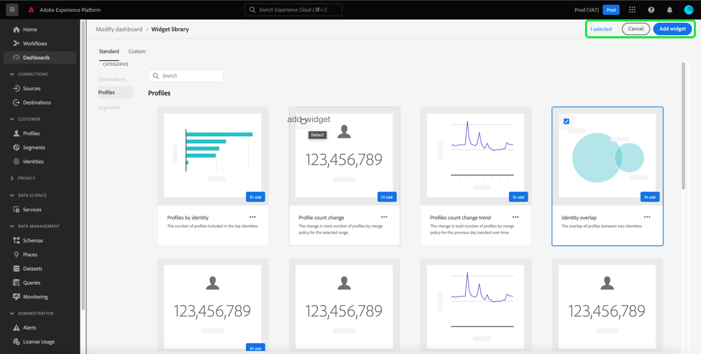

# ダッシュボードへの標準ウィジェットの追加

Adobe Experience Platformでは、複数のダッシュボードを使用して、組織のデータを表示し、操作できます。 また、ダッシュボードビューに新しいウィジェットを追加することで、特定のダッシュボードを更新することもできます。 Adobeには、ダッシュボードに追加できる様々な標準ウィジェットが用意されています。

このガイドでは、標準ウィジェットを追加して、Platform UIの[!UICONTROL Profiles]、[!UICONTROL Segments]、[!UICONTROL Destinations]ダッシュボードをカスタマイズする手順を順を追って説明します。

カスタムウィジェットの詳細については、[カスタムウィジェット](custom-widgets.md)の作成に関するガイドを参照してください。

>[!NOTE]
>
>[!UICONTROL ライセンスの使用]ダッシュボードに表示されるウィジェットはカスタマイズできません。 この一意のダッシュボードの詳細については、[ライセンス使用状況ダッシュボードのドキュメント](../guides/license-usage.md)を参照してください。

## ウィジェットライブラリ {#widget-library}

このガイドでは、Experience Platform内で[!UICONTROL Widgetライブラリ]にアクセスする必要があります。 ウィジェットライブラリの詳細とUI内でのアクセス方法については、まず[ウィジェットライブラリの概要](widget-library.md)を読んでください。

## 標準ウィジェットの概要 {#standard-widgets}

ウィジェットライブラリ内の「**[!UICONTROL 標準]**」タブには、Adobeによって作成されたウィジェットが含まれ、使用可能なダッシュボードに基づいてカテゴリに分類されます。

選択したカテゴリは、ウィジェットライブラリを入力したダッシュボードと一致します。 つまり、[!UICONTROL プロファイル]ダッシュボードからウィジェットライブラリを選択すると、「[!UICONTROL プロファイル]」カテゴリが選択され、他のカテゴリが灰色表示になります。

選択したカテゴリの標準ウィジェットが表示されます。 各ウィジェットはカードとして表示され、タイトル、説明および指標のサンプルのビジュアライゼーションを提供します。

>[!NOTE]
>
>ウィジェットは、選択したカテゴリに一致するダッシュボードにのみ追加できます。 例えば、[!UICONTROL Profiles]カテゴリのウィジェットのみを[!UICONTROL Profiles]ダッシュボードに追加できます。

## ダッシュボードへの標準ウィジェットの追加

ダッシュボードに追加する標準のウィジェットを選択するには、ウィジェットをハイライト表示し、チェックボックスを選択します。 少なくとも1つのウィジェットを選択すると、「**[!UICONTROL ウィジェットを追加]**」ボタンが使用可能になります。

>[!NOTE]
>
>ウィジェットライブラリの右上隅にあるカウンターは、選択されたウィジェットの合計数を示します。

「**[!UICONTROL ウィジェットを追加]**」を選択して、選択したウィジェットをダッシュボードに追加します。

## 次の手順

このドキュメントを読むと、ウィジェットライブラリにアクセスし、それを使用してダッシュボードに標準ウィジェットを追加することができます。 ダッシュボードに表示されるウィジェットのサイズと場所を変更するには、[ダッシュボードの変更に関するガイド](modify.md)を参照してください。
