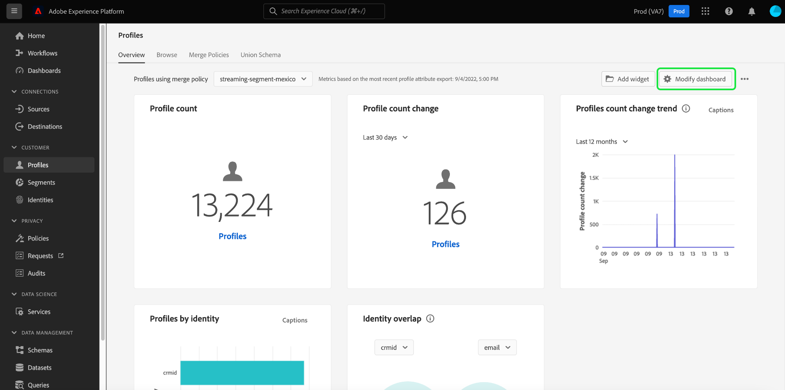

# ウィジェットライブラリの概要

Adobe Experience Platform のユーザーインターフェイスでは、複数のダッシュボードを使用して組織のデータの表示や操作をおこなうことができます。ダッシュボードのビューにウィジェットを追加することで、特定のダッシュボードを更新することもできます。

このガイドでは、Experience Platform の [!UICONTROL ウィジェットライブラリ] にアクセスする手順を説明します。このライブラリで標準ウィジェットを選択したり、カスタムウィジェットを作成したりすることにより、ダッシュボードに表示される情報をカスタマイズできます。

ダッシュボードに表示済みのウィジェットの場所とサイズを変更する方法については、[ダッシュボードの変更ガイド](modify.md)を参照してください。

>[!NOTE]
>
>「[!UICONTROL ライセンスの使用]」ダッシュボードに表示されているウィジェットはカスタマイズできません。ライセンスの使用に特有のダッシュボードについて詳しくは、 [ライセンス使用状況ダッシュボードのドキュメント](../guides/license-usage.md) を参照してください。

## ウィジェットライブラリへのアクセス {#access}

任意のダッシュボード（例えば、プロファイルダッシュボード）から、「 **[!UICONTROL ウィジェットを追加]** は、次の場所にあるウィジェットライブラリに直接移動します。 [ウィジェットを追加](#add-widgets) をダッシュボードに追加します。

選択 **[!UICONTROL ダッシュボードを変更]** をクリックして、ダッシュボードからウィジェットを移動、サイズ変更、削除します。 この表示から、 **[!UICONTROL Widget ライブラリ]** 参照して [ウィジェットを追加](#add-widgets). ウィジェットのサイズとレイアウトの編集方法については、 [ダッシュボードドキュメントの変更](./modify.md).

**[!UICONTROL ウィジェットライブラリ]** を選択してウィジェットライブラリを開き、使用可能なすべての標準指標を表示するか、カスタムウィジェットの作成を開始します。

## ウィジェットを追加 {#add-widgets}

次の [!UICONTROL Widget ライブラリ]をクリックし、使用可能な標準またはカスタムウィジェットのリストから任意のウィジェットを選択します。 ウィジェットの隅にあるチェックマークは、選択内容を示します。

### 使用中のラベル {#in-use-label}

ウィジェットが既にダッシュボードに追加されている場合、ウィジェットには [!UICONTROL 使用中] ウィジェットライブラリで表示した際に添付されるラベル。 このラベルは、重複を避けるために、ダッシュボードに既に追加されているウィジェットをハイライトします。 ただし、同じウィジェットを複数回追加することもできます。

必要なウィジェットをすべて選択したら、 **[!UICONTROL ウィジェットを追加]** をクリックして選択内容を確認し、ダッシュボードにウィジェットを追加します。

## 標準ウィジェットとカスタムウィジェット {#standard-and-custom}

[!UICONTROL ウィジェットライブラリ] には、次の 2 つのタブがあります。

* **[!UICONTROL 標準]：** 「標準」タブには、Adobe が提供するウィジェットが含まれています。これらの標準指標のいずれかを使用して、ダッシュボードを更新できます。 ダッシュボードへの標準ウィジェットの追加について詳しくは、 [ダッシュボードでの標準ウィジェットの使用](standard-widgets.md) に関するガイドを参照してください。
* **[!UICONTROL カスタム]：** 「カスタム」タブを使用すると、ウィジェットを作成して組織内で共有できます。独自のウィジェットを作成する手順について詳しくは、 [ダッシュボードのカスタムウィジェットガイド](custom-widgets.md) を参照してください。

## 次の手順

このドキュメントを読み、Experience Platform の UI からウィジェットライブラリにアクセスできるようになりました。 ダッシュボードに表示されるウィジェットのサイズと場所を変更するには、 [ダッシュボードの変更ガイド](modify.md) を参照してください。
