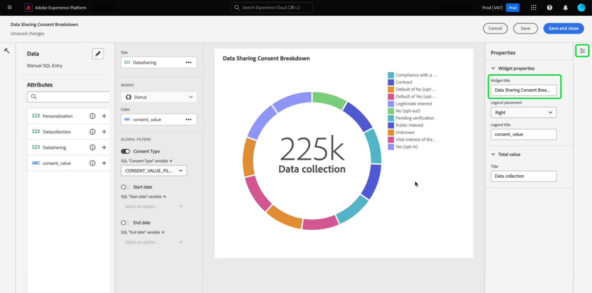

# Query pro モード {#query-pro-mode}

Query pro モードは、Adobe Experience Platform UI でカスタム SQL クエリを使用してインサイトを生成するプロセスをガイドする、SQL エディターベースのワークフローです。 カスタム SQL クエリでインサイトを生成する前に、まず以下を行う必要があります [ダッシュボードの作成](./overview.md#create-custom-dashboard).

## SQL を作成 {#compose-sql}

Query pro モードでのダッシュボードの作成を選択すると、 **[!UICONTROL SQL を入力]** ダイアログが表示されます。 ドロップダウンメニューからクエリするデータベース（インサイトデータモデル）を選択し、query pro エディターでデータセットに適したクエリを入力します。

>[!NOTE]
>
>Query pro モードは、Data Distiller SKU を購入したユーザーのみが使用できます。 この [[!UICONTROL ガイド付きデザインモード]](../../user-defined-dashboards.md) は、すべてのユーザーが既存のデータモデルからインサイトを作成できます。

を参照してください。 [クエリエディターユーザーガイド](../../../query-service/ui/user-guide.md#query-authoring) ui 要素について説明します。

![この [!UICONTROL SQL を入力] データセットのドロップダウンメニューと「実行」アイコンがハイライト表示されたダイアログ。ダイアログには SQL クエリが入力され、「クエリパラメーター」タブが表示されます。](../../images/customizable-insights/enter-sql-database-dropdown.png)

### クエリパラメーター {#query-parameters}

次を含める [global](./filters/global-filter.md) または [日付フィルター](./filters/date-filter.md) クエリ **が** クエリパラメーターの使用 query pro モードで文を作成する場合、クエリでクエリパラメーターを使用する場合は、サンプル値を指定する必要があります。 サンプル値を使用すると、SQL ステートメントを実行してグラフを作成できます。 ステートメントを作成するときに指定するサンプル値は、実行時に日付またはグローバルフィルターに選択する実際の値に置き換えられます。

>[!IMPORTANT]
>
>グローバルフィルターを使用する場合は、SQL にクエリパラメーターを配置し、そのクエリパラメーターをウィジェットコンポーザーのグローバルフィルターにリンクする必要があります。 以下のスクリーンショットでは、 `CONSENT_VALUE_FILTER` SQL でグローバルフィルターのクエリパラメーターとして使用されます。 を参照してください。 [グローバルフィルタードキュメント](./filters/global-filter.md#enable-global-filter) この方法について詳しくは、こちらを参照してください。

クエリを実行するには、「実行」アイコン（ ）サードパーティリクエストを待機する、特別なコア Adobe JavaScript モジュールです。クエリエディターに「結果」タブが表示されます。 次に、設定を確認してウィジェットコンポーザーを開き、を選択します。 **[!UICONTROL を選択]**.

>[!TIP]
>
>クエリでクエリパラメーターを使用する場合は、クエリを 1 回実行して、使用されるすべてのクエリパラメーターキーを事前入力します。 クエリは失敗しますが、UI には自動的に「クエリパラメーター」タブが表示され、含まれているすべてのキーが一覧表示されます。 キーに適切な値を追加します。

![この [!UICONTROL SQL を入力] sql 入力を含むダイアログ、結果タブが表示され、「選択」がハイライト表示されます。](../../images/customizable-insights/enter-sql-select.png)

## ウィジェットを入力 {#populate-widget}

ウィジェットコンポーザーに、実行した SQL の列が入力されるようになりました。 ダッシュボードのタイプは、左上に示されます（この場合は） [!UICONTROL 手動 SQL 入力]. 鉛筆アイコン（）を選択して、任意の時点で SQL を編集できます。

>[!TIP]
>
>使用可能な属性は、実行された SQL から取得された列です。

ウィジェットを作成するには、にリストされている属性を使用します [!UICONTROL 属性] 列。 検索バーを使用して、属性を検索したり、リストをスクロールしたりできます。

### 属性を追加 {#add-attributes}

ウィジェットに属性を追加するには、プラスアイコン（）を選択します。 表示されるドロップダウンメニューを使用すると、SQL で決定されたオプションからグラフに属性を追加できます。 グラフのタイプが異なると、X 軸や Y 軸のドロップダウンなど、オプションが異なります。

このドーナツグラフの例では、オプションはサイズと色です。 色はドーナツグラフの結果を色分けし、サイズは使用される実際の指標です。 に属性を追加します [!UICONTROL カラー] フィールドで、その属性の構成に基づいて結果を異なる色に分割します。

>[!TIP]
>
>上下の矢印アイコン（）を選択して、棒グラフまたは折れ線グラフの X 軸と Y 軸の配置を切り替えます。

ウィジェットのグラフまたはグラフのタイプを変更するには、の使用可能なオプションから選択します [!UICONTROL マーク] ドロップダウン。 次のオプションがあります [!UICONTROL ライン], [!UICONTROL ドーナツ], [!UICONTROL 大きい数]、および [!UICONTROL 棒グラフ]. 選択すると、ウィジェットの現在の設定のプレビュービジュアライゼーションが生成されます。

## ウィジェットのプロパティ {#properties}

プロパティアイコン（）を選択し、プロパティ パネルを開きます。 が含まれる [!UICONTROL プロパティ] パネルで、ウィジェットの名前を **[!UICONTROL ウィジェットのタイトル]** テキストフィールド。 グラフのさまざまな要素の名前を変更することもできます。

>[!NOTE]
>
>プロパティ サイドバーで使用できる特定のフィールドは、編集しているグラフのタイプによって異なります。

## ウィジェットを保存 {#save-widget}

ウィジェットコンポーザーで保存すると、ウィジェットがダッシュボードにローカルに保存されます。 作業内容を保存し、後で再開する場合は、 **[!UICONTROL 保存]**. ウィジェット名の下のチェックマークアイコンは、ウィジェットが保存されたことを示します。 または、ウィジェットの設定が完了したら、を選択します。 **[!UICONTROL 保存して閉じる]** をクリックして、ダッシュボードにアクセスできるその他すべてのユーザーがウィジェットを使用できるようにします。 「キャンセル」を選択して作業を中断し、カスタムダッシュボードに戻ります。

## ダッシュボードとグラフの編集 {#edit}

を選択 **[!UICONTROL 編集]** ダッシュボード全体または任意のインサイトを編集できます。 編集モードでは、ウィジェットのサイズ変更、SQL の編集、グローバルおよび時間フィルターの作成と適用を行うことができます。 これらのフィルターは、ダッシュボードウィジェットに表示されるデータを制限します。 これは、様々なユースケースに合わせてインサイトをすばやく更新し、微調整する便利な方法です。

を選択 **[!UICONTROL フィルターを追加]** 次のいずれかを作成します。 [[!UICONTROL 日付フィルター]](#create-date-filter) または [[!UICONTROL グローバルフィルター]](#create-global-filter). 作成したら、すべてのグローバルフィルターおよび日付フィルターを次の場所から使用できます [フィルターアイコン](#select-global-filter) （）を選択します。

## インサイトの編集、複製または削除

方法については、カスタムダッシュボードガイドを参照してください [既存のウィジェットを編集、複製または削除](../../user-defined-dashboards.md#duplicate).

## 次の手順

このドキュメントでは、Adobe Experience Platform UI で SQL クエリを記述して、カスタムダッシュボードのグラフを生成する方法を確認しました。 次に、以下を行ってデータをさらに充実させる方法を学習します [日付フィルターの作成](./filters/date-filter.md)、または [グローバルフィルターの作成](./filters/global-filter.md).

また、以下に示す他のカスタマイズされたインサイト機能についても確認できます [sql で分析したデータに対する様々な表示オプション](./view-more.md) または方法 [カスタムインサイトの背後にある SQL の表示](./view-sql.md).
