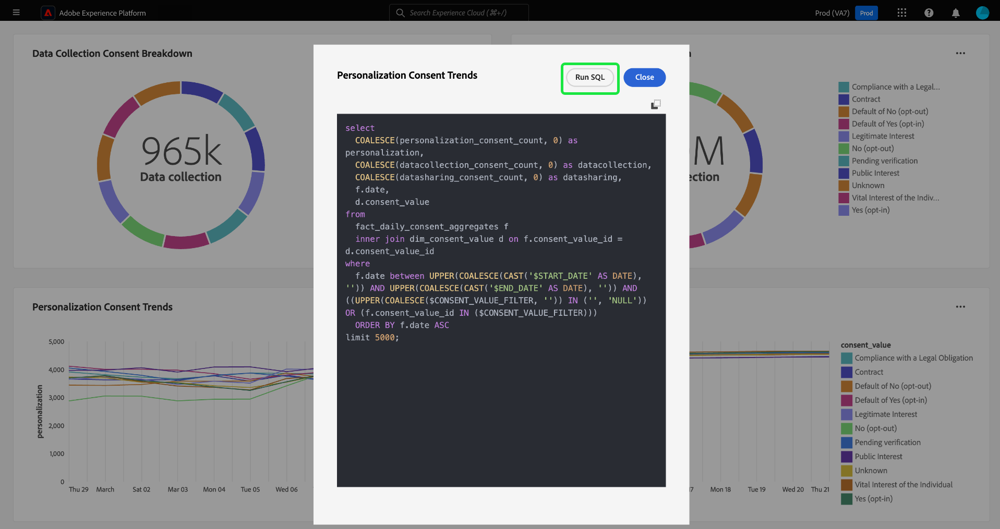

# SQL を表示 {#view-sql}

を作成したら [カスタムインサイト](./overview.md) （を使用） [query pro モード](./query-pro-mode.md)の場合は、「SQL を表示」機能を使用してグラフに入力する SQL を表示できます。

カスタムダッシュボードで、省略記号（`...`）にアクセスします。 [!UICONTROL さらに表示] および [!UICONTROL SQL を表示] オプション。

カスタマイズされたインサイトの背後にある SQL を表示するには、 **[!UICONTROL SQL を表示]** オプション。 ダイアログのタイトルには、インサイトの名前が付けられます。 このビューから SQL をクリップボードにコピーして、クエリ作成モードで今後のグラフオーサリングのベースとして使用したり、SQL をクエリエディターで直接開いたりできます。 を選択 **[!UICONTROL SQL を実行]** をクリックして、クエリエディターでクエリを開きます。

を選択 **[!UICONTROL 閉じる]** をクリックしてダイアログを閉じます。

## 次の手順

このドキュメントでは、カスタムインサイトの背後にある SQL の表示方法を確認しました。 方法については、詳細を表示ドキュメントを参照してください。 [カスタムグラフと SQL 分析の表形式の結果を比較](./view-more.md).

また、を使用して、Adobe Experience Platform UI で既存のデータモデルからグラフを生成する方法も説明します [ガイド付きデザインモードガイド](../../user-defined-dashboards.md).
