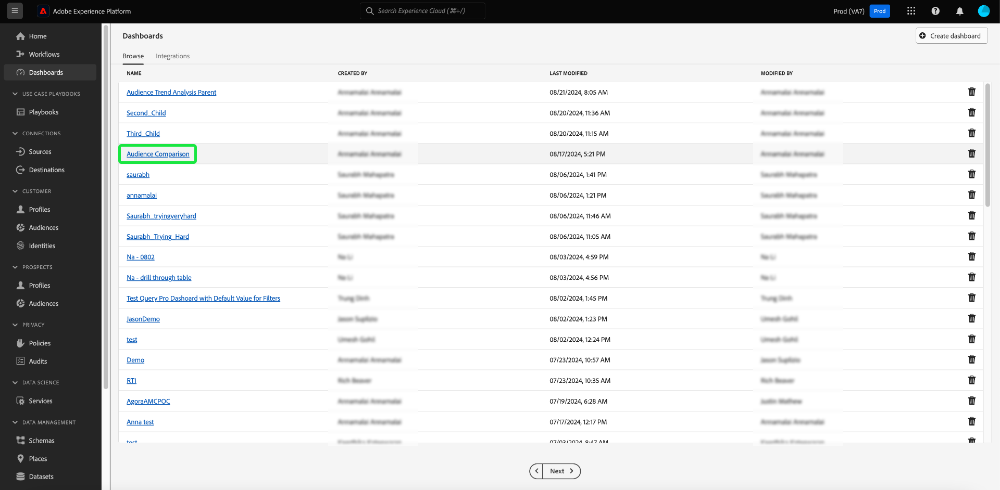

# Export PDF {#export-pdf}

[query pro mode](./overview.md) で [ カスタムインサイト ](../sql-insights/overview.md) を作成したら、グラフデータをPDF形式で書き出すことができます。 このアクションは、カスタムダッシュボードの概要から取得されます。

ダッシュボードワークスペースで、「[!UICONTROL  参照 ] タブにリストされているインベントリからカスタムダッシュボードを選択します。

カスタムダッシュボードが表示されます。 次に、UI の右上から **[!UICONTROL 書き出し]** を選択します。

**[!UICONTROL ファイルを書き出し]** ダイアログが表示されます。 最後に、「**[!UICONTROL ダウンロード]**」を選択します。

PDFプレビューが表示されます。 「**[!UICONTROL 保存]**」を選択して、プロセスを完了します。

