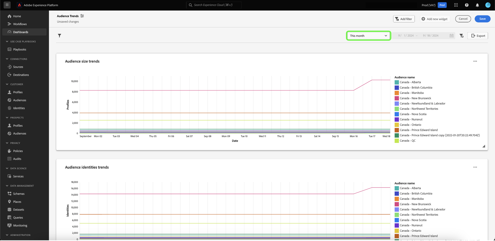

# 日付フィルターの作成 {#create-date-filter}

日付でインサイトをフィルタリングするには、日付制約を受け入れる SQL クエリにパラメーターを追加する必要があります。 これは、query pro mode insight 作成ワークフローの一部として行われます。 インサイトに合わせて SQL を入力する方法については、[query pro モードのドキュメント ](#query-pro-mode) を参照してください。

クエリパラメーターを使用すると、実行時に追加する値のプレースホルダーとして機能する動的データを操作できます。 これらのプレースホルダー値は UI を通じて更新でき、技術の低いユーザーが日付範囲に基づいてインサイトを更新できるようになります。

クエリパラメーターに慣れていない場合は、ドキュメント [ パラメーター化クエリの実装方法に関するガイダンス ](../../../../query-service/ui/parameterized-queries.md) を参照してください。

## ダッシュボードへの日付フィルターの適用 {#apply-date-filter}

日付フィルターを適用するには、「**[!UICONTROL フィルターを追加]**」を選択し、ダッシュボード表示のドロップダウンメニューから「**[!UICONTROL 日付フィルター]**」を選択します。


次の日付フィルタリングオプションが表示されます。

| フィルター | 説明 |
| --- | --- |
| カスタム日付なし | 複数のプリセット値から 1 つ以上のカスタム日付を選択します。 |
| カスタム日付範囲 | 複数のプリセット値から 1 つ以上のカスタム日付を選択するか、カスタム日付範囲を指定します。 |
| カスタム日付 | 最初の値から選択するか、ダッシュボードの開始日を指定します。 |


### カスタム日付フィルターを作成しない

定義済みの日付フィルターを適用するには、「**[!UICONTROL カスタム日付なし]**」を選択した後、含める定義済みの日付オプションを選択します。 最後に、ドロップダウンを使用してデフォルトの日付範囲を選択し、「**[!UICONTROL 保存]**」を選択します。


ダッシュボードに戻ります。ダッシュボードには、以前に選択したデフォルトの日付範囲が表示されます。 ドロップダウンメニューを使用して、別のプリセットの日付範囲を選択します。



### カスタム日付範囲フィルターの作成

カスタムの日付範囲フィルターを適用するには、「**[!UICONTROL カスタムの日付範囲]**」を選択した後、含める事前定義済みの日付オプションを選択します。 最後に、「**[!UICONTROL カスタム]**」を選択して、デフォルトの日付範囲を設定します。 カレンダーを使用して日付範囲を指定し、「**[!UICONTROL 保存]**」を選択します。

>[!NOTE]
>
>事前定義済みの日付オプションを選択する必要はありません。


ダッシュボードに戻ります。ダッシュボードには、以前に指定したカスタムデータ範囲が表示されます。 ドロップダウンメニューを使用して、別のプリセットの日付範囲を選択します。


### カスタム日付フィルターの作成

カスタム日付フィルターを適用するには、「**[!UICONTROL カスタム日付]**」を選択し、含める事前定義済みの日付オプションを選択します。 最後に、「**[!UICONTROL カスタム]**」を選択し、カレンダーを使用して開始日を選択します。 最後に、「**[!UICONTROL 保存]** を選択します。

>[!NOTE]
>
>事前定義済みの日付オプションを選択する必要はありません。


ダッシュボードに戻り、以前に指定したカスタムデータが表示されます。 別の日付を選択するには、ドロップダウンメニューを使用します。


## 日付フィルターの削除 {#delete-date-filter}

日付フィルターを削除するには、「フィルターを削除」アイコン（）を選択します。


## SQL を編集して日付クエリパラメーターを含める {#include-date-parameters}

次に、SQL に日付範囲を許可するクエリパラメーターが含まれていることを確認します。 まだ SQL にクエリパラメーターを組み込んでいない場合は、インサイトを編集してこれらのパラメーターを含めます。 [ インサイトを編集 ](../overview.md#edit) する手順については、ドキュメントを参照してください。

>[!TIP]
>
>日付フィルターを有効にする各グラフの SQL 文に `$START_DATE` および `$END_DATE` パラメーターを追加することをお勧めします。

>[!NOTE]
>
>日付フィルターは、時間制約をサポートしていません。 このフィルターは日付範囲にのみ適用されます。 つまり、24 時間の期間内に複数のレポートがある場合、同じ日に異なる時間を区別することはできません。 このため、時間コンポーネントを日付としてキャストすることをお勧めします。

分析するデータモデルまたはテーブルに時間の構成要素がある場合は、データを日付でグループ化してから、これらの日付フィルターを適用できます。

次の SQL 文の例は、`$START_DATE` および `$END_DATE` パラメーターを組み込む方法を示しており、`cast` を使用して時間コンポーネントを日付としてフレーム化します。

```sql
SELECT Sum(personalization_consent_count) AS Personalization,
       Sum(datacollection_consent_count)  AS Datacollection,
       Sum(datasharing_consent_count)     AS Datasharing
FROM   fact_daily_consent_aggregates f
       INNER JOIN dim_consent_valued
               ON f.consent_value_id = d.consent_value_id
WHERE  f.date BETWEEN Upper(Coalesce(Cast('$START_DATE' AS date), '')) AND Upper
                      (
                             Coalesce(Cast('$END_DATE' AS date), ''))
       AND ( ( Upper(Coalesce($consent_value_filter, '')) IN ( '', 'NULL' ) )
              OR ( f.consent_value_id IN ( $consent_value_filter ) ) )
LIMIT  0; 
```

次のスクリーンショットは、SQL 文とクエリパラメーターのキー値のペアに組み込まれた日付制約を示しています。

>[!NOTE]
>
>query pro モードで文を作成する場合、SQL 文を実行してグラフを作成するには、各パラメータにサンプル値を指定する必要があります。 ステートメントを作成するときに指定するサンプル値は、実行時に日付（またはグローバル） フィルターに選択する実際の値に置き換えられます。

![SQL で日付パラメーターがハイライト表示された [!UICONTROL SQL を入力 ] ダイアログ ](../../../images/sql-insights/sql-date-parameters.png)

## 各インサイトでの日付パラメーターの有効化 {#enable-date-parameters}

適切なパラメーターをインサイトの SQL に組み込むと、ウィジェットコンポーザーで `Start_date` 変数と `End_date` 変数を切り替えできます。 インサイトの編集方法については、[query pro mode ウィジェットの母集団の節 ](#populate-widget) を参照してください。

ウィジェットコンポーザーから、「トグル」を選択して、`Start_date` パラメーターと `End_date` パラメーターを有効にします。


次に、ドロップダウンメニューから適切なクエリパラメーターを選択します。


最後に、「**[!UICONTROL 保存して閉じる]** を選択して、ダッシュボードに戻ります。 開始日および終了日パラメーターを持つすべてのインサイトに対して、日付フィルターが有効になりました。
