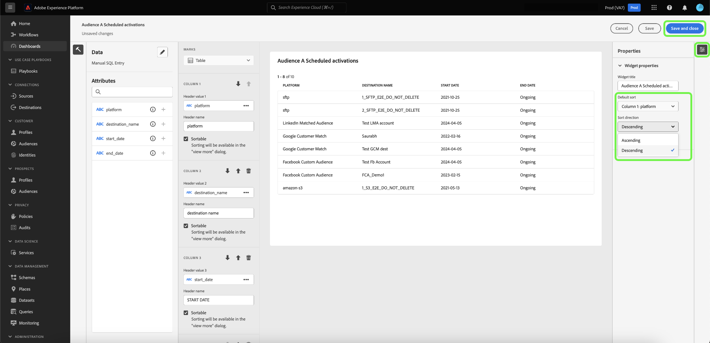

# クエリプロモードの概要 {#query-pro-mode}

Query pro モードは、Adobe Experience Platform UI でカスタム SQL クエリを使用してインサイトを生成するプロセスをガイドする、SQL エディターベースのワークフローです。 カスタム SQL クエリでインサイトを生成する前に、まず [ ダッシュボードを作成 ](./overview.md#create-custom-dashboard) する必要があります。

## SQL を作成 {#compose-sql}

Query pro モードでダッシュボードを作成することを選択すると、「**[!UICONTROL SQL を入力]**」ダイアログが表示されます。 ドロップダウンメニューからクエリするデータベース（インサイトデータモデル）を選択し、query pro エディターでデータセットに適したクエリを入力します。

>[!NOTE]
>
>Query pro モードは、Data Distiller SKU を購入したユーザーのみが使用できます。 [[!UICONTROL  ガイド付きデザインモード ]](../../user-defined-dashboards.md) は、すべてのユーザーが既存のデータモデルからインサイトを作成できます。

UI 要素について詳しくは、[ クエリエディターユーザーガイド ](../../../query-service/ui/user-guide.md#query-authoring) を参照してください。

![ データセットのドロップダウンメニューと「実行」アイコンがハイライト表示された [!UICONTROL SQL を入力 ] ダイアログには、SQL クエリが入力され、「クエリパラメーター」タブが表示されます。](../../images/sql-insights/enter-sql-database-dropdown.png)

### クエリパラメーター {#query-parameters}

[ グローバル ](./filters/global-filter.md) または [ 日付フィルターを含めるには ](./filters/date-filter.md) クエリ **必須** でクエリパラメーターを使用します。 query pro モードで文を作成する場合、クエリでクエリパラメーターを使用する場合は、サンプル値を指定する必要があります。 サンプル値を使用すると、SQL ステートメントを実行してグラフを作成できます。 ステートメントを作成するときに指定するサンプル値は、実行時に日付またはグローバルフィルターに選択する実際の値に置き換えられます。

>[!IMPORTANT]
>
>グローバルフィルターを使用する場合は、SQL にクエリパラメーターを配置し、そのクエリパラメーターをウィジェットコンポーザーのグローバルフィルターにリンクする必要があります。 以下のスクリーンショットでは、SQL でグローバルフィルターのクエリパラメーターとして `CONSENT_VALUE_FILTER` が使用されています。 これを行う方法について詳しくは、[ グローバルフィルタードキュメント ](./filters/global-filter.md#enable-global-filter) を参照してください。

クエリを実行するには、実行アイコン（）に設定します。 クエリエディターに「結果」タブが表示されます。 次に、設定を確認してウィジェットコンポーザーを開き、「**[!UICONTROL 選択]**」を選択します。

>[!TIP]
>
>クエリでクエリパラメーターを使用する場合は、クエリを 1 回実行して、使用されるすべてのクエリパラメーターキーを事前入力します。 クエリは失敗しますが、UI には自動的に「クエリパラメーター」タブが表示され、含まれているすべてのキーが一覧表示されます。 キーに適切な値を追加します。

![SQL 入力を含む [!UICONTROL SQL を入力 ] ダイアログと「結果」タブが表示され、「選択」がハイライト表示されます。](../../images/sql-insights/enter-sql-select.png)

## ウィジェットを入力 {#populate-widget}

ウィジェットコンポーザーに、実行した SQL の列が入力されるようになりました。 ダッシュボードのタイプは左上に示されます。この場合は [!UICONTROL  手動 SQL 入力 ] です。 鉛筆アイコン（）を選択して、任意の時点で SQL を編集できます。

>[!TIP]
>
>使用可能な属性は、実行された SQL から取得された列です。

ウィジェットを作成するには、[!UICONTROL  属性 ] 列に一覧表示された属性を使用します。 検索バーを使用して、属性を検索したり、リストをスクロールしたりできます。

### 属性を追加 {#add-attributes}

ウィジェットに属性を追加するには、プラスアイコン（）を選択します。 表示されるドロップダウンメニューを使用すると、SQL で決定されたオプションからグラフに属性を追加できます。 グラフのタイプが異なると、X 軸や Y 軸のドロップダウンなど、オプションが異なります。

このドーナツグラフの例では、オプションはサイズと色です。 色はドーナツグラフの結果を色分けし、サイズは使用される実際の指標です。 [!UICONTROL  カラー ] フィールドに属性を追加し、その属性の構成に基づいて結果を異なる色に分割します。

>[!TIP]
>
>上向き矢印アイコンと下向き矢印アイコン（）を選択して、棒グラフまたは折れ線グラフの X 軸と Y 軸の配置を切り替えます。

ウィジェットのグラフまたはグラフのタイプを変更するには、[!UICONTROL  マーク ] ドロップダウンの使用可能なオプションから選択します。 オプションには、[!UICONTROL  行 ]、[!UICONTROL  ドーナツ ]、[!UICONTROL  大きい数値 ]、[!UICONTROL  棒 ] があります。 選択すると、ウィジェットの現在の設定のプレビュービジュアライゼーションが生成されます。

## 高度なテーブル属性 {#advanced-attributes}

テーブルの一部またはすべての列に自動ソート機能を適用するには、「**[!UICONTROL 編集]**」を選択してダッシュボード全体を編集します。

列の並べ替えを追加するテーブルグラフで省略記号（`...`）を選択し、「**[!UICONTROL 編集]**」を選択します。

任意の列で並べ替えを有効にするには、「並べ替え可能 **[!UICONTROL ボックスをオンに]** ます。

「プロパティ」アイコン（）を選択し、[!UICONTROL  プロパティ ] パネルを開きます。 **[!UICONTROL プロパティ]** パネルで、ドロップダウンを使用して **[!UICONTROL デフォルトの並べ替え]** 列を選択し、ドロップダウンを使用して **[!UICONTROL 並べ替え方向]** を選択します。 最後に、「**[!UICONTROL 保存して閉じる]** を選択します。

並べ替え、列のサイズ変更、ページネーションの機能の使用について詳しくは、[ 詳細を表示 ](./view-more.md) を参照してください。

## ウィジェットのプロパティ {#properties}

「プロパティ」アイコン（）を選択し、プロパティパネルを開きます。 [!UICONTROL  プロパティ ] パネルの **[!UICONTROL ウィジェットタイトル]** テキストフィールドにウィジェットの名前を入力します。 グラフのさまざまな要素の名前を変更することもできます。

>[!NOTE]
>
>プロパティ サイドバーで使用できる特定のフィールドは、編集しているグラフのタイプによって異なります。

## ウィジェットを保存 {#save-widget}

ウィジェットコンポーザーで保存すると、ウィジェットがダッシュボードにローカルに保存されます。 作業内容を保存し、後で再開する場合は、「**[!UICONTROL 保存]**」を選択します。 ウィジェット名の下のチェックマークアイコンは、ウィジェットが保存されたことを示します。 または、ウィジェットの設定が完了したら、「**[!UICONTROL 保存して閉じる]** を選択して、ダッシュボードにアクセスできる他のすべてのユーザーにウィジェットを公開します。 「キャンセル」を選択して作業を中断し、カスタムダッシュボードに戻ります。

## ダッシュボードとグラフの編集 {#edit}

「**[!UICONTROL 編集]**」を選択して、ダッシュボード全体または任意のインサイトを編集します。 編集モードでは、ウィジェットのサイズ変更、SQL の編集、グローバルおよび時間フィルターの作成と適用を行うことができます。 これらのフィルターは、ダッシュボードウィジェットに表示されるデータを制限します。 これは、様々なユースケースに合わせてインサイトをすばやく更新し、微調整する便利な方法です。

**[!UICONTROL フィルターを追加]** を選択して、[[!UICONTROL  日付フィルター ]](#create-date-filter) または [[!UICONTROL  グローバルフィルター ]](#create-global-filter) を作成します。 作成したら、すべてのグローバルフィルターおよび日付フィルターを [ フィルターアイコン ](#select-global-filter) （）を選択します。

## インサイトの編集、複製または削除

[ 既存のウィジェットを編集、複製、削除する ](../../user-defined-dashboards.md#duplicate) 方法については、カスタムダッシュボードガイドを参照してください。

## 次の手順

このドキュメントでは、Adobe Experience Platform UI で SQL クエリを記述して、カスタムダッシュボードのグラフを生成する方法を確認しました。 次に、[ 日付フィルターの作成 ](./filters/date-filter.md) または [ グローバルフィルターの作成 ](./filters/global-filter.md) を使用して、データをさらに充実させる方法を説明します。

また、[SQL で分析したデータに対する様々な表示オプション ](./view-more.md) または [ カスタムインサイトの背後にある SQL を表示 ](./view-sql.md) など、他のカスタムインサイト機能についても説明します。
