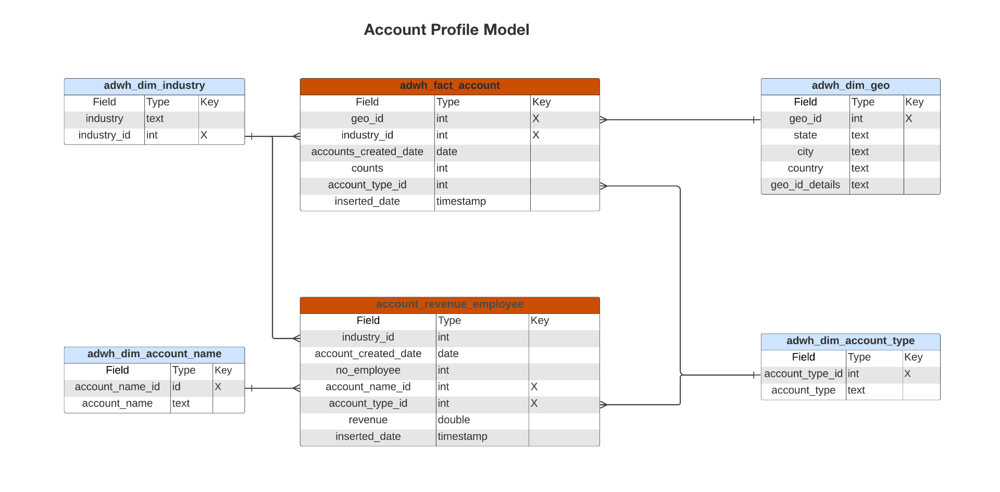
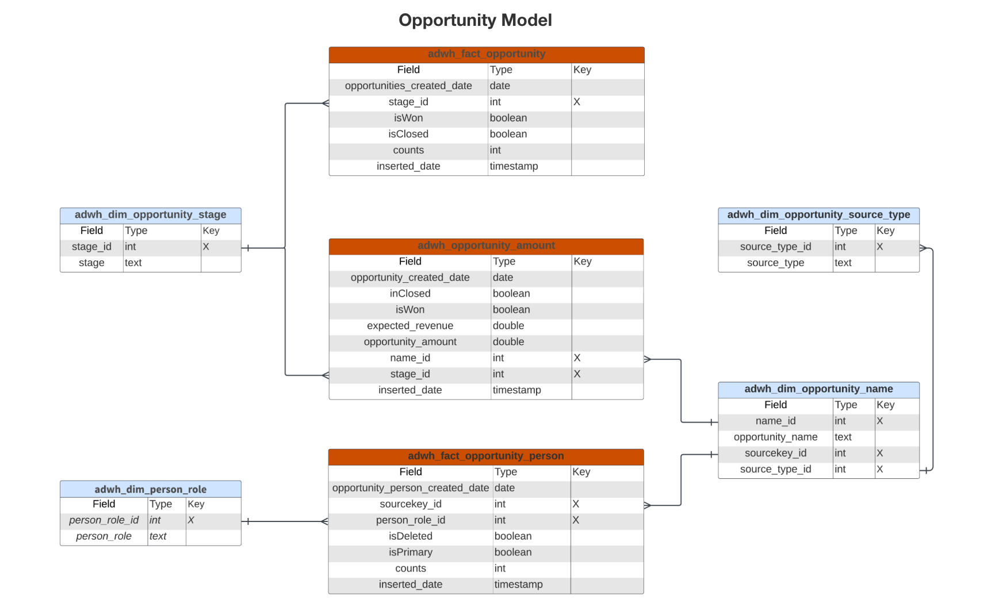

# Real-Time CDP Insights データモデル B2B edition

B2B editionのReal-Time CDP Insights データモデルは、[&#x200B; アカウントプロファイル &#x200B;](https://experienceleague.adobe.com/ja/docs/experience-platform/rtcdp/account/account-profile-overview) のインサイトを強化するデータモデルと SQL を公開します。 これらの SQL クエリテンプレートをカスタマイズすると、B2B マーケティングおよび主要業績評価指標（KPI）のユースケースに関するReal-Time CDP レポートを作成できます。 これらのインサイトは、ダッシュボードのカスタムウィジェットとして使用できます。

>[!AVAILABILITY]
>
>この機能は、Real-Time CDP Prime および Ultimate パッケージを購入したお客様が利用できます。詳しくは、利用可能な [Real-Time CDP エディション &#x200B;](../../rtcdp/overview.md#rtcdp-editions) のドキュメントを参照するか、Adobe担当者にお問い合わせください。

<!-- 
See the query accelerated store reporting insights documentation to learn [how to build a reporting insights data model through Query Service for use with accelerated store data and user-defined dashboards](../../query-service/data-distiller/sql-insights/reporting-insights-data-model.md).
 -->

## 前提条件

このガイドでは、カスタムダッシュボードに関する十分な知識が必要です。 このガイドに進む前に、[&#x200B; カスタムダッシュボードの作成方法 &#x200B;](../standard-dashboards.md) に関するドキュメントを参照してください。

## Real-Time CDP B2B insightのレポートとユースケース {#B2B-insight-reports-and-use-cases}

Real-Time CDP B2B レポートは、アカウントプロファイルデータおよびアカウントとオポチュニティの関係に関するインサイトを提供します。 次のスタースキーマモデルは、様々な一般的なマーケティングユースケースに答えるために開発されたものであり、各データモデルは複数のユースケースをサポートできます。

>[!IMPORTANT]
>
>Real-Time CDP B2B レポートに使用されるデータは、選択した結合ポリシーに関して、および最新の日別スナップショットから正確です。

### アカウントプロファイルモデル {#account-profile-model}

アカウントプロファイルモデルは、次の 8 つのデータセットで構成されます。

- `adwh_dim_industry`
- `adwh_dim_account_name`
- `adwh_dim_geo`
- `adwh_dim_account_type`
- `adwh_fact_account`
- `account_revenue_employee`

次の図は、各データセット内の関連データフィールド、データタイプおよびデータセットをリンクする外部キーを示しています。



#### 業界のユースケース別の新しいアカウント {#accounts-by-industry}

[!UICONTROL New accounts by industry] insightに使用されるロジックは、アカウントプロファイルの数と相互の相対的なサイズに応じて、上位 5 つの業界を返します。 詳しくは、[[!UICONTROL New accounts By Industry] ウィジェットのドキュメ &#x200B;](../guides/account-profiles.md#accounts-by-industry) トを参照してください。

>[!TIP]
>
>この SQL クエリをカスタマイズすると、上位 5 つ以下の業界を返すことができます。

[!UICONTROL New accounts by industry] insightを生成する SQL は、以下の折りたたみ可能なセクションに表示されます。

+++SQL クエリ

```sql
WITH RankedIndustries AS (
    SELECT
        i.industry,
        SUM(f.counts) AS total_accounts,
        ROW_NUMBER() OVER (ORDER BY SUM(f.counts) DESC) AS industry_rank
    FROM
        adwh_fact_account f
    INNER JOIN adwh_dim_industry i ON f.industry_id = i.industry_id
    WHERE f.accounts_created_date between UPPER(COALESCE('$START_DATE', '')) and UPPER(COALESCE('$END_DATE', ''))
    GROUP BY
        i.industry
)
SELECT
    CASE
        WHEN industry_rank <= 5 THEN industry
        ELSE 'Others'
    END AS industry_group,
    SUM(total_accounts) AS total_accounts
FROM
    RankedIndustries
GROUP BY
    CASE
        WHEN industry_rank <= 5 THEN industry
        ELSE 'Others'
    END
ORDER BY
    total_accounts DESC
LIMIT 5000;
```

+++

#### タイプ別の新規アカウントのユースケース {#accounts-by-type}

[!UICONTROL New accounts by type] insightで使用されるロジックは、アカウントのタイプ別に数値分類を返します。 このinsightは、リソース配分やマーケティング戦略など、ビジネス戦略と業務のガイドにするのに役立ちます。 詳しくは、[[!UICONTROL New accounts by type] ウィジェットのドキュメ &#x200B;](../guides/account-profiles.md#accounts-by-type) トを参照してください。

[!UICONTROL New accounts by type] insightを生成する SQL は、以下の折りたたみ可能なセクションに表示されます。

+++SQL クエリ

```sql
SELECT t.account_type,
       Sum(f.counts) AS account_count
FROM   adwh_fact_account f
       JOIN adwh_dim_account_type t
         ON f.account_type_id = t.account_type_id
WHERE  accounts_created_date BETWEEN Upper(Coalesce('$START_DATE', '')) AND
                                     Upper(
                                     Coalesce('$END_DATE', ''))
GROUP  BY t.account_type
LIMIT  5000; 
```

+++

### 商談モデル {#opportunity-model}

商談モデルは次の 7 つのデータセットで構成されます。

- `adwh_dim_opportunity_stage`
- `adwh_dim_person_role`
- `adwh_dim_opportunity_source_type`
- `adwh_dim_opportunity_name`
- `adwh_fact_opportunity`
- `adwh_opportunity_amount`
- `adwh_fact_opportunity_person`

次の図は、各データセット内の関連データフィールドを示しています。


