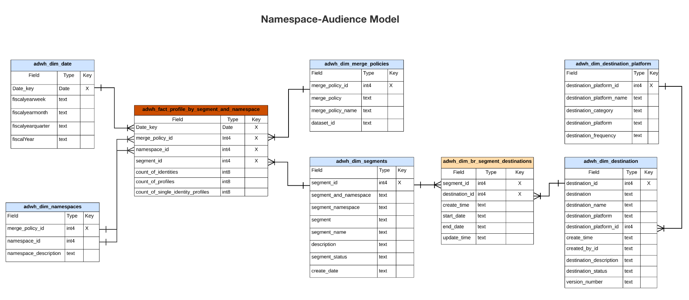
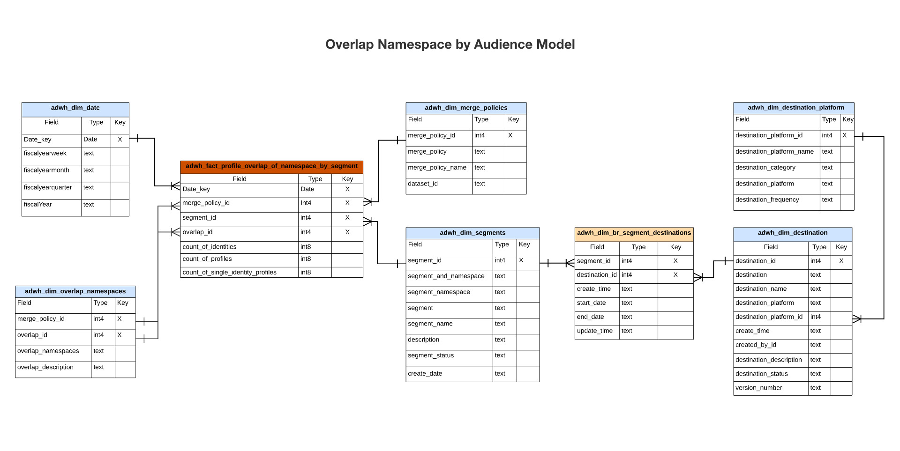
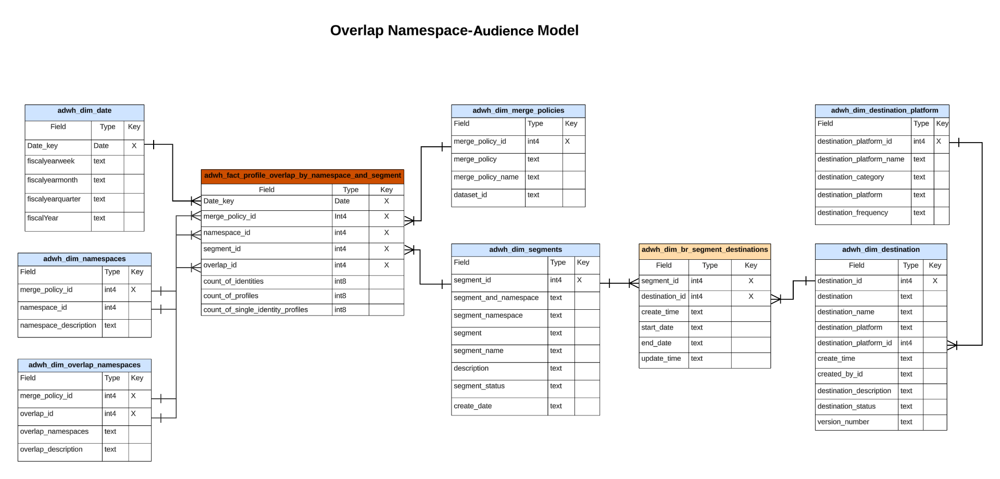

# Real-Time Customer Data Platform Insights data model B2C Edition

[B2C Edition](../../rtcdp/overview.md#rtcdp-b2c)のReal-Time Customer Data Platform インサイト データ モデルは、様々なプロファイル、宛先、セグメント化ウィジェットのインサイトを強化するデータ モデルとSQLを公開します。 これらのSQL クエリテンプレートをカスタマイズして、マーケティングと主要業績評価指標（KPI）のユースケース向けにReal-Time CDPレポートを作成できます。 ユーザー定義のダッシュボードのカスタムウィジェットとして、これらのインサイトを使用できます。 クエリ高速化されたストアレポートのインサイトに関するドキュメントを参照して、高速化されたストアデータとユーザー定義ダッシュボードで使用するクエリサービスを使用してレポートインサイトデータモデルを構築する方法[について説明します。](../../query-service/data-distiller/sql-insights/reporting-insights-data-model.md)

>[!NOTE]
>
>Adobe Experience Platformのシステム全体で、「セグメント」という用語が「オーディエンス」に更新されました。 セグメントへの参照の一部は、ファイルパスとデータセット命名規則で使用されたままです。

## 前提条件

このガイドでは、[&#x200B; ユーザー定義ダッシュボード機能](../standard-dashboards.md)に関する実用的な理解が必要です。 このガイドを続ける前に、ドキュメントをお読みください。

## Real-Time CDP insightのレポートとユースケース

Real-Time CDP レポートは、プロファイルデータと、オーディエンスおよび宛先との関係に関するインサイトを提供します。 さまざまなスタースキーマモデルは、一般的なマーケティングの様々なユースケースに対応するために開発され、各データモデルはいくつかのユースケースをサポートできます。

>[!IMPORTANT]
>
>Real-Time CDP レポートに使用されるデータは、選択した結合ポリシーと最新の日次スナップショットに対して正確です。

### プロファイルモデル {#profile-model}

プロファイルモデルは、次の3つのデータセットで構成されます。

- `adwh_dim_date`
- `adwh_fact_profile`
- `adwh_dim_merge_policies`

以下の画像には、各データセットの関連データフィールドが含まれています。


#### プロファイル数のユースケース {#profile-count}

[!UICONTROL Profile count] ウィジェットに使用されたロジックは、スナップショットが取得された時点で、プロファイルストア内で結合されたプロファイルの合計数を返します。 詳しくは、[[!UICONTROL Profile count] ウィジェットのドキュメント &#x200B;](../guides/profiles.md#profile-count)を参照してください。

[!UICONTROL Profile count] ウィジェットを生成するSQLは、以下の折りたたみ可能なセクションに表示されます。

+++SQL クエリ

```sql
SELECT qsaccel.profile_agg.adwh_dim_merge_policies.merge_policy_name,
       sum(qsaccel.profile_agg.adwh_fact_profile.count_of_profiles) CNT
  FROM qsaccel.profile_agg.adwh_fact_profile
  LEFT OUTER JOIN qsaccel.profile_agg.adwh_dim_merge_policies ON qsaccel.profile_agg.adwh_dim_merge_policies.merge_policy_id=adwh_fact_profile.merge_policy_id
  WHERE qsaccel.profile_agg.adwh_fact_profile.date_key='2024-01-10'
    AND qsaccel.profile_agg.adwh_fact_profile.merge_policy_id = 2027892989
  GROUP BY qsaccel.profile_agg.adwh_dim_merge_policies.merge_policy_name;
```

+++

#### 単一のID プロファイルの使用例 {#single-identity-profiles}

[!UICONTROL Single identity profiles] ウィジェットに使用されるロジックは、組織のプロファイルの数を提供します。このプロファイルには、IDを作成するID タイプが1つしかありません。 詳しくは、[[!UICONTROL Single identity profiles] ウィジェットのドキュメント &#x200B;](../guides/profiles.md#single-identity-profiles)を参照してください。

[!UICONTROL Single identity profiles] ウィジェットを生成するSQLは、以下の折りたたみ可能なセクションに表示されます。

+++SQL クエリ

```sql
SELECT qsaccel.profile_agg.adwh_dim_merge_policies.merge_policy_name,
       sum(qsaccel.profile_agg.adwh_fact_profile.count_of_Single_Identity_profiles) CNT
  FROM qsaccel.profile_agg.adwh_fact_profile
  LEFT OUTER JOIN qsaccel.profile_agg.adwh_dim_merge_policies ON qsaccel.profile_agg.adwh_dim_merge_policies.merge_policy_id=adwh_fact_profile.merge_policy_id
  WHERE qsaccel.profile_agg.adwh_fact_profile.date_key='2024-01-10'
    AND qsaccel.profile_agg.adwh_fact_profile.merge_policy_id = 2027892989
  GROUP BY qsaccel.profile_agg.adwh_dim_merge_policies.merge_policy_name;
```

+++

### 名前空間モデル {#namespace-model}

名前空間モデルは、次のデータセットで構成されます。

- `adwh_dim_date`
- `adwh_fact_profile_by_namespace`
- `adwh_dim_merge_policies`
- `adwh_dim_namespaces`

以下の画像には、各データセットの関連データフィールドが含まれています。


#### ID別プロファイルの使用例 {#profiles-by-identity}

[!UICONTROL Profiles by identity] ウィジェットには、プロファイルストア内のすべての結合プロファイルのIDの内訳が表示されます。 詳しくは、[[!UICONTROL Profiles by identity] ウィジェットのドキュメント &#x200B;](../guides/profiles.md#profiles-by-identity)を参照してください。

[!UICONTROL Profiles by identity] ウィジェットを生成するSQLは、以下の折りたたみ可能なセクションに表示されます。

+++SQL クエリ

```sql
SELECT qsaccel.profile_agg.adwh_dim_namespaces.namespace_description,
        sum(qsaccel.profile_agg.adwh_fact_profile_by_namespace_trendlines.count_of_profiles) count_of_profiles
  FROM qsaccel.profile_agg.adwh_fact_profile_by_namespace_trendlines
  LEFT OUTER JOIN qsaccel.profile_agg.adwh_dim_namespaces ON qsaccel.profile_agg.adwh_fact_profile_by_namespace_trendlines.namespace_id = qsaccel.profile_agg.adwh_dim_namespaces.namespace_id
  AND qsaccel.profile_agg.adwh_fact_profile_by_namespace_trendlines.merge_policy_id = qsaccel.profile_agg.adwh_dim_namespaces.merge_policy_id
  WHERE qsaccel.profile_agg.adwh_fact_profile_by_namespace_trendlines.merge_policy_id = 2027892989
    AND qsaccel.profile_agg.adwh_fact_profile_by_namespace_trendlines.date_key = '2024-01-10'
  GROUP BY qsaccel.profile_agg.adwh_fact_profile_by_namespace_trendlines.date_key,
          qsaccel.profile_agg.adwh_fact_profile_by_namespace_trendlines.merge_policy_id,
          qsaccel.profile_agg.adwh_dim_namespaces.namespace_description
  ORDER BY count_of_profiles DESC;
```

+++

#### ID ユースケース別の単一ID プロファイル {#single-identity-profiles-by-identity}

[!UICONTROL Single identity profiles by identity] ウィジェットに使用されるロジックは、1つの一意の識別子のみで識別されるプロファイルの合計数を示します。 詳しくは、[ID ウィジェット別の単一ID プロファイルに関するドキュメント &#x200B;](../guides/profiles.md#single-identity-profiles-by-identity)を参照してください。

[!UICONTROL Single identity profiles by identity] ウィジェットを生成するSQLは、以下の折りたたみ可能なセクションに表示されます。

+++SQL クエリ

```sql
SELECT qsaccel.profile_agg.adwh_dim_namespaces.namespace_description,
        sum(qsaccel.profile_agg.adwh_fact_profile_by_namespace_trendlines.count_of_Single_Identity_profiles) count_of_Single_Identity_profiles
  FROM qsaccel.profile_agg.adwh_fact_profile_by_namespace_trendlines
  LEFT OUTER JOIN qsaccel.profile_agg.adwh_dim_namespaces ON qsaccel.profile_agg.adwh_fact_profile_by_namespace_trendlines.namespace_id = qsaccel.profile_agg.adwh_dim_namespaces.namespace_id
  AND qsaccel.profile_agg.adwh_fact_profile_by_namespace_trendlines.merge_policy_id = qsaccel.profile_agg.adwh_dim_namespaces.merge_policy_id
  WHERE qsaccel.profile_agg.adwh_fact_profile_by_namespace_trendlines.merge_policy_id = 2027892989
    AND qsaccel.profile_agg.adwh_fact_profile_by_namespace_trendlines.date_key = '2024-01-10'
  GROUP BY qsaccel.profile_agg.adwh_fact_profile_by_namespace_trendlines.date_key,
          qsaccel.profile_agg.adwh_fact_profile_by_namespace_trendlines.merge_policy_id,
          qsaccel.profile_agg.adwh_dim_namespaces.namespace_description;
```

+++

### オーディエンスモデル {#audience-model}

オーディエンスモデルは、次のデータセットで構成されます。

- `adwh_dim_date`
- `adwh_fact_profile_by_segment`
- `adwh_dim_merge_policies`
- `adwh_dim_segments`
- `adwh_dim_br_segment_destinations`
- `adwh_dim_destination`
- `adwh_dim_destination_platform`

以下の画像には、各データセットの関連データフィールドが含まれています。


#### オーディエンスサイズのユースケース {#audience-size}

[!UICONTROL Audience size] ウィジェットに使用されるロジックは、最新のスナップショットの時点で、選択したオーディエンス内の結合プロファイルの合計数を返します。 詳しくは、[[!UICONTROL Audience size] ウィジェットのドキュメント &#x200B;](../guides/audiences.md#audience-size)を参照してください。

[!UICONTROL Audience size] ウィジェットを生成するSQLは、以下の折りたたみ可能なセクションに表示されます。

+++SQL クエリ

```sql
SELECT
  sum(
    qsaccel.profile_agg.adwh_fact_profile_by_segment_trendlines.count_of_profiles
  ) count_of_profiles
FROM
  qsaccel.profile_agg.adwh_fact_profile_by_segment_trendlines
  LEFT OUTER JOIN qsaccel.profile_agg.adwh_dim_segments ON qsaccel.profile_agg.adwh_fact_profile_by_segment_trendlines.segment_id = qsaccel.profile_agg.adwh_dim_segments.segment_id
WHERE
  qsaccel.profile_agg.adwh_fact_profile_by_segment_trendlines.segment_id = -1323307941
  AND qsaccel.profile_agg.adwh_fact_profile_by_segment_trendlines.merge_policy_id = 1914917902
  AND qsaccel.profile_agg.adwh_fact_profile_by_segment_trendlines.date_key = '2024-01-12';
```

+++

#### オーディエンスサイズ変更トレンドのユースケース {#audience-size-change-trend}

[!UICONTROL Audience size change trend] ウィジェットに使用されるロジックは、特定のオーディエンスに適格なプロファイルの合計数の最新の日次スナップショット間の違いを示す折れ線グラフを提供します。 詳しくは、[[!UICONTROL Audience size change trend] ウィジェットのドキュメント &#x200B;](../guides/audiences.md#audience-size-change-trend)を参照してください。

[!UICONTROL Audience size change trend] ウィジェットを生成するSQLは、以下の折りたたみ可能なセクションに表示されます。

+++SQL クエリ

```sql
SELECT date_key,
      Profiles_added
  FROM
    (SELECT rn_num,
            date_key,
            (count_of_profiles-lag(count_of_profiles, 1, 0) over(
                                                                ORDER BY date_key))Profiles_added
    FROM
      (SELECT date_key,
              sum(x.count_of_profiles)count_of_profiles,
              row_number() OVER (
                                  ORDER BY date_key) rn_num
        FROM qsaccel.profile_agg.adwh_fact_profile_by_segment_trendlines x
        INNER JOIN
          (SELECT MAX(process_date) last_process_date,
                  merge_policy_id
          FROM qsaccel.profile_agg.adwh_lkup_process_delta_log
          WHERE process_name = 'FACT_TABLES_PROCESSING'
            AND process_status = 'SUCCESSFUL'
          GROUP BY merge_policy_id) y ON x.merge_policy_id = y.merge_policy_id
        WHERE segment_id = 1333234510
          AND x.date_key >= dateadd(DAY, -30 -1, y.last_process_date)
        GROUP BY x.date_key) a)b
  WHERE rn_num > 1;
```

+++

#### 最も使用されている宛先のユースケース {#most-used-destinations}

[!UICONTROL Most used destinations] ウィジェットで使用されるロジックは、マッピングされたオーディエンスの数に応じて、組織で最も使用される宛先をリストします。 このランキングは、insightで使用されている宛先を示し、使用率が低い可能性のある宛先も示します。 詳しくは、[[!UICONTROL Most used destinations] ウィジェット &#x200B;](../guides/destinations.md#most-used-destinations)のドキュメントを参照してください。

[!UICONTROL Most used destinations] ウィジェットを生成するSQLは、以下の折りたたみ可能なセクションに表示されます。

+++SQL クエリ

```sql
SELECT qsaccel.profile_agg.adwh_dim_destination.destination_name,
       qsaccel.profile_agg.adwh_dim_destination.destination_id,
       qsaccel.profile_agg.adwh_dim_destination.destination,
       count(DISTINCT qsaccel.profile_agg.adwh_dim_br_segment_destinations.segment_id) segment_count
  FROM qsaccel.profile_agg.adwh_dim_destination
  JOIN qsaccel.profile_agg.adwh_dim_br_segment_destinations ON qsaccel.profile_agg.adwh_dim_destination.destination_id = qsaccel.profile_agg.adwh_dim_br_segment_destinations.destination_id
  WHERE qsaccel.profile_agg.adwh_dim_destination.destination_name IS NOT NULL
  GROUP BY qsaccel.profile_agg.adwh_dim_destination.destination_name,
           qsaccel.profile_agg.adwh_dim_destination.destination,
           qsaccel.profile_agg.adwh_dim_destination.destination_id
  ORDER BY segment_count DESC
  LIMIT 20;
```

+++

#### 最近有効化されたオーディエンスのユースケース {#recently-activated-audiences}

[!UICONTROL Recently activated audiences] ウィジェットのロジックは、宛先に最も最近マッピングされたオーディエンスのリストを提供します。 このリストは、システムでアクティブに使用されているオーディエンスと宛先のスナップショットを提供し、誤ったマッピングのトラブルシューティングに役立ちます。 詳しくは、[[!UICONTROL Recently activated audiences] ウィジェットのドキュメント &#x200B;](../guides/destinations.md#recently-activated-audiences)を参照してください。

[!UICONTROL Recently activated audiences] ウィジェットを生成するSQLは、以下の折りたたみ可能なセクションに表示されます。

+++SQL クエリ

```sql
SELECT
  segment_name,
  segment,
  destination_name,
  a.create_time create_time
FROM
  qsaccel.profile_agg.adwh_dim_br_segment_destinations a
  INNER JOIN qsaccel.profile_agg.adwh_dim_segments b ON a.segment_id = b.segment_id
  INNER JOIN qsaccel.profile_agg.adwh_dim_destination c ON a.destination_id = c.destination_id
ORDER BY
  create_time DESC,
  segment
LIMIT
  20;
```

+++

### 名前空間オーディエンスモデル {#namespace-audience-model}

namespace-audience モデルは、次のデータセットで構成されます。

- `adwh_dim_date`
- `adwh_dim_namespaces`
- `adwh_fact_profile_by_segment_and_namespace`
- `adwh_dim_merge_policies`
- `adwh_dim_segments`
- `adwh_dim_br_segment_destinations`
- `adwh_dim_destination`
- `adwh_dim_destination_platform`

以下の画像には、各データセットの関連データフィールドが含まれています。



#### オーディエンスのユースケース向けのID別プロファイル {#audience-profiles-by-identity}

[!UICONTROL Profiles by identity] ウィジェットで使用されるロジックは、特定のオーディエンスに対して、プロファイルストア内のすべての結合プロファイルのIDの内訳を提供します。 詳しくは、[[!UICONTROL Profiles by identity] ウィジェットのドキュメント &#x200B;](../guides/audiences.md#profiles-by-identity)を参照してください。

[!UICONTROL Profiles by identity] ウィジェットを生成するSQLは、以下の折りたたみ可能なセクションに表示されます。

+++SQL クエリ

```sql
SELECT qsaccel.profile_agg.adwh_dim_namespaces.namespace_description,
        sum(qsaccel.profile_agg.adwh_fact_profile_by_segment_and_namespace_trendlines.count_of_profiles) count_of_profiles
  FROM qsaccel.profile_agg.adwh_fact_profile_by_segment_and_namespace_trendlines
  LEFT OUTER JOIN qsaccel.profile_agg.adwh_dim_namespaces ON qsaccel.profile_agg.adwh_fact_profile_by_segment_and_namespace_trendlines.namespace_id = qsaccel.profile_agg.adwh_dim_namespaces.namespace_id
  AND qsaccel.profile_agg.adwh_fact_profile_by_segment_and_namespace_trendlines.merge_policy_id = qsaccel.profile_agg.adwh_dim_namespaces.merge_policy_id
  WHERE qsaccel.profile_agg.adwh_fact_profile_by_segment_and_namespace_trendlines.segment_id = 1333234510
    AND qsaccel.profile_agg.adwh_fact_profile_by_segment_and_namespace_trendlines.merge_policy_id = 1709997014
    AND qsaccel.profile_agg.adwh_fact_profile_by_segment_and_namespace_trendlines.date_key = '2024-01-10'
  GROUP BY qsaccel.profile_agg.adwh_dim_namespaces.namespace_description
  ORDER BY count_of_profiles DESC;
```

+++

### 重複名前空間モデル

重複名前空間モデルは、次のデータセットで構成されます。

- `adwh_dim_date`
- `adwh_dim_overlap_namespaces`
- `adwh_fact_profile_overlap_of_namespace`
- `adwh_dim_merge_policies`

以下の画像には、各データセットの関連データフィールドが含まれています。


#### ID重複（プロファイル）のユースケース {#profiles-identity-overlap}

[!UICONTROL Identity overlap] ウィジェットで使用されるロジックは、選択した2つのIDを含む&#x200B;**プロファイルストア**&#x200B;内のプロファイルの重複を表示します。 詳しくは、[[!UICONTROL Identity overlap] ダッシュボードのドキュメント [!UICONTROL Profiles]の](../guides/profiles.md#identity-overlap) ウィジェットの節を参照してください。

[!UICONTROL Identity overlap] ウィジェットを生成するSQLは、以下の折りたたみ可能なセクションに表示されます。

+++SQL クエリ

```sql
SELECT Sum(overlap_col1) overlap_col1,
        Sum(overlap_col2) overlap_col2,
        coalesce(Sum(overlap_count), 0) overlap_count
  FROM
    (SELECT 0 overlap_col1,
            0 overlap_col2,
            Sum(count_of_profiles) overlap_count
    FROM qsaccel.profile_agg.adwh_fact_profile_overlap_of_namespace
    WHERE qsaccel.profile_agg.adwh_fact_profile_overlap_of_namespace.merge_policy_id = 2027892989
      AND qsaccel.profile_agg.adwh_fact_profile_overlap_of_namespace.date_key = '2024-01-10'
      AND qsaccel.profile_agg.adwh_fact_profile_overlap_of_namespace.overlap_id IN
        (SELECT a.overlap_id
          FROM
            (SELECT qsaccel.profile_agg.adwh_dim_overlap_namespaces.overlap_id overlap_id,
                    count(*) cnt_num
            FROM qsaccel.profile_agg.adwh_dim_overlap_namespaces
            WHERE qsaccel.profile_agg.adwh_dim_overlap_namespaces.merge_policy_id = 2027892989
              AND qsaccel.profile_agg.adwh_dim_overlap_namespaces.overlap_namespaces in ('avid',
                                                                                          'crmid')
            GROUP BY qsaccel.profile_agg.adwh_dim_overlap_namespaces.overlap_id)a
          WHERE a.cnt_num>1 )
    UNION ALL SELECT count_of_profiles overlap_col1,
                      0 overlap_col2,
                      0 overlap_count
    FROM qsaccel.profile_agg.adwh_fact_profile_by_namespace_trendlines
    JOIN qsaccel.profile_agg.adwh_dim_namespaces ON qsaccel.profile_agg.adwh_fact_profile_by_namespace_trendlines.namespace_id = qsaccel.profile_agg.adwh_dim_namespaces.namespace_id
    AND qsaccel.profile_agg.adwh_fact_profile_by_namespace_trendlines.merge_policy_id = qsaccel.profile_agg.adwh_dim_namespaces.merge_policy_id
    WHERE qsaccel.profile_agg.adwh_fact_profile_by_namespace_trendlines.merge_policy_id = 2027892989
      AND qsaccel.profile_agg.adwh_fact_profile_by_namespace_trendlines.date_key = '2024-01-10'
      AND qsaccel.profile_agg.adwh_dim_namespaces.namespace_description = 'avid'
    UNION ALL SELECT 0 overlap_col1,
                      count_of_profiles overlap_col2,
                      0 Overlap_count
    FROM qsaccel.profile_agg.adwh_fact_profile_by_namespace_trendlines
    JOIN qsaccel.profile_agg.adwh_dim_namespaces ON qsaccel.profile_agg.adwh_fact_profile_by_namespace_trendlines.namespace_id = qsaccel.profile_agg.adwh_dim_namespaces.namespace_id
    AND qsaccel.profile_agg.adwh_fact_profile_by_namespace_trendlines.merge_policy_id = qsaccel.profile_agg.adwh_dim_namespaces.merge_policy_id
    WHERE qsaccel.profile_agg.adwh_fact_profile_by_namespace_trendlines.merge_policy_id = 2027892989
      AND qsaccel.profile_agg.adwh_fact_profile_by_namespace_trendlines.date_key = '2024-01-10'
      AND qsaccel.profile_agg.adwh_dim_namespaces.namespace_description = 'crmid' )a;
```

+++

### オーディエンスモデル別の重複名前空間 {#overlap-namespace-by-audience-model}

オーディエンスモデルによる重複名前空間は、次のデータセットで構成されます。

- `adwh_dim_date`
- `adwh_dim_overlap_namespaces`
- `adwh_fact_profile_overlap_of_namespace_by_segment`
- `adwh_dim_merge_policies`
- `adwh_dim_segments`
- `adwh_dim_br_segment_destinations`
- `adwh_dim_destination`
- `adwh_dim_destination_platform`

以下の画像には、各データセットの関連データフィールドが含まれています。



#### ID重複（オーディエンス）のユースケース {#audiences-identity-overlap}

[!UICONTROL Audiences] ダッシュボード [!UICONTROL Identity overlap] ウィジェットで使用されるロジックは、特定のオーディエンスに対して選択された2つのIDを含むプロファイルの重複を示しています。 詳しくは、[[!UICONTROL Identity overlap] ダッシュボードのドキュメント [!UICONTROL Audiences]の](../guides/audiences.md#identity-overlap) ウィジェットの節を参照してください。

[!UICONTROL Identity overlap] ウィジェットを生成するSQLは、以下の折りたたみ可能なセクションに表示されます。

+++SQL クエリ

```sql
SELECT Sum(overlap_col1) overlap_col1,
        Sum(overlap_col2) overlap_col2,
        Sum(overlap_count) Overlap_count
  FROM
    (SELECT 0 overlap_col1,
            0 overlap_col2,
            Sum(count_of_profiles) Overlap_count
    FROM qsaccel.profile_agg.adwh_fact_profile_overlap_of_namespace_by_segment
    WHERE qsaccel.profile_agg.adwh_fact_profile_overlap_of_namespace_by_segment.segment_id = 1333234510
      AND qsaccel.profile_agg.adwh_fact_profile_overlap_of_namespace_by_segment.merge_policy_id = 1709997014
      AND qsaccel.profile_agg.adwh_fact_profile_overlap_of_namespace_by_segment.date_key = '2024-01-10'
      AND qsaccel.profile_agg.adwh_fact_profile_overlap_of_namespace_by_segment.overlap_id IN
        (SELECT a.overlap_id
          FROM
            (SELECT qsaccel.profile_agg.adwh_dim_overlap_namespaces.overlap_id overlap_id,
                    count(*) cnt_num
            FROM qsaccel.profile_agg.adwh_dim_overlap_namespaces
            WHERE qsaccel.profile_agg.adwh_dim_overlap_namespaces.merge_policy_id = 1709997014
              AND qsaccel.profile_agg.adwh_dim_overlap_namespaces.overlap_namespaces in ('crmid',
                                                                                          'email')
            GROUP BY qsaccel.profile_agg.adwh_dim_overlap_namespaces.overlap_id)a
          WHERE a.cnt_num>1 )
    UNION ALL SELECT count_of_profiles overlap_col1,
                      0 overlap_col2,
                      0 Overlap_count
    FROM qsaccel.profile_agg.adwh_fact_profile_by_segment_and_namespace_trendlines
    LEFT OUTER JOIN qsaccel.profile_agg.adwh_dim_namespaces ON qsaccel.profile_agg.adwh_fact_profile_by_segment_and_namespace_trendlines.namespace_id = qsaccel.profile_agg.adwh_dim_namespaces.namespace_id
    AND qsaccel.profile_agg.adwh_fact_profile_by_segment_and_namespace_trendlines.merge_policy_id = qsaccel.profile_agg.adwh_dim_namespaces.merge_policy_id
    WHERE qsaccel.profile_agg.adwh_dim_namespaces.namespace_description = 'crmid'
      AND qsaccel.profile_agg.adwh_fact_profile_by_segment_and_namespace_trendlines.segment_id = 1333234510
      AND qsaccel.profile_agg.adwh_fact_profile_by_segment_and_namespace_trendlines.merge_policy_id = 1709997014
      AND qsaccel.profile_agg.adwh_fact_profile_by_segment_and_namespace_trendlines.date_key = '2024-01-10'
    UNION ALL SELECT 0 overlap_col1,
                      count_of_profiles overlap_col2,
                      0 Overlap_count
    FROM qsaccel.profile_agg.adwh_fact_profile_by_segment_and_namespace_trendlines
    LEFT OUTER JOIN qsaccel.profile_agg.adwh_dim_namespaces ON qsaccel.profile_agg.adwh_fact_profile_by_segment_and_namespace_trendlines.namespace_id = qsaccel.profile_agg.adwh_dim_namespaces.namespace_id
    AND qsaccel.profile_agg.adwh_fact_profile_by_segment_and_namespace_trendlines.merge_policy_id = qsaccel.profile_agg.adwh_dim_namespaces.merge_policy_id
    WHERE qsaccel.profile_agg.adwh_dim_namespaces.namespace_description = 'email'
      AND qsaccel.profile_agg.adwh_fact_profile_by_segment_and_namespace_trendlines.segment_id = 1333234510
      AND qsaccel.profile_agg.adwh_fact_profile_by_segment_and_namespace_trendlines.merge_policy_id = 1709997014
      AND qsaccel.profile_agg.adwh_fact_profile_by_segment_and_namespace_trendlines.date_key = '2024-01-10' ) a;
```

+++

<!-- 
Commented out as Anil wanted to add something but did not provide information yet:
### Overlap Namespace-Audience model {#overlap-namespace-audience-model}

The overlap namespace-audience model is comprised of the following datasets: 

- `adwh_fact_profile_overlap_by_namespace_and_segment`
- `adwh_dim_date`
- `adwh_dim_namespace`
- `adwh_dim_overlap_namespaces`
- `adwh_dim_merge_policies`
- `adwh_dim_segments`
- `adwh_dim_br_segment_destinations`
- `adwh_dim_destination`
- `adwh_dim_destination_platform`

 
-->

<!-- What insights are gathered from this particular data model? -->

<!-- 
Commented out as Anil wanted to add something but did not provide information yet:
### AI model {#ai-model}

The AI model is comprised of the following datasets: 

- `adwh_fact_profile_ai_models`
- `adwh_dim_date`
- `adwh_dim_merge_policies`
- `adwh_dim_ai_models`

 
-->

<!-- What insights are gathered from this particular data model? -->

