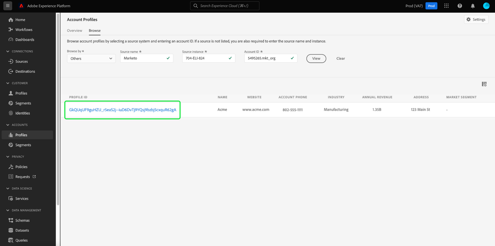
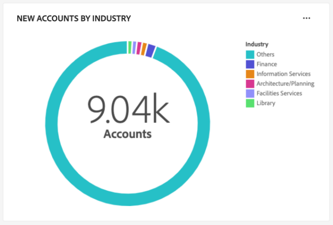

# アカウントプロファイルダッシュボード

Adobe Experience Platform ユーザーインターフェイス（UI）には、毎日のスナップショットで取得した、アカウントプロファイルに関する重要な情報を表示できるダッシュボードが用意されています。 このガイドでは、UI での [!UICONTROL  アカウントプロファイル ] ダッシュボードへのアクセスおよび操作方法の概要を説明し、ダッシュボードに表示されるビジュアライゼーションの詳細を説明します。

このドキュメントでは、[!UICONTROL  アカウントプロファイル ] ダッシュボード内の機能の概要と、使用可能な標準インサイトの詳細を説明します。 使用可能な機能について詳しくは、[[!UICONTROL  アカウントプロファイル ]UI ガイド ](../../rtcdp/accounts/account-profile-ui-guide.md) を参照してください。

## はじめに

B2B [!UICONTROL  アカウントプロファイル ] ダッシュボードにアクセスするには、[Adobe Real-time Customer Data Platform B2B Edition](../../rtcdp/b2b-overview.md) の権利が必要です。

## アカウントプロファイルデータ {#data}

[!UICONTROL  アカウントプロファイル ] ダッシュボードには、統合アカウント情報のスナップショットが表示されます。 このアカウント情報は、マーケティングチャネル全体の複数のソースと、顧客アカウント情報を保存するために組織が現在使用している様々なシステムから取得されます。

スナップショット内のプロファイルデータは、スナップショットが作成された特定の時点に表示されたのとまったく同じデータを表示します。 つまり、スナップショットはデータの近似やサンプルではなく、[!UICONTROL  アカウントプロファイル ] ダッシュボードはリアルタイムには更新されません。

>[!NOTE]
>
>スナップショットが作成された後にデータに加えられた変更や更新は、次のスナップショットが作成されるまでダッシュボードに反映されません。

## [!UICONTROL  アカウントプロファイル ] ダッシュボードを探索 {#explore}

Platform UI 内で [!UICONTROL  アカウントプロファイル ] ダッシュボードに移動するには、左側のナビゲーションパネルで **[!UICONTROL アカウント [!UICONTROL  の下の ] プロファイル]** を選択します。

[!UICONTROL  アカウントプロファイル ] ダッシュボードでは、[ 組織に取り込まれたアカウントプロファイルを参照 ](#browse-account-profiles) または [ ウィジェットを使用してアカウントプロファイルデータ全体を一目で表示 ](#standard-widgets) することができます。

### 日付フィルター {#date-filter}

「[!UICONTROL  概要 ]」タブは、アカウントプロファイルに関する重要な情報を伝える読み取り専用の指標を提供するウィジェットで構成されます。 カレンダーアイコンまたは日付を選択して、ウィジェットのグローバル日付フィルターを変更します。

>[!IMPORTANT]
>
>ドロップダウンカレンダーで選択した日付範囲は、2 つの予測スコアリングウィジェット（[ 分布 ](#predictive-scoring-distribution) および [ 上位の影響要因 ](#predictive-scoring-top-influential-factors)）を除くすべてのインサイトに影響します。

### リードとアカウントのマッチングサービスの設定 {#lead-to-account-matching-service}

**[!UICONTROL 設定]** を選択して、[!UICONTROL  アカウント設定 ] ダイアログからリードとアカウントのマッチングサービスを設定します。 リードとアカウントのマッチングの設定方法について詳しくは、[UI ガイド ](../../rtcdp/accounts/account-profile-ui-guide.md#configure-lead-to-account-matching) を参照してください。 リードとアカウントのマッチングについて詳しくは、[Real-Time CDP B2B ドキュメントのリードとアカウントのマッチング ](../../rtcdp/b2b-ai-ml-services/lead-to-account-matching.md) を参照してください。

## アカウントプロファイルの参照 {#browse-account-profiles}

「[!UICONTROL  参照 ]」タブでは、組織に取り込まれた読み取り専用アカウントプロファイルを検索および表示できます。 接続されたエンタープライズソースのアカウント ID を使用するか、ソースの詳細を直接入力します。 このワークスペースから、名前、業界、売上高、オーディエンスなど、アカウントプロファイルに属する重要な情報を確認できます。

「[!UICONTROL  参照 ]」タブに表示された結果から「[!UICONTROL  プロファイル ID]」を選択して、アカウントプロファイルの「[!UICONTROL  詳細 ]」タブを開きます。

「[!UICONTROL  詳細 ]」タブに表示されるアカウントプロファイル情報は、複数のプロファイルフラグメントを結合し、個々のアカウントの単一のビューを形成したものです。 Platform UI でのアカウントプロファイル表示機能について詳しくは、[Adobe Real-time Customer Data Platformでのアカウントプロファイルの参照 ](../../rtcdp/accounts/account-profile-ui-guide.md#browse-account-profiles) に関するドキュメントを参照してください。

## 標準ウィジェット {#standard-widgets}

>[!CONTEXTUALHELP]
>id="platform_dashboards_accountprofiles_customersperaccountoverview"
>title="アカウントあたりの顧客数の概要"
>abstract="このドリルスルーウィジェットは、B2B データの構造に関するインサイトを提供します。 これは、顧客プロファイルがリンクされていない、または 1 つ以上の顧客プロファイルが関連付けられているアカウントプロファイルの数を特定するのに役立ちます。<ul><li>ダイレクト顧客：`personComponents` ルートを通じてアカウントに直接リンクされた顧客プロファイルです。</li><li>間接顧客：`Account-Person` ルートを介してアカウントにリンクされた顧客プロファイルです。</li></ul>"

Adobeには、アカウントプロファイルに関連する様々な指標を視覚化するために使用できる標準ウィジェットが用意されています。

>[!IMPORTANT]
>
>日付フィルターを指定しない場合、インサイトのデフォルトの動作では、前年から今日までに追加されたデータが分析されます。

使用可能な各標準ウィジェットの詳細を確認するには、次のリストからウィジェットの名前を選択します。

* [追加されたアカウントプロファイル](#account-profiles-added)
* [業界別の新しいアカウント](#accounts-by-industry)
* [タイプ別の新しいアカウント](#accounts-by-type)
* [人物の役割別の新しい機会](#opportunities-by-person-role)
* [収益別の新しい商談](#opportunities-by-revenue)
* [ステータスおよびステージ別の新しい商談](#opportunities-by-status-&-stage)
* [獲得済みの新規商談](#opportunities-won)
* [追加された商談](#opportunities-added)
* [予測スコアリング分布](#predictive-scoring-distribution)
* [予測スコアリングの上位影響要因](#predictive-scoring-top-influential-factors)

### 追加されたアカウントプロファイル {#account-profiles-added}

[!UICONTROL  追加されたアカウントプロファイル ] ウィジェットは、折れ線グラフを使用して、1 日に追加されたアカウントプロファイルの数を一定期間にわたって表示します。 ダッシュボードの上部にあるグローバル日付フィルターを使用して、分析期間を決定します。 日付フィルターが指定されていない場合、デフォルトの動作には、1 年前の日に追加されたアカウントプロファイルが一覧表示されます。 結果を使用して、追加されたアカウントプロファイル数のトレンドを推測できます。

### 業界別の新しいアカウント {#accounts-by-industry}

[!UICONTROL  業界別の新しいアカウント ] ウィジェットは、アカウントの合計数をドーナツグラフ内の単一の指標で表示します。 ドーナツグラフは、この合計を構成する様々な業界の相対的な構成を示します。 色分けされたキーは、含まれているすべての業界の分類を提供します。 ドーナツグラフの各セクションにカーソルを合わせると、各業界の個々のカウントがダイアログに表示されます。

### タイプ別の新しいアカウント {#accounts-by-type}

[!UICONTROL  タイプ別の新しいアカウント ] ウィジェットは、アカウントの合計数をドーナツグラフ内の 1 つの指標に表示します。 ドーナツグラフは、この合計を構成する様々なアカウントタイプの相対的な構成を示しています。 色分けされたキーは、含まれているすべてのアカウントタイプの分類を提供します。 ドーナツグラフの各セクションにカーソルを合わせると、各タイプのアカウントの個々のカウントがダイアログに表示されます。

### 人物の役割別の新しい機会 {#opportunities-by-person-role}

[!UICONTROL  ユーザー役割別の新しい機会 ] ウィジェットは、機会の合計数をドーナツグラフ内の単一の指標に表示します。 ドーナツグラフは、この機会の合計数を構成する役割の相対的な構成を示します。 色分けされたキーは、含まれているすべての役割の分類を提供します。 ドーナツグラフの各セクションにカーソルを合わせると、各役割の個々のカウントがダイアログに表示されます。

>[!NOTE]
>
>[!UICONTROL  データが見つかりません ] または [!UICONTROL  読み込めません ] エラーは、「Opportunity-Person」ブリッジテーブルがスキーマで使用されていない場合に発生します。 インサイトでこれらのエラーのいずれかが表示された場合は、和集合スキーマを確認し、「Opportunity-Person」フィールドグループがデータを取り込んでいることを確認してください。

### 収益別の新しい商談 {#opportunities-by-revenue}

[!UICONTROL  売上高別の新しい商談 ] ウィジェットは、棒グラフを使用して、商談によって生み出された推定売上高の合計を示します。 ウィジェットは最大 6 つの機会をサポートします。

商談の特定の合計売上高を含むダイアログを表示するには、カーソルを個々のバーに合わせます。

### ステータスおよびステージ {#opportunities-by-status-&-stage} ース別の新しい商談

このウィジェットは、棒グラフを使用して、マーケティング/セールスファネルのすべてのステージで開いている商談または閉じている商談の数を示します。 ウィジェットは色を使用して、商談のステージを区別します。 色分けされたキーは、商談で使用可能なステージを示します。

### 獲得済みの新規商談 {#opportunities-won}

[!UICONTROL  新しい受注 ] ウィジェットは、ドーナツグラフ内の単一の指標で、正常に確定された商談の合計数を表示します。 ドーナツグラフは、獲得または獲得していない機会の相対的な構成を示します。 色分けされたキーは、獲得した商談と獲得しなかった商談を区別します。 ドーナツグラフの各セクションにカーソルを合わせると、各役割の個々のカウントがダイアログに表示されます。

### 追加された商談 {#opportunities-added}

[!UICONTROL  追加された商談 ] ウィジェットは、折れ線グラフを使用して、一定期間に 1 日に追加された商談数を表示します。 ダッシュボードの上部にあるグローバル日付フィルターを使用して、分析期間を決定します。 日付フィルターが指定されていない場合、デフォルトの動作では、今日より前の年に追加された商談が一覧表示されます。 結果を使用して、追加された商談数のトレンドを推測できます。

<!-- Link to date filter documentation from Annamalai -->

### 予測スコアリング分布 {#predictive-scoring-distribution}

[!UICONTROL  予測スコアリング分布 ] ウィジェットには、すべてのアカウントプロファイルのスコア分布が表示され、セールスパイプラインの正常性を一目で把握するのに役立ちます。 スコアリングデータは、ドーナツグラフおよび列グラフを介して伝達される。

ドーナツグラフは、高、中、低の各バケット購入傾向における合計アカウントプロファイルの割合を示します。 キーは、スコアリングバケットの範囲とその範囲内のアカウントプロファイル数など、色分けされたセクションに関する詳細を提供します。

列グラフは、より詳細なスコアリング分類を提供します。 各列には、20 個の 5 ポイント増分バケットごとのアカウントプロファイル数が表示されます。

ウィジェット内のドロップダウンメニューを使用すると、アカウントのスコアリングモデルを選択できます。

>[!NOTE]
>
>グローバル日付範囲フィルターは、予測スコアリングインサイトには適用されません。 予測スコアリングウィジェットは、ドロップダウンで選択したアカウントのスコアリングモデルに基づいてデータを分析します。

### 予測スコアリングの上位影響要因 {#predictive-scoring-top-influential-factors}

[!UICONTROL  予測スコアに最も影響を与える要因 ] ウィジェットは、各傾向バケットのスコアを駆動する最も重要な要因を理解するのに役立ちます。

このウィジェットには、傾向の高、中、低の各バケットに影響を与えた上位の要因が表示されます。 各影響要因のバーは、特定の影響要因を含む傾向バケット内のアカウントプロファイルの割合を示します。

ウィジェット内のドロップダウンメニューを使用すると、アカウントのスコアリングモデルを選択できます。

>[!NOTE]
>
>グローバル日付範囲フィルターは、予測スコアリングインサイトには適用されません。 予測スコアリングウィジェットは、ドロップダウンで選択したアカウントのスコアリングモデルに基づいてデータを分析します。

## データを読み込めませんエラー {#errors}

ウィジェットに *[!UICONTROL 読み込めません」と表示される場合。 もう一回やってみて。]* れは、B2B エンティティに使用可能なデータがないためです。 例えば、以下に表示されるウィジェット [!UICONTROL  ユーザー役割別の新しい商談 ] には、「[!UICONTROL  読み込めません。 もう一回やってみて。このサンドボックスには使用可能な商談データがないので、]」です。

この問題を解決するには、*オポチュニティ人物* データなどの B2B エンティティデータをサンドボックスに取り込む必要があります。 48 時間後、データはウィジェットに反映されます。

## 次の手順

このドキュメントでは、[!UICONTROL  アカウントプロファイル ] ダッシュボードの見つけ方と、使用可能なウィジェットに表示される指標について説明しました。 Experience PlatformUI で B2B データの一部としてアカウントプロファイルを使用する方法について詳しくは、Adobe Real-Time CDP B2B Edition の [ アカウントプロファイルの概要 ](../../rtcdp/accounts/account-profile-overview.md) を参照してください。
