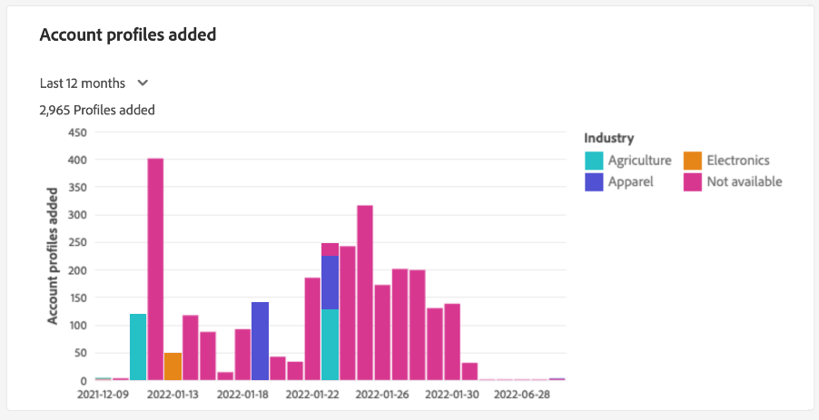
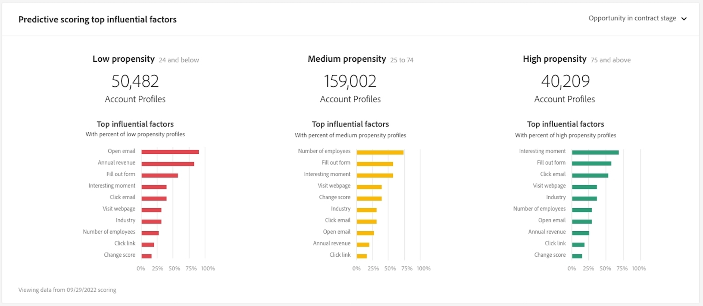

# [!UICONTROL アカウントプロファイル] dashboard

Adobe Experience Platformのユーザーインターフェイス (UI) には、毎日のスナップショットで取り込まれた、アカウントプロファイルに関する重要な情報を表示できるダッシュボードが用意されています。 このガイドでは、 [!UICONTROL アカウントプロファイル] ダッシュボードを使用して、ダッシュボードに表示されるビジュアライゼーションに関する詳細情報を確認できます。

アカウントプロファイルユーザーインターフェイス内のすべての機能の概要については、 [アカウントプロファイル UI ガイド](../../rtcdp/accounts/account-profile-ui-guide.md).

## はじめに

次の権限を持っている必要があります。 [Real-time Customer Data Platform B2B エディション](../../rtcdp/b2b-overview.md) B2B にアクセスするために [!UICONTROL アカウントプロファイル] ダッシュボード。

## アカウントプロファイルデータ

この [!UICONTROL アカウントプロファイル] ダッシュボードには、マーケティングチャネル全体の複数のソースから得られた統合アカウント情報のスナップショットと、顧客アカウント情報の保存に組織が現在使用している様々なシステムが表示されます。

スナップショットのプロファイルデータは、スナップショットが作成された特定の時点でのデータと完全に同じ内容を示します。 つまり、スナップショットはデータの近似やサンプルではなく、 [!UICONTROL アカウントプロファイル] ダッシュボードはリアルタイムで更新されません。

>[!NOTE]
>
>スナップショットが作成された後にデータに加えられた変更や更新は、次のスナップショットが作成されるまでダッシュボードに反映されません。

## 関連トピック [!UICONTROL アカウントプロファイル] dashboard

次に移動するには： [!UICONTROL アカウントプロファイル] Platform UI 内のダッシュボードで、「 **[!UICONTROL プロファイル]** under [!UICONTROL アカウント] をクリックします。

次の [!UICONTROL アカウントプロファイル] ダッシュボードは、次のいずれかを実行できます。 [組織に取り込まれたアカウントプロファイルの参照](#browse-account-profiles)または [ウィジェットを使用して、アカウントプロファイルデータ全体を一目で表示する](#standard-widgets) データの側面を視覚化します。

## アカウントプロファイルの参照 {#browse-account-profiles}

この [!UICONTROL 参照] 「 」タブでは、接続されたエンタープライズソースのアカウント ID を使用して、またはソースの詳細を直接入力することで、組織に取り込まれた読み取り専用アカウントプロファイルを検索および表示できます。 ここから、アカウントプロファイルに属する重要な情報（名前、業種、売上高、セグメントなど）を確認できます。

を選択します。 [!UICONTROL プロファイル ID] を [!UICONTROL 参照] タブをクリックして、 [!UICONTROL 詳細] タブをクリックします。

次に表示されるアカウントプロファイル情報： [!UICONTROL 詳細] タブは、複数のプロファイルフラグメントから結合され、個々のアカウントの単一の表示を形成します。 詳しくは、 [Real-time Customer Data Platformでのアカウントプロファイルの参照](../../rtcdp/accounts/account-profile-ui-guide.md#browse-account-profiles) を参照して、Platform UI でのアカウントプロファイル表示機能について確認してください。

## この [!UICONTROL アカウントプロファイル] [!UICONTROL 概要] {#overview}

この [!UICONTROL 概要] 「 」タブは、アカウントプロファイルに関する重要な情報を伝える読み取り専用の指標を提供するウィジェットで構成されています。 選択 **[!UICONTROL ダッシュボードを変更]** 外観を変更するには [!UICONTROL 概要] タブに移動して、ウィジェットのサイズを変更する。

詳しくは、 [ダッシュボードの変更](../customize/modify.md) そして [ウィジェットライブラリの概要](../customize/widget-library.md) を参照してください。

## 標準ウィジェット {#standard-widgets}

Adobeは、アカウントプロファイルに関連する様々な指標を視覚化するために使用できる標準ウィジェットを提供します。

使用可能な各標準ウィジェットの詳細を確認するには、次のリストからウィジェットの名前を選択します。

* [業種別の合計アカウント数](#total-accounts-by-industry)
* [追加されたアカウントプロファイル](#account-profiles-added)
* [予測スコア配分](#predictive-scoring-distribution)
* [予測スコアリングの上位の影響要因](#predictive-scoring-top-influential-factors)

### 業種別の合計アカウント数 {#total-accounts-by-industry}

このウィジェットは、アカウントの合計数を 1 つの指標で表示し、ドーナツグラフを使用して、全体の数に占める各業種の割合を、数に比例したサイズで示します。このキーは、ドーナツグラフを構成する様々な業界に対して、色分け情報を提供します。

ドーナツグラフの各セクションにカーソルを合わせると、異なる業種の個々の数がダイアログに表示されます。

### 追加されたアカウントプロファイル {#account-profiles-added}

このウィジェットは、色分けされた棒グラフを使用して、特定の期間にアカウントに追加されたプロファイルの数と、追加されたプロファイルを構成する様々な業界の割合を示します。 業界は色分けされ、キーは棒グラフを構成する様々な業界の色分け情報を提供します。 分析期間は、ウィジェットのドロップダウンメニューから選択します。 棒グラフは、30 日、90 日、12 ヶ月の期間で視覚化できます。

>[!NOTE]
>
>プロファイルは 1 つのアカウントにのみ追加され、削除されないので、一定期間に追加されるプロファイルの数ができる限り少ないのはゼロです。

### 予測スコア配分 {#predictive-scoring-distribution}

この [!UICONTROL 予測スコア配分] ウィジェットには、すべてのアカウントプロファイルのスコア配分が表示され、セールスパイプラインの正常性を一目で把握するのに役立ちます。 スコアリングデータは、ドーナツグラフと列グラフを使用して伝達されます。

ドーナツグラフは、バケットを購入する傾向の高い、中程度、低い各アカウントプロファイルの合計数の割合を示します。 キーは、スコアリングバケットの範囲や、その範囲のアカウントプロファイルの数など、色分けされたセクションに関する詳細を提供します。

列のグラフは、より詳細なスコアリング分類を提供します。 各列には、20 個の 5 ポイント増分グループの各アカウントプロファイルの数が表示されます。

ウィジェット内のドロップダウンメニューを使用すると、アカウントスコアリングモデルを選択できます。

### 予測スコアリングの上位の影響要因 {#predictive-scoring-top-influential-factors}

この [!UICONTROL 予測スコアリングの上位の影響要因] ウィジェットを使用すると、各傾向バケットのスコアを算出する最も重要な要因を把握できます。

このウィジェットは、傾向の高いバケット、中程度のバケット、低いバケットのそれぞれについて、最も影響力のある要因を表示します。 影響を与える要因ごとの棒は、その傾向バケット内で、特定の影響を与える要因を含むアカウントプロファイルの割合を示します。

ウィジェット内のドロップダウンメニューを使用すると、アカウントスコアリングモデルを選択できます。

## 次の手順

このドキュメントに従えば、 [!UICONTROL アカウントプロファイル] ダッシュボード。 また、使用可能なウィジェットに表示される指標も理解する必要があります。 Experience PlatformUI で B2B データの一部としてアカウントプロファイルを使用する方法について詳しくは、 [アカウントプロファイルの概要](../../rtcdp/accounts/account-profile-overview.md) Adobe Real-Time CDP, B2B Edition の場合
