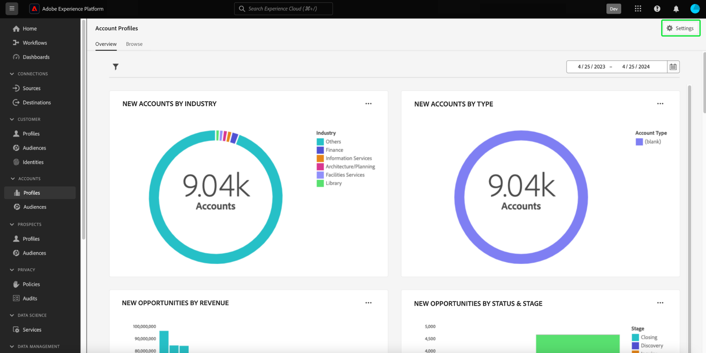
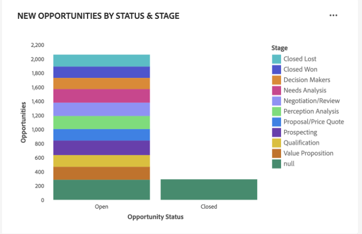
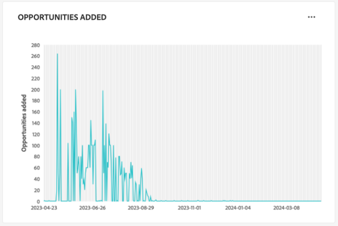

# アカウントプロファイルダッシュボード

Adobe Experience Platform ユーザーインターフェイス（UI）には、毎日のスナップショットで取得した、アカウントプロファイルに関する重要な情報を表示できるダッシュボードが用意されています。 このガイドでは、UI で [!UICONTROL Account Profiles] ダッシュボードにアクセスして操作する方法の概要を説明し、ダッシュボードに表示されるビジュアライゼーションの詳細を説明します。

このドキュメントでは、[!UICONTROL Account Profiles] ダッシュボード内の機能の概要と、使用可能な標準インサイトの詳細を説明します。 使用可能な機能について詳しくは [[!UICONTROL Account Profiles] &#x200B;](../../rtcdp/accounts/account-profile-ui-guide.md) UI ガイドを参照してください。

## はじめに

B2B [&#x200B; ダッシュボードにアクセスするには &#x200B;](../../rtcdp/b2b-overview.md)Adobe Real-Time Customer Data Platform B2B edition&rbrace; の使用資格が必要です。[!UICONTROL Account Profiles]

## アカウントプロファイルデータ {#data}

[!UICONTROL Account Profiles] ダッシュボードに、統合アカウント情報のスナップショットが表示されます。 このアカウント情報は、マーケティングチャネル全体の複数のソースと、顧客アカウント情報を保存するために組織が現在使用している様々なシステムから取得されます。

スナップショット内のプロファイルデータは、スナップショットが作成された特定の時点に表示されたのとまったく同じデータを表示します。 つまり、スナップショットはデータの近似やサンプルではなく、[!UICONTROL Account Profiles] ダッシュボードはリアルタイムには更新されません。

>[!NOTE]
>
>スナップショットが作成された後にデータに加えられた変更や更新は、次のスナップショットが作成されるまでダッシュボードに反映されません。

## [!UICONTROL Account Profiles] ダッシュボードを試す {#explore}

Experience Platform UI 内の [!UICONTROL Account Profiles] ダッシュボードに移動するには、左側のナビゲーションパネルで **[!UICONTROL Profiles]** の下の「[!UICONTROL Accounts]」を選択します。

[!UICONTROL Account Profiles] ダッシュボードから、[&#x200B; 組織に取り込まれたアカウントプロファイルを参照する &#x200B;](#browse-account-profiles) または [&#x200B; ウィジェットを使用してアカウントプロファイルデータ全体を一目で表示する &#x200B;](#standard-widgets) のいずれかを実行できます。

### 日付フィルター {#date-filter}

「[!UICONTROL Overview]」タブは、アカウントプロファイルに関する重要な情報を伝える読み取り専用の指標を提供するウィジェットで構成されています。 カレンダーアイコンまたは日付を選択して、ウィジェットのグローバル日付フィルターを変更します。

>[!IMPORTANT]
>
>ドロップダウンカレンダーで選択した日付範囲は、2 つの予測スコアリングウィジェット（[&#x200B; 分布 &#x200B;](#predictive-scoring-distribution) および [&#x200B; 上位の影響要因 &#x200B;](#predictive-scoring-top-influential-factors)）を除くすべてのインサイトに影響します。

### リードとアカウントのマッチングサービスの設定 {#lead-to-account-matching-service}

「**[!UICONTROL Settings]**」を選択して、「[!UICONTROL Account settings]」ダイアログからリードとアカウントのマッチングサービスを設定します。 リードとアカウントのマッチングの設定方法について詳しくは、[UI ガイド &#x200B;](../../rtcdp/accounts/account-profile-ui-guide.md#configure-lead-to-account-matching) を参照してください。 リードとアカウントのマッチングについて詳しくは、[Real-Time CDP B2B ドキュメントのリードとアカウントのマッチング &#x200B;](../../rtcdp/b2b-ai-ml-services/lead-to-account-matching.md) を参照してください。

## アカウントプロファイルの参照 {#browse-account-profiles}

「[!UICONTROL Browse]」タブでは、組織に取り込まれた読み取り専用アカウントプロファイルを検索および表示できます。 接続されたエンタープライズソースのアカウント ID を使用するか、ソースの詳細を直接入力します。 このワークスペースから、名前、業界、売上高、オーディエンスなど、アカウントプロファイルに属する重要な情報を確認できます。

「[!UICONTROL Profile ID]」タブに表示された結果から [!UICONTROL Browse] を選択して、アカウントプロファイルの「[!UICONTROL Details]」タブを開きます。

「[!UICONTROL Details]」タブに表示されるアカウントプロファイル情報は、複数のプロファイルフラグメントを結合し、個々のアカウントの単一のビューを形成したものです。 Experience Platform UI でのアカウントプロファイル表示機能について詳しくは、[Adobe Real-Time Customer Data Platformでのアカウントプロファイルの参照 &#x200B;](../../rtcdp/accounts/account-profile-ui-guide.md#browse-account-profiles) に関するドキュメントを参照してください。

## 標準ウィジェット {#standard-widgets}

>[!CONTEXTUALHELP]
>id="platform_dashboards_accountprofiles_customersperaccountoverview"
>title="アカウントあたりの顧客数の概要"
>abstract="このドリルスルーウィジェットは、B2B データの構造に関するインサイトを提供します。これにより、顧客プロファイルがリンクされていない、または 1 つ以上の顧客プロファイルが関連付けられているアカウントプロファイルの数を特定できます。<ul><li>直接顧客：`personComponents` ルートを通じてアカウントに直接リンクされた顧客プロファイルです。</li><li>間接顧客：`Account-Person` ルートを介してアカウントにリンクされた顧客プロファイルです。</li></ul>"

Adobeには、アカウントプロファイルに関連する様々な指標を視覚化するために使用できる、標準ウィジェットが用意されています。

>[!IMPORTANT]
>
>日付フィルターを指定しない場合、インサイトのデフォルトの動作では、前年から今日までに追加されたデータが分析されます。

使用可能な各標準ウィジェットの詳細を確認するには、次のリストからウィジェットの名前を選択します。

* [追加されたアカウントプロファイル](#account-profiles-added)
* [アカウントあたりの顧客数の概要](#customers-per-account-overview)
   * [アカウントごとのオポチュニティの概要](#opportunities-per-account-overview)
   * [アカウントごとのオポチュニティの詳細](#opportunities-per-account-detail)
   * [アカウントごとの顧客数の詳細](#customers-per-account-detail)
* [業界別の新しいアカウント](#accounts-by-industry)
* [タイプ別の新しいアカウント](#accounts-by-type)
* [人物の役割別の新しい機会](#opportunities-by-person-role)
* [収益別の新しい商談](#opportunities-by-revenue)
* [ステータスおよびステージ別の新しい商談](#opportunities-by-status-&-stage)
* [獲得済みの新規商談](#opportunities-won)
* [追加された商談](#opportunities-added)
* [予測スコアリング分布](#predictive-scoring-distribution)
* [予測スコアリングの上位影響要因](#predictive-scoring-top-influential-factors)

### 追加されたアカウントプロファイル {#account-profiles-added}

[!UICONTROL Account profiles added] ウィジェットは、折れ線グラフを使用して、一定期間にわたって 1 日に追加されたアカウントプロファイルの数を表示します。 ダッシュボードの上部にあるグローバル日付フィルターを使用して、分析期間を決定します。 日付フィルターが指定されていない場合、デフォルトの動作には、1 年前の日に追加されたアカウントプロファイルが一覧表示されます。 結果を使用して、追加されたアカウントプロファイル数のトレンドを推測できます。

### アカウントあたりの顧客数の概要 {#customers-per-account-overview}

>[!NOTE]
>
>[!UICONTROL Customers per account overview] insightとそのドリルスルーグラフ（[!UICONTROL Customers per account detail]、[!UICONTROL Opportunities per account overview]、[!UICONTROL Opportunities per account detail]）は、設定したグローバル日付フィルターの影響を受けません。

[!UICONTROL Customers per account overview] グラフは、顧客タイプに基づいてアカウントの概要を示します。 アカウントに直接または間接の顧客があるか、またはなしの顧客があるかを分類する 4 行のテーブルが表示されます。 各カテゴリのアカウントの合計数が表示されます。 グラフは、直接顧客と間接顧客のアカウントの配分を識別するのに役立ちます。

ダイレクト顧客は、`personComponents` ルートを通じてアカウントに直接リンクされた顧客プロファイルです。 この関係はより単純で、顧客とアカウントの間の直接的かつ明示的な接続を伴います。

間接顧客は、`Account-Person` ルートを介してアカウントにリンクされた顧客プロファイルです。 この関係は単純ではなく、通常、他のアカウントや関係を通じて、中間エンティティまたは顧客とアカウントの間のより複雑な接続が必要です。

より詳細なインサイトにアクセスするには、**グラフの楕円（**...[!UICONTROL Customers per account overview]）を選択し、ドロップダウンメニューから「**[!UICONTROL Drill through]**」を選択します。

ドリルスルー・ビューが表示されます。 次に、使用可能なドリルスルーグラフを調べて、B2B データの構造をより深く理解します。 これらのドリルスルーチャートを使用して、顧客プロファイルがリンクされていない、または 1 つ以上の顧客プロファイルが関連付けられているアカウントプロファイルの数を特定できます。 また、それらを使用して、アカウントに関連付けられている直接または間接的な顧客の数を特定することもできます。

* [[!UICONTROL Customers per account detail]](#customers-per-account-detail)
* [[!UICONTROL Accounts per opportunity overview]](#accounts-per-opportunity-overview)
* [[!UICONTROL Opportunities per account detail]](#accounts-per-opportunity-detail)

### [!UICONTROL Navigate between dashboard views] {#dashboard-view-navigation}

ドリルスルーとアカウントプロファイルダッシュボードを切り替えるには、フォルダーアイコン（）を選択し、ドロップダウンメニューから正しい表示を選択します。

Experience Platform UI のドリルスルーについて詳しくは、[&#x200B; ドリルスルーガイド &#x200B;](../sql-insights-query-pro-mode/drill-through.md) を参照してください。

#### [!UICONTROL Customers per account detail] {#customers-per-account-detail}

[!UICONTROL Customers per account detail] グラフには、様々な顧客タイプに関連付けられたアカウント数に関する、より詳細な情報が表示されます。 顧客タイプ（直接または間接）別の口座数と、それらに関連付けられた顧客の範囲の詳細を示す 3 列の表が表示されます。 このグラフを使用すると、様々な顧客カテゴリをまたいで顧客が分散している仕組みと、それぞれに関連付けられているアカウントの合計数を把握できます。

#### [!UICONTROL Opportunities per account overview] {#opportunities-per-account-overview}

[!UICONTROL Opportunities per account overview] のグラフは、オポチュニティを持つ、または持たないアカウントの概要を示します。 この 2 行の表は、商談に関連するアカウントの数をすばやく判断するのに役立ち、アカウント間で商談のエンゲージメントのスナップショットを提供します。

#### [!UICONTROL Opportunities per account detail] {#opportunities-per-account-detail}

[!UICONTROL Opportunities per account detail] グラフは、アカウントの商談数に基づいて、アカウントのより詳細な分類を提供します。 この表には、1 から 10 の商談または 100 以上の商談など、商談数の範囲でグループ化されたアカウント数が表示されます。 このグラフは、管理しているオポチュニティの数に基づいて、アカウントがどのように分配されているかを特定するのに役立ちます。

### 業界別の新しいアカウント {#accounts-by-industry}

[!UICONTROL New accounts by industry] ウィジェットは、アカウントの合計数をドーナツグラフ内の 1 つの指標に表示します。 ドーナツグラフは、この合計を構成する様々な業界の相対的な構成を示します。 色分けされたキーは、含まれているすべての業界の分類を提供します。 ドーナツグラフの各セクションにカーソルを合わせると、各業界の個々のカウントがダイアログに表示されます。

### タイプ別の新しいアカウント {#accounts-by-type}

[!UICONTROL New accounts by type] ウィジェットは、アカウントの合計数をドーナツグラフ内の 1 つの指標に表示します。 ドーナツグラフは、この合計を構成する様々なアカウントタイプの相対的な構成を示しています。 色分けされたキーは、含まれているすべてのアカウントタイプの分類を提供します。 ドーナツグラフの各セクションにカーソルを合わせると、各タイプのアカウントの個々のカウントがダイアログに表示されます。

### 人物の役割別の新しい機会 {#opportunities-by-person-role}

[!UICONTROL New opportunities by person role] ウィジェットは、商談の合計数をドーナツグラフ内の 1 つの指標で表示します。 ドーナツグラフは、この機会の合計数を構成する役割の相対的な構成を示します。 色分けされたキーは、含まれているすべての役割の分類を提供します。 ドーナツグラフの各セクションにカーソルを合わせると、各役割の個々のカウントがダイアログに表示されます。

>[!NOTE]
>
>[!UICONTROL No data found] または [!UICONTROL Unable to load] エラーは、「Opportunity-Person」ブリッジテーブルがスキーマで使用されていない場合に発生します。 insightにこれらのエラーのいずれかが表示された場合は、和集合スキーマを確認し、「Opportunity-Person」フィールドグループがデータを取り込んでいることを確認してください。

### 収益別の新しい商談 {#opportunities-by-revenue}

[!UICONTROL New opportunities by revenue] ウィジェットは、棒グラフを使用して、オポチュニティによって生み出された収益の推定合計量を示します。 ウィジェットは最大 6 つの機会をサポートします。

商談の特定の合計売上高を含むダイアログを表示するには、カーソルを個々のバーに合わせます。

### ステータスおよびステージ別の新しい商談 {#opportunities-by-status-&-stage}

このウィジェットは、棒グラフを使用して、マーケティング/セールス・funnelのすべての段階でオープンまたはクローズになっているオポチュニティの数を示します。 ウィジェットは色を使用して、商談のステージを区別します。 色分けされたキーは、商談で使用可能なステージを示します。

### 獲得済みの新規商談 {#opportunities-won}

[!UICONTROL New opportunities won] ウィジェットは、ドーナツグラフ内の単一の指標で、正常にファイナライズされた商談の合計数を表示します。 ドーナツグラフは、獲得または獲得していない機会の相対的な構成を示します。 色分けされたキーは、獲得した商談と獲得しなかった商談を区別します。 ドーナツグラフの各セクションにカーソルを合わせると、各役割の個々のカウントがダイアログに表示されます。

### 追加された商談 {#opportunities-added}

[!UICONTROL Opportunities added] ウィジェットは、折れ線グラフを使用して、一定期間にわたって 1 日に追加された商談数を表示します。 ダッシュボードの上部にあるグローバル日付フィルターを使用して、分析期間を決定します。 日付フィルターが指定されていない場合、デフォルトの動作では、今日より前の年に追加された商談が一覧表示されます。 結果を使用して、追加された商談数のトレンドを推測できます。

<!-- Link to date filter documentation from Annamalai -->

### 予測スコアリング分布 {#predictive-scoring-distribution}

[!UICONTROL Predictive scoring distribution] ウィジェットには、すべてのアカウントプロファイルのスコア分布が表示されるので、セールスパイプラインの健全性を一目で把握するのに役立ちます。 スコアリングデータは、ドーナツグラフおよび列グラフを介して伝達される。

ドーナツグラフは、高、中、低の各バケット購入傾向における合計アカウントプロファイルの割合を示します。 キーは、スコアリングバケットの範囲とその範囲内のアカウントプロファイル数など、色分けされたセクションに関する詳細を提供します。

列グラフは、より詳細なスコアリング分類を提供します。 各列には、20 個の 5 ポイント増分バケットごとのアカウントプロファイル数が表示されます。

ウィジェット内のドロップダウンメニューを使用すると、アカウントのスコアリングモデルを選択できます。

>[!NOTE]
>
>グローバル日付範囲フィルターは、予測スコアリングインサイトには適用されません。 予測スコアリングウィジェットは、ドロップダウンで選択したアカウントのスコアリングモデルに基づいてデータを分析します。

### 予測スコアリングの上位影響要因 {#predictive-scoring-top-influential-factors}

[!UICONTROL Predictive scoring top influential factors] ウィジェットは、各傾向バケットのスコアを駆動する最も重要な要因を理解するのに役立ちます。

このウィジェットには、傾向の高、中、低の各バケットに影響を与えた上位の要因が表示されます。 各影響要因のバーは、特定の影響要因を含む傾向バケット内のアカウントプロファイルの割合を示します。

ウィジェット内のドロップダウンメニューを使用すると、アカウントのスコアリングモデルを選択できます。

>[!NOTE]
>
>グローバル日付範囲フィルターは、予測スコアリングインサイトには適用されません。 予測スコアリングウィジェットは、ドロップダウンで選択したアカウントのスコアリングモデルに基づいてデータを分析します。

## データを読み込めませんエラー {#errors}

ウィジェットに *[!UICONTROL Unable to load. Try again.]* が表示される場合は、B2B エンティティに使用できるデータがないことが原因です。 例えば、[!UICONTROL New opportunities by person role] の下に表示されるウィジェットには、このサンドボックスに使用可能な商談データがないので、「[!UICONTROL Unable to load. Try again.]」というメッセージが表示されます。

この問題を解決するには、*オポチュニティ人物* データなどの B2B エンティティデータをサンドボックスに取り込む必要があります。 48 時間後、データはウィジェットに反映されます。

## 次の手順

このドキュメントでは、[!UICONTROL Account Profiles] ダッシュボードの検索方法と、使用可能なウィジェットに表示される指標について説明しました。 Experience Platform UI で B2B データの一部としてアカウントプロファイルを使用する方法について詳しくは、B2B editionのAdobe Real-Time CDPの [&#x200B; アカウントプロファイルの概要 &#x200B;](../../rtcdp/accounts/account-profile-overview.md) を参照してください。
