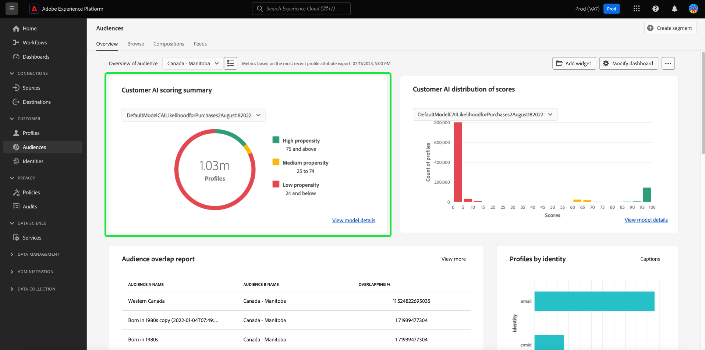

# [!UICONTROL Audiences] ダッシュボード {#audiences-dashboard}

Adobe Experience Platform ユーザーインターフェイス（UI）には、毎日のスナップショットで取得した、オーディエンスに関する重要な情報を表示できるダッシュボードが用意されています。 このガイドでは、UI で [!UICONTROL Audiences] ダッシュボードにアクセスして操作する方法の概要を説明し、ダッシュボードに表示されるビジュアライゼーションの詳細を説明します。

Experience Platform ユーザーインターフェイス内のAdobe Experience Platform セグメント化サービスのすべての機能の概要については、[ セグメント化サービス UI ガイド ](../../segmentation/ui/overview.md) を参照してください。

## [!UICONTROL Audiences] ダッシュボードデータ

[!UICONTROL Audiences] ダッシュボードは、組織がExperience Platformのプロファイルストア内に持つ属性（レコード） データのスナップショットを表示します。 スナップショットには、イベント（時系列）データは含まれていません。

スナップショット内の属性データは、スナップショットが作成された特定の時点に表示されていた正確なデータを示しています。つまり、スナップショットはデータの近似やサンプルではなく、[!UICONTROL Audiences] ダッシュボードはリアルタイムには更新されません。

>[!NOTE]
>
>スナップショットが作成された後にデータに加えられた変更や更新は、次のスナップショットが作成されるまでダッシュボードに反映されません。

## [!UICONTROL Audiences] ダッシュボードを試す {#explore}

Experience Platform UI 内の [!UICONTROL Audiences] ダッシュボードに移動するには、左側のレールで「**[!UICONTROL Audiences]**」を選択し、「**[!UICONTROL Overview]**」タブを選択して、ダッシュボードを表示します。

>[!NOTE]
>
>Experience Platformを初めて使用する組織で、アクティブなプロファイルデータセットや結合ポリシーが作成されていない場合は、[!UICONTROL Audiences] ダッシュボードは表示されません。 代わりに、「[!UICONTROL Overview]」タブには、セグメント化を開始する際に役立つリンクとドキュメントが表示されます。

![[!UICONTROL Audiences] と [!UICONTROL Overview] がハイライト表示された [!UICONTROL Audiences] ダッシュボードの「[!UICONTROL Overview]」タブ ](../images/audiences/dashboard-overview.png)

### [!UICONTROL Audiences] ダッシュボードの変更 {#modify}

[!UICONTROL Audiences] ダッシュボードの外観を変更するには、「**[!UICONTROL Modify dashboard]**」を選択します。 これにより、ダッシュボードからウィジェットを移動、追加、削除できるだけでなく、**[!UICONTROL Widget library]** にアクセスして使用可能なウィジェットを調べたり、組織に合ったカスタムウィジェットを作成したりできます。

詳しくは、[ダッシュボードの変更](../customize/modify.md)および[ウィジェットライブラリの概要](../customize/widget-library.md)ドキュメントを参照してください。

### ウィジェットを追加 {#add-widget}

「**[!UICONTROL Add widget]**」を選択してウィジェットライブラリに移動し、ダッシュボードに追加できるウィジェットのリストを確認します。

![[!UICONTROL Audiences] がハイライト表示された [!UICONTROL Add widget] ダッシュボードの概要 ](../images/audiences/audiences-overview-add-widget.png)

ウィジェットライブラリから、標準およびカスタムオーディエンスウィジェットの選択を参照できます。 ウィジェットの追加方法について詳しくは、[ウィジェットを追加](../customize/widget-library.md#add-widgets)する方法に関するウィジェットライブラリのドキュメントを参照してください。

### SQL を表示 {#view-sql}

[!UICONTROL Overview] ワークスペースを切り替えることで、ダッシュボードで視覚化されたインサイトを生成する SQL を表示できます。 既存のインサイトの SQL からインスピレーションを得て、ビジネスニーズに基づいてExperience Platform データから独自のインサイトを導き出す新しいクエリを作成できます。 この機能について詳しくは、[SQL UI を表示ガイド ](../view-sql.md) を参照してください。

## オーディエンスを選択 {#select-audience}

ダッシュボードは、表示するオーディエンスを自動的に選択します。 ただし、ドロップダウンメニューまたはオーディエンスセレクターを使用して、オーディエンスを変更できます。

別のオーディエンスを選択するには、オーディエンス名の横にあるドロップダウンを選択するか、オーディエンスセレクターを使用して、オーディエンス選択ダイアログを開きます。

>[!IMPORTANT]
>
>選択可能なオーディエンスのリストには、プロファイル数が 0 を超えるオーディエンスのみが表示されます。

![ 使用可能なすべてのオーディエンスを表示する [!UICONTROL Select audience] ダイアログ ](../images/audiences/select-audience-dialog.png)

## ウィジェットと指標 {#widgets-and-metrics}

[!UICONTROL Audiences] ダッシュボードはいくつかのウィジェットで構成されています。ウィジェットは、選択したオーディエンスに関する重要な情報を提供する読み取り専用の指標です。

最新のスナップショットの日時が、オーディエンスドロップダウンの横の「[!UICONTROL Overview]」タブ上部に表示されます。 すべてのウィジェットデータは、その日時の時点で正確です。 スナップショットのタイムスタンプは UTC で指定されます。個々のユーザーや組織のタイムゾーンではありません。

## デフォルトウィジェット {#default-widgets}

Adobe Experience Platformのすべての新しいインスタンスに対して、データから利用可能な最新のインサイトをハイライト表示するデフォルトのウィジェットの読み込みが提供されます。 次のウィジェットは、セグメントビューで最初から事前設定されています。 ウィジェットの目的と機能について詳しくは、それぞれの節を参照してください。

* [[!UICONTROL Audience size]](#audience-size)
* [[!UICONTROL Audience size change trend]](#audience-size-change-trend)
* [[!UICONTROL Identity overlap]](#identity-overlap)
* [[!UICONTROL Profiles by identity]](#profiles-by-identity)

>[!NOTE]
>
>2023 年 7 月 26 日（PT）の時点で、[!UICONTROL Profiles]、[!UICONTROL Audiences] および [!UICONTROL Destinations] の概要ダッシュボードは、過去 6 か月間にビューを変更しなかったすべてのユーザーに対して、新しいデフォルトのウィジェット読み込みにリセットされました。
>デフォルトのウィジェットのロードアウトの一部として含まれるウィジェットについて詳しくは、[ プロファイル ](./profiles.md#default-widgets) および [ 宛先 ](./destinations.md#default-widgets) デフォルトウィジェットの節のドキュメントを参照してください。 引き続き、以前と同様にダッシュボードウィジェットをカスタマイズできます。

## 顧客 AI ウィジェット {#customer-ai-audiences-widgets}

顧客 AI は、個々のプロファイルのカスタム傾向スコア（チャーンやコンバージョンなど）を大規模に生成するために使用されます。顧客 AI では、既存の消費者エクスペリエンスイベントデータを分析して **チャーンまたはコンバージョンの傾向スコア** を予測します。 これらの高精度な顧客傾向モデルにより、より正確なセグメント化とターゲティングが可能になります。 [ スコアの分布 ](#customer-ai-distribution-of-scores) および [ スコアの概要 ](#customer-ai-scoring-summary) インサイトは、オーディエンスの除算を示します。 傾向が高/低/中のプロファイルと、それらのプロファイルがプロファイル数間でどのように分配されるかをハイライトします。

* [[!UICONTROL Customer AI scoring summary]](#customer-ai-scoring-summary)
* [[!UICONTROL Customer AI distribution of scores]](#customer-ai-distribution-of-scores)

### [!UICONTROL Customer AI distribution of scores] {#customer-ai-distribution-of-scores}

>[!CONTEXTUALHELP]
>id="platform_dashboards_segments_distributionOfScores"
>title="スコアの配分"
>abstract="このウィジェットは、プロファイルの合計数の配分を傾向スコア別に 5％単位で視覚化します。プロファイル数の配分は、AI モデルと選択した結合ポリシーで決まります。AI モデルは、ウィジェットタイトルの下にあるドロップダウンメニューから変更できます。"

[!UICONTROL Customer AI distribution of scores] ウィジェットは、プロファイルの合計数を、傾向スコアで分類します。 プロファイル数の分布は、AI モデルと選択した結合ポリシーによって決定され、その傾向を示す 5% の増分で視覚化されます。 プロファイルの数は Y 軸に沿って提供され、傾向スコアは X 軸に沿って提供されます。

>[!NOTE]
>
>ビジュアライゼーションがコンバージョンの傾向スコアの場合、高スコアは緑色で表示され、低スコアは赤色で表示されます。 チャーンの傾向を予測する場合は、これが逆となり、高いスコアは赤、低いスコアは緑で表示されます。選択した傾向タイプに関係なく、メディアバケットは黄色のままです。

傾向スコアを決定する AI モデルは、ウィジェットタイトルの下のドロップダウンセレクターから選択します。 ドロップダウンには、設定済みのすべての顧客 AI モデルのリストが含まれています。 使用可能なモデルのリストから、分析に適した AI モデルを選択します。 使用できる顧客 AI モデルがない場合は、ウィジェット内に、1 つ以上の顧客 AI モデルを設定するように指示するメッセージが表示され、顧客 AI モデル設定ページへのハイパーリンクが提供されます。 詳しくは、[ 顧客 AI インスタンスの設定方法 ](../../intelligent-services/customer-ai/user-guide/configure.md) のドキュメントを参照してください。

>[!NOTE]
>
>「概要」タブのすぐ下のドロップダウンを選択して、分析に含めるプロファイルを決定する結合ポリシーを変更します。 簡単な説明については [ 結合ポリシー ](#merge-policies) の節、詳細については [ 結合ポリシーの概要 ](../../profile/merge-policies/overview.md) を参照してください。

選択した顧客 AI モデルの詳細なインサイトページに移動するには、「**[!UICONTROL View model details]**」を選択します。

![[!UICONTROL Customer AI distribution of scores] ウィジェットと [!UICONTROL View model details] がハイライト表示されたExperience Platform オーディエンスダッシュボード ](../images/segments/customer-ai-distribution-of-scores.png)

詳細なモデルインサイト ページが表示されます。

顧客 AI について詳しくは、[ インサイトの獲得 UI ガイド ](../../intelligent-services/customer-ai/user-guide/discover-insights.md) を参照してください。

### [!UICONTROL Customer AI scoring summary] {#customer-ai-scoring-summary}

>[!CONTEXTUALHELP]
>id="platform_dashboards_segments_scoringSummary"
>title="スコア付けの概要"
>abstract="このウィジェットには、スコア付けされたプロファイルの合計数が、高、中および低の傾向を含んだバケットに分類されて表示されます。ドーナツグラフは、高、中および低の傾向別に合計プロファイル数の構成比を示します。"

このウィジェットは、スコアリングされたプロファイルの合計数を表示し、高、中、低の傾向を含むバケットにそれぞれ緑、黄、赤として分類します。 ドーナツグラフは、高、中、低の傾向の間の合計プロファイルの比例構成を、それぞれ緑、黄、赤として示すために使用されます。 プロファイルは、傾向が 75 以上で高く、傾向が 25～74 の間で中程度であり、傾向が 24 未満で低いと認定されます。 凡例は、傾向のカラーコードとしきい値を示します。 ドーナツグラフの各セクションにカーソルを合わせると、高、中、低の傾向のプロファイル数がダイアログに表示されます。

>[!NOTE]
>
>ビジュアライゼーションがコンバージョンの傾向スコアの場合、高スコアは緑色で表示され、低スコアは赤色で表示されます。 チャーンの傾向を予測する場合は、これが逆となり、高いスコアは赤、低いスコアは緑で表示されます。選択した傾向タイプに関係なく、メディアバケットは黄色のままです。

ウィジェットタイトルの下にあるドロップダウンメニューには、設定済みのすべての顧客 AI モデルのリストが表示されます。 使用可能なモデルのリストから、分析に適した AI モデルを選択します。 使用できる顧客 AI モデルがない場合は、ウィジェット内に、1 つ以上の顧客 AI モデルを設定するように指示するメッセージが表示され、顧客 AI モデル設定ページへのハイパーリンクが提供されます。 手順について詳しくは、[ 顧客 AI インスタンスの設定方法 ](../../intelligent-services/customer-ai/user-guide/configure.md) に関するドキュメントを参照してください。

>[!NOTE]
>
>計算されるプロファイルの合計数は、選択した結合ポリシーによって異なります。 使用する結合ポリシーを変更するには、「概要」タブのすぐ下のドロップダウンを選択します。 簡単な説明については [ 結合ポリシー ](#merge-policies) の節、詳細については [ 結合ポリシーの概要 ](../../profile/merge-policies/overview.md) を参照してください。

「**[!UICONTROL View model details]**」を選択すると、選択した顧客 AI モデルの詳細なインサイトページに移動します。 顧客 AI について詳しくは、[ インサイトの獲得 UI ガイド ](../../intelligent-services/customer-ai/user-guide/discover-insights.md) を参照してください。

## 標準ウィジェット {#standard-widgets}

Adobeには、オーディエンスに関連する様々な指標を視覚化するために使用できる、複数の標準ウィジェットが用意されています。 [!UICONTROL Widget library] を使用して組織で共有するカスタムウィジェットを作成することもできます。 カスタムウィジェットの作成について詳しくは、[ウィジェットライブラリの概要](../customize/widget-library.md)を参照してください。

使用可能な各標準ウィジェットの詳細を確認するには、次のリストからウィジェットの名前を選択します。

* [[!UICONTROL Audience size]](#audience-size)
* [[!UICONTROL Audience activation order]](#audience-activation-order)
* [[!UICONTROL Audience size trend]](#audience-size-trend)
* [[!UICONTROL Audience size change trend]](#audience-size-change-trend)
* [[!UICONTROL Audience size trend by identity]](#audience-size-trend-by-identity)
* [[!UICONTROL Audience overlap]](#audience-overlap)
* [[!UICONTROL Audience overlap report]](#audience-overlap-report)
* [[!UICONTROL Identity overlap]](#identity-overlap)
* [[!UICONTROL Profiles by identity]](#profiles-by-identity)
* [[!UICONTROL Scheduled activations]](#scheduled-activations)

### [!UICONTROL Audience size] {#audience-size}

>[!CONTEXTUALHELP]
>id="platform_dashboards_segments_audiencesize"
>title="オーディエンスサイズ"
>abstract="このウィジェットは、選択したオーディエンス内での結合プロファイルの合計数を表示します。この数は、データに適用される結合ポリシーによって異なり、最新のスナップショットの時点で正しい値になります。"

**[!UICONTROL Audience size]** ウィジェットには、スナップショットが作成された時点での、選択したオーディエンス内での結合プロファイルの合計数が表示されます。 この数は、プロファイルデータにオーディエンス結合ポリシーを適用してプロファイルフラグメントを結合し、オーディエンス内の個々のユーザーに対して単一のプロファイルを形成した結果です。

フラグメントと結合プロファイルについて詳しくは、[ リアルタイム顧客プロファイルの概要 ](../../profile/home.md) を参照してください。

![[!UICONTROL Audiences] ウィジェットがハイライト表示された [!UICONTROL Audience size] ダッシュボードの概要 ](../images/audiences/audience-size.png)

### [!UICONTROL Audience size trend] {#audience-size-trend}

>[!CONTEXTUALHELP]
>id="platform_dashboards_segments_audiencesizetrend"
>title="オーディエンスサイズのトレンド"
>abstract="このウィジェットでは、過去 30 日、90 日または 12 か月の期間に毎日のスナップショットでキャプチャされた&#x200B;**任意の**&#x200B;セグメント定義の基準を満たすプロファイルの総数に関する情報を提供します。"

**[!UICONTROL Audience size trend]** ウィジェットは、特定期間の **任意** オーディエンスに選定されたプロファイルの合計数を折れ線グラフで示します。 オーディエンスサイズのトレンドは、30 日、90 日および 12 か月の期間のトレンドを可視化できます。期間は、ウィジェットのドロップダウンメニューから選択します。オーディエンスサイズは Y 軸に、時間は X 軸に反映されます。

このウィジェットには、自動 [!UICONTROL Captions] 機能も含まれており、機械学習モデルがグラフとオーディエンスデータを分析し、主要なトレンドと重要なイベントを説明するキャプションを自動的に生成します。 「**[!UICONTROL Captions]**」を選択すると、自動キャプションダイアログが開きます。

![[!UICONTROL Audiences] の概要には、オーディエンスサイズのトレンドウィジェットが表示されます。](../images/audiences/audience-size-trend-captions.png)

自動キャプションダイアログが開き、データに関するインサイトが表示されます。

オーディエンスの評価、およびプロファイルがオーディエンスにどのように適合し、終了するかについて詳しくは、[ セグメント化サービスのドキュメント ](../../segmentation/home.md) を参照してください。

### [!UICONTROL Audience size change trend] {#audience-size-change-trend}

このウィジェットは、最新の日別スナップショット間の特定のオーディエンスに対して選定されたプロファイルの合計数の違いを示す折れ線グラフを提供します。 分析の対象として選択したオーディエンスは、概要ドロップダウンから選択します。 30 日、90 日および 12 か月の期間のトレンド分析の期間を可視化できます。期間は、ウィジェットのドロップダウンメニューから選択します。オーディエンスサイズは Y 軸に、時間は X 軸に反映されます。

### [!UICONTROL Audience size trend by identity] {#audience-size-trend-by-identity}

このウィジェットは、ウィジェットドロップダウンメニューから選択した ID タイプに基づいて、特定のオーディエンスに関するオーディエンスサイズのトレンドを示します。 分析に使用するオーディエンスは、概要ドロップダウンから選択します。 30 日、90 日および 12 か月の期間のトレンド分析の期間を可視化できます。期間は、ウィジェットのドロップダウンメニューから選択します。

### [!UICONTROL Audience activation order] {#audience-activation-order}

[!UICONTROL Audience activation order] ウィジェットは、宛先名、プラットフォーム、オーディエンスのアクティベーション日をリストする 3 列の表を提供します。 リストは新しい順に並べられ、最大 10 行まで格納できます。

### [!UICONTROL Audience overlap] {#audience-overlap}

このウィジェットは、ベン図を使用して、両方のオーディエンスの条件に一致する人数を視覚化します。 比較に使用するオーディエンスは、ウィジェットのドロップダウンメニューから選択します。 ベン図の円または積集合にカーソルを合わせると、関連するセグメント定義内に含まれるプロファイルの合計数を確認できます。

このウィジェットを使用すると、セグメント定義の結果の類似性を視覚化することで、セグメント化戦略を最適化できます。

### [!UICONTROL Audience overlap report] {#audience-overlap-report}

このウィジェットは、特定のオーディエンスのプロファイル重複データを表にします。 画面上部のドロップダウンメニューで選択したオーディエンスに対し、重複率が高い順にランク付けされた 5 つのオーディエンスのリストが表示されます。 わかりやすくするために、選択したオーディエンスが [!UICONTROL AUDIENCE A NAME] の列に表示されます。 オーディエンスの重複分析は、[!UICONTROL AUDIENCE B NAME] の列にリストされている 2 番目のオーディエンスに対して提供されます。 重複率は、3 番目の列の小数点以下 12 桁までの精度で表示されます。

オーディエンスの重複レポートは、新しい高パフォーマンスのオーディエンスを作成するのに役立ちます。 重複率が高いものを観察することで、オーディエンスを抑制し、同じオーディエンスが異なる宛先に送信されるのを防ぐことができます。また、セグメント化の改善に役立つ隠れたインサイトを特定するのにも役立ちます。重複率の低さは、追跡する固有のプロファイルを見つけるのに役立ちます。

「**[!UICONTROL View more]**」を選択すると、フルスクリーンダイアログが開き、さらに多くのオーディエンスの重複データが表示されます。

[!UICONTROL Audience overlap report] ダイアログが表示されます。 このダイアログには、最大 50 行のオーディエンスの重複分析を 6 つの列に分類して含めることができます。設定アイコン（）を選択して、テーブルから列を削除または追加します。

>[!NOTE]
>
>**[!UICONTROL Overlapping]** 列ヘッダーを選択して、結果のランキングを高い順または低い順に変更できます。

レポート全体をPDF形式でダウンロードするには、オプションメニュー（**`...`**）に続いて「**[!UICONTROL Download]**」を選択します。

レポートから行を選択して、重複分析のベン図を開きます。ベン図のセクションの上にマウスポインターを置くと、ダイアログでプロファイル数が表示されます。

「**[!UICONTROL Close]**」を選択すると、[!UICONTROL Audiences] ダッシュボードに戻ります。

### [!UICONTROL Identity overlap] {#identity-overlap}

>[!CONTEXTUALHELP]
>id="platform_dashboards_segments_identityoverlap"
>title="ID の重複"
>abstract="このウィジェットは、選択した両方の ID を含むオーディエンス内のプロファイルの重複を表示します。円は各 ID の相対サイズを示します。 両方の名前空間を含んだプロファイルの数は、円の重複部分で表されます。"

この **[!UICONTROL Identity overlap]** ウィジェットには、複数の ID を含んだ、オーディエンス内のプロファイルの重複を示すベン図（集合図）が表示されます。

ウィジェットのドロップダウンメニューを使用して、比較する ID を選択します。 円には、選択した各 ID の相対サイズが表示され、両方の名前空間を含んだプロファイルの数が、円の重複部分のサイズで表されます。

顧客が複数のチャネルでブランドとやり取りする場合、複数の ID がその個々の顧客に関連付けられます。 このような状況では、複数の ID からのフラグメントを含んだ複数のプロファイルが組織に存在する可能性があります。

ID について詳しくは、[ID サービスのドキュメント ](../../identity-service/home.md) を参照してください。

![ID の重複ウィジェットがハイライト表示された [!UICONTROL Audiences] ダッシュボードの「概要」タブ ](../images/audiences/identity-overlap.png)

### [!UICONTROL Profiles by identity] {#profiles-by-identity}

>[!CONTEXTUALHELP]
>id="platform_dashboards_segments_profilesbyidentity"
>title="ID 別プロファイル"
>abstract="このウィジェットは、選択したオーディエンスの結合プロファイルの ID の分類を表示します。"

**[!UICONTROL Profiles by identity]** ウィジェットには、選択したオーディエンスの結合プロファイルごとの ID の分類が表示されます。 1 つのプロファイルに複数の ID が関連付けられている可能性があるので、ID 別のプロファイルの合計数は、オーディエンス内のプロファイルの合計数より多くなる場合があります。 つまり、各 ID に表示される値を合計すると、合計オーディエンスサイズを超える場合があります。 これは、顧客が複数のチャネルでブランドとやり取りする場合、複数の ID がその個々の顧客に関連付けられる可能性があるためです。

「**[!UICONTROL Captions]**」を選択すると、自動キャプションダイアログが開きます。

![ID 別プロファイルウィジェットとキャプションオプションがハイライトされた [!UICONTROL Audiences] ダッシュボードの概要。](../images/audiences/profiles-by-identity.png)

機械学習モデルは、データの全体的な分布と主要なディメンションを分析することにより、データインサイトを自動的に生成します。

ID について詳しくは、[ID サービスのドキュメント ](../../identity-service/home.md) を参照してください。

### スケジュールアクティベーション {#scheduled-activations}

[!UICONTROL Scheduled activations] ウィジェットは、最近アクティブ化された宛先を表形式で表示します。 この表には、宛先プラットフォーム、この宛先へのアクティベーションフローの名前、選択したオーディエンスのアクティベーションの開始日と終了日が含まれています。 アクティベーションの終了日が指定されていない場合は、[!UICONTROL Ongoing] と表示されます。 分析のオーディエンスは、ページ上部のドロップダウンから選択します。

このウィジェットを使用すると、オーディエンスがアクティブ化されている場所とタイミングを一目で把握できるので、重複したアクティベーションや不要なアクティベーションを見通しやすくなります。この累積情報は、アクティベーションが中断された場所も示します。

## 次の手順

このドキュメントを通して、[!UICONTROL Audiences] ダッシュボードを見つけ、表示するオーディエンスを選択できるようになりました。 また、使用可能なウィジェットに表示される指標についても理解できました。 Experience Platform UI でのオーディエンスの操作について詳しくは、[ セグメント化サービス UI ガイド ](../../segmentation/ui/overview.md) を参照してください。
