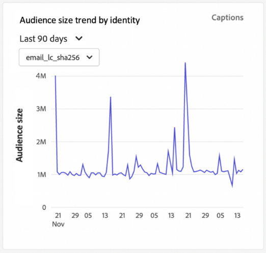

# [!UICONTROL オーディエンス] dashboard {#audiences-dashboard}

Adobe Experience Platformのユーザーインターフェイス (UI) は、毎日のスナップショットでキャプチャされた、オーディエンスに関する重要な情報を表示できるダッシュボードを提供します。 このガイドでは、 [!UICONTROL オーディエンス] ダッシュボードを使用して、ダッシュボードに表示されるビジュアライゼーションに関する詳細情報を確認できます。

Platform ユーザーインターフェイス内の Adobe Experience Platform セグメント化サービスのすべての機能の概要については、 [セグメント化サービス UI ガイド](../../segmentation/ui/overview.md)を参照してください。

## [!UICONTROL オーディエンス] ダッシュボードデータ

この [!UICONTROL オーディエンス] 「Experience Platform」には、組織がプロファイルストア内に存在する属性（レコード）データのスナップショットが表示されます。 スナップショットには、イベント（時系列）データは含まれていません。

スナップショット内の属性データは、スナップショットが作成された特定の時点に表示されていた正確なデータを示しています。つまり、スナップショットはデータの近似やサンプルではなく、 [!UICONTROL オーディエンス] ダッシュボードがリアルタイムで更新されていません。

>[!NOTE]
>
>スナップショットが作成された後にデータに加えられた変更や更新は、次のスナップショットが作成されるまでダッシュボードに反映されません。

## 関連トピック [!UICONTROL オーディエンス] dashboard {#explore}

次に移動するには： [!UICONTROL オーディエンス] Platform UI 内のダッシュボードで、「 **[!UICONTROL オーディエンス]** 左側のレールで、 **[!UICONTROL 概要]** タブをクリックして、ダッシュボードを表示します。

>[!NOTE]
>
>組織が Platform を初めて使用し、アクティブなプロファイルデータセットや結合ポリシーがまだ作成されていない場合、 [!UICONTROL オーディエンス] ダッシュボードが表示されません。 代わりに、「[!UICONTROL 概要]」タブには、セグメント化を開始する際に役立つリンクとドキュメントが表示されます。

![この [!UICONTROL オーディエンス] dashboard [!UICONTROL 概要] タブ [!UICONTROL オーディエンス] および [!UICONTROL 概要] ハイライト表示されました。](../images/audiences/dashboard-overview.png)

### を変更します。 [!UICONTROL オーディエンス] dashboard {#modify}

次の外観を変更できます： [!UICONTROL オーディエンス] 選択してダッシュボード **[!UICONTROL ダッシュボードを変更]**. これにより、ダッシュボードからウィジェットを移動、追加、削除できるだけでなく、**[!UICONTROL ウィジェットライブラリ]**&#x200B;にアクセスして利用可能なウィジェットを調べたり、組織に合ったカスタムウィジェットを作成したりできます。

詳しくは、[ダッシュボードの変更](../customize/modify.md)および[ウィジェットライブラリの概要](../customize/widget-library.md)ドキュメントを参照してください。

### ウィジェットを追加 {#add-widget}

「**[!UICONTROL ウィジェットを追加]**」を選択してウィジェットライブラリに移動し、ダッシュボードに追加できるウィジェットのリストを確認します。

![この [!UICONTROL オーディエンス] ダッシュボードの概要 [!UICONTROL ウィジェットを追加] ハイライト表示されました。](../images/audiences/audiences-overview-add-widget.png)

ウィジェットライブラリから、標準およびカスタムのオーディエンスウィジェットを参照できます。 ウィジェットの追加方法について詳しくは、[ウィジェットを追加](../customize/widget-library.md#add-widgets)する方法に関するウィジェットライブラリのドキュメントを参照してください。

## オーディエンスを選択 {#select-audience}

ダッシュボードは、表示するオーディエンスを自動的に選択します。 ただし、ドロップダウンメニューまたはオーディエンスセレクターを使用してオーディエンスを変更することはできます。

別のオーディエンスを選択するには、オーディエンス名の横にあるドロップダウンを選択するか、オーディエンスセレクターを使用して、オーディエンス選択ダイアログを開きます。

>[!IMPORTANT]
>
>プロファイル数が 0 を超えるオーディエンスのみが、選択可能なオーディエンスのリストに表示されます。

![この [!UICONTROL オーディエンスを選択] ダイアログが開き、利用可能なすべてのオーディエンスが表示されます。](../images/audiences/select-audience-dialog.png)

## ウィジェットと指標 {#widgets-and-metrics}

この [!UICONTROL オーディエンス] ダッシュボードはウィジェットで構成されています。ウィジェットは、選択したオーディエンスに関する重要な情報を提供する読み取り専用の指標です。

最新のスナップショットの日時が [!UICONTROL 概要] タブが表示されます。 すべてのウィジェットデータは、その日時の時点で正確です。 スナップショットのタイムスタンプは UTC で指定されます。個々のユーザーや組織のタイムゾーンではありません。

## 標準ウィジェット {#standard-widgets}

Adobeには、オーディエンスに関連する様々な指標を視覚化するために使用できる、複数の標準ウィジェットが用意されています。 [!UICONTROL ウィジェットライブラリ]を使用して、組織で共有するカスタムウィジェットを作成することもできます。カスタムウィジェットの作成について詳しくは、[ウィジェットライブラリの概要](../customize/widget-library.md)を参照してください。

使用可能な各標準ウィジェットの詳細を確認するには、次のリストからウィジェットの名前を選択します。

* [[!UICONTROL オーディエンスサイズ]](#audience-size)
* [[!UICONTROL オーディエンスアクティベーションの順序]](#audience-activation-order)
* [[!UICONTROL オーディエンスサイズのトレンド]](#audience-size-trend)
* [[!UICONTROL オーディエンスサイズの変更のトレンド]](#audience-size-change-trend)
* [[!UICONTROL ID 別のオーディエンスサイズのトレンド]](#audience-size-trend-by-identity)
* [[!UICONTROL オーディエンスの重複]](#audience-overlap)
* [[!UICONTROL オーディエンスの重複レポート]](#audience-overlap-report)
* [[!UICONTROL ID の重複]](#identity-overlap)
* [[!UICONTROL ID 別プロファイル]](#profiles-by-identity)
* [[!UICONTROL 予定されているアクティベーション]](#scheduled-activations)

### [!UICONTROL オーディエンスサイズ] {#audience-size}

>[!CONTEXTUALHELP]
>id="platform_dashboards_segments_audiencesize"
>title="オーディエンスサイズ"
>abstract="このウィジェットには、選択したオーディエンス内の結合プロファイルの合計数が表示されます。 この数は、データに適用される結合ポリシーによって異なり、最新のスナップショットの時点で正しい値になります。"

この **[!UICONTROL オーディエンスサイズ]** ウィジェットには、スナップショットが作成された時点での、選択したオーディエンス内の結合されたプロファイルの合計数が表示されます。 この数は、オーディエンス結合ポリシーをプロファイルデータに適用してプロファイルフラグメントを結合し、オーディエンス内の個々のユーザーに対して 1 つのプロファイルを形成した結果です。

フラグメントと結合プロファイルについて詳しくは、 [リアルタイム顧客プロファイルの概要](../../profile/home.md).

![この [!UICONTROL オーディエンス] ダッシュボードの概要と [!UICONTROL オーディエンスサイズ] ウィジェットがハイライト表示されました。](../images/audiences/audience-size.png)

### [!UICONTROL オーディエンスサイズのトレンド] {#audience-size-trend}

>[!CONTEXTUALHELP]
>id="platform_dashboards_segments_audiencesizetrend"
>title="オーディエンスサイズのトレンド"
>abstract="このウィジェットでは、過去 30 日、90 日または 12 か月の期間に毎日のスナップショットでキャプチャされた&#x200B;**任意の**&#x200B;セグメント定義の基準を満たすプロファイルの総数に関する情報を提供します。"

この **[!UICONTROL オーディエンスサイズのトレンド]** widget は、対象となるプロファイルの総数を示す線グラフの図を提供します **任意** オーディエンスを特定の期間にわたって閲覧します。 オーディエンスサイズのトレンドは、30 日、90 日および 12 か月の期間のトレンドを可視化できます。期間は、ウィジェットのドロップダウンメニューから選択します。オーディエンスサイズは Y 軸に、時間は X 軸に反映されます。

このウィジェットには、自動 [!UICONTROL キャプション] 機械学習モデルがグラフとオーディエンスのデータを分析し、主要な傾向と重要なイベントを説明するキャプションを自動的に生成する機能。 **[!UICONTROL キャプション]**&#x200B;を選択し、自動キャプションダイアログを開きます。

![この [!UICONTROL オーディエンス] 「概要」には、オーディエンスサイズのトレンドウィジェットが表示されます。](../images/audiences/audience-size-trend-captions.png)

自動キャプションダイアログが開き、データに関するインサイトが表示されます。

オーディエンスの評価と、プロファイルがオーディエンスを絞り込み、オーディエンスから離脱する方法について詳しくは、 [セグメント化サービスのドキュメント](../../segmentation/home.md).

### [!UICONTROL オーディエンスサイズの変更のトレンド] {#audience-size-change-trend}

このウィジェットは、最新の日別スナップショット間の特定のオーディエンスについて認定されたプロファイルの合計数の違いを示す線グラフを提供します。 分析に選択したオーディエンスは、概要ドロップダウンから選択されます。 30 日、90 日および 12 か月の期間のトレンド分析の期間を可視化できます。期間は、ウィジェットのドロップダウンメニューから選択します。オーディエンスサイズは Y 軸に、時間は X 軸に反映されます。

### [!UICONTROL ID 別のオーディエンスサイズのトレンド] {#audience-size-trend-by-identity}

このウィジェットは、ウィジェットのドロップダウンメニューから選択した ID タイプに基づいて、特定のオーディエンスに関するオーディエンスサイズの傾向を示します。 分析に使用するオーディエンスは、概要ドロップダウンから選択します。 30 日、90 日および 12 か月の期間のトレンド分析の期間を可視化できます。期間は、ウィジェットのドロップダウンメニューから選択します。

### [!UICONTROL Audience Activation の順序] {#audience-activation-order}

[!UICONTROL Audience Activation の順序]ウィジェットには、宛先名、プラットフォームおよびアクティベーション日をリストする 3 列のテーブルが表示されます。リストは新しい順に並べられ、最大 10 行まで格納できます。

### [!UICONTROL オーディエンスの重複] {#audience-overlap}

このウィジェットは、ベン図を使用して、両方のオーディエンスの条件に一致する人の数を視覚化します。 比較に使用するオーディエンスは、ウィジェットのドロップダウンメニューから選択します。 ベン図の円または積集合にカーソルを合わせると、関連するセグメント定義内に含まれるプロファイルの合計数を確認できます。

このウィジェットを使用すると、セグメント定義の結果の類似性を視覚化することで、セグメント化戦略を最適化できます。

### [!UICONTROL オーディエンスの重複レポート] {#audience-overlap-report}

このウィジェットは、特定のオーディエンスのプロファイルの重複データを表化します。 画面上部のドロップダウンメニューから選択したオーディエンスに対して、重複の高い順にランク付けされた 5 つのオーディエンスのリストが表示されます。 明確にするために、選択したオーディエンスが [!UICONTROL AUDIENCE A NAME] 列。 オーディエンスの重複分析は、 [!UICONTROL オーディエンス B 名] 列。 重複率は、3 番目の列の小数点以下 12 桁までの精度で表示されます。

オーディエンスの重複レポートは、新しい高性能なオーディエンスを構築するのに役立ちます。 重複率が高いものを観察することで、オーディエンスを抑制し、同じオーディエンスが異なる宛先に送信されるのを防ぐことができます。また、セグメント化の改善に役立つ隠れたインサイトを特定するのにも役立ちます。重複率の低さは、追跡する固有のプロファイルを見つけるのに役立ちます。

**[!UICONTROL さらに表示]**&#x200B;を選択すると、フルスクリーンダイアログが開き、さらに多くのオーディエンスの重複データが表示されます。

[!UICONTROL オーディエンスの重複レポート]ダイアログが表示されます。 このダイアログには、最大 50 行のオーディエンスの重複分析を 6 つの列に分類して含めることができます。設定アイコン（）を選択して、テーブルから列を削除または追加します。

>[!NOTE]
>
>「**[!UICONTROL 重複]**」列ヘッダーを選択して、結果のランキングを高い順または低い順に変更できます。

レポート全体を PDF 形式でダウンロードするには、オプションメニュー（**`...`**）に続いて「**[!UICONTROL ダウンロード]**」を選択します。

レポートから行を選択して、重複分析のベン図を開きます。ベン図のセクションの上にマウスポインターを置くと、ダイアログでプロファイル数が表示されます。

選択 **[!UICONTROL 閉じる]** に戻る [!UICONTROL オーディエンス] ダッシュボード。

### [!UICONTROL ID の重複] {#identity-overlap}

>[!CONTEXTUALHELP]
>id="platform_dashboards_segments_identityoverlap"
>title="ID の重複"
>abstract="このウィジェットは、選択された ID の両方を含むオーディエンス内のプロファイルの重複を表示します。 円は各 ID の相対サイズを示します。 両方の名前空間を含んだプロファイルの数は、円の重複部分で表されます。"

この **[!UICONTROL ID の重複]** ウィジェットには、複数の ID を含むオーディエンス内のプロファイルの重複を示す、ベン図またはセット図が表示されます。

ウィジェットのドロップダウンメニューを使用して、比較する ID を選択します。 円には、選択した各 ID の相対サイズが表示され、両方の名前空間を含んだプロファイルの数が、円の重複部分のサイズで表されます。

顧客が複数のチャネルでブランドとやり取りする場合、複数の ID がその顧客に関連付けられます。 この状況では、組織が複数の ID のフラグメントを含む複数のプロファイルを持つ可能性があります。

ID の詳細については、 [ID サービスドキュメント](../../identity-service/home.md).

![この [!UICONTROL オーディエンス] 「 ID 重複ウィジェット」がハイライトされたダッシュボードの概要。](../images/audiences/identity-overlap.png)

### [!UICONTROL ID 別プロファイル] {#profiles-by-identity}

>[!CONTEXTUALHELP]
>id="platform_dashboards_segments_profilesbyidentity"
>title="ID 別プロファイル"
>abstract="このウィジェットは、選択したオーディエンス内のすべての結合プロファイルで ID の分類を表示します。"

この **[!UICONTROL ID 別プロファイル]** ウィジェットは、選択したオーディエンス内のすべての結合プロファイルで id の分類を表示します。 1 つのプロファイルが複数の ID を関連付けている場合があるので、ID 別のプロファイルの合計数は、オーディエンスのプロファイルの合計数より多くなる場合があります。 つまり、各 ID に表示される値をまとめて、合計オーディエンスサイズを超える場合があります。 これは、顧客が複数のチャネルでブランドとやり取りする場合、複数の ID が個々の顧客に関連付けられる可能性があるからです。

**[!UICONTROL キャプション]**&#x200B;を選択し、自動キャプションダイアログを開きます。

![この [!UICONTROL オーディエンス] 「 ID 別プロファイル」ウィジェットと「キャプション」オプションがハイライトされたダッシュボードの概要。](../images/audiences/profiles-by-identity.png)

機械学習モデルは、データの全体的な分布と主要なディメンションを分析することにより、データインサイトを自動的に生成します。

ID の詳細については、 [ID サービスドキュメント](../../identity-service/home.md).

### 予定されているアクティベーション {#scheduled-activations}

[!UICONTROL 予定されているアクティベーション]ウィジェットでは、最近アクティブ化された宛先を表形式で表示します。この表には、宛先プラットフォーム、この宛先へのアクティベーションフローの名前、選択したオーディエンスのアクティベーション開始日と終了日が含まれます。 アクティベーションの終了日が指定されていない場合は、「[!UICONTROL 進行中]」と表示されます。分析対象のオーディエンスは、ページ上部のドロップダウンから選択します。

このウィジェットを使用すると、オーディエンスがアクティブ化されている場所とタイミングを一目で把握できるので、重複したアクティベーションや不要なアクティベーションを見通しやすくなります。この累積情報は、アクティベーションが中断された場所も示します。

## 次の手順

このドキュメントに従うと、 [!UICONTROL オーディエンス] ダッシュボードを開き、表示するオーディエンスを選択します。 また、使用可能なウィジェットに表示される指標についても理解できました。 Experience PlatformUI でのオーディエンスの操作について詳しくは、 [セグメント化サービス UI ガイド](../../segmentation/ui/overview.md).
