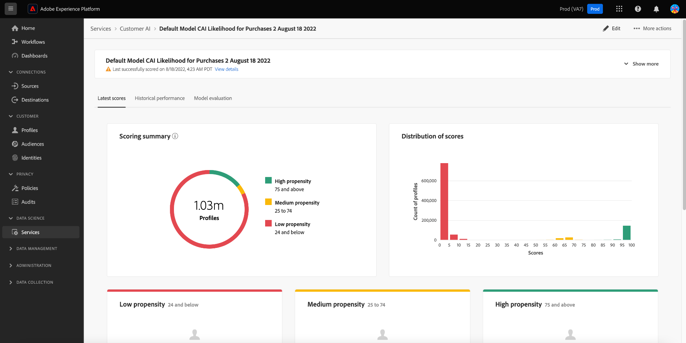

# オーディエンスダッシュボードの顧客 AI ウィジェット {#customer-ai-audiences-widgets}

顧客 AI は、個々のプロファイルのカスタム傾向スコア（チャーンやコンバージョンなど）を大規模に生成するために使用されます。顧客 AI は、既存の消費者エクスペリエンスイベントデータを分析してを予測することで、これを実現します **チャーンまたはコンバージョン傾向スコア**. これらの高精度な顧客傾向モデルを使用すると、より正確なセグメント化とターゲティングをおこなうことができます。 The [スコアの配分](#customer-ai-distribution-of-scores) および [スコア付けの概要](#customer-ai-scoring-summary) インサイトは、オーディエンスの分割を示します。 傾向が高い/低/中のプロファイルと、プロファイル数間でどのように分散されているかを強調します。

<!-- 
THe links when required
* [[!UICONTROL Customer AI scoring summary]](#customer-ai-scoring-summary)
* [[!UICONTROL Customer AI distribution of scores]](#customer-ai-distribution-of-scores) 
-->

## [!UICONTROL スコアの顧客 AI 配分] {#customer-ai-distribution-of-scores}

>[!CONTEXTUALHELP]
>id="platform_dashboards_segments_distributionOfScores"
>title="スコアの配分"
>abstract="このウィジェットは、プロファイルの合計数の配分を傾向スコア別に 5％単位で視覚化します。プロファイル数の配分は、AI モデルと選択した結合ポリシーで決まります。AI モデルは、ウィジェットタイトルの下にあるドロップダウンメニューから変更できます。"

The [!UICONTROL スコアの顧客 AI 配分] ウィジェットは、プロファイルの合計数を傾向スコア別に分類します。 プロファイル数の配分は AI モデルと選択した結合ポリシーによって決定され、傾向を示す 5%の増分で視覚化されます。 プロファイルの数は Y 軸に沿って表示され、傾向スコアは X 軸に沿って表示されます。

>[!NOTE]
>
>ビジュアライゼーションがコンバージョン傾向スコアの場合、高スコアは緑色、低スコアは赤色で表示されます。 チャーンの傾向を予測する場合は、これが逆となり、高いスコアは赤、低いスコアは緑で表示されます。選択した傾向タイプに関係なく、メディアバケットは黄色のままです。

傾向スコアを決定する AI モデルは、ウィジェットタイトルの下のドロップダウンセレクターから選択します。 ドロップダウンには、設定済みのすべての顧客 AI モデルのリストが含まれます。 使用可能なモデルのリストから、分析に適した AI モデルを選択します。 顧客 AI モデルが使用できない場合、ウィジェット内のメッセージにより、少なくとも 1 つの顧客 AI モデルを設定し、顧客 AI モデル設定ページへのハイパーリンクを表示します。 手順については、ドキュメントを参照してください。 [顧客 AI インスタンスの設定方法](../../intelligent-services/customer-ai/user-guide/configure.md).

>[!NOTE]
>
>「概要」タブのすぐ下のドロップダウンを選択して、分析に含めるプロファイルを決定する結合ポリシーを変更します。 詳しくは、 [結合ポリシー](#merge-policies) 簡単な説明、または [結合ポリシーの概要](../../profile/merge-policies/overview.md) を参照してください。

選択した顧客 AI モデルの詳細なインサイトページに移動するには、「 」を選択します。 **[!UICONTROL モデルの詳細を表示]**.

![Experience Platformオーディエンスダッシュボードと [!UICONTROL スコアの顧客 AI 配分] ウィジェットと [!UICONTROL モデルの詳細を表示] ハイライト表示されました。](../images/segments/customer-ai-distribution-of-scores.png)

詳細なモデルインサイトページが表示されます。

顧客 AI の詳細については、 [discover insights UI ガイド](../../intelligent-services/customer-ai/user-guide/discover-insights.md).

## [!UICONTROL 顧客 AI スコア付けの概要] {#customer-ai-scoring-summary}

>[!CONTEXTUALHELP]
>id="platform_dashboards_segments_scoringSummary"
>title="スコア付けの概要"
>abstract="このウィジェットには、スコア付けされたプロファイルの合計数が、高、中および低の傾向を含んだバケットに分類されて表示されます。ドーナツグラフは、高、中および低の傾向別に合計プロファイル数の構成比を示します。"

このウィジェットは、スコアリングされたプロファイルの合計数を表示し、傾向が高い、中、低いを、それぞれ緑、黄、赤のグループに分類します。 ドーナツグラフは、高、中、低の傾向の間の総プロファイル数の比例構成を、それぞれ緑、黄、赤として示すために使用されます。 プロファイルは、75 以上での高い傾向、25～74 の中程度の傾向、24 未満での低い傾向に適合します。 凡例は、傾向の色コードとしきい値を示します。 ドーナツグラフの各セクションにカーソルを合わせると、高、中、低の傾向に対するプロファイル数がダイアログに表示されます。

>[!NOTE]
>
>ビジュアライゼーションがコンバージョン傾向スコアの場合、高スコアは緑色、低スコアは赤色で表示されます。 チャーンの傾向を予測する場合は、これが逆となり、高いスコアは赤、低いスコアは緑で表示されます。選択した傾向タイプに関係なく、メディアバケットは黄色のままです。

ウィジェットタイトルの下にあるドロップダウンメニューには、設定済みのすべての顧客 AI モデルのリストが表示されます。 使用可能なモデルのリストから、分析に適した AI モデルを選択します。 顧客 AI モデルが使用できない場合、ウィジェット内のメッセージにより、少なくとも 1 つの顧客 AI モデルを設定し、顧客 AI モデル設定ページへのハイパーリンクを表示します。 次のドキュメントを参照してください： [顧客 AI インスタンスの設定方法](../../intelligent-services/customer-ai/user-guide/configure.md) を参照してください。

>[!NOTE]
>
>計算されるプロファイルの合計数は、選択した結合ポリシーによって異なります。 使用する結合ポリシーを変更するには、「概要」タブのすぐ下にあるドロップダウンを選択します。 詳しくは、 [結合ポリシー](#merge-policies) 簡単な説明、または [結合ポリシーの概要](../../profile/merge-policies/overview.md) を参照してください。

選択 **[!UICONTROL モデルの詳細を表示]** をクリックして、選択した顧客 AI モデルの詳細なインサイトページに移動します。 顧客 AI の詳細については、 [discover insights UI ガイド](../../intelligent-services/customer-ai/user-guide/discover-insights.md).
