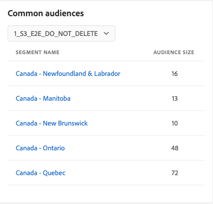

# [!UICONTROL 宛先] dashboard

Adobe Experience Platformのユーザーインターフェイス (UI) は、毎日のスナップショットで取り込まれた、組織のアクティブな宛先に関する重要な情報を表示できるダッシュボードを提供します。 このガイドでは、UI での宛先ダッシュボードへのアクセス方法と操作方法の概要を説明し、ダッシュボードに表示される指標に関する詳細を提供します。

宛先の概要、およびExperience Platform内で使用可能なすべての宛先のカタログについては、 [宛先ドキュメント](../../destinations/home.md).

## [!UICONTROL 宛先] ダッシュボードデータ {#destinations-dashboard-data}

宛先ダッシュボードは、組織が Experience Platform 内で有効にしている宛先のスナップショットを表示します。スナップショット内のデータは、スナップショットが作成された特定の時点でのデータとまったく同じ内容を示します。つまり、スナップショットはデータの近似やサンプルではなく、宛先ダッシュボードはリアルタイムで更新されません。

>[!NOTE]
>
>スナップショットが作成された後にデータに加えられた変更や更新は、次のスナップショットが作成されるまでダッシュボードに反映されません。

## 関連トピック [!UICONTROL 宛先] dashboard {#explore}

Platform UI 内で宛先ダッシュボードに移動するには、「 **[!UICONTROL 宛先]** 左側のレールで、 **[!UICONTROL 概要]** タブをクリックして、ダッシュボードを表示します。

最新のスナップショットの日時が [!UICONTROL 概要] をクリックします。 すべてのウィジェットデータは、その日時時点で正確です。 スナップショットのタイムスタンプは UTC で提供されます。個々のユーザーや組織のタイムゾーンに含まれていません。

>[!NOTE]
>
>組織がExperience Platformを初めて使用し、アクティブな宛先がまだない場合は、宛先ダッシュボードおよび [!UICONTROL 概要] タブが表示されません。 代わりに、「 [!UICONTROL 宛先] 左のナビゲーションから、 [!UICONTROL カタログ] タブをクリックします。 詳しくは、 [!UICONTROL カタログ] タブ ( [[!UICONTROL 宛先] workspace ガイド](../../destinations/ui/destinations-workspace.md).

### を変更します。 [!UICONTROL 宛先] dashboard {#modify}

選択 **[!UICONTROL ダッシュボードを変更]** をクリックして、宛先ダッシュボードの表示を変更します。 これにより、ダッシュボードからウィジェットを移動、追加、削除したり、ウィジェットライブラリにアクセスしたりできます。 ウィジェットライブラリから、使用可能なウィジェットを参照し、組織のカスタムウィジェットを作成できます。

詳しくは、 [ダッシュボードの変更](../customize/modify.md) および [ウィジェットライブラリの概要](../customize/widget-library.md) ドキュメントを参照してください。

### ウィジェットを追加 {#add-widget}

選択 **[!UICONTROL ウィジェットを追加]** をクリックしてウィジェットライブラリに移動し、ダッシュボードに追加できるウィジェットのリストを確認します。

ウィジェットライブラリから、標準およびカスタムセグメントウィジェットの選択を参照できます。 ウィジェットの追加方法について詳しくは、ウィジェットライブラリのドキュメントを参照してください。 [ウィジェットを追加](../customize/widget-library.md#add-widgets).

## 標準ウィジェット {#standard-widgets}

Adobeには、宛先に関連する様々な指標を視覚化し、データ分析に使用できるセグメントの完全性を評価するために使用できる、複数の標準ウィジェットが用意されています。 また、 [!UICONTROL Widget ライブラリ]. カスタムウィジェットの作成の詳細については、まず [ウィジェットライブラリの概要](../customize/widget-library.md).

### 前提条件 {#prerequisites}

標準ウィジェットの説明を続ける前に、ドキュメント全体で使用される次の主要用語の定義について理解しておく必要があります。

* **セグメント：** セグメントは **一連の規則** には、多数のプロファイルをオーディエンスと見なす属性とイベントデータが含まれます。
* **対象ユーザ**:オーディエンスは **一連のプロファイル** がセグメント定義の条件を満たしている。
* **マッピング済み/マッピング**:データマッピングは、ソースデータフィールドを宛先内の関連するターゲットフィールドにマッピングする処理です。
* **ID**:ID は、Cookie ID、デバイス ID、電子メール ID など、個々の顧客を一意に表す識別子です。
* **有効化**:アクティブ化とは、OracleEloqua、Google、SalesforceMarketing Cloudなどの宛先にセグメントまたはプロファイルをマッピングするためにユーザーが実行するアクションです。

使用可能な各標準ウィジェットの詳細を確認するには、次のリストからウィジェットの名前を選択します。

* [[!UICONTROL 最も使用されている宛先]](#most-used-destinations)
* [[!UICONTROL 最近作成した宛先]](#recently-created-destinations)
* [[!UICONTROL 最近アクティブ化されたセグメント]](#recently-activated-segments)
* [[!UICONTROL 最近アクティブ化したセグメント（宛先別）]](#recently-activated-segments-by-destination)
* [[!UICONTROL オーディエンスサイズのトレンド]](#audience-size-trend)
* [[!UICONTROL ID によるマッピングされていないセグメント]](#unmapped-segments-by-identity)
* [[!UICONTROL ID によるマッピングされたセグメント]](#mapped-segments-by-identity)
* [[!UICONTROL 一般的なオーディエンス]](#common-audiences)
* [[!UICONTROL マッピングされたオーディエンス]](#mapped-audiences)
* [[!UICONTROL マッピングされたオーディエンスのヘルス]](#mapped-audience-health)
* [[!UICONTROL 宛先数]](#destinations-count)
* [[!UICONTROL 宛先ステータス]](#destination-status)
* [[!UICONTROL 宛先プラットフォーム別のアクティブな宛先]](#active-destinations-by-destination-platform)
* [[!UICONTROL すべての宛先にわたってアクティブ化されたオーディエンス]](#activated-audiences-across-all-destinations)
* [[!UICONTROL アクティブ化されたオーディエンス]](#activated-audiences)

### [!UICONTROL 最も使用されている宛先] {#most-used-destinations}

>[!CONTEXTUALHELP]
>id="platform_dashboards_destinations_mostuseddestinations"
>title="最も使用されている宛先"
>abstract="このウィジェットは、マッピングされたセグメントの数別に、組織の最もアクティブな宛先を表示します。 これらの数値は、最後のスナップショットの時点で正確です。 このランキングは、使用率が低い可能性のある宛先を強調表示しながら、現在どの宛先が最も使用されているかに関するインサイトを提供します。"

この **[!UICONTROL 最も使用されている宛先]** ウィジェットには、最後のスナップショットに関して、マッピングされたセグメント数別に組織の上位の宛先が表示されます。 このランキングは、どの宛先が利用されているかに関するインサイトを提供すると共に、利用率が低い可能性のある宛先も示します。

例えば、宛先を昨日設定したが、セグメントをマッピングしていない場合、その宛先は現在使用されていないことを確認できます。

セグメント数列に表示されるマッピングされたセグメントの数は、最後の 1 日のスナップショットの正確さです。 新しいセグメントを宛先にマッピングしても、次のスナップショットが作成されるまでカウントは更新されません。

ウィジェットに表示されるリストから宛先の名前を選択すると、 **[!UICONTROL 参照]** タブをクリックします。 また、 **[!UICONTROL すべて表示]** をクリックして、 **[!UICONTROL 参照]** タブをクリックし、詳細を表示する宛先の名前を選択します。

### [!UICONTROL 最近作成した宛先] {#recently-created-destinations}

>[!CONTEXTUALHELP]
>id="platform_dashboards_destinations_recentlycreateddestinations"
>title="最近作成した宛先"
>abstract="このウィジェットには、組織内で最も最近設定された宛先のリストが表示されます。"

この **[!UICONTROL 最近作成した宛先]** ウィジェットを使用すると、組織の最近設定した宛先のリストを表示できます。

表示される作成日は、最後の 1 日のスナップショットに正確です。 つまり、新しい宛先を作成した場合、次のスナップショットが作成されるまでリストに表示されません。

ウィジェットに表示されるリストから宛先の名前を選択すると、 **[!UICONTROL 参照]** タブをクリックします。 また、 **[!UICONTROL すべて表示]** をクリックして、 **[!UICONTROL 参照]** タブをクリックし、詳細を表示する宛先の名前を選択します。

特定のタイプの宛先の設定方法について詳しくは、 [宛先ドキュメント](../../destinations/home.md).

### [!UICONTROL 最近アクティブ化されたセグメント] {#recently-activated-segments}

>[!CONTEXTUALHELP]
>id="platform_dashboards_destinations_recentlyactivatedsegments"
>title="最近アクティブ化されたセグメント"
>abstract="このウィジェットは、宛先に最近マッピングされたセグメントのリストを提供します。 このリストには、システムでアクティブに使用されているセグメントと宛先のスナップショットが表示され、誤ったマッピングのトラブルシューティングに役立ちます。"

この **[!UICONTROL 最近アクティブ化されたセグメント]** widget は、宛先に最近マッピングされたセグメントのリストを提供します。 このリストには、システムでアクティブに使用されているセグメントと宛先のスナップショットが表示され、誤ったマッピングのトラブルシューティングに役立ちます。

表示される更新日は、セグメントが宛先に対して最後にアクティブ化された日時を示し、最後の日別スナップショットに対する正確性を示します。 つまり、宛先に対してセグメントをアクティブ化した場合、更新された日付は、次のスナップショットが作成されるまで変更されません。

ウィジェットに表示されるリストからセグメントの名前を選択すると、セグメントの詳細が表示されます。 また、 **[!UICONTROL すべて表示]** をクリックして「セグメントの参照」タブに移動し、セグメントの名前を選択して詳細を表示します。

Experience Platformでのセグメントの操作について詳しくは、 [セグメント化サービスの概要](../../segmentation/home.md).

### [!UICONTROL 最近アクティブ化したセグメント（宛先別）] {#recently-activated-segments-by-destination}

>[!CONTEXTUALHELP]
>id="platform_dashboards_destinations_recentlyactivatedsegmentsbydestination"
>title="最近アクティブ化したセグメント（宛先別）"
>abstract="このウィジェットには、概要ドロップダウンで選択した宛先に応じて、最近アクティブになった上位 5 つのセグメントが降順で表示されます。"

この **[!UICONTROL 最近アクティブ化したセグメント（宛先別）]** ウィジェットは、概要ドロップダウンで選択した宛先に応じて、最近アクティブになった上位 5 つのセグメントを降順で表示します。 これは、 [!UICONTROL 最近アクティブ化されたセグメント] ウィジェットを使用するが、表示されるデータは使用しない **のみ** は、選択した宛先に適用されます。

このウィジェットには 2 つの指標が含まれています。セグメント名と、セグメントが宛先に対して最後にアクティブ化された日付。 表示されるデータは、最後の 1 日のスナップショットの時点で正しいです。

セグメントの詳細を表示するには、表示されるリストからセグメントの名前を選択します。

前提条件の節を参照してください。 [使用される用語の定義](#prerequisites) （この説明）。

### [!UICONTROL オーディエンスサイズのトレンド] {#audience-size-trend}

>[!CONTEXTUALHELP]
>id="platform_dashboards_destinations_audiencesizetrend"
>title="オーディエンスサイズのトレンド"
>abstract="このウィジェットは、セグメントに含まれ、1 日に宛先アカウントに送信されるプロファイルの数を示します。 最初のドロップダウンメニューでは、オーディエンスのトレンドの期間を調整します。 2 つ目のウィジェットドロップダウンメニューでは、分析するセグメントを選択します。 宛先は概要ドロップダウンから選択します。"

この **[!UICONTROL オーディエンスサイズのトレンド]** ウィジェットは、対象のアカウントにマッピングされたセグメントの期間におけるプロファイル数の関係を示します。 ウィジェットは折れ線グラフを使用して、1 日に宛先アカウントに送信される、セグメントに含まれるプロファイルの数を示します。

過去 30 日間、90 日間または 12 ヶ月間のオーディエンスのトレンドを示す期間は、最初のドロップダウンメニューを使用して調整できます。

2 番目のドロップダウンメニューには、ダッシュボードの上部で選択した宛先アカウントに送信できる、使用可能なすべてのセグメントが一覧表示されます。

この **[!UICONTROL オーディエンスサイズのトレンド]** ウィジェットは [!UICONTROL キャプション] ボタンを使用して、ウィジェットの右上に表示できます。 選択 **[!UICONTROL キャプション]** 自動キャプションダイアログを開く。 機械学習モデルは、グラフとセグメントデータを分析することで、主要なトレンドと重要なイベントを説明するキャプションを自動的に生成します。

### [!UICONTROL ID によるマッピングされていないセグメント] {#unmapped-segments-by-identity}

>[!CONTEXTUALHELP]
>id="platform_dashboards_destinations_unmappedsegmentsbyidentity"
>title="ID によるマッピングされていないセグメント"
>abstract="このウィジェットには上位 5 つの **マッピングされていない** 特定の宛先と ID に対する降順の ID カウントでランク付けされたセグメント。 ウィジェットドロップダウンに表示されるフィルター ID は、概要ページの上部で選択した宛先アカウントに応じて変わります。"

この **[!UICONTROL ID によるマッピングされていないセグメント]** ウィジェットに上位 5 件のリストが表示されます **マッピングされていない** 特定の宛先と ID に対する降順の ID カウントでランク付けされたセグメント。 選択した ID に基づいて選択した宛先アカウントにマッピングするのに最も役立つセグメントが強調表示されます。

宛先 ID ドロップダウンで、使用可能なセグメントをフィルタリングします。 ドロップダウンに表示されるフィルター ID は、概要ページの上部で選択した宛先アカウントに応じて変わります。

ID 列は、セグメント内のソース ID のうち、ウィジェット ID ドロップダウンで選択された ID にマッピングできるものの数を数えます。

前提条件の節を参照してください。 [使用される用語の定義](#prerequisites) （この説明）。

### [!UICONTROL ID によるマッピングされたセグメント] {#mapped-segments-by-identity}

>[!CONTEXTUALHELP]
>id="platform_dashboards_destinations_mappedsegmentsbyidentity"
>title="ID によるマッピングされたセグメント"
>abstract="このウィジェットには、 **マップ** セグメント。 リストの順番は、セグメント内に含まれるソース ID の数に応じて、高い順に並べられます。 カウントする宛先 ID は、ウィジェットタイトルの下にあるドロップダウンメニューから選択します。 ウィジェットドロップダウンから使用できる宛先 ID は、概要ダッシュボードの上部で選択した宛先に応じて異なります。"

このウィジェットには、 **マップ** セグメント。 リストの順番は、セグメント内に含まれるソース ID の数に応じて、高い順に並べられます。 カウントする宛先 ID は、ウィジェットタイトルの下にあるドロップダウンメニューから選択します。 ウィジェットのドロップダウンから使用できる宛先 ID は、概要ダッシュボードの上部で選択した宛先アカウントフィルターに応じて変更されます。

この **[!UICONTROL ID によるマッピングされたセグメント]** ウィジェットは、選択した宛先内のキャンペーンに対して、プロファイルの商談のターゲティングが成功する可能性を一目で強調表示します。 効率的なターゲットキャンペーンは、宛先に送信されるプロファイルの数に依存せず、宛先 ID と照合して有用で実用的なデータを提供すると考えられるソース ID の数に依存します。

### 一般的なオーディエンス {#common-audiences}

>[!CONTEXTUALHELP]
>id="platform_dashboards_destinations_commonaudiences"
>title="一般的なオーディエンス"
>abstract="このウィジェットには、ページ上部で選択された宛先アカウントでアクティブ化された上位 5 つのセグメントと、ウィジェットドロップダウンで選択された宛先のリストが表示されます。 セグメントのリストは、セグメントがアクティブ化された最近の方法に従って並べられます。 最も最近アクティブ化されたセグメントが上部に表示されます。"

この **[!UICONTROL 一般的なオーディエンス]** ウィジェットは、ページ上部で選択された宛先アカウント全体でアクティブ化された上位 5 つのセグメントのリストと、ウィジェットドロップダウンで選択された宛先を提供します。 セグメントのリストは、セグメントがアクティブ化された最近の方法に従って並べられます。 最も最近アクティブ化されたセグメントが上部に表示されます。

この [!UICONTROL オーディエンスサイズ] 列には、リストされた各セグメントの合計プロファイル数が表示されます。

### マッピングされたオーディエンス {#mapped-audiences}

この [!UICONTROL マッピングされたオーディエンス] widget は、ページ上部で選択した宛先に対してアクティブ化できる、マッピングされたオーディエンスの合計数を表示します。

選択 **[!UICONTROL セグメント]** セグメントダッシュボードに移動するには [!UICONTROL 参照] タブをクリックします。 このワークスペースには、組織のすべてのセグメント定義のリストが表示されます。

### マッピングされたオーディエンスのヘルス {#mapped-audience-health}

>[!CONTEXTUALHELP]
>id="platform_dashboards_destinations_mappedaudiencehealth"
>title="マッピングされたオーディエンスのヘルス"
>abstract="このウィジェットは、合計プロファイル数が、その宛先にマッピングされた 30 日間の平均オーディエンスサイズから少なくとも 1 つの標準偏差の係数でずれた、最大 20 個のマッピングされたセグメントのリストを提供します。 この指標は、過去 30 日間の平均からのオーディエンスサイズの分散に対する計算指標を提供します。 オーディエンスサイズは、高い順に並べ替えられます。"

ウィジェットには、最後の日別スナップショットに関して、その宛先にマッピングされた平均オーディエンスサイズの 30 日間から少なくとも 1 つの標準偏差の要因とずれた、最大 20 個のマッピングされたセグメントのリストが表示されます。

簡単に言うと、過去 30 日間の平均からのオーディエンスサイズの分散に関する計算指標が提供されます。 このレポートでは、今日のオーディエンスサイズが、過去 30 日間のデータで確認された過去の標準偏差を下回っているかどうかを比較します。

システム内のすべてのオーディエンスサイズは、 [!UICONTROL 最新サイズ] 列。

セグメントにマッピングされたプロファイルの数が、過去 30 日間での平均マッピングされたプロファイルサイズから 1 つの標準偏差外にある場合は、システムの異常値を示しているので、調査する必要があります。

セグメントが [!UICONTROL マッピングされたオーディエンスのヘルス] ウィジェットが広い余白でずらされている場合は、オーディエンスサイズのトレンドグラフを参照して、異常なセグメントを見つける必要があります。 トレンドを参照すると、セグメントの正常性に関する詳細なインサイトを得ることができます。

>[!NOTE]
>
>マッピングされたオーディエンスヘルスウィジェットのデフォルトサイズがテーブル情報の妨げになる可能性があります。 マッピングしたセグメント名と列タイトルを読みやすくするために、ウィジェットのサイズを変更してください。 次のガイダンスについては、ダッシュボードの変更に関するドキュメントを参照してください： [ウィジェットのサイズを変更する方法](../customize/modify.md).

### [!UICONTROL 宛先数] {#destinations-count}

>[!CONTEXTUALHELP]
>id="platform_dashboards_destinations_destinationscount"
>title="宛先数"
>abstract="このウィジェットは、オーディエンスをアクティブ化し、システム内で配信できる、使用可能なエンドポイントの合計数を提供します。 この数には、アクティブな宛先と非アクティブな宛先の両方が含まれます。"

この [!UICONTROL 宛先数] ウィジェットは、オーディエンスをアクティブ化し、システム内で配信できる、使用可能なエンドポイントの合計数を提供します。 この数には、アクティブな宛先と非アクティブな宛先の両方が含まれます。

合計数の下で、「 」を選択します。 **[!UICONTROL 宛先]** をクリックして、宛先の「参照」タブに移動します。 このページには、これまでに接続を確立したすべての宛先が一覧表示されます。

### [!UICONTROL 宛先ステータス] {#destination-status}

この [!UICONTROL 宛先のステータス] ウィジェットは、有効な宛先の合計数を 1 つの指標として表示し、ドーナツグラフを使用して、有効な宛先と無効な宛先の比例的な違いを示します。

有効または無効の宛先の個々のカウントは、ドーナツグラフの各セクションにカーソルを置くと、ダイアログに表示されます。

### [!UICONTROL 宛先プラットフォーム別のアクティブな宛先] {#active-destinations-by-destination-platform}

このウィジェットには、アクティブな宛先プラットフォームのリストと、各宛先プラットフォームのアクティブな宛先の合計数を表示する 2 つの列のテーブルが表示されます。 宛先プラットフォームのリストは、上位から下位に並べられます。

### [!UICONTROL すべての宛先にわたってアクティブ化されたオーディエンス] {#activated-audiences-across-all-destinations}

この [!UICONTROL すべての宛先でアクティブ化されたオーディエンス] ウィジェットは、1 つの指標内のすべての宛先でアクティブ化されたオーディエンスの合計数を提供します。 このウィジェットは、セグメントの数ではなく、オーディエンスの数を表示します。 この数は、最新のスナップショットに対して正確です。

選択 **[!UICONTROL オーディエンス]** 宛先に移動するには [!UICONTROL 参照] タブをクリックします。 このページには、有効なすべての宛先のリストと、様々な関連指標が表示されます。 詳しくは、ドキュメントを参照してください。 [[!UICONTROL 参照] タブ](../../destinations/ui/destinations-workspace.md#browse).

前提条件の節を参照してください。 [使用される用語の定義](#prerequisites) （この説明）。

### [!UICONTROL アクティブ化されたオーディエンス] {#activated-audiences}

このウィジェットは、宛先に対してアクティブ化されたオーディエンスの合計数を示す単一の指標を提供します。

選択 **[!UICONTROL オーディエンス]** をクリックして、宛先ダッシュボードの詳細ページに移動します。 この [!UICONTROL アクティベーションデータ] 「 」タブには、宛先にマッピングされたセグメントのリストが表示されます。これには、開始日と終了日（該当する場合）、およびデータエクスポートに関するその他の関連情報（エクスポートタイプ、スケジュール、頻度など）が含まれます。 特定のセグメントに関する詳細を表示するには、リストからそのセグメントの名前を選択します。

このウィジェットを使用すると、一目でアクティブ化されるオーディエンスの数に基づいて宛先の価値を把握できます。 また、より詳細な情報に容易にアクセスして、さらに分析することもできます。

前提条件の節を参照してください。 [使用される用語の定義](#prerequisites) （この説明）。

## 次の手順

このドキュメントに従うと、宛先ダッシュボードを見つけて、使用可能なウィジェットに表示される指標を理解できるようになります。 Experience Platformでの宛先の使用について詳しくは、 [宛先ドキュメント](../../destinations/home.md).
