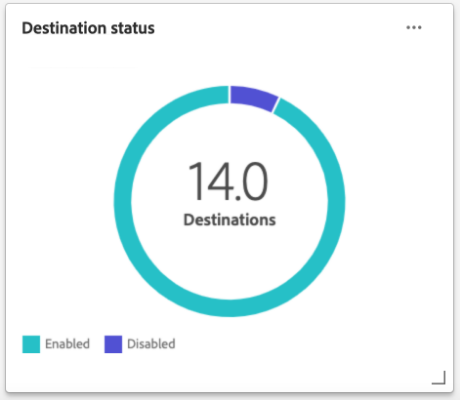

# [!UICONTROL Destinations] ダッシュボード

Adobe Experience Platform ユーザーインターフェイス（UI）には、毎日のスナップショットで取得した、組織のアクティブな宛先に関する重要な情報を表示できるダッシュボードが用意されています。このガイドでは、UI での宛先ダッシュボードへのアクセスおよび操作方法の概要を説明し、ダッシュボードに表示される指標に関する詳細情報を提供します。

宛先の概要、および Experience Platform 内で使用可能なすべての宛先のカタログについては、[宛先のドキュメント](../../destinations/home.md)を参照してください。

## [!UICONTROL Destinations] ダッシュボードデータ {#destinations-dashboard-data}

宛先ダッシュボードは、組織が Experience Platform 内で有効にしている宛先のスナップショットを表示します。スナップショット内のデータは、スナップショットが作成された特定の時点でのデータとまったく同じ内容を示します。つまり、スナップショットはデータの近似やサンプルではなく、宛先ダッシュボードはリアルタイムで更新されません。

>[!NOTE]
>
>スナップショットが作成された後にデータに加えられた変更や更新は、次のスナップショットが作成されるまでダッシュボードに反映されません。

## [!UICONTROL Destinations] ダッシュボードを試す {#explore}

Experience Platform UI 内で宛先ダッシュボードに移動するには、左側のレールで「**[!UICONTROL Destinations]**」を選択し、「**[!UICONTROL Overview]**」タブを選択して、ダッシュボードを表示します。

最新のスナップショットの日時が、宛先ドロップダウン横の [!UICONTROL Overview] の上部に表示されます。 すべてのウィジェットデータは、その日時の時点で正確です。 スナップショットのタイムスタンプは UTC で指定されます。個々のユーザーや組織のタイムゾーンではありません。

>[!NOTE]
>
>組織が Experience Platform を初めて使用し、アクティブな宛先がまだない場合、[宛先] ダッシュボードと [!UICONTROL Overview] タブは表示されません。 代わりに、左側のナビゲーションから [!UICONTROL Destinations] を選択すると、 [!UICONTROL Catalog] タブが表示されます。 [!UICONTROL Catalog] タブについて詳しくは、[[!UICONTROL Destinations] ワークスペース ガイド](../../destinations/ui/destinations-workspace.md) を参照してください。

### [!UICONTROL Destinations]ダッシュボードの変更 {#modify}

宛先ダッシュボードの外観を変更するには、「 **[!UICONTROL Modify dashboard]** 」を選択します。 ダッシュボードへの変更は、組織全体ではなく、ユーザーごとに行われます。 ダッシュボードからウィジェットの移動、追加、サイズ変更、削除を行ったり、ウィジェットライブラリにアクセスしてダッシュボードをカスタマイズしたりできます。 ウィジェットライブラリから、使用可能なウィジェットを参照し、組織向けのカスタムウィジェットを作成できます。

詳しくは、[ダッシュボードの変更](../customize/modify.md)と[ウィジェットライブラリの概要](../customize/widget-library.md)のドキュメントを参照してください。

### ウィジェットを追加 {#add-widget}

[ **[!UICONTROL Add widget]** ] を選択してウィジェット ライブラリに移動し、ダッシュボードに追加する使用可能なウィジェットのリストを確認します。

ウィジェットライブラリから、選択した標準およびカスタムオーディエンスウィジェットを参照できます。 ウィジェットの追加方法について詳しくは、[ウィジェットを追加](../customize/widget-library.md#add-widgets)する方法に関するウィジェットライブラリのドキュメントを参照してください。

### SQL を表示 {#view-sql}

ダッシュボードで視覚化された分析情報を生成する SQL は、 [!UICONTROL Overview] ワークスペースを切り替えることで表示できます。 既存の分析情報の SQL からインスピレーションを得て、ビジネス ニーズに基づいてExperience Platformデータから独自の分析情報を導き出す新しいクエリを作成できます。 この機能の詳細については、 [表示 SQL UI ガイド](../view-sql.md) を参照してください。

## デフォルトウィジェット {#default-widgets}

既定のウィジェット ロードアウトは、データから利用可能な最新の分析情報を強調表示するAdobe Experience Platformのすべての新しいインスタンスに対して提供されます。 以下のウィジェットは、最初からセグメント表示事前設定されています。 ウィジェットの目的と機能の詳細についてはフル以下を参照してください。

* [[!UICONTROL Most used destinations]](#most-used-destinations)
* [[!UICONTROL Recently created destinations]](#recently-created-destinations)
* [[!UICONTROL Recently activated segments]](#recently-activated-segments)

>[!NOTE]
>
>2023 年 7 月 26 日（PT）の時点で、[!UICONTROL Profiles]、[!UICONTROL Audiences] および [!UICONTROL Destinations] の概要ダッシュボードは、過去 6 か月間にビューを変更しなかったすべてのユーザーに対して、新しいデフォルトのウィジェット読み込みにリセットされました。
>デフォルトのウィジェットのロードアウトの一部として含まれるウィジェットについて詳しくは、[&#x200B; プロファイル &#x200B;](./profiles.md#default-widgets) および [&#x200B; オーディエンス &#x200B;](./audiences.md#default-widgets) デフォルトウィジェットの節のドキュメントを参照してください。 以前と同様にダッシュボードウィジェットをカスタマイズし続けることができます。

## 標準ウィジェット {#standard-widgets}

Adobe Systems には、宛先に関連するさまざまなメトリックを視覚化し、データ 分析で使用できるオーディエンスの完全性を評価するために使用できる複数の標準ウィジェットが用意されています。 また、カスタムウィジェットを作成し、 [!UICONTROL Widget library]を使用して組織と共有することもできます。 カスタムウィジェットの作成について詳しくは、[ウィジェットライブラリの概要](../customize/widget-library.md)を参照してください。

### 前提条件 {#prerequisites}

標準ウィジェットの説明に進む前に、ドキュメント全体で使用される次の主要な用語の定義に精通していることを確認してください。

* **セグメント定義：** セグメント定義は、ターゲットオーディエンスの重要な特徴や行動を説明するために使用される **一連のルール** です。 これらのルールには、オーディエンスの一部としてプロファイルを選定する属性データとイベントデータが含まれます。
* **オーディエンス**：共通の特徴や行動を共有する人物、アカウント、世帯、その他のエンティティのセットです。
* **マッピング済み/マッピング**：データマッピングは、ソースデータフィールドを宛先内の関連ターゲットフィールドにマッピングするプロセスです。
* **IDサービス**: ID は、cookie ID、デバイス ID、電子メール ID など、個人顧客を一意に表す識別子です。
* **アクティベート**:アクティベートは、オーディエンスまたはプロファイルをOracle Eloqua、Google、Salesforce Marketing Cloudなどの宛先にマッピングするためにユーザーによって実行されるアクションです。

使用可能な各標準ウィジェットの詳細を確認するには、次のリストからウィジェットの名前を選択します。

* [[!UICONTROL Most used destinations]](#most-used-destinations)
* [[!UICONTROL Recently created destinations]](#recently-created-destinations)
* [[!UICONTROL Recently activated audiences]](#recently-activated-audiences)
* [[!UICONTROL Recently activated audiences by destination]](#recently-activated-audiences-by-destination)
* [[!UICONTROL Audience size trend]](#audience-size-trend)
* [[!UICONTROL Unmapped audiences by identity]](#unmapped-audiences-by-identity)
* [[!UICONTROL Mapped audiences by identity]](#mapped-audiences-by-identity)
* [[!UICONTROL Common audiences]](#common-audiences)
* [[!UICONTROL Mapped audiences]](#mapped-audiences)
* [[!UICONTROL Mapped audience health]](#mapped-audience-health)
* [[!UICONTROL Destinations count]](#destinations-count)
* [[!UICONTROL Destination status]](#destination-status)
* [[!UICONTROL Active destinations by destination platform]](#active-destinations-by-destination-platform)
* [[!UICONTROL Activated audiences across all destinations]](#activated-audiences-across-all-destinations)
* [[!UICONTROL Activated audiences]](#activated-audiences)

### [!UICONTROL Most used destinations] {#most-used-destinations}

>[!CONTEXTUALHELP]
>id="platform_dashboards_destinations_mostuseddestinations"
>title="最も使用されている宛先"
>abstract="このウィジェットは、マッピングしたオーディエンスの数別に、組織の最もアクティブな宛先を表示します。これらの数値は、最後のスナップショットの時点で正確です。 このランキングは、使用率が低い可能性のある宛先を強調表示しながら、現在最も使用されている宛先に関するインサイトを提供します。"

**[!UICONTROL Most used destinations]** ウィジェットには、最後のスナップショットから、マッピングされたオーディエンスの数別に組織での上位の宛先が表示されます。 このランキングは、使用率が低い可能性のある宛先を表示しながら、使用されている宛先に関するインサイトも提供します。

例えば、昨日設定した宛先にオーディエンスをマッピングしていない場合、その宛先は現在使用されていないことを確認できます。

[!UICONTROL Audience count] 列に表示されるマッピングされたオーディエンスの数は、前回の日別スナップショットに対して正確です。 新しいオーディエンスを宛先にマッピングしても、次のスナップショットが作成されるまでカウントは更新されません。

ウィジェットに表示されるリストから宛先の名前を選択して、その特定の宛先の宛先の詳細に移動します。 [ **[!UICONTROL View All]** ] を選択して **[!UICONTROL Browse]** タブに移動し、宛先の名前を選択して詳細表示することもできます。

### [!UICONTROL Recently created destinations] {#recently-created-destinations}

>[!CONTEXTUALHELP]
>id="platform_dashboards_destinations_recentlycreateddestinations"
>title="最近作成した宛先"
>abstract="このウィジェットには、組織内で最も最近設定された宛先のリストが表示されます。"

**[!UICONTROL Recently created destinations]** ウィジェットを使用すると、組織が最近設定した宛先のリストを表示できます。

表示される作成日は、前回の日別スナップショットに対して正確です。つまり、新しい宛先を作成した場合、次のスナップショットが作成されるまでリストに表示されません。

ウィジェットに表示されているリストから目的地の名前を選択すると、 **[!UICONTROL Browse]** タブからリンクされている目的地の詳細に移動します。 [ **[!UICONTROL View All]** ] を選択して **[!UICONTROL Browse]** タブに移動し、宛先の名前を選択して詳細表示することもできます。

宛先の特定のタイプの設定方法について詳しくは、[宛先ドキュメント](../../destinations/home.md)を参照してください。

### [!UICONTROL Recently activated audiences] {#recently-activated-audiences}

>[!CONTEXTUALHELP]
>id="platform_dashboards_destinations_recentlyactivatedsegments"
>title="最近アクティブ化されたオーディエンス"
>abstract="このウィジェットは、宛先に最近マッピングしたオーディエンスのリストを表示します。このリストには、システムでアクティブに使用されているオーディエンスと宛先のスナップショットが表示され、誤ったマッピングのトラブルシューティングに役立ちます。"

**[!UICONTROL Recently activated audiences]**&#x200B;ウィジェットは、宛先に最近マッピングされたオーディエンスのリストを表示します。このリストには、システムでアクティブに使用されているオーディエンスと宛先のスナップショットが表示され、誤ったマッピングのトラブルシューティングに役立ちます。

表示される [!UICONTROL Updated] 日付は、オーディエンスが宛先に対して最後にアクティブ化された時刻を表示し、最後の毎日のスナップショットに対して正確です。 つまり、宛先へのオーディエンスをアクティブ化した場合、次のスナップショットが作成されるまで、更新された日付は変更されません。

ウィジェットに表示されるリストからオーディエンスの名前を選択すると、オーディエンスの詳細が表示されます。 **[!UICONTROL View All]**&#x200B;を選択して[!UICONTROL Audiences] [!UICONTROL Browse]タブに移動し、オーディエンスの名前を選択して詳細表示こともできます。

Experience Platformでのオーディエンスの操作について詳しくは、[&#x200B; セグメント化サービスの概要 &#x200B;](../../segmentation/home.md) を参照してください。

### [!UICONTROL Recently activated audiences by destination] {#recently-activated-audiences-by-destination}

>[!CONTEXTUALHELP]
>id="platform_dashboards_destinations_recentlyactivatedsegmentsbydestination"
>title="最近アクティブ化されたオーディエンス（宛先別）"
>abstract="このウィジェットは、概要ドロップダウンで選択した宛先に応じて、最近アクティブ化された上位 5 つのオーディエンスを降順で表示します。"

**[!UICONTROL Recently activated audiences by destination]**&#x200B;ウィジェットには、概要ドロップダウンで選択した宛先に従って降順最近アクティブ化された上位5つのオーディエンスが並べて表示されます。これは [!UICONTROL Recently activated audiences] ウィジェットに似ていますが、表示されるデータは **のみ** 選択した宛先に適用されます。

このウィジェットには、オーディエンス名と、オーディエンスが宛先に対して最後にアクティブ化された日付の2つの指標が含まれています。 表示されるデータは、前回の日単位のスナップショットの時点に対して正確です。

表示されたリストからオーディエンスの名前を選択して、オーディエンスの詳細表示ことができます。

この説明の [&#x200B; 使用される用語の定義 &#x200B;](#prerequisites) については、前提条件の節を参照してください。

### [!UICONTROL Audience size trend] {#audience-size-trend}

>[!CONTEXTUALHELP]
>id="platform_dashboards_destinations_audiencesizetrend"
>title="オーディエンスサイズのトレンド"
>abstract="このウィジェットは、毎日宛先アカウントに送信されるオーディエンスに含まれるプロファイルの数を表示します。最初のドロップダウンメニューでは、オーディエンスのトレンドの期間を調整します。2 つ目のウィジェットドロップダウンメニューでは、分析するオーディエンスを選択します。宛先は概要ドロップダウンから選択します。"

**[!UICONTROL Audience size trend]**&#x200B;ウィジェットは、その宛先アカウントにマップされているオーディエンス一定期間にわたるプロファイル数の関係を示します。ウィジェットは折れ線グラフを使用して、毎日宛先アカウントに送信されているオーディエンスに含まれるプロファイルの数を示します。

過去 30 日間、90 日間または 12 か月間のオーディエンスのトレンドを示す期間は、最初のドロップダウンメニューを使用して調整できます。

2番目のドロップダウンメニューには、ダッシュボードの上部で選択した宛先アカウントに送信できるすべての利用可能なオーディエンスが一覧表示されます。

**[!UICONTROL Audience size trend]**&#x200B;ウィジェットでは、ウィジェットの右上に[!UICONTROL Captions]ボタンが表示されます。**[!UICONTROL Captions]**&#x200B;を選択して、自動キャプションダイアログを開きます。機械学習モデルは、チャートとオーディエンスデータを分析することにより、主要な傾向と重要なイベントを説明するキャプションを自動的に生成します。

### [!UICONTROL Unmapped audiences by identity] {#unmapped-audiences-by-identity}

>[!CONTEXTUALHELP]
>id="platform_dashboards_destinations_unmappedsegmentsbyidentity"
>title="マッピングされていないオーディエンス（ID 別）"
>abstract="このウィジェットは、特定の宛先と ID に対して、ID 数の降順でランク付けされた、**マッピングされていない**&#x200B;オーディエンスの上位 5 つのリストを表示します。ウィジェットドロップダウンに一覧表示されるフィルター ID は、概要ページの上部で選択した宛先アカウントに応じて変わります。"

**[!UICONTROL Unmapped audiences by identity]**&#x200B;ウィジェットには、特定の宛先と ID の 降順 ID 数でランク付けされた上位 5 つの **マップされていない**&#x200B;オーディエンスが一覧表示されます。選択した ID に基づいて、選択した宛先アカウントにマッピングするのに最も有益なオーディエンスが強調表示されます。

利用可能なオーディエンスフィルター宛先 ID ドロップダウン。 ドロップダウンにリストされるフィルター ID は、概要ページの上部で選択した宛先アカウントに応じて変わります。

[ID] 列には、ウィジェット ID ドロップダウンで選択した ID にマップできるオーディエンス内のソース ID の数がカウントされます。

この説明の [使用される用語の定義](#prerequisites) については、前提条件のセクションを参照してください。

### [!UICONTROL Mapped audiences by identity] {#mapped-audiences-by-identity}

>[!CONTEXTUALHELP]
>id="platform_dashboards_destinations_mappedsegmentsbyidentity"
>title="マッピングされたオーディエンス（ID 別）"
>abstract="このウィジェットは、**マッピングされた**&#x200B;オーディエンスの上位 5 つのリストを表示します。リストは、オーディエンス内に含まれるソース ID の数に従って、多い順に並べられます。カウントされる宛先 ID は、ウィジェットタイトルの下にあるドロップダウンメニューから選択します。 ウィジェットのドロップダウンから選択できる宛先 ID は、概要ダッシュボードの上部で選択した宛先によって異なります。"

このウィジェットは、**マッピングされた**&#x200B;オーディエンスの上位 5 つのリストを表示します。リストは、オーディエンス内に含まれるソース ID の数に従って、多い順に並べられます。カウントされる宛先 ID は、ウィジェットタイトルの下にあるドロップダウンメニューから選択します。 ウィジェットのドロップダウンから選択できる宛先 ID は、概要ダッシュボードの上部で選択した宛先アカウントフィルターに従って変わります。

**[!UICONTROL Mapped audiences by identity]**&#x200B;ウィジェットは、選択した宛先内でキャンペーンの機会を正常にターゲティングする可能性を一目で強調表示プロファイル。効率的なターゲットキャンペーンは、宛先に送信されるプロファイルの数ではなく、宛先 ID と適合してアクションにつながる有用なデータを提供する可能性のあるソース ID の数によって決まります。

### 一般的なオーディエンス {#common-audiences}

>[!CONTEXTUALHELP]
>id="platform_dashboards_destinations_commonaudiences"
>title="一般的なオーディエンス"
>abstract="このウィジェットは、ページの上部で選択した宛先アカウントとウィジェットのドロップダウンで選択した宛先全体でアクティブ化されたオーディエンスの上位 5 つのリストを表示します。オーディエンスのリストは、最近アクティブ化された順に従って並べられます。最近アクティブ化されたオーディエンスが上位に表示されます。"

**[!UICONTROL Common audiences]**&#x200B;ウィジェットには、ページの上部で選択された宛先アカウント、およびウィジェットのドロップダウンで選択された宛先でアクティブ化された上位 5 つのオーディエンスのリストが表示されます。オーディエンスのリストは、最近アクティブ化された順に従って並べられます。最近アクティブ化されたオーディエンスが上位に表示されます。

[ [!UICONTROL AUDIENCE SIZE] ] 列には、一覧表示された各オーディエンスの合計プロファイル数が表示されます。

### マッピングされたオーディエンス {#mapped-audiences}

[!UICONTROL Mapped audiences]ウィジェットには、ページの上部で選択した宛先に対してアクティブ化できるマッピングされたオーディエンスの合計数が表示されます。

「**[!UICONTROL Audiences]**」を選択すると、オーディエンスダッシュボードの「[!UICONTROL Browse]」タブに移動します。 このワークスペースには、組織のすべてのセグメント定義が一覧表示されます。

### マッピングされたオーディエンスの正常性 {#mapped-audience-health}

>[!CONTEXTUALHELP]
>id="platform_dashboards_destinations_mappedaudiencehealth"
>title="マッピングされたオーディエンスの正常性"
>abstract="このウィジェットは、合計プロファイル数が、その宛先にマッピングされた 30 日間の平均オーディエンスサイズから少なくとも 1 標準偏差の係数だけ逸脱している、最大 20 個のマッピングされたオーディエンスのリストを表示します。この指標は、過去 30 日間の平均からのオーディエンスサイズの分散を表す計算指標となります。 オーディエンスサイズは、多い順に並べ替えられます。"

このウィジェットは、最大20のマッピングされたオーディエンスのリストを提供し、その合計プロファイルカウントは、最後の1日のスナップショットの時点で、その宛先にマッピングされた30日間の平均オーディエンスサイズから少なくとも1標準偏差の係数で逸脱しています。

手短に言えば、過去 30 日間の平均からのオーディエンスサイズの分散を表す計算指標となります。 今日のオーディエンスサイズが、過去 30 日間のデータに見られるこれまでの標準偏差の範囲内に収まっていないかどうかを比較します。

システム内のすべてを選択オーディエンスサイズは、 [!UICONTROL LATEST SIZE] 列に示されているように、大きいサイズから低いオーディエンスサイズにソートされます。

マップされたオーディエンスプロファイル数が、過去 30 日間のマップされたプロファイル サイズの平均から 1 標準偏差の範囲外にある場合は、システムに異常があることを示しており、調査する必要があります。

[!UICONTROL Mapped audience health]ウィジェット内のオーディエンスが大幅にずれている場合は、オーディエンスサイズの傾向グラフを参照して、異常なオーディエンスを見つける必要があります。この傾向は、オーディエンスの健康をさらにインサイトする可能性があります。

>[!NOTE]
>
>マッピングされたオーディエンス正常性ウィジェットのデフォルトサイズが、テーブル情報の妨げになる可能性があります。 ウィジェットのサイズを変更して、マッピングされたオーディエンス名と列タイトルを読みやすくしてください。 [ウィジェットのサイズを変更する方法](../customize/modify.md)については、ダッシュボードの変更に関するドキュメントを参照してください。

### [!UICONTROL Destinations count] {#destinations-count}

>[!CONTEXTUALHELP]
>id="platform_dashboards_destinations_destinationscount"
>title="宛先数"
>abstract="このウィジェットには、システム内でオーディエンスをアクティブ化して配信できる使用可能なエンドポイントの合計数が表示されます。この数には、アクティブな宛先と非アクティブな宛先の両方が含まれます。"

[!UICONTROL Destinations count]ウィジェットは、システム内でオーディエンスをアクティブ化して配信できる使用可能なエンドポイントの総数を提供します。この数には、アクティブな宛先と非アクティブな宛先の両方が含まれます。

合計数の下にある [ **[!UICONTROL Destinations]** ] を選択して、タブを参照する宛先に移動します。 このページには、これまでに接続を確立したすべての宛先が一覧表示されます。

### [!UICONTROL Destination status] {#destination-status}

[!UICONTROL Destination status] ウィジェットは、有効な宛先の合計数を単一の指標として表示し、ドーナツグラフを使用して、有効な宛先と無効な宛先の割合の違いを示します。

ドーナツグラフの各セクションにカーソルを置くと、有効な宛先または無効な宛先の個々のカウントがダイアログに表示されます。

### [!UICONTROL Active destinations by destination platform] {#active-destinations-by-destination-platform}

このウィジェットは、アクティブな宛先プラットフォームと宛先プラットフォームごとのアクティブな宛先の合計数を一覧表示する 2 列の表です。宛先プラットフォームのリストは、宛先数の多い方から少ない方へと並べられます。

### [!UICONTROL Activated audiences across all destinations] {#activated-audiences-across-all-destinations}

[!UICONTROL Activated audiences across all destinations]ウィジェットは、1 つの指標内のすべての宛先でアクティブ化されたオーディエンスの合計数を表示します。この数は、最新のスナップショットまで正確です。

「**[!UICONTROL Audiences]**」を選択すると、「宛先 [!UICONTROL Browse]」タブに移動します。 このページには、有効なすべての宛先と様々な関連指標が一覧表示されます。「[[!UICONTROL Browse]」タブについて詳しくは、ドキュメントを参照してください &#x200B;](../../destinations/ui/destinations-workspace.md#browse)

この説明の [使用される用語の定義](#prerequisites) については、前提条件のセクションを参照してください。

### [!UICONTROL Activated audiences] {#activated-audiences}

このウィジェットには、ある宛先に対してアクティブ化されたオーディエンスの合計数が単一の指標として表示されます。

**[!UICONTROL Audiences]**&#x200B;を選択して、宛先ダッシュボードの詳細ページに移動します。[!UICONTROL Activation data]タブには、開始日と終了日(該当する場合)、およびエクスポートタイプ、スケジュール、頻度など、データのエクスポートに関するその他の関連情報など、宛先にマッピングされているオーディエンスリストが表示されます。特定のオーディエンスの詳細表示には、 [!UICONTROL Audience Name] 列からその名前を選択します。

このウィジェットを使用すると、アクティブ化されたオーディエンスの数に基づいて宛先の価値を一目で把握できます。 また、より詳細な情報に容易にアクセスできるので、さらに分析を進めることもできます。

この説明の [&#x200B; 使用される用語の定義 &#x200B;](#prerequisites) については、前提条件の節を参照してください。

## 次の手順

このドキュメントを通して、宛先ダッシュボードを見つけ、使用可能なウィジェットに表示される指標を理解できるようになりました。Experience Platform での宛先の使用について詳しくは、[宛先のドキュメント](../../destinations/home.md)を参照してください。
