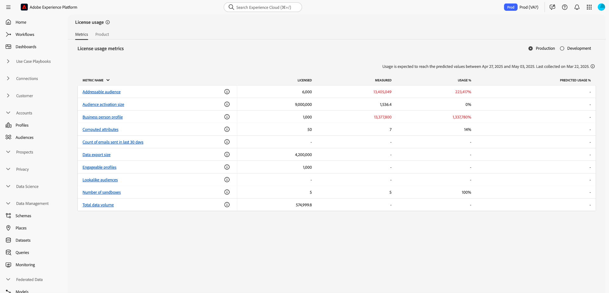
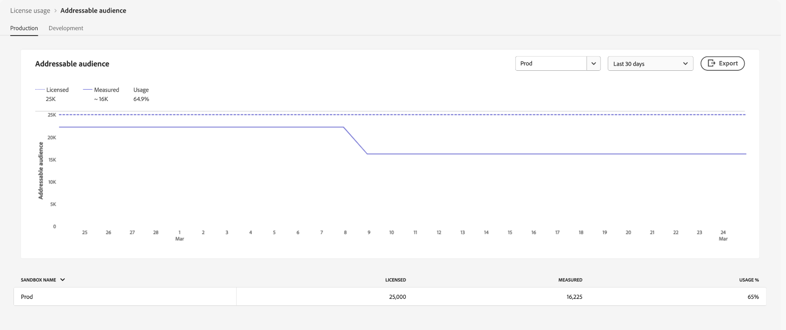
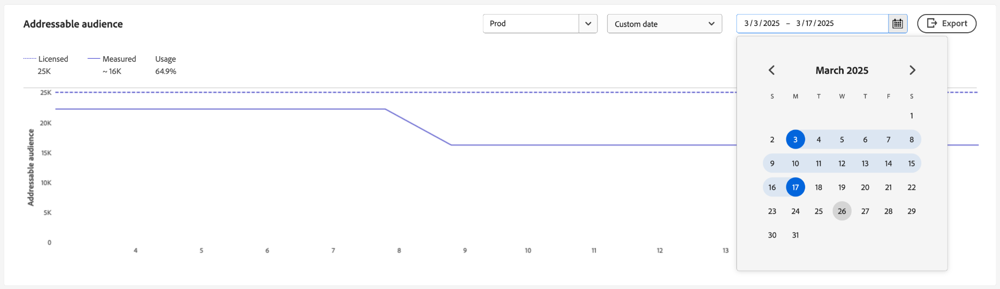
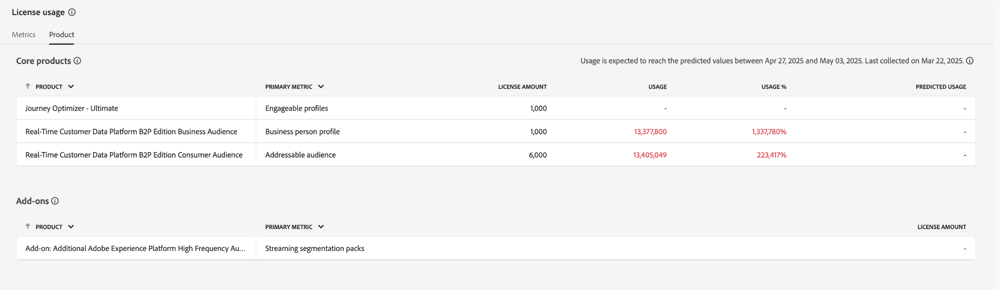

# ライセンス使用状況ダッシュボード {#license-usage-dashboard}

>[!CONTEXTUALHELP]
>id="testy-mctestface"
>title="表示してはいけないテストダイアログ"
>abstract="オブジェクト {name} は {date} に表示されています。"

>[!CONTEXTUALHELP]
>id="platform_dashboards_licenseusage_core"
>title="コア製品テーブル"
>abstract="テーブルにリストされているコア製品には、サンドボックスレベルでの独自の指標、使用状況トラッキング、ドリルスルービューがあります。これらのコア製品は、トラッキングの主要指標を提供し、これらの指標には任意のアドオンが含まれます。"

>[!CONTEXTUALHELP]
>id="platform_dashboards_licenseusage_addons"
>title="アドオンテーブル"
>abstract="アドオンテーブルには、ライセンス数がコア製品でサポートされる指標と組み合わされる製品がリストされます。これらのアドオンには、個別の指標はありませんが、関連付けられているコア製品の使用状況トラッキングを強化します。"

>[!CONTEXTUALHELP]
>id="platform_dashboards_licenseUsage"
>title="ライセンス使用状況ダッシュボード"
>abstract="ライセンス使用状況ダッシュボードでは、購入した Adobe Experience Platform 製品に関するインサイトを得ることができます。ダッシュボードの概要には、各プライマリ指標の使用状況や契約済みのライセンス金額など、製品のプライマリ指標が表示されます。詳細ワークスペースは、特定のサンドボックス内の各製品の指標の分類を表示します。"
>additional-url="https://experienceleague.adobe.com/docs/experience-platform/data-lifecycle/ui/dataset-expiration.html?lang=ja" text="データセットの有効期限の自動化"
>additional-url="https://experienceleague.adobe.com/docs/experience-platform/profile/pseudonymous-profiles.html?lang=ja" text="偽名プロファイルデータの有効期限"

>[!CONTEXTUALHELP]
>id="platform_licenseusage"
>title="ライセンス使用状況ダッシュボード"
>abstract="ライセンス使用状況ダッシュボードでは、購入した Adobe Experience Platform 製品に関するインサイトを得ることができます。ダッシュボードの概要には、各プライマリ指標の使用状況や契約済みのライセンス金額など、製品のプライマリ指標が表示されます。詳細ワークスペースは、特定のサンドボックス内の各製品の指標の分類を表示します。"
>additional-url="https://experienceleague.adobe.com/docs/experience-platform/data-lifecycle/ui/dataset-expiration.html?lang=ja" text="データセットの有効期限の自動化"
>additional-url="https://experienceleague.adobe.com/docs/experience-platform/profile/pseudonymous-profiles.html?lang=ja" text="偽名プロファイルデータの有効期限"

>[!CONTEXTUALHELP]
>id="platform_dashboards_licenseusage_predictedusage_computehours"
>title="予測される計算時間"
>abstract="計算時間は、バッチクエリの実行時に、クエリサービスエンジンがデータの読み取り、処理、書き込みに費やす時間を測定します。 使用量がライセンス量に達する可能性があります。使用量を評価または削減するには、クエリ／ログに移動してクエリ履歴を確認します。クエリワークスペースに対するアクセス権がない場合は、管理者にお問い合わせください。"
>additional-url="https://experience.adobe.com/#/platform/query/log.html" text="クエリログワークスペース"

>[!CONTEXTUALHELP]
>id="platform_dashboards_licenseusage_predictedusage_addressableaudience"
>title="予測されるアドレス可能なオーディエンス"
>abstract="アドレス可能なオーディエンスは、組織が関与する資格のあるリアルタイム顧客プロファイルの一連のユーザープロファイルです。この指標には、直接識別可能なプロファイルと偽名プロファイルの両方が含まれます。 使用量がライセンス量に達する可能性があります。使用量を減らすには、データセットまたは偽名プロファイルデータの有効期限を設定します。"
>additional-url="https://experienceleague.adobe.com/docs/experience-platform/profile/event-expirations.html?lang=ja" text="エクスペリエンスイベントの有効期限"
>additional-url="https://experienceleague.adobe.com/docs/experience-platform/profile/pseudonymous-profiles.html?lang=ja" text="偽名プロファイルデータの有効期限"

>[!CONTEXTUALHELP]
>id="platform_dashboards_licenseusage_predictedusage_engageableprofiles"
>title="予測されるエンゲージ可能なプロファイル"
>abstract="エンゲージ可能なプロファイルは、組織が過去 12 か月以内に Journey Optimizer を使用してエンゲージを試みた、リアルタイム顧客プロファイルのユーザープロファイルです。 使用量がライセンス量に達する可能性があります。使用量を減らすには、データセットまたは偽名プロファイルデータの有効期限を設定します。"
>additional-url="https://experienceleague.adobe.com/docs/experience-platform/profile/event-expirations.html?lang=ja" text="エクスペリエンスイベントの有効期限"
>additional-url="https://experienceleague.adobe.com/docs/experience-platform/profile/pseudonymous-profiles.html?lang=ja" text="偽名プロファイルデータの有効期限"

>[!CONTEXTUALHELP]
>id="platform_dashboards_licenseusage_predictedusage_businesspersonprofile"
>title="予測されるビジネスユーザーのプロファイル"
>abstract="ビジネスユーザーのプロファイルは、B2B コンテキストで個人を表すリアルタイム顧客プロファイルのレコードです。 使用量がライセンス量に達する可能性があります。使用量を減らすには、データセットまたは偽名プロファイルデータの有効期限を設定します。"
>additional-url="https://experienceleague.adobe.com/docs/experience-platform/profile/event-expirations.html?lang=ja" text="エクスペリエンスイベントの有効期限"
>additional-url="https://experienceleague.adobe.com/docs/experience-platform/profile/pseudonymous-profiles.html?lang=ja" text="偽名プロファイルデータの有効期限"

>[!CONTEXTUALHELP]
>id="platform_dashboards_licenseusage_predictedusage_corehours"
>title="予測されるコア時間"
>abstract="コア時間は、Experience Platform サービス全体で消費される処理時間を表します。 使用量がライセンス量に達する可能性があります。使用量を減らすには、データセットまたは偽名プロファイルデータの有効期限を設定します。"
>additional-url="https://experienceleague.adobe.com/docs/experience-platform/profile/event-expirations.html?lang=ja" text="エクスペリエンスイベントの有効期限"
>additional-url="https://experienceleague.adobe.com/docs/experience-platform/profile/pseudonymous-profiles.html?lang=ja" text="偽名プロファイルデータの有効期限"

>[!CONTEXTUALHELP]
>id="platform_dashboards_licenseusage_predictedusage_totaldatavolume"
>title="予測される合計データボリューム"
>abstract="合計データボリュームは、エンゲージメントワークフローとパーソナライゼーションワークフローで使用するリアルタイム顧客プロファイルで使用可能なデータの量です。 使用量がライセンス量に達する可能性があります。使用量を減らすには、データセットまたは偽名プロファイルデータの有効期限を設定します。"
>additional-url="https://experienceleague.adobe.com/docs/experience-platform/profile/event-expirations.html?lang=ja" text="エクスペリエンスイベントの有効期限"
>additional-url="https://experienceleague.adobe.com/docs/experience-platform/profile/pseudonymous-profiles.html?lang=ja" text="偽名プロファイルデータの有効期限"

>[!CONTEXTUALHELP]
>id="platform_dashboards_licenseusage_predictedusage_cjaRowsAvailable"
>title="予測される使用可能な CJA 行数"
>abstract="使用可能な CJA 行数は、Customer Journey Analytics で分析に使用できるデータの 1 日あたりの平均行数を指します。 使用量がライセンス量に達する可能性があります。使用量を減らすには、データセットまたは偽名プロファイルデータの有効期限を設定します。"
>additional-url="https://experienceleague.adobe.com/docs/experience-platform/profile/event-expirations.html?lang=ja" text="エクスペリエンスイベントの有効期限"
>additional-url="https://experienceleague.adobe.com/docs/experience-platform/profile/pseudonymous-profiles.html?lang=ja" text="偽名プロファイルデータの有効期限"

>[!CONTEXTUALHELP]
>id="platform_dashboards_licenseusage_exceededusage_addressableaudience"
>title="予測されるアドレス可能なオーディエンス"
>abstract="アドレス可能なオーディエンスは、組織が関与する資格のあるリアルタイム顧客プロファイルの一連のユーザープロファイルです。これには、直接識別可能なプロファイルと偽名プロファイルの両方が含まれます。 使用量がライセンス量を超えました。使用量を減らすには、データセットまたは偽名プロファイルデータの有効期限を設定します。"
>additional-url="https://experienceleague.adobe.com/docs/experience-platform/profile/event-expirations.html?lang=ja" text="エクスペリエンスイベントの有効期限"
>additional-url="https://experienceleague.adobe.com/docs/experience-platform/profile/pseudonymous-profiles.html?lang=ja" text="偽名プロファイルデータの有効期限"

>[!CONTEXTUALHELP]
>id="platform_dashboards_licenseusage_exceededusage_engageableprofiles"
>title="予測されるエンゲージ可能なプロファイル"
>abstract="エンゲージ可能なプロファイルは、組織が過去 12 か月以内に Journey Optimizer を使用してエンゲージを試みた、リアルタイム顧客プロファイルのユーザープロファイルです。 使用量がライセンス量を超えました。使用量を減らすには、データセットまたは偽名プロファイルデータの有効期限を設定します。"
>additional-url="https://experienceleague.adobe.com/docs/experience-platform/profile/event-expirations.html?lang=ja" text="エクスペリエンスイベントの有効期限"
>additional-url="https://experienceleague.adobe.com/docs/experience-platform/profile/pseudonymous-profiles.html?lang=ja" text="偽名プロファイルデータの有効期限"

>[!CONTEXTUALHELP]
>id="platform_dashboards_licenseusage_exceededusage_businesspersonprofile"
>title="予測されるビジネスユーザーのプロファイル"
>abstract="ビジネスユーザーのプロファイルは、B2B コンテキストで個人を表すリアルタイム顧客プロファイルのレコードです。 使用量がライセンス量を超えました。使用量を減らすには、データセットまたは偽名プロファイルデータの有効期限を設定します。"
>additional-url="https://experienceleague.adobe.com/docs/experience-platform/profile/event-expirations.html?lang=ja" text="エクスペリエンスイベントの有効期限"
>additional-url="https://experienceleague.adobe.com/docs/experience-platform/profile/pseudonymous-profiles.html?lang=ja" text="偽名プロファイルデータの有効期限"

>[!CONTEXTUALHELP]
>id="platform_dashboards_licenseusage_exceededusage_corehours"
>title="予測されるコア時間"
>abstract="コア時間は、Experience Platform サービス全体で消費される処理時間を表します。 使用量がライセンス量を超えました。使用量を減らすには、データセットまたは偽名プロファイルデータの有効期限を設定します。"
>additional-url="https://experienceleague.adobe.com/docs/experience-platform/profile/event-expirations.html?lang=ja" text="エクスペリエンスイベントの有効期限"
>additional-url="https://experienceleague.adobe.com/docs/experience-platform/profile/pseudonymous-profiles.html?lang=ja" text="偽名プロファイルデータの有効期限"

>[!CONTEXTUALHELP]
>id="platform_dashboards_licenseusage_exceededusage_totaldatavolume"
>title="予測される合計データボリューム"
>abstract="合計データボリュームは、エンゲージメントワークフローとパーソナライゼーションワークフローで使用するリアルタイム顧客プロファイルで使用可能なデータの量です。 使用量がライセンス量を超えました。使用量を減らすには、データセットまたは偽名プロファイルデータの有効期限を設定します。"
>additional-url="https://experienceleague.adobe.com/docs/experience-platform/profile/event-expirations.html?lang=ja" text="エクスペリエンスイベントの有効期限"
>additional-url="https://experienceleague.adobe.com/docs/experience-platform/profile/pseudonymous-profiles.html?lang=ja" text="偽名プロファイルデータの有効期限"

>[!CONTEXTUALHELP]
>id="platform_dashboards_licenseusage_exceededusage_cjaRowsAvailable"
>title="予測される使用可能な CJA 行数"
>abstract="使用可能な CJA 行数は、Customer Journey Analytics で分析に使用できるデータの 1 日あたりの平均行数を指します。 使用量がライセンス量を超えました。使用量を減らすには、データセットまたは偽名プロファイルデータの有効期限を設定します。"
>additional-url="https://experienceleague.adobe.com/docs/experience-platform/profile/event-expirations.html?lang=ja" text="エクスペリエンスイベントの有効期限"
>additional-url="https://experienceleague.adobe.com/docs/experience-platform/profile/pseudonymous-profiles.html?lang=ja" text="偽名プロファイルデータの有効期限"

**[!UICONTROL License usage]** ダッシュボードを通じて、組織のライセンス使用状況に関する重要な情報を表示できます。 ダッシュボードは、Adobe Experience Platformのライセンスを取得している組織とそうでない組織を含む、対象となるExperience Cloud組織で使用できます。 表示される情報は、組織の環境の毎日のスナップショット中にキャプチャされ、リアルタイムでは更新されません。

ライセンス使用状況レポートは、詳細な情報を提供します。 ほとんどの指標は複数の製品で共有され、製品別の合計ではなく、それらを使用するすべての製品で集計された使用状況を反映します。

このガイドでは、UIでライセンス使用状況ダッシュボードにアクセスして操作する方法の概要を説明し、ダッシュボードに表示されるビジュアライゼーションに関する詳細情報を提供します。

Experience Platform UIの概要については、[Experience Platform UI ガイド &#x200B;](../../landing/ui-guide.md)を参照してください。

## [!UICONTROL License usage] ダッシュボードデータ

[!UICONTROL License usage] ダッシュボードには、購入したすべてのExperience Platform製品と、それらの製品のアドオンのリストが表示されます。 このダッシュボードでは、Experience Platformのライセンス関連データのスナップショットを、関連する任意のサンドボックスで検索できます。

このダッシュボードのデータは、スナップショットが取得された特定の時点に表示されたとおりに表示されます。 近似やサンプルではありませんが、ダッシュボードはリアルタイムで更新されません。

Adobe Experience Platform アプリケーション（Real-Time Customer Data Platform、Adobe Journey Optimizer、Customer Journey Analyticsなど）を持たない組織の場合、ダッシュボードにはAI クレジット使用指標のみが表示されます。

>[!NOTE]
>
>ダッシュボード内のほとんどの指標は、Experience Platform インスタンスのスナップショットに基づいて毎日更新されます。 [!UICONTROL CJA Rows Available]は例外であり、毎月更新されます。 [!UICONTROL Adhoc Query Service Users Packs]、[!UICONTROL Profile Richness No of Packs]、[!UICONTROL Streaming Segmentation No of Packs]などの「パック」でラベル付けされた指標は、アドオンの提供に対するライセンス使用権限を反映しており、継続的な使用は追跡されません。 スナップショットの後に行われた変更は、次のスナップショットが実行されるまで表示されません。

## ライセンス使用状況ダッシュボードの確認 {#explore}

Experience Platform UI内のライセンス使用状況ダッシュボードに移動するには、左側のパネルで「**[!UICONTROL License usage]**」を選択します。 ダッシュボードには2つのタブがあります：**[!UICONTROL Metrics]**&#x200B;と&#x200B;**[!UICONTROL Products]**。

>[!NOTE]
>
>ライセンス使用状況ダッシュボードは、デフォルトでは有効になっていません。 アクセスするには、**&quot;[!UICONTROL View License Usage Dashboard]&quot;**&#x200B;権限が付与されている必要があります。
>
>組織でAdobe Experience Platform アプリケーションのライセンスを取得している場合は、該当する製品プロファイルとサンドボックスでこの権限を付与します。
>
>Adobe Experience Platform アプリケーションを持たない組織（AEM専用またはワークフロー専用の組織など）の場合、この権限はAdobe Admin ConsoleのAdobe Experience Platform製品カード（組織にプロビジョニングされている場合）で使用できます。 ユーザーがダッシュボードを表示するには、管理者が製品プロファイルに権限を追加する必要があります。

## [!UICONTROL Metrics] タブ {#metrics-tab}

「**[!UICONTROL Metrics]**」タブには、組織全体のすべてのライセンス使用率の指標が一元的に表示されます。 ほとんどの指標は製品で共有されているため、これらの指標に対して製品ごとに個別の分類はありません。

指標テーブルには、次の列が含まれます。

| 列の名前 | 説明 |
|---|---|
| **[!UICONTROL Metric Name]** | ライセンス使用率メトリックの名前。 各エントリには、関連する製品の説明とリストを表示する情報アイコン（`ⓘ`）が含まれています。 |
| **[!UICONTROL Licensed]** | 組織が使用できる単位の数（契約で定義）。 この指標は、「製品」タブの「**ライセンス量**」と同じ値です。 |
| **[!UICONTROL Measured]** | 組織で現在使用されている指標の量。 |
| **[!UICONTROL Usage %]** | 現在使用されているライセンス値の割合。 |
| **[!UICONTROL Predicted Usage %]** | 今後6週間における指標の予測使用範囲。 |

**[!UICONTROL Production]**&#x200B;または&#x200B;**[!UICONTROL Development]** サンドボックスの切り替えスイッチを使用して、サンドボックスで表示される指標をフィルタリングします。

>[!NOTE]
>
>消費レポートは、サンドボックスタイプごとに累積されます。 [!UICONTROL Production]または[!UICONTROL Development]を選択すると、そのタイプのすべてのサンドボックスで使用状況が組み合わされて表示されます。

>[!WARNING]
>
>ライセンス使用状況ダッシュボードを表示する権限は、サンドボックスレベルで指定する必要があります。 各サンドボックスに権限を追加し、ダッシュボード内で表示できます。 この制限は、今後のリリースで対応する予定です。 その間に、次の回避策を使用できます。
>
>1. Adobe Admin Consoleで商品プロファイルを作成します。
>2. 「サンドボックス」カテゴリの「権限」で、表示するすべてのサンドボックスをライセンス使用ダッシュボードに追加します。
>3. ユーザーダッシュボード権限カテゴリで、「ライセンス使用状況ダッシュボードを表示」権限を追加します。

### 指標の詳細を表示 {#view-metric-details}

特定の指標の使用状況の詳細を表示するには、リストで指標の名前を選択します。 指標の詳細なビューが表示され、次の情報が表示されます。

- 経時的な利用状況を示す過去の折れ線グラフ
- ライセンス値と測定値の比較
- 個別のサンドボックスによる使用
- データをフィルタリングするサンドボックスセレクター
- CSV ダウンロードのエクスポートオプション

このビジュアライゼーションにより、傾向を追跡し、各サンドボックスが全体的な使用状況にどのように貢献しているかを把握し、データを書き出してオフライン分析に利用することができます。

各チャートには、データをフィルタリングするためのドロップダウンメニューが含まれています。 日付範囲ドロップダウンを使用してルックバック期間を調整するか（デフォルト：過去30日間）、サンドボックスドロップダウンを使用して、特定の実稼動サンドボックスまたは開発サンドボックスの使用状況を表示します。

**[!UICONTROL Custom date]**&#x200B;を選択して、表示される期間を選択することもできます。

### CSV書き出し {#export-metric-usage-data}

選択した指標とサンドボックスの使用履歴データを、指標の詳細ビューから直接CSV ファイルとして書き出すことができます。 **[!UICONTROL Export]** アイコンを選択して、表形式でグラフのデータをダウンロードします。 書き出されたCSVを使用して、オフラインでのトレンドの分析や、チーム間での使用状況に関するインサイトの共有が容易になります。

## [!UICONTROL Products] タブ {#products-tab}

「**[!UICONTROL Products]**」タブには、購入した製品と関連するアドオン別にグループ化されたライセンス使用状況データが表示されます。 「[!UICONTROL Products]」タブには、次の2つのテーブルが含まれています。

- **[!UICONTROL Core products]テーブル**：このテーブルには、お客様の組織がライセンスを取得している主なAdobe Experience Platform製品が一覧表示されます。 各製品には、主要な指標、利用状況の追跡、予測される利用状況が記載されています。
- **[!UICONTROL Add-ons]テーブル**: ライセンス金額がコア製品の指標に貢献している補足項目を一覧表示します。 アドオンには個別の指標はありませんが、関連付けられたコア製品の使用状況追跡を強化します。

| 列の名前 | 説明 |
|---|---|
| **[!UICONTROL Product]** | お客様の組織でライセンスを取得したAdobe ソリューション。 |
| **[!UICONTROL Primary Metric]** | その製品内でトラッキングするために使用される主な指標。 |
| **[!UICONTROL License Amount]** | プライマリ指標の最大量の契約値。 |
| **[!UICONTROL Usage]** | 使用されたプライマリ指標の量。 |
| **[!UICONTROL Usage %]** | ライセンス量に応じて使用される主な指標の割合。 |
| **[!UICONTROL Predicted Usage]** | プライマリ指標の予測使用率。 |

>[!NOTE]
>
>アドオン用の[!UICONTROL License Amount]は、コア製品の合計ライセンス額に含まれています。 アドオンは個別に追跡されませんが、関連する製品の機能を強化します。 例えば、アドオンとして5つのサンドボックスのパックを1つ購入した場合、その金額はベース製品のそれに追加されます。 アドオンのテーブルにはアドオン特有の[!UICONTROL License Amount]が表示されますが、実際の使用状況はベース製品を通じて追跡されます。

### 予測される使用状況 {#predicted-usage}

>[!CONTEXTUALHELP]
>id="platform_dashboards_licenseUsage_prediction"
>title="予測される使用状況"
>abstract="予測は過去6～7か月の使用状況に基づき、毎週金曜日に週単位で生成されます。ライセンス使用状況の予測は過去の使用状況に基づく概算です。お客様は、組織における実際の使用状況を理解し、その使用状況がアドビとの組織のライセンスの範囲を超えないようにする責任があります。使用量を減らすには、サンドボックスとデータセットに対するデータセットまたは偽名プロファイルのデータの有効期限を設定します。"
>additional-url="https://experienceleague.adobe.com/docs/experience-platform/data-lifecycle/ui/dataset-expiration.html?lang=ja" text="データセットの有効期限の自動化"
>additional-url="https://experienceleague.adobe.com/docs/experience-platform/profile/pseudonymous-profiles.html?lang=ja" text="偽名プロファイルデータの有効期限"

>[!CONTEXTUALHELP]
>id="platform_licenseusage_prediction"
>title="予測される使用状況"
>abstract="予測は過去6～7か月の使用状況に基づき、毎月15日に生成されます。ライセンス使用状況の予測は過去の使用状況に基づく概算です。お客様は、組織における実際の使用状況を理解し、その使用状況がアドビとの組織のライセンスの範囲を超えないようにする責任があります。使用量を減らすには、サンドボックスとデータセットに対するデータセットまたは偽名プロファイルのデータの有効期限を設定します。"
>additional-url="https://experienceleague.adobe.com/docs/experience-platform/data-lifecycle/ui/dataset-expiration.html?lang=ja" text="データセットの有効期限の自動化"
>additional-url="https://experienceleague.adobe.com/docs/experience-platform/profile/pseudonymous-profiles.html?lang=ja" text="偽名プロファイルデータの有効期限"

正確かつ最新の使用状況を予測し、ライセンスリソースを積極的に管理および最適化できます。 [!UICONTROL Predicted Usage]列は、購入したすべての製品のすべての実稼動用サンドボックスと開発用サンドボックスのサンドボックスレベルでの将来のライセンス使用状況を予測します。 予測は週単位で更新され、最新の利用状況データにもとづいて6週間の予測が提供されます。 各予測には、情報に基づいた計画をサポートするための下限と上限の両方が含まれます。

>[!IMPORTANT]
>
>予測は、毎週金曜日に毎週更新されます。 更新日は、情報アイコン （）が列タイトルの上にあります。

[!UICONTROL Product] テーブルの「[!UICONTROL Core products]」タブにある製品の使用権限の使用状況の概要を表示します。

![製品と予測使用列がハイライト表示された[!UICONTROL License usage] [!UICONTROL Product] タブ。](../images/license-usage/product-predicted-usage.png)

>[!NOTE]
>
>ライセンス使用状況の予測は過去の使用状況に基づく概算です。お客様は、組織の実際の使用状況を把握し、Adobeを使用して組織のライセンスの範囲を超えないようにする責任があります。

予測される使用率の割合は次のように決定されます。

- 下限と上限が大きく異なる場合は、範囲として表示されます（例：32%～35%）。
- 下限と上限がほぼ同じで、ゼロでない場合は、近似値（約34%）として表示されます。
- 下限と上限がほぼ同じでゼロの場合、それらは正確に0%として表示されます。

>[!NOTE]
>
>このコンテキストでは、「ほぼ同じ」とは、値が統計的に有意な小数点以下2桁の値であることを意味します（例えば、下限が0.342、上限が0.344の両方が34%に丸められます）。

予測使用機能では、次の指標をサポートしています。

- [!UICONTROL Addressable audience]
- [!UICONTROL Businessperson profiles]
- [!UICONTROL Compute hours]
- [!UICONTROL Customer Journey Audience number of rows]
- [!UICONTROL Engageable profiles]
- [!UICONTROL Total Data Volume]

## 使用可能な指標 {#available-metrics}

>[!IMPORTANT]
>
>8月20日から、&#39;[!UICONTROL Average Profile Richness]&#39;と&#39;[!UICONTROL Total Storage]&#39;の使用権限を持つお客様は、代わりにライセンス使用状況ダッシュボードで&#39;[!UICONTROL Total Data Volume]&#39;を見ました。 顧客の使用権限は変更されず、追跡メトリックが簡素化されただけです。 [!UICONTROL Total Data Volume]は、エンゲージメントとパーソナライゼーションのワークフローでリアルタイム顧客プロファイルで使用可能なデータを表します。 この簡素化された指標により、リアルタイム顧客プロファイルの使用管理と測定が改善されました。 この変更について詳しくは、Adobeの担当者にお問い合わせください。

ダッシュボードに表示される指標は、組織に関連付けられている製品と使用権限によって異なります。 お客様の組織が[Adobe Experience Platform Agents利用制限トライアル &#x200B;](https://experienceleague.adobe.com/en/docs/experience-cloud-ai/experience-cloud-ai/agents/trial)に参加している場合、またはAdobe Experience Platform Agentsのライセンスを取得している場合、ダッシュボードには[!UICONTROL AI credits]指標が含まれます。 Adobe Experience Platformのライセンスを取得していない場合、AIによるクレジットの使用状況が主な指標として表示されます。

| 指標 | 説明 |
|---|---|
| [!UICONTROL AI credits] | Adobe Experience Platform Agentsを使用する際に組織が使用したAI クレジットの数。 AI クレジットは、Adobe Experience Platform Agentsの使用制限トライアル中および有料エージェントの使用許可が付与されている場合に使用されます。 この指標により、利用可能な利用資格に対するAI クレジットの消費量を監視できます。 |
| [!UICONTROL Audience Activation Size] | 1 年間に任意のファイルベースの宛先に対してアクティベートされたプロファイルの合計サイズ。メモ : これには、ストリーミング宛先を通じて送信したプロファイルは含まれません。 |
| [!UICONTROL Addressable Audience] | 組織がエンゲージする権限を持つリアルタイム顧客プロファイルの個人プロファイルのセット（直接識別可能プロファイルと仮名プロファイルの両方を含む）。 これらのプロファイルには、属性、行動、セグメントメンバーシップデータが含まれる場合があります。 プロファイルボリュームは、Adobe Experience Platformのデフォルトの確定的ID グラフを使用して計算され、共有機能と見なされます。 |
| [!UICONTROL Adhoc Query Service Users Packs] | 承認済み同時クエリサービスユーザーの使用権限を追加するアドオン。パックごとに同時クエリサービスユーザー 5 人と同時実行アドホッククエリ 1 つが追加されます。追加のアドホッククエリユーザーパックのライセンスは複数購入可能です。 |
| [!UICONTROL Average profile richness] | **非推奨** – 任意の時点でHub プロファイルサービス内に保存されているすべての実稼動データの合計を、許可されたビジネスパーソンのプロファイル数の5倍で割った値。 [!UICONTROL Average profile richness]は共有機能です。 |
| [!UICONTROL CJA Rows Available] | Customer Journey Analytics 内で分析に使用できるデータの 1 日あたりの平均行数。 |
| [!UICONTROL Computed Attributes] | エクスペリエンスイベントに基づいて集計されたプロファイル行動データをプロファイル属性に変換し、人物プロファイルに含めることができます。 |
| [!UICONTROL Consumer Audience] | 販売注文で「消費者オーディエンス」として識別された人物プロファイルの数。 |
| [!UICONTROL Data Export Size] | データセットのアクティベーションを通じて 1 年間に送信されたデータの量。 |
| [!UICONTROL Data Exports] | 1 年間にアドビ以外のソリューションに (直接または間接的に) 書き出すことができるデータセットの合計サイズ。 |
| [!UICONTROL Data Lake Storage] | Adobe Experience Platform 内の分析データストアの使用量。 |
| [!UICONTROL Engageable Audience] | Journey Optimizerのオーサリング、決定、配信、テスト、オーケストレーション機能を使用して、過去12か月以内にエンゲージを試みた、リアルタイム顧客プロファイルの人物プロファイルのグループ。 |
| [!UICONTROL Look-alike Audiences] | 消費者の類似オーディエンスとは、既存の消費者オーディエンスをモデリングして、類似の属性や行動を持つ人物プロファイルを特定することで生成されるオーディエンスです。 |
| [!UICONTROL Number of AMM Models] | 投資に基づいて指定した結果を測定 / 予測するために使用される機械学習モデル (Adobe Mix Modeler に組み込み済み) の数。 |
| [!UICONTROL Number of Sandboxes] | Adobe Experience Platform にアクセスしてデータと操作を分離する Adobe オンデマンドサービスのインスタンス内での論理分離の数。 |
| [!UICONTROL Profile Richness No of Packs] | 追加のプロファイルリッチネスパックごとに、許可される合計データ量がプロファイルあたり 25 KB 増加します。 |
| [!UICONTROL Query Service Compute Hours] | バッチクエリの実行時に、クエリサービスエンジンがデータレイクに対してデータの読み取り、処理、書き戻しを行うために必要な時間の測定値。 |
| [!UICONTROL Streaming Segmentation No of Packs] | パックでは、ストリーミングフローを通じて新しいデータをセグメント化サービスに入力すると、ユーザープロファイルのセグメントメンバーシップが更新されます。セグメントメンバーシップは、過去の行動を考慮せずに、現在のユーザープロファイル属性と現在のイベントの値に基づいて評価されます。ストリーミングセグメント化は共有機能です。 |
| [!UICONTROL Total Data Volume] | リアルタイム顧客プロファイルがエンゲージメントワークフローで使用できるデータの合計量。 合計データボリュームは、次の式を使用して計算されます。**合計データボリューム = アドレス可能オーディエンス ×平均プロファイルリッチネス**。 この指標は、プロファイルストアにのみ保存されたデータを反映し、データレイクのストレージは除外されます。 これにより、プロファイルベースのエンゲージメントに関連するデータを、より焦点を絞った形で把握できます。 詳しくは、[合計データボリューム &#x200B;](../../landing/license-usage-and-guardrails/total-data-volume.md)に関するよくある質問を参照してください。 |
| [!UICONTROL Total Volume of Data Egress] | Adobe Experience Platformからサードパーティのデータウェアハウスに書き出されるデータの年間累積量。 |

<!-- |  [!UICONTROL Sandbox No of Packs] |  A logical separation within your instance of any Adobe On-demand Service that accesses Adobe Experience Platform isolating data and operations | -->

>[!TIP]
>
>販売注文のライセンス使用権限を確認して、「ストレージ使用料」などの指標を計算できます。 例：<ul><li>ストレージ許可=契約の「許可されたプロファイル」の数X平均プロファイルリッチネス</li></ul>

これらの指標の可用性と各指標の具体的な定義は、組織が購入したライセンスによって異なります。 各指標の詳細な定義については、適切な製品説明ドキュメントを参照してください。

| ライセンス | 製品説明 |
| --- | --- |
| <ul><li>ADOBE EXPERIENCE PLATFORM:OD LITE</li><li>ADOBE EXPERIENCE PLATFORM:OD STANDARD</li><li>ADOBE EXPERIENCE PLATFORM:OD ヘビー</li></ul> | [Adobe Experience Platform](https://helpx.adobe.com/legal/product-descriptions/adobe-experience-platform.html) |
| <ul><li>ADOBE EXPERIENCE PLATFORM:OD</li></ul> | [Experience Platform、アプリ サービス、インテリジェントサービス &#x200B;](https://helpx.adobe.com/legal/product-descriptions/exp-platform-app-svcs.html) |
| <ul><li>RT CUSTOMER DATA PLATFORM:OD</li><li>RT CUSTOMER DATA PLATFORM:OD PRFL ～ 10M</li><li>RT CUSTOMER DATA PLATFORM:OD PRFL ～ 5,000万</li></ul> | [Adobe Real-Time Customer Data Platform](https://helpx.adobe.com/jp/legal/product-descriptions/real-time-customer-data-platform.html) |
| <ul><li>AEP:ODのライセンス認証</li><li>AEP:OD アクティベーション PRFL ～ 10M</li><li>AEP:OD アクティベーション PRFL （最大5,000万）</li></ul> | [Adobe Experience Platform アクティベーション &#x200B;](https://helpx.adobe.com/jp/legal/product-descriptions/adobe-experience-platform0.html) |
| <ul><li>AEP:OD インテリジェンス</li></ul> | [Adobe Experience Platform Intelligence](https://helpx.adobe.com/legal/product-descriptions/adobe-experience-platform-intelligence---product-description.html) |
| <ul><li>JOURNEY OPTIMIZER SELECT:OD</li><li>JOURNEY OPTIMIZER PRIME:OD</li><li>JOURNEY OPTIMIZER ULTIMATE:OD</li><li>UNP AJO PRIME STARTER:OD</li><li>UNP AJO ULTIMATE STARTER:OD</li><li>UNP Real-Time CDP:OD プロファイル オーケストレーション</li></ul> | [Adobe Journey Optimizer](https://helpx.adobe.com/jp/legal/product-descriptions/adobe-journey-optimizer.html) |

>[!WARNING]
>
>ライセンス使用状況ダッシュボードでは、組織にプロビジョニングされた最新のライセンスのみがレポートされます。 組織にプロビジョニングされた最新のライセンスが上記の表に表示されない場合、ライセンス使用状況ダッシュボードが正しく表示されない可能性があります。 1つの組織内の追加ライセンスと複数のライセンスのサポートは、今後のリリースで予定されています。

## 次の手順

このドキュメントを読むと、ライセンス使用状況ダッシュボードを見つけ、購入した各製品、すべての実稼動または開発サンドボックス、および特定のサンドボックスの使用状況の指標を表示できます。 組織が購入したライセンスに基づいて、組織で利用可能な指標に関する詳細を確認できます。

Experience Platform UIで使用できるその他の機能について詳しくは、[Experience Platform UI ガイド &#x200B;](../../landing/ui-guide.md)を参照してください。
