# [!UICONTROL Profiles] ダッシュボード

Adobe Experience Platform ユーザーインターフェイス（UI）には、毎日のスナップショットで取得した、[!DNL Real-Time Customer Profile] データに関する重要な情報を表示できるダッシュボードが用意されています。このガイドでは、UI でプロファイルダッシュボードにアクセスし操作する方法の概要と、ダッシュボードに表示される指標に関する情報を説明します。

Experience Platform ユーザーインターフェイス内のプロファイル機能の概要については、[Real-Time Customer Profile UI ガイド ](../../profile/ui/user-guide.md)を参照してください。

## プロファイルダッシュボードのデータ

プロファイルダッシュボードには、組織がExperience Platformのプロファイルストア内に保持する属性（レコード）データのスナップショットが表示されます。 スナップショットには、イベント（時系列）データは含まれていません。

スナップショット内の属性データは、スナップショットが作成された特定の時点に表示されていた正確なデータを示しています。つまり、スナップショットはデータの近似やサンプルではなく、プロファイルダッシュボードがリアルタイムで更新されることもありません。

>[!NOTE]
>
>スナップショットが作成された後にデータに加えられた変更や更新は、次のスナップショットが作成されるまでダッシュボードに反映されません。

## プロファイルダッシュボードの詳細 {#explore-dashboard}

Experience Platform UI内のプロファイルダッシュボードに移動するには、左側のパネルで「**[!UICONTROL Profiles]**」を選択し、「**[!UICONTROL Overview]**」タブを選択してダッシュボードを表示します。

>[!NOTE]
>
>Experience Platformを初めて使用する組織で、アクティブなプロファイルデータセットや結合ポリシーがまだ作成されていない場合、プロファイルダッシュボードは表示されません。 代わりに、[!UICONTROL Overview] タブには、リアルタイム顧客プロファイルを開始するのに役立つリンクとドキュメントが表示されます。

### プロファイルダッシュボードの変更 {#modify-dashboard}

**[!UICONTROL Modify dashboard]**&#x200B;を選択すると、プロファイルダッシュボードの外観を変更できます。 ダッシュボードからウィジェットを移動、追加、サイズ変更、削除できます。また、**[!UICONTROL Widget library]**&#x200B;にアクセスして、使用可能なウィジェットを検索したり、組織のカスタムウィジェットを作成したりすることもできます。

詳しくは、[ ダッシュボードの変更](../customize/modify.md)および[ ウィジェットライブラリの概要](../customize/widget-library.md)のドキュメントを参照してください。

### ウィジェットを追加 {#add-widget}

**[!UICONTROL Add widget]**&#x200B;を選択してウィジェットライブラリに移動し、ダッシュボードに追加できるウィジェットのリストを表示します。

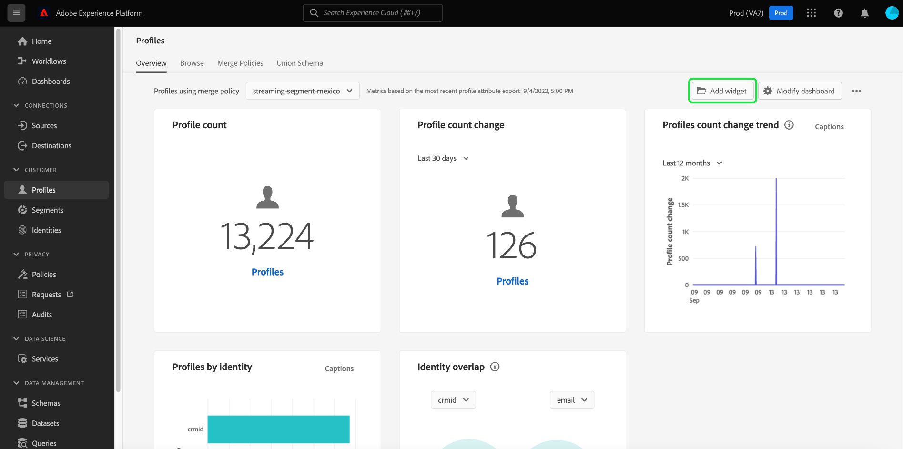

ウィジェットライブラリから、標準およびカスタムオーディエンスウィジェットの選択を参照できます。 ウィジェットの追加方法について詳しくは、[ウィジェットを追加](../customize/widget-library.md#add-widgets)する方法に関するウィジェットライブラリのドキュメントを参照してください。

### SQL を表示 {#view-sql}

ダッシュボードに表示されるインサイトを生成するSQLを、[!UICONTROL Overview] ワークスペースのトグルで表示できます。 既存のインサイトのSQLからヒントを得て、ビジネスニーズにもとづいてExperience Platformデータから独自のインサイトを導き出す新しいクエリを作成できます。 この機能について詳しくは、[SQL UIの表示ガイド ](../view-sql.md)を参照してください。

<!-- 
## (Beta) Profile efficacy insights {#profile-efficacy-insights}

>[!IMPORTANT]
>
>The profile efficacy insight functionality is currently in beta and are not available to all users. The documentation and the functionality are subject to change.

The [!UICONTROL Efficacy] tab provides metrics on the quality and completeness of your profile data through the use of profile efficacy widgets. These widgets illustrate at a glance the composition of your profiles, trends in completeness over time, and assessments on the quality of your profile data.

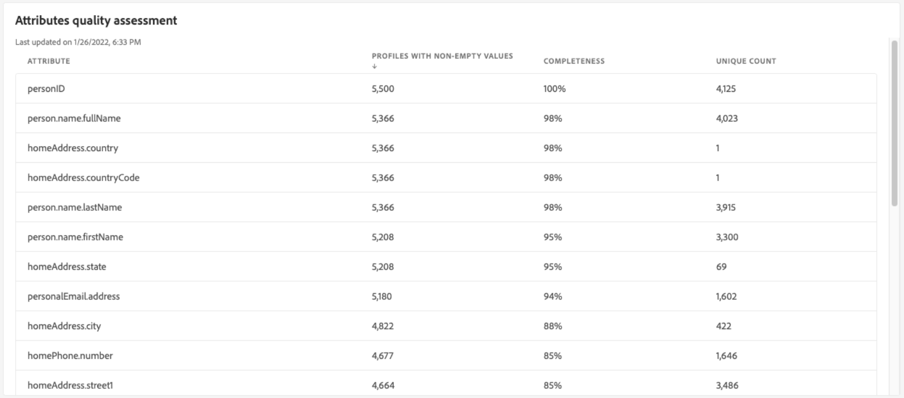

See the [profile efficacy widgets section](#profile-efficacy-widgets) for more information on the widgets currently available.

The layout of this dashboard is also customizable by selecting [**[!UICONTROL Modify dashboard]**](../customize/modify.md) from the [!UICONTROL Overview] tab. 
-->

## プロファイルの参照 {#browse-profiles}

「[!UICONTROL Browse]」タブでは、組織に取り込まれた読み取り専用プロファイルを検索して表示できます。 ここから、プロファイルの好み、過去のイベント、インタラクション、オーディエンスに関する重要な情報を確認できます。

## プロファイルの詳細 {#profile-details}

[!UICONTROL Profiles] [!UICONTROL Detail] ワークスペースを開くには、リストから[!UICONTROL Profile ID]を選択します。

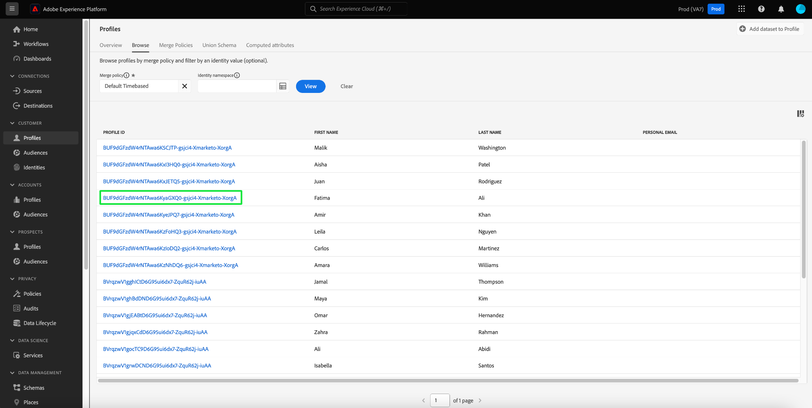

[!UICONTROL Profiles] [!UICONTROL Detail] ワークスペースには、そのプロファイルに固有の情報を伝える事前設定済みのウィジェットがいくつか表示されます。 この情報を使用すると、プロファイルの主要な属性を一目で把握できます。 独自のウィジェットを作成して、[!UICONTROL Profiles] [!UICONTROL Detail] ワークスペースをカスタマイズすることもできます。 詳しくは、[ ウィジェットの追加方法](#add-widgets)の節を参照してください。

![ 「[!UICONTROL Profiles]」タブがハイライト表示された[!UICONTROL Detail] [!UICONTROL Detail] ワークスペース。](../images/profiles/profile-details-workspace.png)

### プロファイル詳細ウィジェット {#widgets}

事前設定済みのプロファイル詳細ウィジェットは次のとおりです。

#### 顧客プロファイル {#customer-profile}

[!UICONTROL Customer profile] ウィジェットには、プロファイルに関連付けられているユーザーの姓と名、および[!UICONTROL Profile ID]が表示されます。 プロファイル IDは、ID タイプに関連付けられた自動生成されたIDで、プロファイルを表します。 ID と ID 名前空間について詳しくは、「[ID の概要](../../rtcdp/profile/identities-overview.md)」を参照してください。

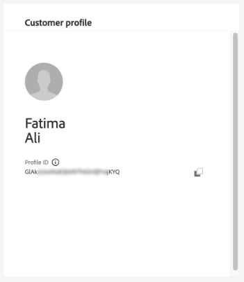

#### 基本属性 {#basic-attributes}

[!UICONTROL Basic attributes] ウィジェットには、個々のプロファイルの定義に使用される最も一般的な属性が表示されます。

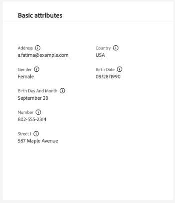

#### リンクされた ID {#linked-identities}

[!UICONTROL Linked identities] ウィジェットには、プロファイルに関連付けられたその他のIDが表示されます。

プロファイルのIDの詳細をより詳細に表示し、[!UICONTROL Identities] ワークスペースに移動するには、**[!UICONTROL View identity graph]**&#x200B;を選択します。

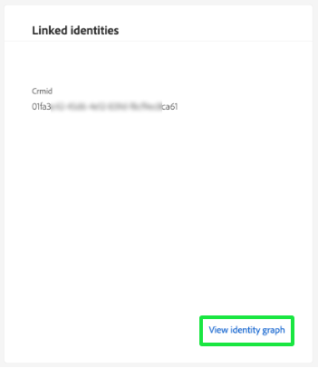

#### チャネル環境設定 {#channel-preferences}

[!UICONTROL Channel preferences] ウィジェットには、ユーザーがコミュニケーションの受信に同意したコミュニケーションのチャネルが表示されます。 チェックマークは、ユーザーが通信の受信に同意した各チャネルを示します。

<!-- image needs a blue tick added below -->

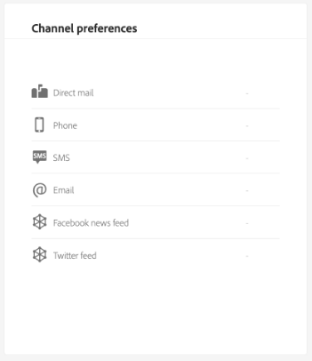

顧客の同意と連絡先の環境設定は複雑なトピックです。Experience Platformで同意とコンテキストの環境設定を収集、処理、フィルタリングする方法については、次のドキュメントを参照することをお勧めします。

* Adobe標準[に従って同意データを](../../landing/governance-privacy-security/consent/adobe/overview.md)収集するために必要なスキーマフィールドグループについて詳しくは、これらのプロファイル対応スキーマフィールドグループに関するドキュメントを参照してください。
   * [[!UICONTROL Consent and Preference Details]](../../xdm/field-groups/profile/consents.md)
   * [[!UICONTROL IdentityMap]](../../xdm/field-groups/profile/identitymap.md) （Experience Platform WebまたはMobile SDKを使用して同意シグナルを送信する場合に必要）
* Adobe標準を使用して顧客の同意と環境設定データを処理する方法については、[Experience Platformでの同意処理の概要](../../landing/governance-privacy-security/consent/adobe/overview.md)を参照してください。
* データガバナンスと同意ポリシーを組み合わせることで、同意の環境設定と確立された組織ルールにもとづいて、セグメント化するプロファイルをフィルタリングすることができます。 これらの結合ポリシーを作成して使用する方法については、[ データ使用ポリシーの管理](../../data-governance/policies/user-guide.md#combine-policies)に関するユーザーガイドを参照してください。

### ウィジェットを追加 {#add-widgets}

カスタマイズしたウィジェットを[!UICONTROL Profiles] [!UICONTROL Detail] ワークスペースに追加するには、**[!UICONTROL Customize profile details]**&#x200B;を選択します。

![[!UICONTROL Customize profile details]がハイライト表示されたプロファイル詳細ワークスペース。](../images/profiles/customize-profile-details.png)

ウィジェットのサイズ変更または再配置により、ワークスペースを編集できるようになりました。 **[!UICONTROL Add widget]**&#x200B;を選択して、カスタム属性を含むウィジェットを作成します。

![[!UICONTROL Detail]がハイライト表示されたプロファイル [!UICONTROL Add widget] ワークスペース。](../images/profiles/add-widget.png)

ウィジェットの作成者が表示されます。 [!UICONTROL Card title] テキストフィールドにウィジェットのわかりやすい名前を入力し、**[!UICONTROL Add attributes]**&#x200B;を選択します。

![[!UICONTROL Card title] フィールドと[!UICONTROL Add attributes]が強調表示されたウィジェット作成者キャンバス。](../images/profiles/widget-creator.png)

プロファイルの結合スキーマのビジュアライゼーションを含むダイアログが表示されます。 検索フィールドまたはスクロールを使用して、ウィジェットでレポートする属性を見つけます。 含める属性のチェックボックスをオンにします。 作成ワークフローを続行するには、**[!UICONTROL Select]**&#x200B;を選択してください。

>[!TIP]
>
>最上位のチェックボックスの選択には、任意の子要素が含まれます。

![ ロイヤルティ属性のチェックボックスと[!UICONTROL Select]が強調表示された結合スキーマ図。](../images/profiles/union-schema-attributes.png)

完成したウィジェットのプレビューがキャンバスに表示されます。 選択した属性に問題がなければ、**[!UICONTROL Save]**&#x200B;を選択して選択を確認し、[!UICONTROL Profiles] [!UICONTROL Detail] ワークスペースに戻ります。 新しく作成されたウィジェットがワークスペースに表示されるようになりました。

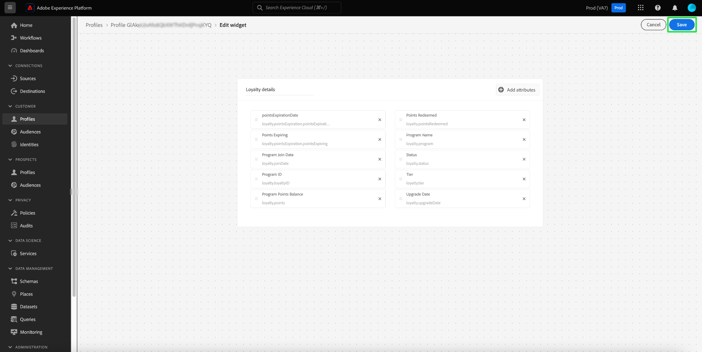

## 結合ポリシー {#merge-policies}

プロファイルダッシュボードに表示される指標は、リアルタイム顧客プロファイルデータに適用される結合ポリシーに基づいています。 複数のソースからデータを統合して顧客プロファイルを作成している場合、データに競合する値が含まれている可能性があります。例えば、あるデータセットでは顧客を「独身」としてリストしていても、別のデータセットでは同じ顧客が「既婚」としてリストされている場合があります。どのデータを優先しプロファイルの一部として表示するかを決定するのは、結合ポリシーのジョブです。

組織のデフォルトの結合ポリシーを作成、編集、宣言する方法など、結合ポリシーについて詳しくは、[結合ポリシーの概要](../../profile/merge-policies/overview.md)を参照してください。

ダッシュボードは、使用する結合ポリシーを自動的に選択します。 適用した結合ポリシーは、結合ポリシー名の横にあるドロップダウンメニューを使用して変更できます。

>[!NOTE]
>
>ドロップダウンメニューには、`_xdm.context.profile` スキーマを使用する結合ポリシーのみが表示されます。ただし、組織が複数の結合ポリシーを作成している場合は、使用可能な結合ポリシーの全リストを表示するには、スクロールが必要となることがあります。

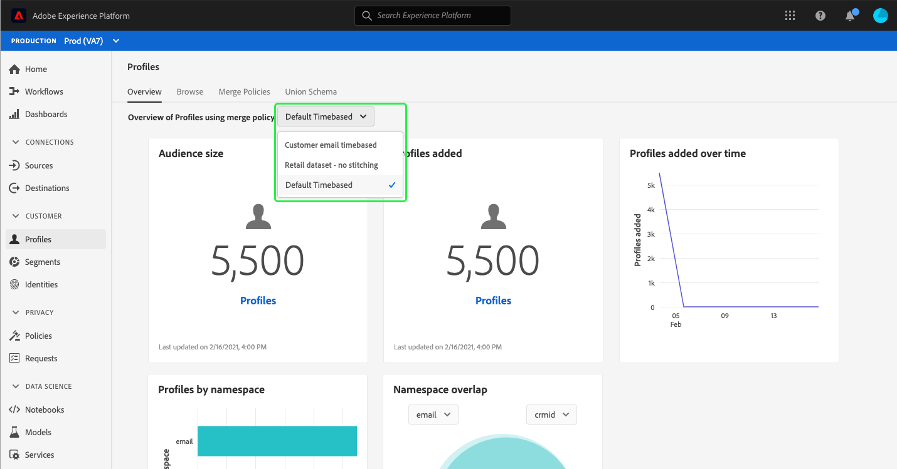

## 結合スキーマ

[!UICONTROL Union Schema] ダッシュボードには、特定のXDM クラスの結合スキーマが表示されます。 **[!UICONTROL Class]** ドロップダウンを選択すると、異なるXDM クラスの結合スキーマを表示できます。

結合スキーマは、同じクラスを共有し、プロファイルが有効になっている複数のスキーマで構成されています。これにより、同じクラスを共有する各スキーマ内に含まれているすべてのフィールドを 1 つのビューに統合して表示できます。

Experience Platform UI[内の](../../profile/ui/union-schema.md#view-union-schemas)和集合スキーマの表示について詳しくは、和集合スキーマ UI ガイドを参照してください。

## ウィジェットと指標

ダッシュボードは複数のウィジェットで構成されています。ウィジェットは読み取り専用の指標であり、プロファイルデータに関する重要な情報を提供します。

最新のスナップショットの日時は、結合ポリシードロップダウンの横にある「[!UICONTROL Overview]」タブの上部に表示されます。 すべてのウィジェットデータは、その日時の時点で正確です。 スナップショットのタイムスタンプは UTC で指定されます。個々のユーザーや組織のタイムゾーンではありません。

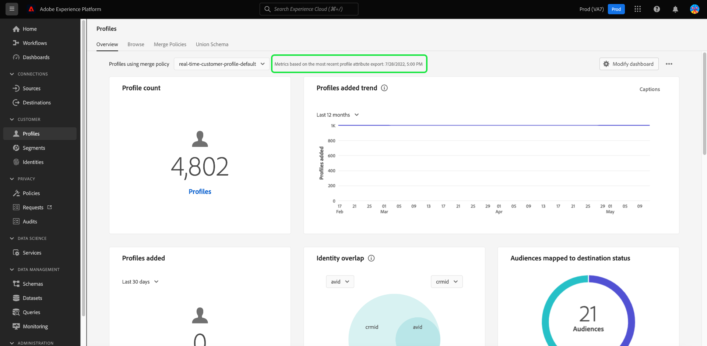

## デフォルトウィジェット {#default-widgets}

デフォルトのウィジェット読み込みアウトは、データから利用可能な最新のインサイトをハイライト表示するAdobe Experience Platformの新しいインスタンスすべてに対して提供されます。 次のウィジェットは、最初からセグメントビューで事前設定されています。 ウィジェットの目的と機能に関する詳細は、以下を参照してください。

* [[!UICONTROL Profile count]](#profile-count)
* [[!UICONTROL Profile count change]](#profile-count-change)
* [[!UICONTROL Profiles count change trend]](#profiles-count-change-trend)
* [[!UICONTROL Profiles by identity]](#profiles-by-identity)
* [[!UICONTROL Identity overlap]](#identity-overlap)

>[!NOTE]
>
>2023年7月26日の時点で、[!UICONTROL Profiles]、[!UICONTROL Audiences]および[!UICONTROL Destinations]概要ダッシュボードは、過去6か月間にビューを変更しなかったすべてのユーザーに対して、新しいデフォルトのウィジェット読み込みアウトにリセットされました。 デフォルトのウィジェットの読み込みアウトに含まれるウィジェットの詳細については、[宛先](./destinations.md#default-widgets)および[ オーディエンス ](./audiences.md#default-widgets)のデフォルトウィジェットセクションのドキュメントを参照してください。 ダッシュボードウィジェットは、以前と同様に引き続きカスタマイズできます。

## Customer AI ウィジェット {#customer-ai-profiles-widgets}

顧客 AI は、個々のプロファイルのカスタム傾向スコア（チャーンやコンバージョンなど）を大規模に生成するために使用されます。Customer AIは、既存の消費者体験イベントデータを分析して、**解約またはコンバージョン傾向スコア**&#x200B;を予測することで、これを実現します。 こうした高精度な顧客傾向モデルは、より正確なセグメンテーションとターゲティングを可能にします。 スコアの[分布](#customer-ai-distribution-of-scores)と[ スコアリングサマリー](#customer-ai-scoring-summary)のインサイトは、オーディエンスの分断を示しています。 どのプロファイルが高/低/中の傾向なのか、プロファイル数にどのように分布しているのかを強調表示します。

* [[!UICONTROL Customer AI scoring summary]](#customer-ai-scoring-summary)
* [[!UICONTROL Customer AI distribution of scores]](#customer-ai-distribution-of-scores)

### [!UICONTROL Customer AI distribution of scores] {#customer-ai-distribution-of-scores}

>[!CONTEXTUALHELP]
>id="platform_dashboards_profiles_distributionOfScores"
>title="スコアの配分"
>abstract="このウィジェットは、プロファイルの合計数の配分を傾向スコア別に 5％単位で視覚化します。プロファイル数の配分は、AI モデルと選択した結合ポリシーで決まります。AI モデルは、ウィジェットタイトルの下にあるドロップダウンメニューから変更できます。"

[!UICONTROL Customer AI distribution of scores] ウィジェットは、プロファイルの総数を傾向スコアで分類します。 プロファイル数の分布は、AI モデルと選択した結合ポリシーによって決まり、その傾向を示す5%の増分で視覚化されます。 プロファイルの数はY軸に沿って指定され、傾向スコアはX軸に沿って指定されます。

>[!NOTE]
>
>ビジュアライゼーションがコンバージョン傾向スコアの場合、高スコアは緑色で、低スコアは赤色で示されます。 チャーンの傾向を予測する場合は、これが逆となり、高いスコアは赤、低いスコアは緑で表示されます。選択した傾向タイプに関係なく、メディアバケットは黄色のままです。

傾向スコアを決定するAI モデルは、ウィジェットタイトルの下にあるドロップダウンセレクターから選択されます。 ドロップダウンには、設定されたすべてのCustomer AI モデルのリストが含まれます。 利用可能なモデルのリストから、分析に適したAI モデルを選択します。 利用可能なCustomer AI モデルがない場合、ウィジェット内のメッセージは、少なくとも1つのCustomer AI モデルの設定を指示し、Customer AI モデル設定ページへのハイパーリンクを提供します。 Customer AI インスタンスの設定方法[に関する手順については、ドキュメントを参照してください](../../intelligent-services/customer-ai/user-guide/configure.md)。

>[!NOTE]
>
>「概要」タブのすぐ下にあるドロップダウンを選択して、分析に含めるプロファイルを決定する結合ポリシーを変更します。 簡単な説明については、[結合ポリシー](#merge-policies)の節を参照してください。詳細については、[結合ポリシーの概要](../../profile/merge-policies/overview.md)を参照してください。

選択したCustomer AI モデルの詳細インサイト ページに移動するには、**[!UICONTROL View model details]**&#x200B;を選択します。

![[!UICONTROL Customer AI distribution of scores] ウィジェットと[!UICONTROL View model details]がハイライト表示されたExperience Platform Audiences ダッシュボード。](../images/segments/customer-ai-distribution-of-scores.png)

詳細なモデルインサイト ページが表示されます。

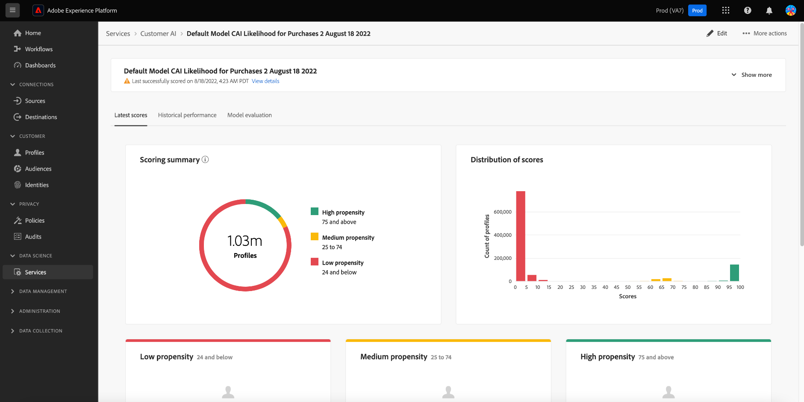

顧客AIについて詳しくは、[ インサイトを見つけるUI ガイド ](../../intelligent-services/customer-ai/user-guide/discover-insights.md)を参照してください。

### [!UICONTROL Customer AI scoring summary] {#customer-ai-scoring-summary}

>[!CONTEXTUALHELP]
>id="platform_dashboards_profiles_scoringSummary"
>title="スコア付けの概要"
>abstract="このウィジェットには、スコア付けされたプロファイルの合計数が、高、中および低の傾向を含んだバケットに分類されて表示されます。ドーナツグラフは、高、中および低の傾向別に合計プロファイル数の構成比を示します。"

このウィジェットは、スコアリングされたプロファイルの合計数を表示し、高、中、低の傾向を含むバケットにそれぞれ緑、黄、赤に分類します。 ドーナツチャートは、高、中、低の傾向のプロファイルの比例構成を示しています。 プロファイルは、75以上の傾向が高く、25から74の間の傾向が中、24未満の傾向が低い傾向に適格です。 凡例は、カラーコードと傾向のしきい値を示します。 ドーナツチャートのそれぞれのセクションにカーソルを合わせると、高、中、低の傾向のプロファイル数がダイアログに表示されます。

>[!NOTE]
>
>ビジュアライゼーションがコンバージョン傾向スコアの場合、高スコアは緑色で、低スコアは赤色で示されます。 チャーンの傾向を予測する場合は、これが逆となり、高いスコアは赤、低いスコアは緑で表示されます。選択した傾向タイプに関係なく、メディアバケットは黄色のままです。

ウィジェットタイトルの下のドロップダウンメニューには、設定されたすべてのCustomer AI モデルのリストが表示されます。 利用可能なモデルのリストから、分析に適したAI モデルを選択します。 利用可能なCustomer AI モデルがない場合、ウィジェット内のメッセージは、少なくとも1つのCustomer AI モデルの設定を指示し、Customer AI モデル設定ページへのハイパーリンクを提供します。 詳しい手順については、[Customer AI インスタンスの設定方法](../../intelligent-services/customer-ai/user-guide/configure.md)に関するドキュメントを参照してください。

>[!NOTE]
>
>計算されるプロファイルの合計数は、選択した結合ポリシーによって異なります。 使用する結合ポリシーを変更するには、「概要」タブのすぐ下にあるドロップダウンを選択します。 簡単な説明については、[結合ポリシー](#merge-policies)の節を参照してください。詳細については、[結合ポリシーの概要](../../profile/merge-policies/overview.md)を参照してください。

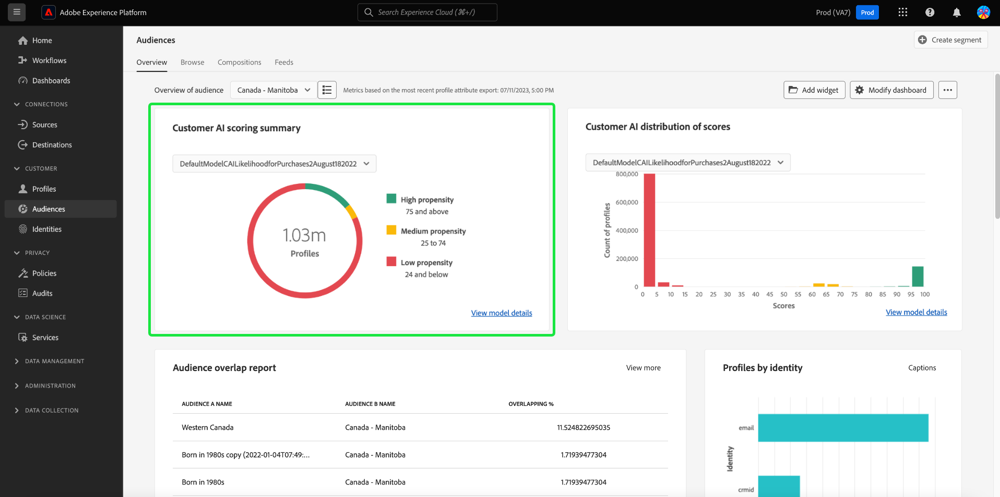

選択したCustomer AI モデルの詳細インサイト ページに移動するには、**[!UICONTROL View model details]**&#x200B;を選択します。 顧客AIについて詳しくは、[ インサイトを見つけるUI ガイド ](../../intelligent-services/customer-ai/user-guide/discover-insights.md)を参照してください。

## 標準ウィジェット {#standard-widgets}

アドビは、プロファイルデータに関連する様々な指標を視覚化するために使用できる、複数の標準ウィジェットを提供します。 [!UICONTROL Widget library]を使用して、組織と共有するカスタムウィジェットを作成することもできます。 カスタムウィジェットの作成について詳しくは、[ ウィジェットライブラリの概要](../customize/widget-library.md)を参照してください。

使用可能な各標準ウィジェットの詳細を確認するには、次のリストからウィジェットの名前を選択します。

* [[!UICONTROL Profile count]](#profile-count)
* [[!UICONTROL Profile count trend]](#profile-count-trend)
* [[!UICONTROL Profile count change]](#profile-count-change)
* [[!UICONTROL Profiles count change trend]](#profiles-count-change-trend)
* [[!UICONTROL Profiles count change trend by identity]](#profiles-count-change-trend-by-identity)
* [[!UICONTROL Profiles by identity]](#profiles-by-identity)
* [[!UICONTROL Identity overlap]](#identity-overlap)
* [[!UICONTROL Single identity profiles]](#single-identity-profiles)
* [[!UICONTROL Single identity profiles by identity]](#single-identity-profiles-by-identity)
* [[!UICONTROL Unsegmented profiles]](#unsegmented-profiles)
* [[!UICONTROL Unsegmented profiles change trend]](#unsegmented-profiles-change-trend)
* [[!UICONTROL Unsegmented profiles by identity]](#unsegmented-profiles-by-identity)
* [[!UICONTROL Audiences]](#audiences)
* [[!UICONTROL Audiences mapped to destination status]](#audiences-mapped-to-destination-status)
* [[!UICONTROL Audiences size]](#audiences-size)
* [[!UICONTROL Audience overlap by merge policy]](#audience-overlap-by-merge-policy)
* [[!UICONTROL Audience overlap report]](#audience-overlap-report)

### [!UICONTROL Profile count] {#profile-count}

>[!CONTEXTUALHELP]
>id="platform_dashboards_profiles_profilecount"
>title="プロファイル数"
>abstract="このウィジェットには、スナップショットが作成された時点でのプロファイルストア内の結合プロファイルの合計数が表示されます。この数は、選択した結合ポリシーがプロファイルデータに適用されているかどうかによって異なります。"

**[!UICONTROL Profile count]** ウィジェットには、スナップショットが取得された時点で、プロファイルストア内に統合されたプロファイルの合計数が表示されます。 この数は、プロファイルフラグメントを結合して個々のプロファイルを 1 つ形成するために、選択した結合ポリシーをプロファイルデータに適用した結果です。

詳しくは、[このドキュメント前半の結合ポリシーの節](#merge-policies)を参照してください。

>[!NOTE]
>
>[!UICONTROL Profile count] ウィジェットには、複数の理由により、UIの[!UICONTROL Browse] セクションの[!UICONTROL Profiles] タブに表示されるプロファイル数とは異なる数が表示される場合があります。 この違いの最も一般的な理由は、[!UICONTROL Browse] タブが組織のデフォルトの結合ポリシーに基づく結合プロファイルの合計数を参照するのに対し、[!UICONTROL Profile count] ウィジェットは、ダッシュボードで表示するように選択した結合ポリシーに基づく結合プロファイルの合計数を参照することです。
>
>もう1つの一般的な理由は、ダッシュボードのスナップショットを取得する時間と、[!UICONTROL Browse] タブに対してサンプルジョブを実行する時間の違いによるものです。 ウィジェットのタイムスタンプを確認すると、[!UICONTROL Profile count] ウィジェットが最後に更新された日時を確認できます。 [!UICONTROL Browse] タブでサンプルジョブがトリガーされる方法について詳しくは、リアルタイム顧客プロファイル UI ガイド [の「](../../profile/ui/user-guide.md#profile-count) プロファイル数」セクションを参照してください。

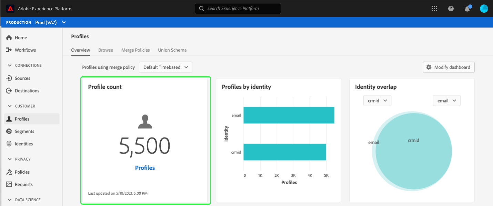

### [!UICONTROL Profile count trend] {#profile-count-trend}

[!UICONTROL Profile count trend] ウィジェットは、折れ線グラフを使用して、システムに含まれるプロファイルの合計数の傾向を経時的に示します。 この合計数には、前回の日別スナップショット以降にシステムに読み込まれたプロファイルが含まれます。 30日間、90日間、12 ヶ月間でデータを可視化できます。 期間は、ウィジェットのドロップダウンメニューから選択します。

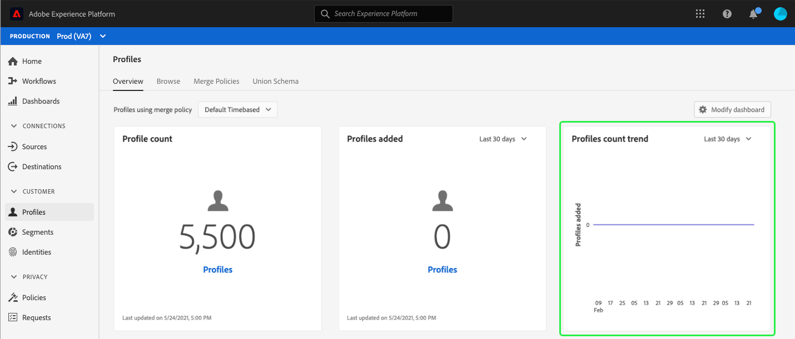

### [!UICONTROL Profile count change] {#profile-count-change}

>[!CONTEXTUALHELP]
>id="platform_dashboards_profiles_profilescountchange"
>title="プロファイル数の変更"
>abstract="このウィジェットは、最新スナップショットの時点でプロファイルストアに&#x200B;**追加された**&#x200B;結合プロファイルの合計数を表示します。この数は、選択した結合ポリシーがプロファイルデータに適用されているかどうかによって異なります。"

**[!UICONTROL Profile count change]** ウィジェットには、前回のスナップショット以降にプロファイルストアに追加された結合プロファイルの数が表示されます。 この数は、プロファイルフラグメントを結合して個々のプロファイルを 1 つ形成するために、選択した結合ポリシーをプロファイルデータに適用した結果です。ドロップダウンセレクターを使用すると、過去 30 日間、90 日間、12 か月間に追加されたプロファイルの数を表示できます。

>[!NOTE]
>
>[!UICONTROL Profile count change] ウィジェットには、最初のプロファイル取り込みとプロファイルストアの設定の&#x200B;**後に追加されたプロファイルの数が反映されます。**&#x200B;つまり、組織がプロファイルストアを設定し、1日目に4,000,000を取り込んだ場合、ダッシュボードは24時間以内に利用できますが、[!UICONTROL Profile count change] ウィジェットは0に設定されます。 このカウント方法は、プロファイルの最初のシステムへの取り込みに関連するスパイクを回避するために実行されます。 今後30日間で、組織は追加の1,000,000個のプロファイルをプロファイルストアに取り込みます。 次のスナップショットが取得された後、[!UICONTROL Profile count change] ウィジェットには合計1,000,000個のプロファイルが追加され、[!UICONTROL Profile count] ウィジェットには合計5,000,000個のプロファイルが表示されます。

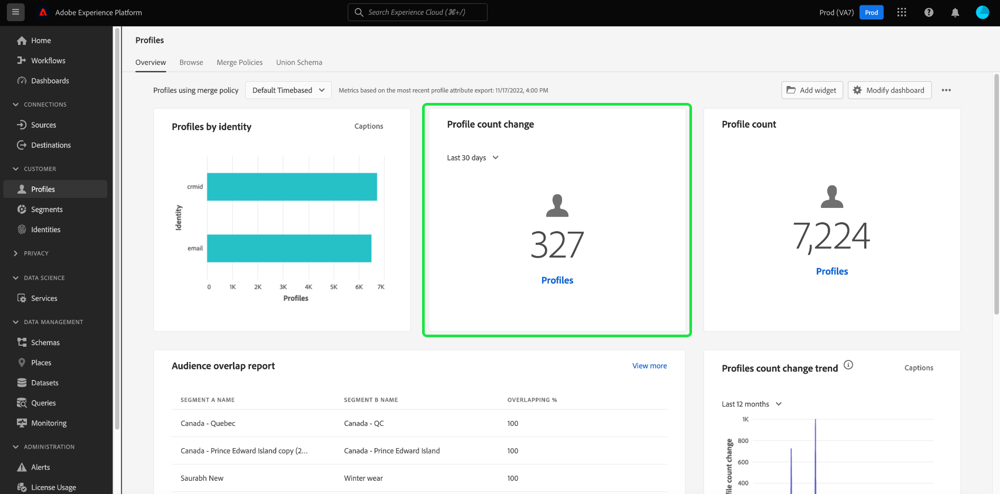

### [!UICONTROL Profiles count change trend] {#profiles-count-change-trend}

>[!CONTEXTUALHELP]
>id="platform_dashboards_profiles_profilesaddedtrend"
>title="プロファイル数の変化のトレンド"
>abstract="このウィジェットは、過去 30 日、90 日、12 か月にわたって毎日プロファイルストアに追加された結合プロファイルの数を表示します。また、この数は、選択した結合ポリシーがプロファイルデータに適用されるかどうかによって異なります。"

**[!UICONTROL Profiles count change trend]** ウィジェットには、過去30日間、90日間、または12か月間にプロファイルストアに毎日追加された結合プロファイルの合計数が表示されます。 この数値はスナップショットが取得されるたびに更新されるため、Experience Platformにプロファイルを取り込む場合、次のスナップショットが取得されるまでプロファイルの数は反映されません。 追加されたプロファイルの数は、プロファイルフラグメントを結合して個々のプロファイルを 1 つ形成するために、選択した結合ポリシーをプロファイルデータに適用した結果です。

詳しくは、このドキュメント [の前の結合ポリシーに関する](#merge-policies)節を参照してください。

**[!UICONTROL Profiles count change trend]** ウィジェットでは、ウィジェットの右上に「キャプション」ボタンが表示されます。 自動キャプション ダイアログを開くには、**[!UICONTROL Captions]**&#x200B;を選択します。

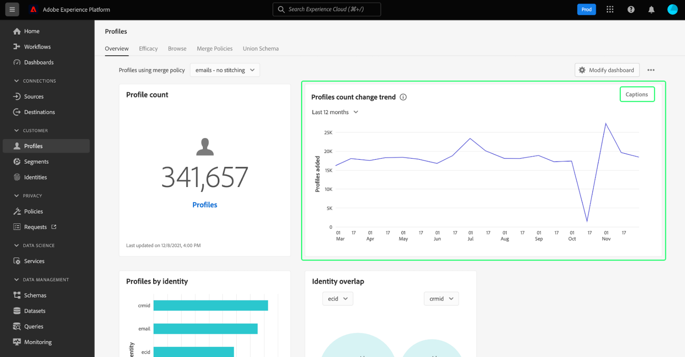

機械学習モデルは、グラフとデータを分析して、主要なトレンドと重要なイベントを記述するキャプションを自動的に生成します。キャプションに基づいてグラフに注釈を追加します。 対応する注釈にフォーカスするキャプションを選択します。

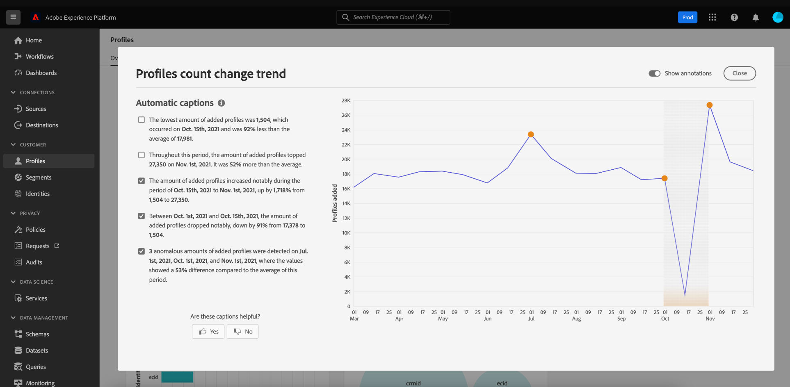

### [!UICONTROL Profiles count change trend by identity] {#profiles-count-change-trend-by-identity}

<!-- This widget uses a line graph to illustrate the change in number of profiles filtered by a chosen source identity and merge policy. -->

このウィジェットは、選択したソース IDに基づいてプロファイル数をフィルタリングし、結合ポリシーを作成してから、折れ線グラフを使用して様々な期間の数の変化を示します。 結合ポリシーは、ページの上部にある概要ドロップダウン、ソース ID、期間から選択されます。 傾向は、30日間、90日間、12か月間で視覚化できます。

このウィジェットは、必要な ID でフィルタリングされたプロファイルの成長パターンを示すことで、宛先のアクティブ化のニーズを管理するのに役立ちます。

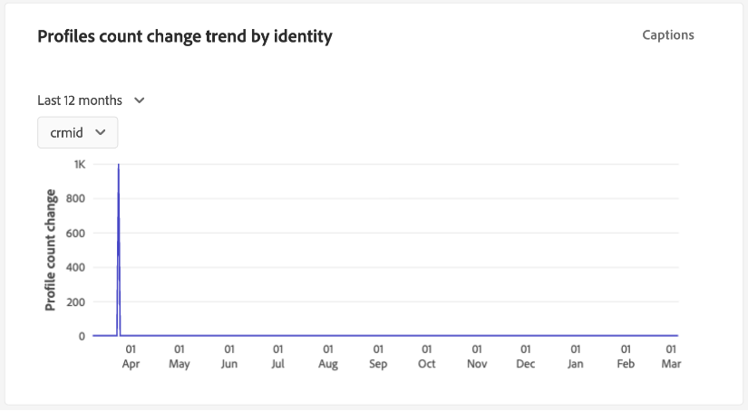

### [!UICONTROL Profiles by identity] {#profiles-by-identity}

>[!CONTEXTUALHELP]
>id="platform_dashboards_profiles_profilesbyidentity"
>title="ID 別プロファイル"
>abstract="このウィジェットは、プロファイルストアにあるすべての結合済みプロファイルの分類を ID 別に表示します。"

**[!UICONTROL Profiles by identity]** ウィジェットには、プロファイルストア内のすべての結合プロファイルのIDの内訳が表示されます。 1 つのプロファイルに複数の名前空間が関連付けられている可能性があるので、ID 別のプロファイルの合計数（各名前空間に表示される値をまとめたもの）は、結合されたプロファイルの合計数より多くなる場合があります。たとえば、顧客が複数のチャネルで企業とインタラクションする場合、個々の顧客に複数の名前空間が関連付けられます。

詳しくは、このドキュメント [の前の結合ポリシーに関する](#merge-policies)節を参照してください。

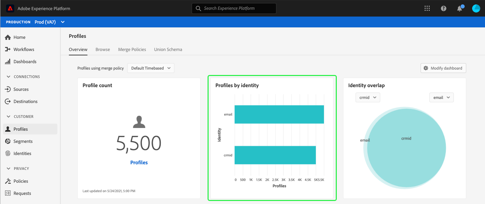

自動キャプション ダイアログを開くには、**[!UICONTROL Captions]**&#x200B;を選択します。

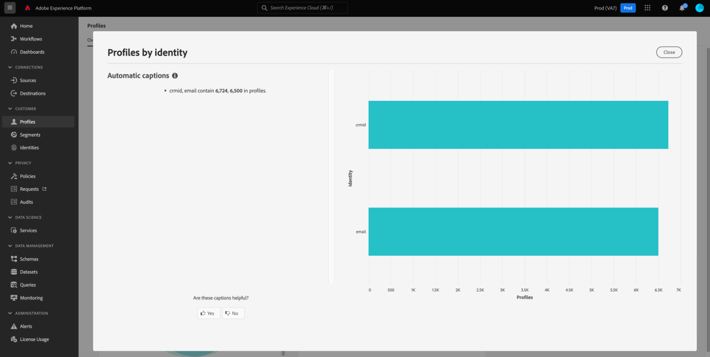

機械学習モデルは、データの全体的な分布と主要なディメンションを分析することにより、データインサイトを自動的に生成します。

IDについて詳しくは、[Adobe Experience Platform Identity Service ドキュメント ](../../identity-service/home.md)を参照してください。

### [!UICONTROL Identity overlap] {#identity-overlap}

>[!CONTEXTUALHELP]
>id="platform_dashboards_profiles_identityoverlap"
>title="ID の重複"
>abstract="このウィジェットは、ベン図を使用して、選択した 2 つの ID を含むプロファイルストア内のプロファイルの重複を表示します。"

**[!UICONTROL Identity overlap]** ウィジェットは、ベン図またはセット図を使用して、選択した2つのIDを含むプロファイルストア内のプロファイルの重複を表示します。

ウィジェットのドロップダウンメニューを使用して、比較する ID を選択します。円には、各 ID を含むプロファイルの相対合計数が表示されます。両方の ID を含むプロファイルの数は、円の重なり部分の大きさで表されます。顧客が複数のチャネルで企業とインタラクションする場合、個々の顧客に複数のIDが関連付けられます。 このような状況では、組織に複数のIDのフラグメントを含む複数のプロファイルがある可能性があります。

プロファイルフラグメントについて詳しくは、リアルタイム顧客プロファイルの概要の[ プロファイルフラグメントと結合プロファイル ](../../profile/home.md#profile-fragments-vs-merged-profiles)の節を参照してください。

IDについて詳しくは、[Adobe Experience Platform Identity Service ドキュメント ](../../identity-service/home.md)を参照してください。

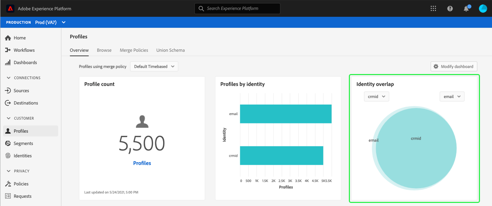

### [!UICONTROL Single identity profiles] {#single-identity-profiles}

>[!CONTEXTUALHELP]
>id="platform_dashboards_profiles_singleidentityprofiles"
>title="単一の ID プロファイル"
>abstract="このウィジェットは、ID を作成する 1 つのタイプの ID タイプのみを持つ組織のプロファイルの数を提供します。この ID タイプは、メールまたは ECID のどちらかです。"

[!UICONTROL Single Identity Profiles] ウィジェットは、IDを作成するID タイプが1つしかない組織のプロファイルの数を提供します。 この ID タイプは、メールまたは ECID のどちらかです。プロファイル数は、最新のスナップショットに含まれるデータから生成されます。

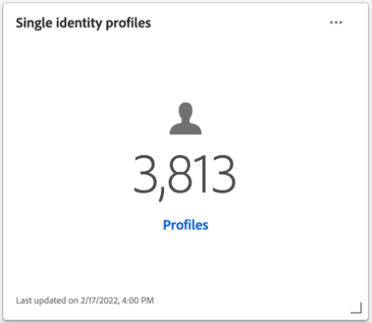

### [!UICONTROL Single identity profiles by identity] {#single-identity-profiles-by-identity}

このウィジェットは、棒グラフを使用して、単一の一意の ID のみで識別されるプロファイルの合計数を示します。このウィジェットは、最も一般的な ID を最大 5 つサポートします。

IDのプロファイルの合計数を詳細に示すダイアログを表示するには、カーソルを使用して個々のバーにカーソルを合わせます。

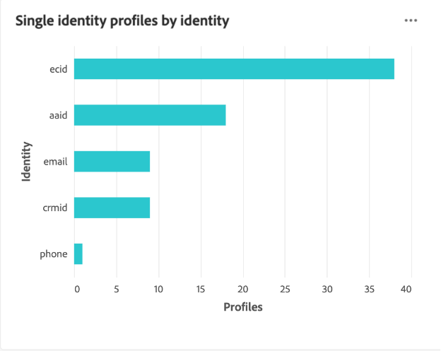

### [!UICONTROL Unsegmented profiles] {#unsegmented-profiles}

>[!CONTEXTUALHELP]
>id="platform_dashboards_profiles_unsegmentedprofiles"
>title="セグメント化されていないプロファイル"
>abstract="このウィジェットは、どのオーディエンスにも属していないすべてのプロファイルの合計数を表示します。これは、組織全体でのプロファイルのアクティブ化の機会を示します。"

[!UICONTROL Unsegmented Profiles] ウィジェットは、どのオーディエンスにもアタッチされていないすべてのプロファイルの合計数を提供します。 生成される数は、最後のスナップショット時点のもので、組織全体のプロファイルアクティブ化の機会を表しています。また、十分な ROI を提供しないプロファイルを削除する機会も示します。

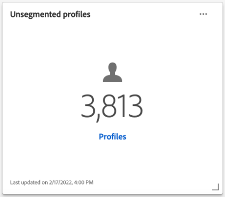

### [!UICONTROL Unsegmented profiles change trend] {#unsegmented-profiles-change-trend}

>[!CONTEXTUALHELP]
>id="platform_dashboards_profiles_unsegmentedprofilestrend"
>title="セグメント化されていないプロファイルのトレンド"
>abstract="このウィジェットは、一定期間内にどのオーディエンスにも属していないプロファイルの数を折れ線グラフで表示します。オーディエンスに属していないプロファイルのトレンドを、30 日、90 日、12 か月の期間で視覚化できます。"

[!UICONTROL Unsegmented profiles change trend] ウィジェットは、折れ線グラフを使用して、最後の1日のスナップショット以降に追加されたプロファイルの数を示します。このプロファイルは、どのオーディエンスにもアタッチされません。 どのオーディエンスにも関連付けられていないプロファイルの変化トレンドは、30日、90日、12か月間にわたって可視化できます。 期間は、ウィジェットのドロップダウンメニューから選択します。プロファイル数は y 軸、時間は x 軸に反映されます。

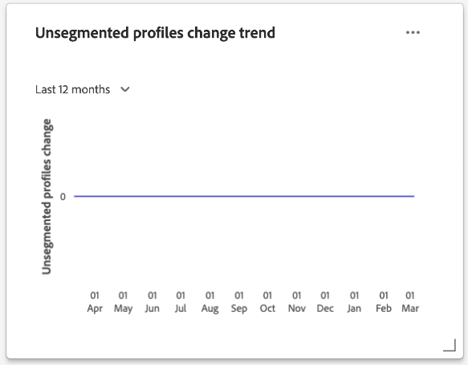

### [!UICONTROL Unsegmented profiles by identity] {#unsegmented-profiles-by-identity}

>[!NOTE]
>
>ID別セグメント化されていないプロファイル ウィジェットは、2022年10月の時点で非推奨（廃止予定）となり、使用できなくなります。

<!-- 

>[!CONTEXTUALHELP]
>id="platform_dashboards_profiles_unsegmentedprofilesbyidentity"
>title="Unsegmented profiles by identity"
>abstract="This widget categorizes the total number of unsegmented profiles by their unique identifier."

The [!UICONTROL Unsegmented Profiles by Identity] widget categorizes the total number of unsegmented profiles by their unique identifier. The data is visualized in a bar chart for ease of comparison. 

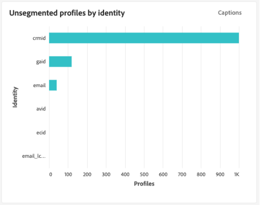 
-->

### [!UICONTROL Audiences] {#audiences}

このウィジェットは、プロファイルデータに適用された結合ポリシーに従って、アクティブ化する準備ができているオーディエンスの合計数を提供します。

**[!UICONTROL Audiences]**&#x200B;を選択して、[!UICONTROL Audiences] ダッシュボード [!UICONTROL Browse] タブに移動します。 そこから、組織のすべてのセグメント定義のリストを表示できます。

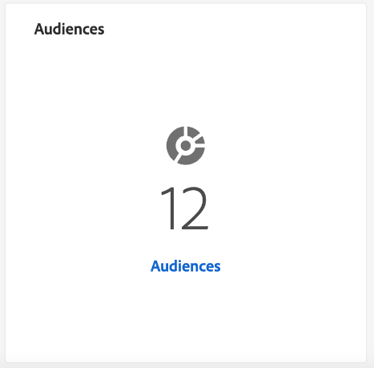

<!-- https://jira.corp.adobe.com/browse/PLAT-115291 -->

<!-- * [[!UICONTROL Audiences change trend]](#audiences-change-trend) -->
<!-- 
### [!UICONTROL Audiences change trend] {#audiences-change-trend}

This line graph widget visualizes the change in the total number of audiences each day, trending over time. The change in the number of audiences is dependent on the selected merge policy being applied to your profile data. The period of analysis is selected from the widget dropdown menu. The bar chart can be visualized over 30 days, 90 days, and 12-month periods.

The visualization allows you to monitor the overall health of audiences within Adobe Experience Platform by understanding trends in the growth or decline of the total number of audiences. 
-->

<!--  -->

### [!UICONTROL Audience overlap report] {#audience-overlap-report}

このウィジェットは、結合ポリシーでフィルタリングされたすべての利用可能なオーディエンスのデータ重複を表形式で表示します。 画面上部のドロップダウンメニューで選択した結合ポリシーに対して、重複率の高い順にランク付けされた 5 つのオーディエンスのリストが表示されます。分析された2つのオーディエンスが[!UICONTROL AUDIENCE A NAME]列と[!UICONTROL AUDIENCE B NAME]列に表示されます。 重複率は、3 番目の列の小数点以下 12 桁までの精度で表示されます。

オーディエンス重複レポートは、新しい高性能なオーディエンスを構築するのに役立ちます。 重複率が高いものを観察することで、オーディエンスを抑制し、同じオーディエンスが異なる宛先に送信されるのを防ぐことができます。また、セグメント化の改善に役立つ隠れたインサイトを特定するのにも役立ちます。重複率の低さは、追跡する固有のプロファイルを見つけるのに役立ちます。

**[!UICONTROL View more]**&#x200B;を選択して、より多くのオーディエンス重複データを含む全画面ダイアログを開きます。

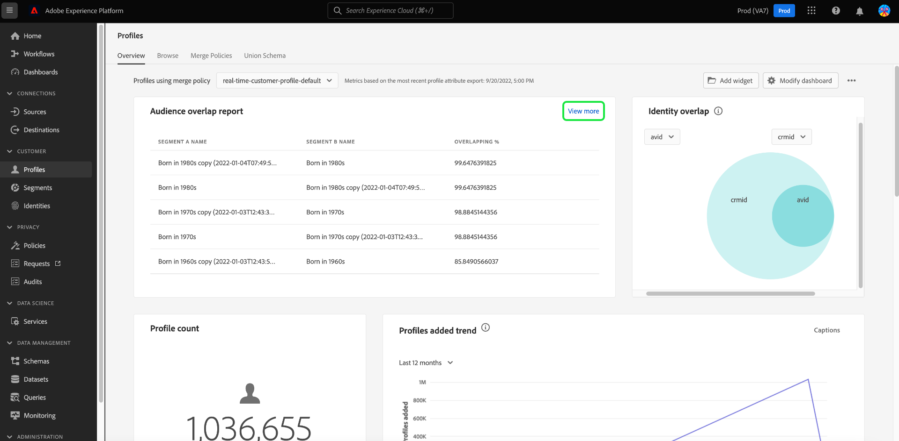

[!UICONTROL Audience overlap report] ダイアログが表示されます。 このダイアログには、最大 50 行のオーディエンスの重複分析を 6 つの列に分類して含めることができます。テーブルから列を削除または追加するには、設定アイコン（）を選択します。

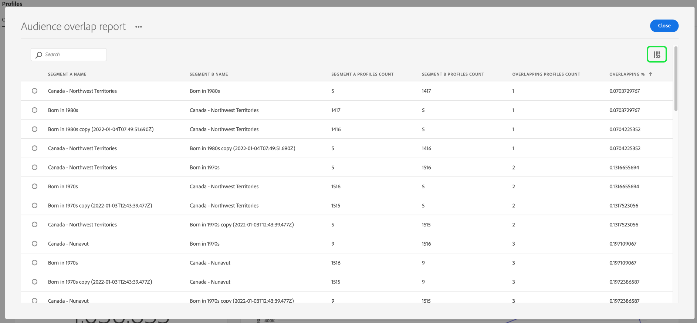

>[!NOTE]
>
>結果のランキングを最高から最低、または最低から最高に変更するには、**[!UICONTROL Overlapping]**&#x200B;列ヘッダーを選択します。

レポート全体をPDF形式でダウンロードするには、オプションメニュー（**`...`**）の後に&#x200B;**[!UICONTROL Download]**&#x200B;を選択します。

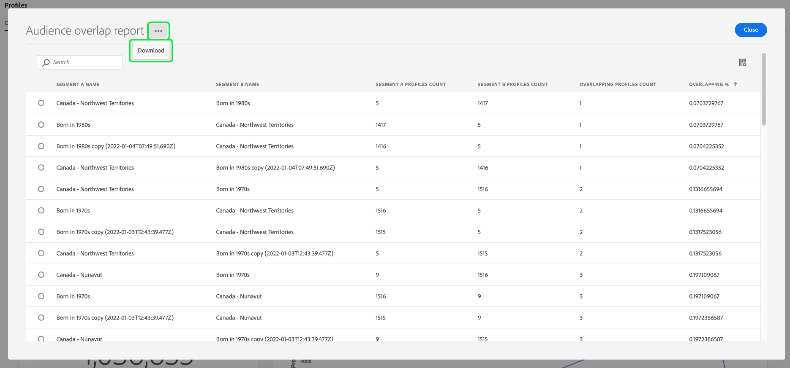

重複分析のベン図を開くには、レポートから行を選択します。 ダイアログでプロファイル数を確認するには、ベン図のセクションにカーソルを合わせます。

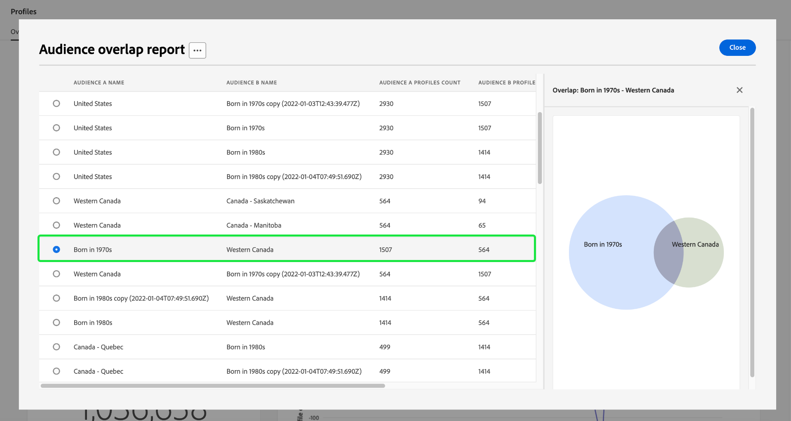

**[!UICONTROL Close]**&#x200B;を選択して[!UICONTROL Profiles] ダッシュボードに戻ります。

### [!UICONTROL Audiences mapped to destination status] {#audiences-mapped-to-destination-status}

[!UICONTROL Audiences mapped to destination status] ウィジェットは、マッピングされたオーディエンスとマッピングされていないオーディエンスの両方の合計数を1つの指標で表示し、ドーナツチャートを使用して合計の比例的な差を示します。 計算される数値は、選択した結合ポリシーによって異なります。

マッピングされたオーディエンスまたはマッピングされていないオーディエンスの個々の数は、ドーナツグラフの各セクションにカーソルを合わせると、ダイアログに表示されます。

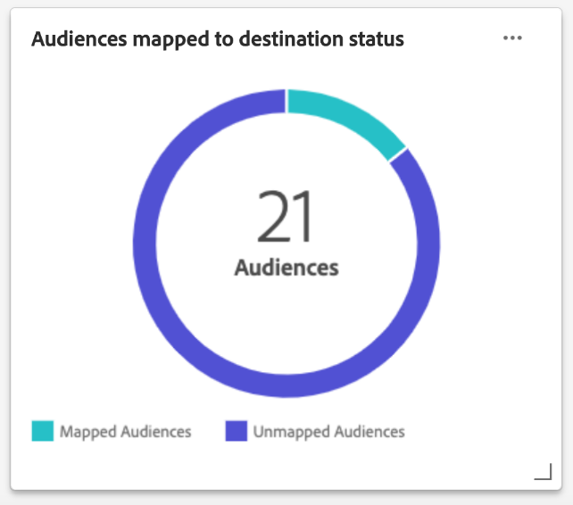

### [!UICONTROL Audiences size] {#audiences-size}

[!UICONTROL Audiences size] ウィジェットには、最大20 オーディエンスの名前と、各オーディエンスに含まれるプロファイルの合計数を一覧表示する2列のテーブルが用意されています。 リストは、オーディエンス内に含まれるプロファイルの合計数に応じて、上位から下位に並べられます。 オーディエンスサイズの合計数は、適用された結合ポリシーによって異なります。

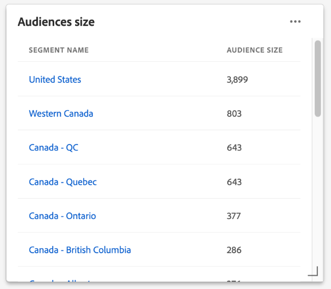

オーディエンスに関する包括的な情報を表示するには、提供されたリストからオーディエンス名を選択して、[!UICONTROL Audiences] [!UICONTROL Detail] ページに移動します。 また、ウィジェットの最後から&#x200B;**[!UICONTROL View all audiences]**&#x200B;を選択すると、[!UICONTROL Audiences] [!UICONTROL Browse] タブに移動して、既存のオーディエンスを見つけることができます。

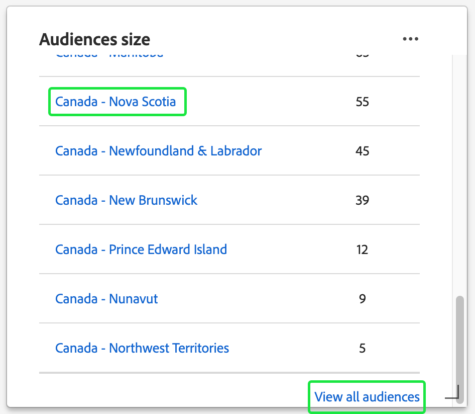

オーディエンスの詳細については、[ オーディエンスポータルのドキュメント ](../../segmentation/ui/audience-portal.md)を参照してください。

### [!UICONTROL Audience overlap by merge policy] {#audience-overlap-by-merge-policy}

このウィジェットは、ベン図を使用して、選択した2つのオーディエンスの重複を表示します。 結合ポリシーは、ページ上部の概要ドロップダウンから選択され、分析用オーディエンスはウィジェット内の2つのドロップダウンメニューから選択されます。 関連するセグメント定義に含まれるプロファイルの合計数は、円または交点の上にカーソルを置くと表示できます。

このウィジェットはセグメント定義のクロスオーバーを視覚的に表示するため、セグメント定義間の類似性を調査することで、セグメント化戦略を最適化できます。

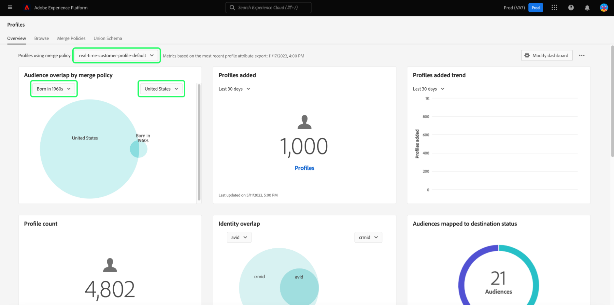

<!-- 
## (Beta) Profile efficacy widgets {#profile-efficacy-widgets}

>[!IMPORTANT]
>
>The profile efficacy widgets are currently in Beta and are not available to all users. The documentation and the functionality are subject to change.

Adobe provides multiple widgets to assess the completeness of the ingested profiles available for your data analysis. Each of the profile efficacy widgets can be filtered by the merge policy. To change the merge policy filter, select the[!UICONTROL Profiles using merge policy] dropdown and choose the appropriate policy from the available list.

To learn more about each of the profile efficacy widgets, select the name of a widget from the following list:

* [[!UICONTROL Attribute quality assessment]](#attributes-quality-assessment)
* [[!UICONTROL Profiles by completeness]](#profiles-by-completeness)
* [[!UICONTROL Profiles completeness trend]](#profiles-completeness-trend)

### (Beta) [!UICONTROL Attributes quality assessment] {#attributes-quality-assessment}

>[!CONTEXTUALHELP]
>id="platform_dashboards_profiles_attributesqualityassessment"
>title="Attributes quality assessment"
>abstract="This widget shows the completeness and cardinality of all profiles according to their attributes. Each row describes one attribute. The **Profiles** column provides the number of profiles that have this attribute and are filled with non-null values. The **Completeness** percentage is determined by the total number of profiles that have this attribute and are filled with non-null values divided by the total number of non-empty values in the profiles for that attribute. **Cardinality** provides the total number of unique non-null values of this attribute across all attributes."

The [!UICONTROL Attribute quality assessment] widget shows the completeness and cardinality of all profiles according to their attributes. The data is accurate to the last processing date. This information is presented as a table with four columns where each row in the table represents a single attribute.

| Column  | Description  |
|---|---|
| Attribute  | The name of the attribute.  |
| Profiles  | The number of profiles that have this attribute and are filled with non-null values.  |
| Completeness  | This percentage is determined by the total number of profiles that have this attribute and are filled with non-null values. The number is calculated by dividing the total number of profiles by the total number of non-empty values in the profiles for that attribute.  |
| Cardinality  | The total number of **unique** non-null values of this attribute. It is measured across all profiles. |

### (Beta) [!UICONTROL Profiles by completeness] {#profiles-by-completeness}

>[!CONTEXTUALHELP]
>id="platform_dashboards_profiles_profilesbycompleteness"
>title="Profiles by completeness"
>abstract="The donut chart displays the percentage of profile attributes that are filled with non-null values among all observed attributes. It illustrates the proportion of profiles that are of high, medium, or low completeness. High completeness profiles have more than 70% of their attributes filled. Medium completeness profiles have between 30% and 70% of their attributes filled. Low completeness profiles have less than 30% of their attributes filled."

The [!UICONTROL Profiles by completeness] widget creates a donut chart of profile completeness since the last processing date. The completeness of a profile is measured by the percentage of attributes that are filled with non-null values among all observed attributes.

This widget shows the proportion of profiles that are of high, medium, or low completeness. By default, there are three levels of completeness configured: 

* High completeness: Profiles have more than 70% of their attributes filled. 
* Medium completeness: Profiles have between 30% and 70% of their attributes filled. 
* Low completeness: Profiles have less than 30% of their attributes filled. 

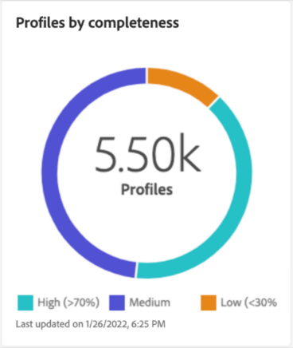

### (Beta) [!UICONTROL Profiles completeness trend] {#profiles-completeness-trend}

>[!CONTEXTUALHELP]
>id="platform_dashboards_profiles_profilescompletenesstrend"
>title="Profiles completeness trend"
>abstract="This widget creates a stacked area chart to depict the trend of profile completeness over time. Completeness is measured by the percentage of attributes that are filled with non-null values among all observed attributes."

This widget creates a stacked area chart to depict the trend of profile completeness over time. Completeness is measured by the percentage of attributes filled with non-null values among all observed attributes. It categorizes the profile completeness as high, medium, or low completeness since the last processing date.

The x-axis represents time, the y-axis represents the number of profiles, and the colors represent the three levels of profile completeness. 

The three levels of completeness are:

* High completeness: Profiles have more than 70% of attributes filled. 
* Medium completeness: Profiles have less than 70% and more than 30% of attributes filled. 
* Low completeness: Profiles have less than 30% of attributes filled.

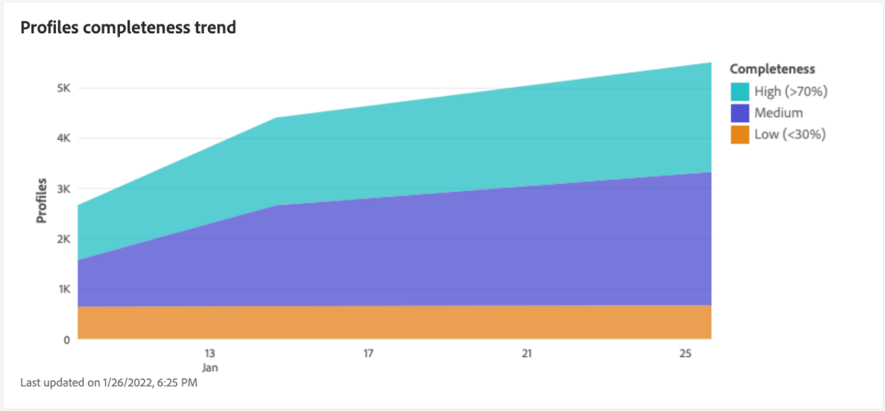 
-->

## 次の手順

このドキュメントに従うことで、プロファイルダッシュボードを見つけ、使用可能なウィジェットに表示される指標を理解できるようになりました。 Experience Platform UIでの[!DNL Profile] データの操作について詳しくは、[Real-Time Customer Profile UI ガイド ](../../profile/ui/user-guide.md)を参照してください。
