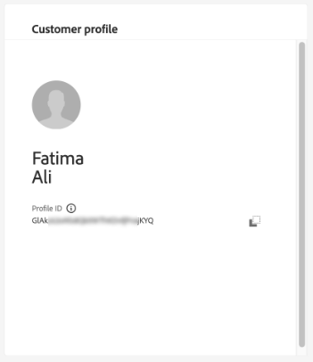
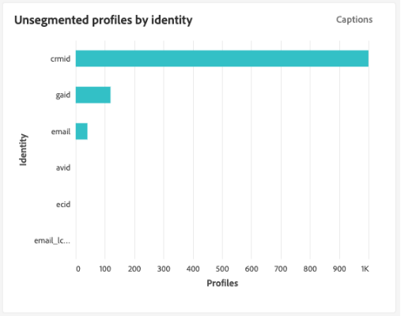
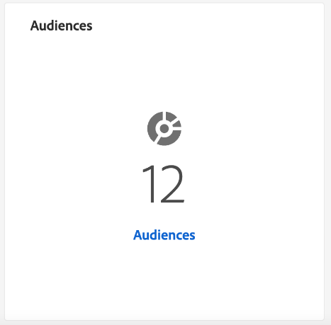
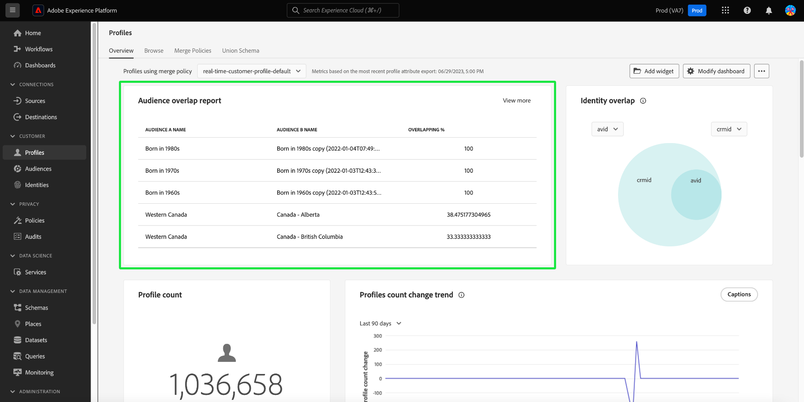
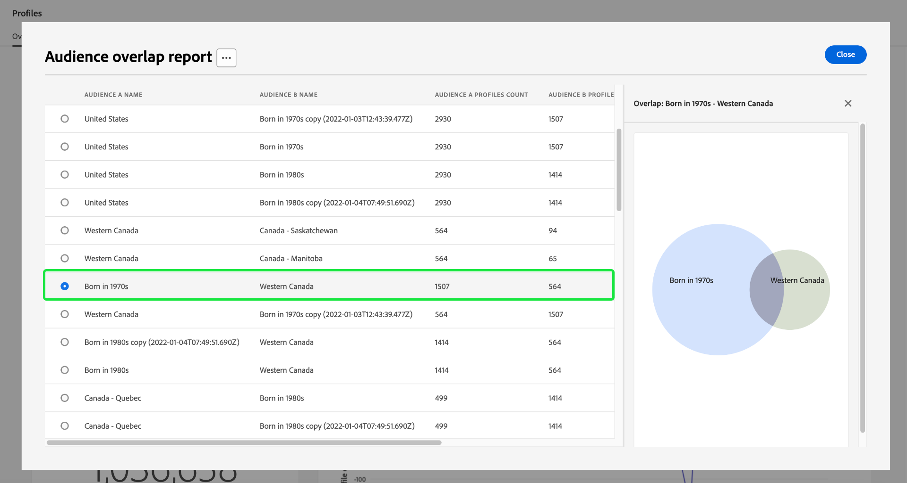

# [!UICONTROL Profiles] ダッシュボード

Adobe Experience Platform ユーザーインターフェイス（UI）には、毎日のスナップショットで取得した、[!DNL Real-Time Customer Profile] データに関する重要な情報を表示できるダッシュボードが用意されています。このガイドでは、UI でプロファイルダッシュボードにアクセスし操作する方法の概要と、ダッシュボードに表示される指標に関する情報を説明します。

Experience Platform ユーザーインターフェイス内のプロファイル機能の概要については、[&#x200B; リアルタイム顧客プロファイル UI ガイド &#x200B;](../../profile/ui/user-guide.md) を参照してください。

## プロファイルダッシュボードのデータ

プロファイルダッシュボードは、組織がExperience Platformのプロファイルストア内に持つ属性（レコード） データのスナップショットを表示します。 スナップショットには、イベント（時系列）データは含まれていません。

スナップショット内の属性データは、スナップショットが作成された特定の時点に表示されていた正確なデータを示しています。つまり、スナップショットはデータの近似やサンプルではなく、プロファイルダッシュボードがリアルタイムで更新されることもありません。

>[!NOTE]
>
>スナップショットが作成された後にデータに加えられた変更や更新は、次のスナップショットが作成されるまでダッシュボードに反映されません。

## プロファイルダッシュボードを探索 {#explore-dashboard}

Experience Platform UI 内でプロファイルダッシュボードに移動するには、左側のレールで「**[!UICONTROL Profiles]**」を選択してから「**[!UICONTROL Overview]**」タブを選択して、ダッシュボードを表示します。

>[!NOTE]
>
>Experience Platformを初めて使用する組織で、アクティブなプロファイルデータセットや結合ポリシーが作成されていない場合は、プロファイルダッシュボードは表示されません。 代わりに、「[!UICONTROL Overview]」タブに、リアルタイム顧客プロファイルを初めて使用する際に役立つリンクやドキュメントが表示されます。

### プロファイルダッシュボードの変更 {#modify-dashboard}

プロファイルダッシュボードの外観は、**[!UICONTROL Modify dashboard]** を選択して変更できます。 ダッシュボードからウィジェットの移動、追加、サイズ変更、削除を行えます。また、**[!UICONTROL Widget library]** ージにアクセスして使用可能なウィジェットを確認したり、組織に合ったカスタムウィジェットを作成したりできます。

詳しくは、[&#x200B; ダッシュボードの変更 &#x200B;](../customize/modify.md) および [&#x200B; ウィジェットライブラリの概要 &#x200B;](../customize/widget-library.md) ドキュメントを参照してください。

### ウィジェットを追加 {#add-widget}

「**[!UICONTROL Add widget]**」を選択してウィジェットライブラリに移動し、ダッシュボードに追加できるウィジェットのリストを確認します。

ウィジェットライブラリから、厳選された標準およびカスタムオーディエンスウィジェットを参照できます。 ウィジェットの追加方法について詳しくは、[ウィジェットを追加](../customize/widget-library.md#add-widgets)する方法に関するウィジェットライブラリのドキュメントを参照してください。

### SQL を表示 {#view-sql}

[!UICONTROL Overview] ワークスペースを切り替えることで、ダッシュボードで視覚化されたインサイトを生成する SQL を表示できます。 既存のインサイトの SQL からインスピレーションを得て、ビジネスニーズに基づいてExperience Platform データから独自のインサイトを導き出す新しいクエリを作成できます。 この機能について詳しくは、[SQL UI を表示ガイド &#x200B;](../view-sql.md) を参照してください。

<!-- ## (Beta) Profile efficacy insights {#profile-efficacy-insights}

>[!IMPORTANT]
>
>The profile efficacy insight functionality is currently in beta and are not available to all users. The documentation and the functionality are subject to change.

The [!UICONTROL Efficacy] tab provides metrics on the quality and completeness of your profile data through the use of profile efficacy widgets. These widgets illustrate at a glance the composition of your profiles, trends in completeness over time, and assessments on the quality of your profile data.

See the [profile efficacy widgets section](#profile-efficacy-widgets) for more information on the widgets currently available.

The layout of this dashboard is also customizable by selecting [**[!UICONTROL Modify dashboard]**](../customize/modify.md) from the [!UICONTROL Overview] tab. -->

## プロファイルの参照 {#browse-profiles}

「[!UICONTROL Browse]」タブを使用すると、組織に取り込まれた読み取り専用プロファイルを検索および表示できます。 ここから、プロファイルの環境設定、過去のイベント、インタラクションおよびオーディエンスに関する、そのプロファイルに属する重要な情報を確認できます。

## プロファイルの詳細 {#profile-details}

[!UICONTROL Profiles] [!UICONTROL Detail] ワークスペースを開くには、リストから [!UICONTROL Profile ID] を選択します。

[!UICONTROL Profiles] [!UICONTROL Detail] ワークスペースには、そのプロファイルに固有の情報を伝える事前設定済みのウィジェットがいくつか表示されます。 この情報により、プロファイルの主要な属性を一目で把握できます。 独自のウィジェットを作成して、[!UICONTROL Profiles] [!UICONTROL Detail] ワークスペースをカスタマイズすることもできます。 詳しくは、[&#x200B; ウィジェットの追加方法 &#x200B;](#add-widgets) の節を参照してください。

![&#x200B; 「[!UICONTROL Profiles]」タブがハイライト表示された [!UICONTROL Detail] [!UICONTROL Detail] ワークスペース &#x200B;](../images/profiles/profile-details-workspace.png)

### プロファイルの詳細ウィジェット {#widgets}

事前設定済みのプロファイルの詳細ウィジェットは次のとおりです。

#### 顧客プロファイル {#customer-profile}

[!UICONTROL Customer profile] ウィジェットには、プロファイルに関連付けられたユーザーの姓と名 [!UICONTROL Profile ID] が表示されます。 プロファイル ID は、ID タイプに関連付けられた自動生成された識別子で、プロファイルを表します。 ID と ID 名前空間について詳しくは、「[ID の概要](../../rtcdp/profile/identities-overview.md)」を参照してください。

#### 基本属性 {#basic-attributes}

[!UICONTROL Basic attributes] ウィジェットには、個々のプロファイルの定義に使用される、最も一般的な属性が表示されます。

#### リンクされた ID {#linked-identities}

[!UICONTROL Linked identities] ウィジェットには、プロファイルに関連付けられた他の ID が表示されます。

プロファイルの ID の詳細を表示し、[!UICONTROL Identities] ワークスペースに移動するには、「**[!UICONTROL View identity graph]**」を選択します。

#### チャネル環境設定 {#channel-preferences}

[!UICONTROL Channel preferences] ウィジェットには、ユーザーが通信の受信に同意した通信のチャネルが表示されます。 チェックマークは、ユーザーが通信の受信に同意した各チャネルを示します。

<!-- image needs a blue tick added below -->

顧客の同意と連絡先の環境設定は複雑なトピックです。Experience Platformで同意およびコンテキスト環境設定を収集、処理、フィルタリングする方法については、次のドキュメントを参照することをお勧めします。

* [Adobe標準に従って同意データを収集 &#x200B;](../../landing/governance-privacy-security/consent/adobe/overview.md) するために必要なスキーマフィールドグループについては、これらのプロファイル対応スキーマフィールドグループに関するドキュメントを参照してください。
   * [[!UICONTROL Consent and Preference Details]](../../xdm/field-groups/profile/consents.md)
   * [[!UICONTROL IdentityMap]](../../xdm/field-groups/profile/identitymap.md) （Experience Platform Web または Mobile SDKを使用して同意信号を送信する場合は必須）
* Adobe標準を使用して顧客の同意データと環境設定データを処理する方法については、[Experience Platformでの同意処理 &#x200B;](../../landing/governance-privacy-security/consent/adobe/overview.md) に関する概要を参照してください。
* データガバナンスと同意ポリシーを組み合わせて、プロファイルの同意環境設定と確立された組織ルールに基づいて、プロファイルをフィルタリングしてセグメント化できます。 これらの結合ポリシーを作成して使用する方法については、[&#x200B; データ使用ポリシーの管理 &#x200B;](../../data-governance/policies/user-guide.md#combine-policies) に関するユーザーガイドを参照してください。

### ウィジェットを追加 {#add-widgets}

カスタマイズしたウィジェットを [!UICONTROL Profiles] [!UICONTROL Detail] ワークスペースに追加するには、「**[!UICONTROL Customize profile details]**」を選択します。

![[!UICONTROL Customize profile details] がハイライト表示されたプロファイルの詳細ワークスペース。](../images/profiles/customize-profile-details.png)

ウィジェットのサイズを変更したり位置を変更したりして、ワークスペースを編集できるようになりました。 「**[!UICONTROL Add widget]**」を選択すると、カスタム属性を持つウィジェットが作成されます。

![[!UICONTROL Detail] がハイライト表示されたプロファイル [!UICONTROL Add widget] ワークスペース。](../images/profiles/add-widget.png)

ウィジェットの作成者が表示されます。 [!UICONTROL Card title] テキストフィールドにウィジェットのわかりやすい名前を入力し、「**[!UICONTROL Add attributes]**」を選択します。

![&#x200B; 「[!UICONTROL Card title]」フィールドと [!UICONTROL Add attributes] がハイライト表示されたウィジェット作成キャンバス &#x200B;](../images/profiles/widget-creator.png)

プロファイルの結合スキーマのビジュアライゼーションを含むダイアログが表示されます。 検索フィールドを使用するか、スクロールしてウィジェットでレポートする属性を見つけます。 含める属性のチェックボックスを選択します。 「**[!UICONTROL Select]**」を選択して、作成ワークフローを続行します。

>[!TIP]
>
>最上位チェックボックスの選択には、すべての子要素が含まれます。

![&#x200B; ロイヤルティ属性のチェックボックスと [!UICONTROL Select] がハイライト表示された和集合スキーマ図。](../images/profiles/union-schema-attributes.png)

完了したウィジェットのプレビューがキャンバスに表示されます。 選択した属性に満足したら、「**[!UICONTROL Save]**」を選択して選択を確定し、[!UICONTROL Profiles] [!UICONTROL Detail] ワークスペースに戻ります。 新しく作成されたウィジェットがワークスペースに表示されます。

## 結合ポリシー {#merge-policies}

プロファイルダッシュボードに表示される指標は、リアルタイム顧客プロファイルデータに適用される結合ポリシーに基づいています。 複数のソースからデータを統合して顧客プロファイルを作成している場合、データに競合する値が含まれている可能性があります。例えば、あるデータセットでは顧客を「独身」としてリストしていても、別のデータセットでは同じ顧客が「既婚」としてリストされている場合があります。どのデータを優先しプロファイルの一部として表示するかを決定するのは、結合ポリシーの役目です。

組織のデフォルトの結合ポリシーを作成、編集、宣言する方法など、結合ポリシーについて詳しくは、[結合ポリシーの概要](../../profile/merge-policies/overview.md)を参照してください。

ダッシュボードは、使用する結合ポリシーを自動的に選択します。 適用した結合ポリシーは、結合ポリシー名の横にあるドロップダウンメニューを使用して変更できます。

>[!NOTE]
>
>ドロップダウンメニューには、`_xdm.context.profile` スキーマを使用する結合ポリシーのみが表示されます。ただし、組織が複数の結合ポリシーを作成している場合は、使用可能な結合ポリシーの全リストを表示するには、スクロールが必要となることがあります。

## 結合スキーマ

[!UICONTROL Union Schema] ダッシュボードには、特定の XDM クラスの結合スキーマが表示されます。 **[!UICONTROL Class]** ドロップダウンを選択することで、様々な XDM クラスの結合スキーマを表示できます。

結合スキーマは、同じクラスを共有し、プロファイルが有効になっている複数のスキーマで構成されています。これにより、同じクラスを共有する各スキーマ内に含まれているすべてのフィールドを 1 つのビューに統合して表示できます。

[Experience Platform UI 内で結合スキーマを表示する &#x200B;](../../profile/ui/union-schema.md#view-union-schemas) について詳しくは、結合スキーマ UI ガイドを参照してください。

## ウィジェットと指標

ダッシュボードは複数のウィジェットで構成されています。ウィジェットは読み取り専用の指標であり、プロファイルデータに関する重要な情報を提供します。

最新のスナップショットの日時が、「[!UICONTROL Overview]」タブの上部にある結合ポリシードロップダウンの横に表示されます。 すべてのウィジェットデータは、その日時の時点で正確です。 スナップショットのタイムスタンプは UTC で指定されます。個々のユーザーや組織のタイムゾーンではありません。

## デフォルトウィジェット {#default-widgets}

Adobe Experience Platformのすべての新しいインスタンスに対して、データから利用可能な最新のインサイトをハイライト表示するデフォルトのウィジェットの読み込みが提供されます。 次のウィジェットは、セグメントビューで最初から事前設定されています。 ウィジェットの目的と機能の詳細については、以下を参照してください。

* [[!UICONTROL Profile count]](#profile-count)
* [[!UICONTROL Profile count change]](#profile-count-change)
* [[!UICONTROL Profiles count change trend]](#profiles-count-change-trend)
* [[!UICONTROL Profiles by identity]](#profiles-by-identity)
* [[!UICONTROL Identity overlap]](#identity-overlap)

>[!NOTE]
>
>2023 年 7 月 26 日（PT）の時点で、[!UICONTROL Profiles]、[!UICONTROL Audiences]、[!UICONTROL Destinations] の概要ダッシュボードは、過去 6 か月間にビューを変更しなかったすべてのユーザーに対して、新しいデフォルトのウィジェット読み込みにリセットされました。 デフォルトのウィジェットのロードアウトの一部として含まれるウィジェットについて詳しくは、[&#x200B; 宛先 &#x200B;](./destinations.md#default-widgets) および [&#x200B; オーディエンス &#x200B;](./audiences.md#default-widgets) デフォルトウィジェットの節のドキュメントを参照してください。 引き続き、以前と同様にダッシュボードウィジェットをカスタマイズできます。

## 顧客 AI ウィジェット {#customer-ai-profiles-widgets}

顧客 AI は、個々のプロファイルのカスタム傾向スコア（チャーンやコンバージョンなど）を大規模に生成するために使用されます。顧客 AI では、既存の消費者エクスペリエンスイベントデータを分析して **チャーンまたはコンバージョンの傾向スコア** を予測します。 これらの高精度な顧客傾向モデルにより、より正確なセグメント化とターゲティングが可能になります。 [&#x200B; スコアの分布 &#x200B;](#customer-ai-distribution-of-scores) および [&#x200B; スコアの概要 &#x200B;](#customer-ai-scoring-summary) インサイトは、オーディエンスの除算を示します。 傾向が高/低/中のプロファイルと、それらのプロファイルがプロファイル数間でどのように分配されるかをハイライトします。

* [[!UICONTROL Customer AI scoring summary]](#customer-ai-scoring-summary)
* [[!UICONTROL Customer AI distribution of scores]](#customer-ai-distribution-of-scores)

### [!UICONTROL Customer AI distribution of scores] {#customer-ai-distribution-of-scores}

>[!CONTEXTUALHELP]
>id="platform_dashboards_profiles_distributionOfScores"
>title="スコアの配分"
>abstract="このウィジェットは、プロファイルの合計数の配分を傾向スコア別に 5％単位で視覚化します。プロファイル数の配分は、AI モデルと選択した結合ポリシーで決まります。AI モデルは、ウィジェットタイトルの下にあるドロップダウンメニューから変更できます。"

[!UICONTROL Customer AI distribution of scores] ウィジェットは、プロファイルの合計数を、傾向スコアで分類します。 プロファイル数の分布は、AI モデルと選択した結合ポリシーによって決定され、その傾向を示す 5% の増分で視覚化されます。 プロファイルの数は Y 軸に沿って提供され、傾向スコアは X 軸に沿って提供されます。

>[!NOTE]
>
>ビジュアライゼーションがコンバージョンの傾向スコアの場合、高スコアは緑色で表示され、低スコアは赤色で表示されます。 チャーンの傾向を予測する場合は、これが逆となり、高いスコアは赤、低いスコアは緑で表示されます。選択した傾向タイプに関係なく、メディアバケットは黄色のままです。

傾向スコアを決定する AI モデルは、ウィジェットタイトルの下のドロップダウンセレクターから選択します。 ドロップダウンには、設定済みのすべての顧客 AI モデルのリストが含まれています。 使用可能なモデルのリストから、分析に適した AI モデルを選択します。 使用できる顧客 AI モデルがない場合は、ウィジェット内に、1 つ以上の顧客 AI モデルを設定するように指示するメッセージが表示され、顧客 AI モデル設定ページへのハイパーリンクが提供されます。 詳しくは、[&#x200B; 顧客 AI インスタンスの設定方法 &#x200B;](../../intelligent-services/customer-ai/user-guide/configure.md) のドキュメントを参照してください。

>[!NOTE]
>
>「概要」タブのすぐ下のドロップダウンを選択して、分析に含めるプロファイルを決定する結合ポリシーを変更します。 簡単な説明については [&#x200B; 結合ポリシー &#x200B;](#merge-policies) の節、詳細については [&#x200B; 結合ポリシーの概要 &#x200B;](../../profile/merge-policies/overview.md) を参照してください。

選択した顧客 AI モデルの詳細なインサイトページに移動するには、「**[!UICONTROL View model details]**」を選択します。

![[!UICONTROL Customer AI distribution of scores] ウィジェットと [!UICONTROL View model details] がハイライト表示されたExperience Platform オーディエンスダッシュボード &#x200B;](../images/segments/customer-ai-distribution-of-scores.png)

詳細なモデルインサイト ページが表示されます。

顧客 AI について詳しくは、[&#x200B; インサイトの獲得 UI ガイド &#x200B;](../../intelligent-services/customer-ai/user-guide/discover-insights.md) を参照してください。

### [!UICONTROL Customer AI scoring summary] {#customer-ai-scoring-summary}

>[!CONTEXTUALHELP]
>id="platform_dashboards_profiles_scoringSummary"
>title="スコア付けの概要"
>abstract="このウィジェットには、スコア付けされたプロファイルの合計数が、高、中および低の傾向を含んだバケットに分類されて表示されます。ドーナツグラフは、高、中および低の傾向別に合計プロファイル数の構成比を示します。"

このウィジェットは、スコアリングされたプロファイルの合計数を表示し、高、中、低の傾向を含むバケットにそれぞれ緑、黄、赤として分類します。 ドーナツグラフは、高、中、低の傾向の間のプロファイルの比例構成を示します。 プロファイルは、傾向が 75 以上で高く、傾向が 25～74 の間で中程度であり、傾向が 24 未満で低いと認定されます。 凡例は、傾向のカラーコードとしきい値を示します。 ドーナツグラフの各セクションにカーソルを合わせると、高、中、低の傾向のプロファイル数がダイアログに表示されます。

>[!NOTE]
>
>ビジュアライゼーションがコンバージョンの傾向スコアの場合、高スコアは緑色で表示され、低スコアは赤色で表示されます。 チャーンの傾向を予測する場合は、これが逆となり、高いスコアは赤、低いスコアは緑で表示されます。選択した傾向タイプに関係なく、メディアバケットは黄色のままです。

ウィジェットタイトルの下にあるドロップダウンメニューには、設定済みのすべての顧客 AI モデルのリストが表示されます。 使用可能なモデルのリストから、分析に適した AI モデルを選択します。 使用できる顧客 AI モデルがない場合は、ウィジェット内に、1 つ以上の顧客 AI モデルを設定するように指示するメッセージが表示され、顧客 AI モデル設定ページへのハイパーリンクが提供されます。 手順について詳しくは、[&#x200B; 顧客 AI インスタンスの設定方法 &#x200B;](../../intelligent-services/customer-ai/user-guide/configure.md) に関するドキュメントを参照してください。

>[!NOTE]
>
>計算されるプロファイルの合計数は、選択した結合ポリシーによって異なります。 使用する結合ポリシーを変更するには、「概要」タブのすぐ下のドロップダウンを選択します。 簡単な説明については [&#x200B; 結合ポリシー &#x200B;](#merge-policies) の節、詳細については [&#x200B; 結合ポリシーの概要 &#x200B;](../../profile/merge-policies/overview.md) を参照してください。

選択した顧客 AI モデルの詳細なインサイトページに移動するには、「**[!UICONTROL View model details]**」を選択します。 顧客 AI について詳しくは、[&#x200B; インサイトの獲得 UI ガイド &#x200B;](../../intelligent-services/customer-ai/user-guide/discover-insights.md) を参照してください。

## 標準ウィジェット {#standard-widgets}

アドビは、プロファイルデータに関連する様々な指標を視覚化するために使用できる、複数の標準ウィジェットを提供します。 [!UICONTROL Widget library] を使用して組織で共有するカスタムウィジェットを作成することもできます。 カスタムウィジェットの作成について詳しくは、まず [&#x200B; ウィジェットライブラリの概要 &#x200B;](../customize/widget-library.md) を参照してください。

使用可能な各標準ウィジェットの詳細を確認するには、次のリストからウィジェットの名前を選択します。

* [[!UICONTROL Profile count]](#profile-count)
* [[!UICONTROL Profile count trend]](#profile-count-trend)
* [[!UICONTROL Profile count change]](#profile-count-change)
* [[!UICONTROL Profiles count change trend]](#profiles-count-change-trend)
* [[!UICONTROL Profiles count change trend by identity]](#profiles-count-change-trend-by-identity)
* [[!UICONTROL Profiles by identity]](#profiles-by-identity)
* [[!UICONTROL Identity overlap]](#identity-overlap)
* [[!UICONTROL Single identity profiles]](#single-identity-profiles)
* [[!UICONTROL Single identity profiles by identity]](#single-identity-profiles-by-identity)
* [[!UICONTROL Unsegmented profiles]](#unsegmented-profiles)
* [[!UICONTROL Unsegmented profiles change trend]](#unsegmented-profiles-change-trend)
* [[!UICONTROL Unsegmented profiles by identity]](#unsegmented-profiles-by-identity)
* [[!UICONTROL Audiences]](#audiences)
* [[!UICONTROL Audiences mapped to destination status]](#audiences-mapped-to-destination-status)
* [[!UICONTROL Audiences size]](#audiences-size)
* [[!UICONTROL Audience overlap by merge policy]](#audience-overlap-by-merge-policy)
* [[!UICONTROL Audience overlap report]](#audience-overlap-report)

### [!UICONTROL Profile count] {#profile-count}

>[!CONTEXTUALHELP]
>id="platform_dashboards_profiles_profilecount"
>title="プロファイル数"
>abstract="このウィジェットには、スナップショットが作成された時点でのプロファイルストア内の結合プロファイルの合計数が表示されます。この数は、選択した結合ポリシーがプロファイルデータに適用されているかどうかによって異なります。"

**[!UICONTROL Profile count]** ウィジェットは、スナップショットが作成された時点でのプロファイルストア内の結合プロファイルの合計数を表示します。 この数は、プロファイルフラグメントを結合して個々のプロファイルを 1 つ形成するために、選択した結合ポリシーをプロファイルデータに適用した結果です。

詳しくは、[このドキュメント前半の結合ポリシーの節](#merge-policies)を参照してください。

>[!NOTE]
>
>[!UICONTROL Profile count] ウィジェットは、複数の理由により、UI の「[!UICONTROL Browse]」セクションの「[!UICONTROL Profiles]」タブに表示されるプロファイル数とは異なる数を表示する場合があります。 この違いが生じる最も一般的な理由は、「[!UICONTROL Browse]」タブが組織のデフォルトの結合ポリシーに基づいて結合されたプロファイルの合計数を参照し、[!UICONTROL Profile count] ウィジェットがダッシュボードに表示するように選択した結合ポリシーに基づいて、結合されたプロファイルの合計数を参照するためです。
>
>もう 1 つの一般的な原因は、ダッシュボードのスナップショットが作成される時間と、「[!UICONTROL Browse]」タブでサンプルジョブを実行する時間の違いによるものです。 [!UICONTROL Profile count] ウィジェットが最後に更新された時間は、ウィジェットのタイムスタンプで確認できます。 「[!UICONTROL Browse]」タブでサンプルジョブがトリガーされる方法について詳しくは、[&#x200B; リアルタイム顧客プロファイル UI ガイドのプロファイル数に関する節 &#x200B;](../../profile/ui/user-guide.md#profile-count) を参照してください。

### [!UICONTROL Profile count trend] {#profile-count-trend}

[!UICONTROL Profile count trend] ウィジェットは、折れ線グラフを使用して、システムに含まれるプロファイルの合計数のトレンドの推移を示します。 この合計数には、前回の日別スナップショット以降にシステムに読み込まれたプロファイルが含まれます。 30 日、90 日および 12 か月の期間のデータを可視化できます。 期間は、ウィジェットのドロップダウンメニューから選択します。

### [!UICONTROL Profile count change] {#profile-count-change}

>[!CONTEXTUALHELP]
>id="platform_dashboards_profiles_profilescountchange"
>title="プロファイル数の変更"
>abstract="このウィジェットは、最新スナップショットの時点でプロファイルストアに&#x200B;**追加された**&#x200B;結合プロファイルの合計数を表示します。この数は、選択した結合ポリシーがプロファイルデータに適用されているかどうかによって異なります。"

**[!UICONTROL Profile count change]** ウィジェットには、前回のスナップショット以降にプロファイルストアに追加された結合プロファイルの数が表示されます。 この数は、プロファイルフラグメントを結合して個々のプロファイルを 1 つ形成するために、選択した結合ポリシーをプロファイルデータに適用した結果です。ドロップダウンセレクターを使用すると、過去 30 日間、90 日間、12 か月間に追加されたプロファイルの数を表示できます。

>[!NOTE]
>
>[!UICONTROL Profile count change] ウィジェットは、最初のプロファイルの取り込みとプロファイルストア設定の後 **追加されたプロファイル数を反映します** つまり、組織がプロファイルストアを設定し、1 日目に 4,000,000 個を取り込んだ場合、24 時間以内にダッシュボードは使用可能になりますが、[!UICONTROL Profile count change] ウィジェットは 0 に設定されます。 このカウント方法は、プロファイルのシステムへの最初の取り込みに関連するスパイクを回避するために行われます。 次の 30 日間で、組織はさらに 1,000,000 個のプロファイルをプロファイルストアに取り込みます。 次のスナップショットが作成されると、[!UICONTROL Profile count change] ウィジェットには合計 1,000,000 個のプロファイルが追加表示され、[!UICONTROL Profile count] ウィジェットには合計 5,000,000 個のプロファイルが表示されます。

### [!UICONTROL Profiles count change trend] {#profiles-count-change-trend}

>[!CONTEXTUALHELP]
>id="platform_dashboards_profiles_profilesaddedtrend"
>title="プロファイル数の変化のトレンド"
>abstract="このウィジェットは、過去 30 日、90 日、12 か月にわたって毎日プロファイルストアに追加された結合プロファイルの数を表示します。また、この数は、選択した結合ポリシーがプロファイルデータに適用されるかどうかによって異なります。"

**[!UICONTROL Profiles count change trend]** ウィジェットには、過去 30 日、90 日、12 か月にわたって毎日プロファイルストアに追加された結合プロファイルの合計数が表示されます。 この数はスナップショットが作成されるたびに更新されるので、プロファイルをExperience Platformに取り込む場合、次のスナップショットが作成されるまでプロファイルの数は反映されません。 追加されたプロファイルの数は、プロファイルフラグメントを結合して個々のプロファイルを 1 つ形成するために、選択した結合ポリシーをプロファイルデータに適用した結果です。

詳しくは、[&#x200B; このドキュメントの前の結合ポリシーに関する節 &#x200B;](#merge-policies) を参照してください。

**[!UICONTROL Profiles count change trend]** ウィジェットは、ウィジェットの右上に「キャプション」ボタンを表示します。 自動キャプションダイアログを開くには、「**[!UICONTROL Captions]**」を選択します。

機械学習モデルは、グラフとデータを分析して、主要なトレンドと重要なイベントを記述するキャプションを自動的に生成します。キャプションに基づいてグラフに注釈を追加します。 対応する注釈にフォーカスするキャプションを選択します。

### [!UICONTROL Profiles count change trend by identity] {#profiles-count-change-trend-by-identity}

<!-- This widget uses a line graph to illustrate the change in number of profiles filtered by a chosen source identity and merge policy. -->

このウィジェットは、選択したソース ID に基づいてプロファイル数をフィルタリングし、ポリシーを結合してから、折れ線グラフを使用して様々な期間の数の変化を示します。 ページ上部の概要ドロップダウンから結合ポリシーを選択し、ウィジェットのドロップダウンメニューからソース ID および期間を選択します。 30 日、90 日および 12 か月の期間のトレンドを可視化できます。

このウィジェットは、必要な ID でフィルタリングされたプロファイルの成長パターンを示すことで、宛先のアクティブ化のニーズを管理するのに役立ちます。

### [!UICONTROL Profiles by identity] {#profiles-by-identity}

>[!CONTEXTUALHELP]
>id="platform_dashboards_profiles_profilesbyidentity"
>title="ID 別プロファイル"
>abstract="このウィジェットは、プロファイルストアにあるすべての結合済みプロファイルの分類を ID 別に表示します。"

**[!UICONTROL Profiles by identity]** ウィジェットは、プロファイルストアにあるすべての結合済みプロファイルで ID の分類を表示します。 1 つのプロファイルに複数の名前空間が関連付けられている可能性があるので、ID 別のプロファイルの合計数（各名前空間に表示される値をまとめたもの）は、結合されたプロファイルの合計数より多くなる場合があります。例えば、顧客が複数のチャネルでブランドとやり取りする場合、複数の名前空間がその個々の顧客に関連付けられます。

詳しくは、[&#x200B; このドキュメントの前の結合ポリシーに関する節 &#x200B;](#merge-policies) を参照してください。

自動キャプションダイアログを開くには、「**[!UICONTROL Captions]**」を選択します。

機械学習モデルは、データの全体的な分布と主要なディメンションを分析することにより、データインサイトを自動的に生成します。

ID について詳しくは、[Adobe Experience Platform ID サービスドキュメント &#x200B;](../../identity-service/home.md) を参照してください。

### [!UICONTROL Identity overlap] {#identity-overlap}

>[!CONTEXTUALHELP]
>id="platform_dashboards_profiles_identityoverlap"
>title="ID の重複"
>abstract="このウィジェットは、ベン図を使用して、選択した 2 つの ID を含むプロファイルストア内のプロファイルの重複を表示します。"

**[!UICONTROL Identity overlap]** ウィジェットは、ベン図（セット図）を使用して、選択した 2 つの ID を含むプロファイルストア内のプロファイルの重複を表示します。

ウィジェットのドロップダウンメニューを使用して、比較する ID を選択します。円には、各 ID を含むプロファイルの相対合計数が表示されます。両方の ID を含むプロファイルの数は、円の重なり部分の大きさで表されます。顧客が複数のチャネルでブランドとやり取りする場合、複数の ID がその個々の顧客に関連付けられます。 このような場合、組織には、複数の ID からのフラグメントを含む複数のプロファイルがある可能性があります。

プロファイルフラグメントについて詳しくは、リアルタイム顧客プロファイルの概要の [&#x200B; プロファイルフラグメントと結合プロファイル &#x200B;](../../profile/home.md#profile-fragments-vs-merged-profiles) の節を参照してください。

ID について詳しくは、[Adobe Experience Platform ID サービスドキュメント &#x200B;](../../identity-service/home.md) を参照してください。

### [!UICONTROL Single identity profiles] {#single-identity-profiles}

>[!CONTEXTUALHELP]
>id="platform_dashboards_profiles_singleidentityprofiles"
>title="単一の ID プロファイル"
>abstract="このウィジェットは、ID を作成する 1 つのタイプの ID タイプのみを持つ組織のプロファイルの数を提供します。この ID タイプは、メールまたは ECID のどちらかです。"

[!UICONTROL Single Identity Profiles] ウィジェットは、ID を作成する 1 つのタイプの ID タイプのみを持つ組織のプロファイルの数を提供します。 この ID タイプは、メールまたは ECID のどちらかです。プロファイル数は、最新のスナップショットに含まれるデータから生成されます。

### [!UICONTROL Single identity profiles by identity] {#single-identity-profiles-by-identity}

このウィジェットは、棒グラフを使用して、単一の一意の ID のみで識別されるプロファイルの合計数を示します。このウィジェットは、最も一般的な ID を最大 5 つサポートします。

ID に関するプロファイルの合計数の詳細を示すダイアログを表示するには、カーソルを使用して個々のバーにポインタを合わせます。

### [!UICONTROL Unsegmented profiles] {#unsegmented-profiles}

>[!CONTEXTUALHELP]
>id="platform_dashboards_profiles_unsegmentedprofiles"
>title="セグメント化されていないプロファイル"
>abstract="このウィジェットは、どのオーディエンスにも属していないすべてのプロファイルの合計数を表示します。これは、組織全体でのプロファイルのアクティブ化の機会を示します。"

[!UICONTROL Unsegmented Profiles] ウィジェットには、オーディエンスに関連付けられていないプロファイルの合計数が表示されます。 生成される数は、最後のスナップショット時点のもので、組織全体のプロファイルアクティブ化の機会を表しています。また、十分な ROI を提供しないプロファイルを削除する機会も示します。

### [!UICONTROL Unsegmented profiles change trend] {#unsegmented-profiles-change-trend}

>[!CONTEXTUALHELP]
>id="platform_dashboards_profiles_unsegmentedprofilestrend"
>title="セグメント化されていないプロファイルのトレンド"
>abstract="このウィジェットは、一定期間内にどのオーディエンスにも属していないプロファイルの数を折れ線グラフで表示します。オーディエンスに属していないプロファイルのトレンドを、30 日、90 日、12 か月の期間で視覚化できます。"

[!UICONTROL Unsegmented profiles change trend] ウィジェットは、折れ線グラフを使用して、オーディエンスに関連付けられていない前回の日別スナップショット以降に追加されたプロファイルの数を示します。 どのオーディエンスにも属していないプロファイルの変化のトレンドを、30 日、90 日、12 か月の期間で視覚化できます。 期間は、ウィジェットのドロップダウンメニューから選択します。プロファイル数は y 軸、時間は x 軸に反映されます。

### [!UICONTROL Unsegmented profiles by identity] {#unsegmented-profiles-by-identity}

>[!NOTE]
>
>セグメント化されていないプロファイル（ID 別）ウィジェットは 2022 年 10 月から非推奨（廃止予定）となり、使用できなくなりました。

<!-- 

>[!CONTEXTUALHELP]
>id="platform_dashboards_profiles_unsegmentedprofilesbyidentity"
>title="Unsegmented profiles by identity"
>abstract="This widget categorizes the total number of unsegmented profiles by their unique identifier."

The [!UICONTROL Unsegmented Profiles by Identity] widget categorizes the total number of unsegmented profiles by their unique identifier. The data is visualized in a bar chart for ease of comparison. 

 -->

### [!UICONTROL Audiences] {#audiences}

このウィジェットは、プロファイルデータに適用された選択した結合ポリシーに従って、アクティブ化する準備が整ったオーディエンスの合計数を提供します。

「**[!UICONTROL Audiences]**」を選択すると、[!UICONTROL Audiences] ダッシュボードの「[!UICONTROL Browse]」タブに移動します。 ここから、組織のすべてのセグメント定義のリストが表示されます。

<!-- https://jira.corp.adobe.com/browse/PLAT-115291 -->

<!-- * [[!UICONTROL Audiences change trend]](#audiences-change-trend) -->
<!-- ### [!UICONTROL Audiences change trend] {#audiences-change-trend}

This line graph widget visualizes the change in the total number of audiences each day, trending over time. The change in the number of audiences is dependent on the selected merge policy being applied to your profile data. The period of analysis is selected from the widget dropdown menu. The bar chart can be visualized over 30 days, 90 days, and 12-month periods.

The visualization allows you to monitor the overall health of audiences within Adobe Experience Platform by understanding trends in the growth or decline of the total number of audiences. -->

<!--  -->

### [!UICONTROL Audience overlap report] {#audience-overlap-report}

このウィジェットは、結合ポリシーでフィルタリングされたすべての使用可能なオーディエンスからのデータの重複を表にします。 画面上部のドロップダウンメニューで選択した結合ポリシーに対して、重複率の高い順にランク付けされた 5 つのオーディエンスのリストが表示されます。分析された 2 つのオーディエンスが、[!UICONTROL AUDIENCE A NAME] 列および [!UICONTROL AUDIENCE B NAME] 列で一覧表示されます。 重複率は、3 番目の列の小数点以下 12 桁までの精度で表示されます。

オーディエンスの重複レポートは、新しい高パフォーマンスのオーディエンスを作成するのに役立ちます。 重複率が高いものを観察することで、オーディエンスを抑制し、同じオーディエンスが異なる宛先に送信されるのを防ぐことができます。また、セグメント化の改善に役立つ隠れたインサイトを特定するのにも役立ちます。重複率の低さは、追跡する固有のプロファイルを見つけるのに役立ちます。

「**[!UICONTROL View more]**」を選択すると、フルスクリーンダイアログが開き、さらに多くのオーディエンスの重複データが表示されます。

[!UICONTROL Audience overlap report] ダイアログが表示されます。 このダイアログには、最大 50 行のオーディエンスの重複分析を 6 つの列に分類して含めることができます。テーブルから列を削除または追加するには、設定アイコン（）を選択します。

>[!NOTE]
>
>結果のランキングを高い順または低い順に変更するには、**[!UICONTROL Overlapping]** の列ヘッダーを選択します。

レポート全体をPDF形式でダウンロードするには、オプションメニュー（**`...`**）に続いて「**[!UICONTROL Download]**」を選択します。

重複分析のベン図を開くには、レポートから行を選択します。 ダイアログでプロファイル数を表示するには、ベン図のセクションにポインタを合わせます。

「**[!UICONTROL Close]**」を選択すると、[!UICONTROL Profiles] ダッシュボードに戻ります。

### [!UICONTROL Audiences mapped to destination status] {#audiences-mapped-to-destination-status}

[!UICONTROL Audiences mapped to destination status] ウィジェットは、マッピングされたオーディエンスとマッピングされていないオーディエンスの両方の合計数を単一の指標で表示し、ドーナツグラフを使用してそれぞれの合計の割合の違いを示します。 計算される数値は、選択した結合ポリシーによって異なります。

マッピングされたオーディエンスまたはマッピングされていないオーディエンスの個々の数は、ドーナツグラフの各セクションにカーソルを合わせると、ダイアログに表示されます。

### [!UICONTROL Audiences size] {#audiences-size}

[!UICONTROL Audiences size] ウィジェットは、最大 20 個のオーディエンスの名前と各オーディエンスに含まれるプロファイルの合計数をリストする 2 列の表を提供します。 リストは、オーディエンス内に含まれるプロファイルの合計数に応じて、多い順に並べられます。 合計オーディエンスサイズのカウントは、適用される結合ポリシーによって異なります。

オーディエンスに関する包括的な情報を確認するには、表示されたリストからオーディエンス名を選択して、[!UICONTROL Audiences] [!UICONTROL Detail] ページに移動します。 また、ウィジェットの最後から **[!UICONTROL View all audiences]** を選択すると、「[!UICONTROL Audiences] [!UICONTROL Browse]」タブに移動して、既存のオーディエンスを検索できます。

オーディエンスの詳細については、[&#x200B; オーディエンスポータルドキュメント &#x200B;](../../segmentation/ui/audience-portal.md) を参照してください。

### [!UICONTROL Audience overlap by merge policy] {#audience-overlap-by-merge-policy}

このウィジェットは、ベン図を使用して、選択した 2 つのオーディエンスの重複を表示します。 結合ポリシーはページ上部の概要ドロップダウンから選択され、分析対象のオーディエンスはウィジェット内の 2 つのドロップダウンメニューから選択されます。 関連するセグメント定義内に含まれるプロファイルの合計数は、円または積集合の上にマウスポインターを置くと確認できます。

このウィジェットはセグメント定義のクロスオーバーを視覚的に表示するため、セグメント定義間の類似性を調査することで、セグメント化戦略を最適化できます。

<!-- ## (Beta) Profile efficacy widgets {#profile-efficacy-widgets}

>[!IMPORTANT]
>
>The profile efficacy widgets are currently in Beta and are not available to all users. The documentation and the functionality are subject to change.

Adobe provides multiple widgets to assess the completeness of the ingested profiles available for your data analysis. Each of the profile efficacy widgets can be filtered by the merge policy. To change the merge policy filter, select the[!UICONTROL Profiles using merge policy] dropdown and choose the appropriate policy from the available list.

To learn more about each of the profile efficacy widgets, select the name of a widget from the following list:

* [[!UICONTROL Attribute quality assessment]](#attributes-quality-assessment)
* [[!UICONTROL Profiles by completeness]](#profiles-by-completeness)
* [[!UICONTROL Profiles completeness trend]](#profiles-completeness-trend)

### (Beta) [!UICONTROL Attributes quality assessment] {#attributes-quality-assessment}

>[!CONTEXTUALHELP]
>id="platform_dashboards_profiles_attributesqualityassessment"
>title="Attributes quality assessment"
>abstract="This widget shows the completeness and cardinality of all profiles according to their attributes. Each row describes one attribute. The **Profiles** column provides the number of profiles that have this attribute and are filled with non-null values. The **Completeness** percentage is determined by the total number of profiles that have this attribute and are filled with non-null values divided by the total number of non-empty values in the profiles for that attribute. **Cardinality** provides the total number of unique non-null values of this attribute across all attributes."

The [!UICONTROL Attribute quality assessment] widget shows the completeness and cardinality of all profiles according to their attributes. The data is accurate to the last processing date. This information is presented as a table with four columns where each row in the table represents a single attribute.

| Column  | Description  |
|---|---|
| Attribute  | The name of the attribute.  |
| Profiles  | The number of profiles that have this attribute and are filled with non-null values.  |
| Completeness  | This percentage is determined by the total number of profiles that have this attribute and are filled with non-null values. The number is calculated by dividing the total number of profiles by the total number of non-empty values in the profiles for that attribute.  |
| Cardinality  | The total number of **unique** non-null values of this attribute. It is measured across all profiles. |

### (Beta) [!UICONTROL Profiles by completeness] {#profiles-by-completeness}

>[!CONTEXTUALHELP]
>id="platform_dashboards_profiles_profilesbycompleteness"
>title="Profiles by completeness"
>abstract="The donut chart displays the percentage of profile attributes that are filled with non-null values among all observed attributes. It illustrates the proportion of profiles that are of high, medium, or low completeness. High completeness profiles have more than 70% of their attributes filled. Medium completeness profiles have between 30% and 70% of their attributes filled. Low completeness profiles have less than 30% of their attributes filled."

The [!UICONTROL Profiles by completeness] widget creates a donut chart of profile completeness since the last processing date. The completeness of a profile is measured by the percentage of attributes that are filled with non-null values among all observed attributes.

This widget shows the proportion of profiles that are of high, medium, or low completeness. By default, there are three levels of completeness configured: 

* High completeness: Profiles have more than 70% of their attributes filled. 
* Medium completeness: Profiles have between 30% and 70% of their attributes filled. 
* Low completeness: Profiles have less than 30% of their attributes filled. 

### (Beta) [!UICONTROL Profiles completeness trend] {#profiles-completeness-trend}

>[!CONTEXTUALHELP]
>id="platform_dashboards_profiles_profilescompletenesstrend"
>title="Profiles completeness trend"
>abstract="This widget creates a stacked area chart to depict the trend of profile completeness over time. Completeness is measured by the percentage of attributes that are filled with non-null values among all observed attributes."

This widget creates a stacked area chart to depict the trend of profile completeness over time. Completeness is measured by the percentage of attributes filled with non-null values among all observed attributes. It categorizes the profile completeness as high, medium, or low completeness since the last processing date.

The x-axis represents time, the y-axis represents the number of profiles, and the colors represent the three levels of profile completeness. 

The three levels of completeness are:

* High completeness: Profiles have more than 70% of attributes filled. 
* Medium completeness: Profiles have less than 70% and more than 30% of attributes filled. 
* Low completeness: Profiles have less than 30% of attributes filled.

 -->

## 次の手順

このドキュメントを通して、プロファイルダッシュボードを見つけ、使用可能なウィジェットに表示される指標を理解できるようになりました。 Experience Platform UI で [!DNL Profile] データの使用に関する詳細を学ぶには、[&#x200B; リアルタイム顧客プロファイル UI ガイド &#x200B;](../../profile/ui/user-guide.md) を参照してください。
