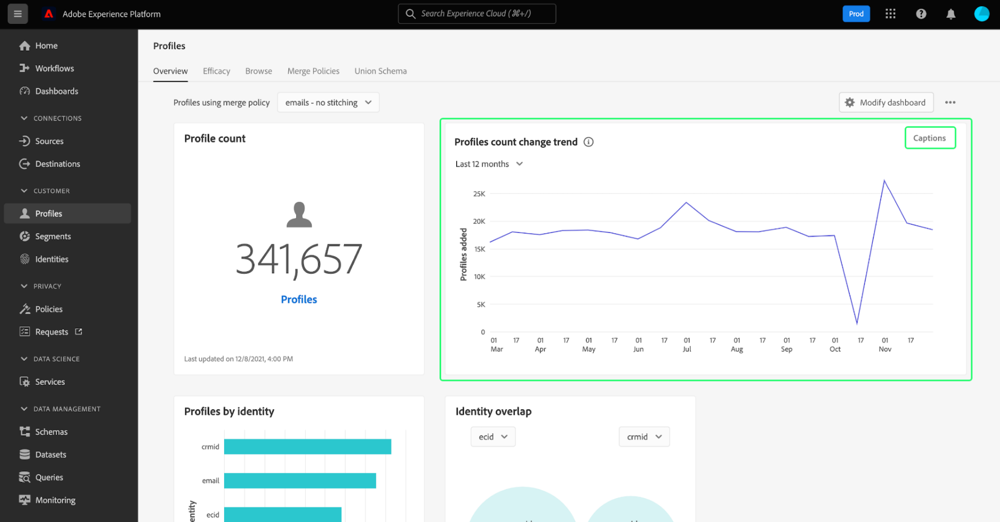

# [!UICONTROL プロファイル] dashboard

Adobe Experience Platformのユーザーインターフェイス (UI) には、ダッシュボードが用意されており、このダッシュボードを使用して、 [!DNL Real-time Customer Profile] 毎日のスナップショット中にキャプチャされたデータ。 このガイドでは、 [!UICONTROL プロファイル] ダッシュボードを使用して、ダッシュボードに表示される指標に関する情報を確認できます。

Experience Platformユーザーインターフェイス内のすべてのプロファイル機能の概要については、 [リアルタイム顧客プロファイル UI ガイド](../../profile/ui/user-guide.md).

## プロファイルダッシュボードデータ

この [!UICONTROL プロファイル] 「ダッシュボード」には、組織がExperience Platform内のプロファイルストアに保持している属性（レコード）データのスナップショットが表示されます。 スナップショットには、イベント（時系列）データは含まれていません。

スナップショットの属性データは、スナップショットが作成された特定の時点でのデータと完全に同じ状態で表示されます。 つまり、スナップショットはデータの近似やサンプルではなく、プロファイルダッシュボードはリアルタイムで更新されません。

>[!NOTE]
>
>スナップショットが作成された後にデータに加えられた変更や更新は、次のスナップショットが作成されるまでダッシュボードに反映されません。

## の詳細 [!UICONTROL プロファイル] dashboard

次に移動するには： [!UICONTROL プロファイル] Platform UI 内のダッシュボードで、「 **[!UICONTROL プロファイル]** 左側のレールで、 **[!UICONTROL 概要]** タブをクリックして、ダッシュボードを表示します。

>[!NOTE]
>
>組織が Platform を初めて使用し、アクティブなプロファイルデータセットや結合ポリシーがまだ作成されていない場合、 [!UICONTROL プロファイル] ダッシュボードが表示されません。 代わりに、 [!UICONTROL 概要] 「 」タブには、リアルタイム顧客プロファイルの使用を開始するのに役立つリンクとドキュメントが表示されます。

### の変更 [!UICONTROL プロファイル] dashboard

次の外観を変更できます： [!UICONTROL プロファイル] 選択してダッシュボード **[!UICONTROL ダッシュボードを変更]**. これにより、ダッシュボードからウィジェットを移動、追加、削除したり、 **[!UICONTROL Widget ライブラリ]** 使用可能なウィジェットを参照し、組織のカスタムウィジェットを作成するには。

詳しくは、 [ダッシュボードの変更](../customize/modify.md) および [ウィジェットライブラリの概要](../customize/widget-library.md) ドキュメントを参照してください。

### ウィジェットを追加 {#add-widget}

選択 **[!UICONTROL ウィジェットを追加]** をクリックしてウィジェットライブラリに移動し、ダッシュボードに追加できるウィジェットのリストを確認します。

ウィジェットライブラリから、標準およびカスタムセグメントウィジェットの選択を参照できます。ウィジェットの追加方法については、ウィジェットライブラリのドキュメントを参照してください。 [ウィジェットを追加](../customize/widget-library.md#add-widgets).

<!-- ## (Beta) Profile efficacy insights {#profile-efficacy-insights}

>[!IMPORTANT]
>
>The profile efficacy insight functionality is currently in beta and are not available to all users. The documentation and the functionality are subject to change.

The [!UICONTROL Efficacy] tab provides metrics on the quality and completeness of your profile data through the use of profile efficacy widgets. These widgets illustrate at a glance the composition of your profiles, trends in completeness over time, and assessments on the quality of your profile data.

See the [profile efficacy widgets section](#profile-efficacy-widgets) for more information on the widgets currently available.

The layout of this dashboard is also customizable by selecting [**[!UICONTROL Modify dashboard]**](../customize/modify.md) from the [!UICONTROL Overview] tab. -->

## プロファイルを参照 {#browse-profiles}

この [!UICONTROL 参照] 「 」タブでは、組織に取り込まれた読み取り専用プロファイルを検索および表示できます。 ここから、プロファイルの環境設定、過去のイベント、インタラクションおよびセグメントに関する重要な情報を確認できます

Platform UI で提供されるプロファイル表示機能について詳しくは、 [Adobe Real-time Customer Data Platformでのプロファイルの参照](../../rtcdp/profile/profile-browse.md).

## 結合ポリシー {#merge-policies}

表示される指標 [!UICONTROL プロファイル] ダッシュボードは、リアルタイム顧客プロファイルデータに適用される結合ポリシーに基づいています。 複数のソースからデータを統合して顧客プロファイルを作成する場合、データに競合する値が含まれている可能性があります。 例えば、あるデータセットで顧客を「独身」としてリストし、別のデータセットで顧客を「既婚」としてリストします。 プロファイルの一部として優先順位を付けて表示するデータを決定するのは、結合ポリシーのジョブです。

組織のデフォルトの結合ポリシーを作成、編集、宣言する方法など、結合ポリシーの詳細については、まず [結合ポリシーの概要](../../profile/merge-policies/overview.md).

ダッシュボードは、使用する結合ポリシーを自動的に選択します。 適用される結合ポリシーは、結合ポリシー名の横にあるドロップダウンメニューを使用して変更できます。

>[!NOTE]
>
>ドロップダウンメニューには、 `_xdm.context.profile` スキーマ。 ただし、組織が複数の結合ポリシーを作成している場合は、使用可能な結合ポリシーの完全なリストを表示するには、スクロールする必要がある可能性があります。

## 結合スキーマ

この [!UICONTROL 和集合スキーマ] 「ダッシュボード」には、特定の XDM クラスの和集合スキーマが表示されます。 次を選択すると、 **[!UICONTROL クラス]** ドロップダウンで、様々な XDM クラスの和集合スキーマを表示できます。

結合スキーマは、同じクラスを共有し、プロファイルが有効になっている複数のスキーマで構成されています。これにより、同じクラスを共有する各スキーマ内に含まれるすべてのフィールドを 1 つのビューで統合して表示できます。

詳しくは、和集合スキーマの UI ガイドを参照してください。 [Platform UI 内での和集合スキーマの表示](../../profile/ui/union-schema.md#view-union-schemas).

## ウィジェットと指標

ダッシュボードはウィジェットで構成されています。ウィジェットは読み取り専用の指標で、プロファイルデータに関する重要な情報を提供します。

最新のスナップショットの日時が [!UICONTROL 概要] タブが表示されます。 すべてのウィジェットデータは、その日時時点で正確です。 スナップショットのタイムスタンプは UTC で提供されます。個々のユーザーや組織のタイムゾーンに含まれていません。

## 標準ウィジェット {#standard-widgets}

Adobeは、プロファイルデータに関連する様々な指標を視覚化するために使用できる、複数の標準ウィジェットを提供します。 また、 [!UICONTROL Widget ライブラリ]. カスタムウィジェットの作成の詳細については、まず [ウィジェットライブラリの概要](../customize/widget-library.md).

使用可能な各標準ウィジェットの詳細を確認するには、次のリストからウィジェットの名前を選択します。

* [[!UICONTROL プロファイル数]](#profile-count)
* [[!UICONTROL プロファイル数のトレンド]](#profile-count-trend)
* [[!UICONTROL プロファイル数の変更]](#profile-count-change)
* [[!UICONTROL プロファイル数の変化の傾向]](#profiles-count-change-trend)
* [[!UICONTROL プロファイル数 ID 別の変更トレンド]](#profiles-count-change-trend-by-identity)
* [[!UICONTROL ID 別プロファイル]](#profiles-by-identity)
* [[!UICONTROL ID の重複]](#identity-overlap)
* [[!UICONTROL 単一の ID プロファイル]](#single-identity-profiles)
* [[!UICONTROL 単一の ID プロファイル (ID 別)]](#single-identity-profiles-by-identity)
* [[!UICONTROL 非セグメント化プロファイル]](#unsegmented-profiles)
* [[!UICONTROL 非セグメント化プロファイルのトレンド]](#unsegmented-profiles-trend)
* [[!UICONTROL ID 別の非セグメント化プロファイル]](#unsegmented-profiles-by-identity)
* [[!UICONTROL オーディエンス]](#audiences)
* [[!UICONTROL 宛先ステータスにマッピングされたオーディエンス]](#audiences-mapped-to-destination-status)
* [[!UICONTROL オーディエンスサイズ]](#audiences-size)
* [[!UICONTROL 結合ポリシーによるオーディエンスの重複]](#audience-overlap-by-merge-policy)
* [[!UICONTROL オーディエンスの重複レポート]](#audience-overlap-report)

### [!UICONTROL プロファイル数] {#profile-count}

>[!CONTEXTUALHELP]
>id="platform_dashboards_profiles_profilecount"
>title="プロファイル数"
>abstract="このウィジェットは、スナップショットが作成された時点でのプロファイルストア内の結合済みプロファイルの合計数を表示します。 この数は、選択した結合ポリシーがプロファイルデータに適用されているかどうかによって異なります。"

この **[!UICONTROL プロファイル数]** ウィジェットは、スナップショットが作成された時点でのプロファイルストア内の結合済みプロファイルの合計数を表示します。 この数値は、選択した結合ポリシーをプロファイルデータに適用して、プロファイルフラグメントを結合し、個々のプロファイルごとに 1 つのプロファイルを形成することによって生じます。

詳しくは、 [このドキュメントで前述した結合ポリシーに関する節](#merge-policies) を参照してください。

>[!NOTE]
>
>この [!UICONTROL プロファイル数] ウィジェットは、 [!UICONTROL 参照] 」タブをクリックします。 [!UICONTROL プロファイル] 」の節を参照してください。 最も一般的な理由は、 [!UICONTROL 参照] 「 」タブは、組織のデフォルトの結合ポリシーに基づいて結合されたプロファイルの合計数を参照しますが、 [!UICONTROL プロファイル数] ウィジェットは、ダッシュボードに表示するように選択した結合ポリシーに基づいて、結合されたプロファイルの合計数を参照します。
>
>もう 1 つの一般的な理由は、ダッシュボードのスナップショットを実行する時間と、サンプルジョブを実行する時間の違いです [!UICONTROL 参照] タブをクリックします。 この [!UICONTROL プロファイル数] ウィジェットは最後に更新されたので、ウィジェットのタイムスタンプを調べ、サンプルジョブがでどのようにトリガーされるかを確認する必要があります。 [!UICONTROL 参照] タブ、「 [リアルタイム顧客プロファイル UI ガイドのプロファイル数に関する節](https://experienceleague.adobe.com/docs/experience-platform/profile/ui/user-guide.html?lang=en#profile-count).

### [!UICONTROL プロファイル数のトレンド] {#profile-count-trend}

この [!UICONTROL プロファイル数のトレンド] ウィジェットは、折れ線グラフを使用して、システムに含まれるプロファイルの総数の経時的な推移を示します。 この合計数には、最後の日別スナップショット以降にシステムにインポートされたプロファイルが含まれます。 30 日、90 日および 12 か月の期間のデータを可視化できます。期間は、ウィジェットのドロップダウンメニューから選択します。

### [!UICONTROL プロファイル数の変更] {#profile-count-change}

>[!CONTEXTUALHELP]
>id="platform_dashboards_profiles_profilescountchange"
>title="プロファイル数の変更"
>abstract="このウィジェットには、結合されたプロファイルの合計数が表示されます **追加済み** を最後のスナップショットの時点のプロファイルストアに追加します。 この数は、選択した結合ポリシーがプロファイルデータに適用されているかどうかによって異なります。"

この **[!UICONTROL プロファイル数の変更]** ウィジェットは、前のスナップショット以降にプロファイルストアに追加された結合プロファイルの数を表示します。 この数値は、選択した結合ポリシーをプロファイルデータに適用して、プロファイルフラグメントを結合し、個々のプロファイルごとに 1 つのプロファイルを形成することによって生じます。 ドロップダウンセレクターを使用して、過去 30 日間、90 日間、12 ヶ月間に追加されたプロファイルの数を表示できます。

>[!NOTE]
>
>この [!UICONTROL プロファイル数の変更] ウィジェットは追加されたプロファイル数を反映します **後** 最初のプロファイル取り込みとプロファイルストアの設定。 つまり、組織がプロファイルストアを設定し、24 時間以内に 1 日目に 4,000,000 個を取り込んだ場合、ダッシュボードは使用可能になりますが、 [!UICONTROL プロファイル数の変更] ウィジェットは 0 に設定されます。 これは、プロファイルのシステムへの初期取り込みに関連するスパイクを避けるためにおこなわれます。 今後 30 日間で、組織は 1,000,000 件のプロファイルをプロファイルストアに追加で取り込みます。 次のスナップショットを作成した後、 [!UICONTROL プロファイル数の変更] ウィジェットには合計 1,000,000 個のプロファイルが追加され、 [!UICONTROL プロファイル数] ウィジェットには、合計 5,000,000 個のプロファイルが表示されます。

### [!UICONTROL プロファイル数の変化の傾向] {#profiles-count-change-trend}

>[!CONTEXTUALHELP]
>id="platform_dashboards_profiles_profilesaddedtrend"
>title="プロファイル数の変化の傾向"
>abstract="このウィジェットは、過去 30 日、90 日、12 ヶ月間にプロファイルストアに毎日追加された、結合されたプロファイルの数を表示します。 また、この数は、選択した結合ポリシーがプロファイルデータに適用されるかどうかによって異なります。"

この **[!UICONTROL プロファイル数の変化の傾向]** ウィジェットには、過去 30 日、90 日、12 ヶ月間にプロファイルストアに毎日追加された、結合されたプロファイルの合計数が表示されます。 この数は、スナップショットが作成されるたびに更新されます。そのため、プロファイルを Platform に取り込む場合、次のスナップショットが作成されるまでプロファイルの数は反映されません。 追加されるプロファイルの数は、選択した結合ポリシーがプロファイルデータに適用され、プロファイルフラグメントを結合して個々のプロファイルを 1 つ形成する結果です。

詳しくは、 [このドキュメントで前述した結合ポリシーに関する節](#merge-policies) を参照してください。

この **[!UICONTROL プロファイル数の変化の傾向]** ウィジェットは、ウィジェットの右上に「キャプション」ボタンを表示します。 選択 **[!UICONTROL キャプション]** 自動キャプションダイアログを開く。

機械学習モデルは、グラフとデータを分析することで、主要なトレンドと重要なイベントを記述するキャプションを自動的に生成します。 注釈は、キャプションに基づいてグラフに追加されます。 対応する注釈にフォーカスするキャプションを選択します。

### [!UICONTROL プロファイル数 ID 別の変更トレンド] {#profiles-count-change-trend-by-identity}

<!-- This widget uses a line graph to illustrate the change in number of profiles filtered by a chosen source identity and merge policy. -->

このウィジェットは、選択したソース ID と結合ポリシーに基づいてプロファイル数をフィルタリングし、線グラフを使用して様々な期間の数の変化を示します。 結合ポリシーはページ上部の概要ドロップダウンから選択し、ソース ID と期間はウィジェットのドロップダウンメニューから選択します。 30 日、90 日および 12 か月の期間のトレンドを可視化できます。

このウィジェットは、必要な ID でフィルタリングされたプロファイルの成長パターンを示すことで、宛先のアクティベーションニーズを管理するのに役立ちます。

### [!UICONTROL ID 別プロファイル] {#profiles-by-identity}

>[!CONTEXTUALHELP]
>id="platform_dashboards_profiles_profilesbyidentity"
>title="ID 別プロファイル"
>abstract="このウィジェットは、プロファイルストア内のすべての結合済みプロファイルの分類を ID 別に表示します。"

この **[!UICONTROL ID 別プロファイル]** ウィジェットは、プロファイルストア内のすべての結合済みプロファイルで id の分類を表示します。 1 つのプロファイルに複数の名前空間が関連付けられている可能性があるので、ID 別のプロファイルの合計数（各名前空間に表示される値をまとめたもの）は、結合されたプロファイルの合計数より多くなる場合があります。例えば、顧客が複数のチャネルでブランドとやり取りする場合、複数の名前空間がその個々の顧客に関連付けられます。

詳しくは、 [このドキュメントで前述した結合ポリシーに関する節](#merge-policies) を参照してください。

選択 **[!UICONTROL キャプション]** 自動キャプションダイアログを開く。

機械学習モデルは、データの全体的な分布と主要なディメンションを分析することで、データインサイトを自動的に生成します。

ID の詳細については、 [Adobe Experience Platform ID サービスドキュメント](../../identity-service/home.md).

### [!UICONTROL ID の重複] {#identity-overlap}

>[!CONTEXTUALHELP]
>id="platform_dashboards_profiles_identityoverlap"
>title="ID の重複"
>abstract="このウィジェットは、ベン図を使用して、選択した 2 つの ID を含むプロファイルストア内のプロファイルの重複を表示します。"

この **[!UICONTROL ID の重複]** ウィジェットは、ベン図（セット図）を使用して、選択した 2 つの ID を含むプロファイルストア内のプロファイルの重複を表示します。

ウィジェットのドロップダウンメニューを使用して、比較する ID を選択します。 円には、各 ID を含むプロファイルの相対合計数が表示されます。 両方の ID を含むプロファイルの数は、円間の重複のサイズで表されます。 顧客が複数のチャネルでブランドとやり取りする場合、複数の ID がその顧客に関連付けられるので、組織は複数の ID のフラグメントを含む複数のプロファイルを持つ可能性が高くなります。

プロファイルフラグメントの詳細については、まず [プロファイルフラグメントと結合プロファイル](https://experienceleague.adobe.com/docs/experience-platform/profile/home.html?lang=en#profile-fragments-vs-merged-profiles) （リアルタイム顧客プロファイルの概要）を参照してください。

ID の詳細については、 [Adobe Experience Platform ID サービスドキュメント](../../identity-service/home.md).

### [!UICONTROL 単一の ID プロファイル] {#single-identity-profiles}

>[!CONTEXTUALHELP]
>id="platform_dashboards_profiles_singleidentityprofiles"
>title="単一の ID プロファイル"
>abstract="このウィジェットは、ID を作成する 1 つのタイプの ID のみを持つ組織のプロファイルの数を提供します。 この ID タイプは、電子メールまたは ECID のどちらかです。"

この [!UICONTROL 単一の ID プロファイル] ウィジェットは、id を作成する 1 つのタイプの ID のみを持つ組織のプロファイルの数を提供します。 この ID タイプは、電子メールまたは ECID のどちらかです。 プロファイル数は、最新のスナップショットに含まれるデータから生成されます。

### [!UICONTROL 単一の ID プロファイル (ID 別)] {#single-identity-profiles-by-identity}

このウィジェットは、棒グラフを使用して、単一の一意の ID のみで識別されるプロファイルの合計数を示します。このウィジェットは、最も一般的な ID を最大 5 つサポートします。

個々のバーの上にマウスポインターを置くと、ID のプロファイルの合計数を示すダイアログが表示されます。

### [!UICONTROL 非セグメント化プロファイル] {#unsegmented-profiles}

>[!CONTEXTUALHELP]
>id="platform_dashboards_profiles_unsegmentedprofiles"
>title="非セグメント化プロファイル"
>abstract="このウィジェットは、どのセグメントにも添付されていないすべてのプロファイルの合計数を提供し、組織全体でのプロファイルのアクティベーションの機会を表します。"

この [!UICONTROL 非セグメント化プロファイル] ウィジェットは、どのセグメントにも添付されていないすべてのプロファイルの合計数を提供します。 生成される数は、最後のスナップショット時点のもので、組織全体のプロファイルアクティブ化の機会を表しています。また、十分な ROI を提供しないプロファイルを拡張する機会も示します。

### [!UICONTROL 非セグメント化プロファイルのトレンド] {#unsegmented-profiles-trend}

>[!CONTEXTUALHELP]
>id="platform_dashboards_profiles_unsegmentedprofilestrend"
>title="非セグメント化プロファイルのトレンド"
>abstract="このウィジェットには、一定期間内にどのセグメントにも属していないプロファイルの数が折れ線グラフで表示されます。どのセグメントにも関連付けられていないプロファイルのトレンドを、30 日、90 日、12 ヶ月の期間で視覚化できます。"

この [!UICONTROL 非セグメント化プロファイルトレンド] ウィジェットには、特定の期間にどのセグメントにも添付されていないプロファイルの数を示す線グラフの図が表示されます。 どのセグメントにも関連付けられていないプロファイルのトレンドを、30 日、90 日、12 ヶ月の期間で視覚化できます。 期間は、ウィジェットのドロップダウンメニューから選択します。 プロファイル数は、x 軸の y 軸と時間に反映されます。

### [!UICONTROL ID 別の非セグメント化プロファイル] {#unsegmented-profiles-by-identity}

>[!CONTEXTUALHELP]
>id="platform_dashboards_profiles_unsegmentedprofilesbyidentity"
>title="ID 別の非セグメント化プロファイル"
>abstract="このウィジェットは、セグメント化されていないプロファイルの合計数を、一意の識別子で分類します。"

この [!UICONTROL ID 別の非セグメント化プロファイル] ウィジェットは、セグメント化されていないプロファイルの合計数を、一意の識別子で分類します。 データを棒グラフで視覚化し、比較しやすくします。

### [!UICONTROL オーディエンス] {#audiences}

このウィジェットは、プロファイルデータに適用された選択した結合ポリシーに従って、アクティブ化する準備ができているセグメントの合計数を提供します。

選択 **[!UICONTROL オーディエンス]** をクリックして、 [!UICONTROL セグメント] dashboard [!UICONTROL 参照] タブをクリックします。 ここから、組織のすべてのセグメント定義のリストが表示されます。

<!-- https://jira.corp.adobe.com/browse/PLAT-115291 -->

<!-- * [[!UICONTROL Audiences change trend]](#audiences-change-trend) -->
<!-- ### [!UICONTROL Audiences change trend] {#audiences-change-trend}

This line graph widget visualizes the change in the total number of audiences each day, trending over time. The change in the number of audiences is dependent on the selected merge policy being applied to your profile data. The period of analysis is selected from the widget dropdown menu. The bar chart can be visualized over 30 days, 90 days, and 12-month periods.  

The visualization allows you to monitor the overall health of audiences within Adobe Experience Platform by understanding trends in the growth or decline of the total number of audiences. -->

<!--  -->

### [!UICONTROL オーディエンスの重複レポート] {#audience-overlap-report}

このウィジェットは、結合ポリシーでフィルタリングされたすべての使用可能なセグメントから、オーディエンスの重複データを表にします。 画面上部のドロップダウンメニューで選択した結合ポリシーに対して、重複の高い順にランク付けされた 5 つのオーディエンスのリストが表示されます。 分析された 2 つのセグメントが、 [!UICONTROL セグメント名] および [!UICONTROL セグメント B 名] 列。 重複率は、3 番目の列の小数点以下 12 桁までの精度で表示されます。

オーディエンスの重複レポートは、新しい高パフォーマンスのセグメントを作成するのに役立ちます。 重複率が高いを観察することで、オーディエンスを抑制し、同じオーディエンスが異なる宛先に送信されるのを防ぐことができます。 また、セグメント化の改善に役立つ隠れたインサイトを特定するのに役立ちます。 重複率が低いと、追跡する固有のプロファイルを見つけるのに役立ちます。

選択 **[!UICONTROL さらに表示]** をクリックすると、オーディエンスの重複データが多いフルスクリーンダイアログが開きます。

この [!UICONTROL オーディエンスの重複レポート] ダイアログが表示されます。 このダイアログには、最大 50 行のオーディエンスの重複分析を 6 つの列に分類して含めることができます。 設定アイコン () をクリックして、テーブルから列を削除または追加します。

>[!NOTE]
>
>を選択します。 **[!UICONTROL 重複]** 列ヘッダーを使用して、結果のランクを最も高い順または最も低い順に変更できます。

レポート全体をオプション形式でPDFするには、オプションメニュー (**`...`**) に続いて **[!UICONTROL ダウンロード]**.

レポートから行を選択して、重複分析のベン図を開きます。 ベン図のセクションの上にマウスポインターを置くと、ダイアログでプロファイル数が表示されます。

選択 **[!UICONTROL 閉じる]** に戻る [!UICONTROL プロファイル] ダッシュボード。

### [!UICONTROL 宛先ステータスにマッピングされたオーディエンス] {#audiences-mapped-to-destination-status}

この [!UICONTROL 宛先ステータスにマッピングされたオーディエンス] ウィジェットは、マッピングされたオーディエンスとマッピングされていないオーディエンスの合計数を 1 つの指標で表示し、ドーナツグラフを使用して合計の比例差を示します。 計算される数値は、選択した結合ポリシーによって異なります。

マッピングされたオーディエンスまたはマッピングされていないオーディエンスの個々の数は、ドーナツグラフの各セクションにカーソルを合わせると、ダイアログに表示されます。

### [!UICONTROL オーディエンスサイズ] {#audiences-size}

この [!UICONTROL オーディエンスのサイズ] ウィジェットには 2 列の表が用意されており、この表には、最大 20 個のセグメントと、各セグメントに含まれるオーディエンスの総数が表示されます。 リストは、オーディエンスの合計数に応じて、上位から下位の順に並べられます。 合計オーディエンスサイズの数は、適用される結合ポリシーによって異なります。

セグメントの包括的な情報を確認するには、表示されたリストからセグメント名を選択して、 [!UICONTROL セグメント] [!UICONTROL 詳細] ページ。 また、次を選択します。 **[!UICONTROL すべてのセグメントを表示]** ウィジェットの最後から、 [!UICONTROL セグメント] [!UICONTROL 参照] タブで既存のセグメントを検索します。

詳しくは、ドキュメントを参照してください。 [[!UICONTROL セグメント] [!UICONTROL  参照] タブ](https://experienceleague.adobe.com/docs/experience-platform/segmentation/ui/overview.html#browse).

### [!UICONTROL 結合ポリシーによるオーディエンスの重複] {#audience-overlap-by-merge-policy}

このウィジェットは、ベン図を使用して、選択した 2 つのセグメントの重複を表示します。 結合ポリシーはページ上部の概要ドロップダウンから選択され、分析用のセグメントはウィジェット内の 2 つのドロップダウンメニューから選択されます。 関連するセグメント定義内に含まれるプロファイルの総数は、円または積集合の上にマウスポインターを置くと確認できます。

ウィジェットにセグメント定義の視覚的な重複が表示されるので、セグメント定義間の類似点を調べることで、セグメント化戦略を最適化できます。

<!-- ## (Beta) Profile efficacy widgets {#profile-efficacy-widgets}

>[!IMPORTANT]
>
>The profile efficacy widgets are currently in Beta and are not available to all users. The documentation and the functionality are subject to change.

Adobe provides multiple widgets to assess the completeness of the ingested profiles available for your data analysis. Each of the profile efficacy widgets can be filtered by the merge policy. To change the merge policy filter, select the[!UICONTROL Profiles using merge policy] dropdown and choose the appropriate policy from the available list.

To learn more about each of the profile efficacy widgets, select the name of a widget from the following list:

* [[!UICONTROL Attribute quality assessment]](#attributes-quality-assessment)
* [[!UICONTROL Profiles by completeness]](#profiles-by-completeness)
* [[!UICONTROL Profiles completeness trend]](#profiles-completeness-trend)

### (Beta) [!UICONTROL Attributes quality assessment] {#attributes-quality-assessment}

>[!CONTEXTUALHELP]
>id="platform_dashboards_profiles_attributesqualityassessment"
>title="Attributes quality assessment"
>abstract="This widget shows the completeness and cardinality of all profiles according to their attributes. Each row describes one attribute. The **Profiles** column provides the number of profiles that have this attribute and are filled with non-null values. The **Completeness** percentage is determined by the total number of profiles that have this attribute and are filled with non-null values divided by the total number of non-empty values in the profiles for that attribute. **Cardinality** provides the total number of unique non-null values of this attribute across all attributes."

The [!UICONTROL Attribute quality assessment] widget shows the completeness and cardinality of all profiles according to their attributes. The data is accurate to the last processing date. This information is presented as a table with four columns where each row in the table represents a single attribute.

| Column  | Description  |
|---|---|
| Attribute  | The name of the attribute.  |
| Profiles  | The number of profiles that have this attribute and are filled with non-null values.  |
| Completeness  | This percentage is determined by the total number of profiles that have this attribute and are filled with non-null values. The number is calculated by dividing the total number of profiles by the total number of non-empty values in the profiles for that attribute.  |
| Cardinality  | The total number of **unique** non-null values of this attribute. It is measured across all profiles. |

### (Beta) [!UICONTROL Profiles by completeness] {#profiles-by-completeness}

>[!CONTEXTUALHELP]
>id="platform_dashboards_profiles_profilesbycompleteness"
>title="Profiles by completeness"
>abstract="The donut chart displays the percentage of profile attributes that are filled with non-null values among all observed attributes. It illustrates the proportion of profiles that are of high, medium, or low completeness. High completeness profiles have more than 70% of their attributes filled. Medium completeness profiles have between 30% and 70% of their attributes filled. Low completeness profiles have less than 30% of their attributes filled."

The [!UICONTROL Profiles by completeness] widget creates a donut chart of profile completeness since the last processing date. The completeness of a profile is measured by the percentage of attributes that are filled with non-null values among all observed attributes.

This widget shows the proportion of profiles that are of high, medium, or low completeness. By default, there are three levels of completeness configured: 

* High completeness: Profiles have more than 70% of their attributes filled. 
* Medium completeness: Profiles have between 30% and 70% of their attributes filled. 
* Low completeness: Profiles have less than 30% of their attributes filled. 

### (Beta) [!UICONTROL Profiles completeness trend] {#profiles-completeness-trend}

>[!CONTEXTUALHELP]
>id="platform_dashboards_profiles_profilescompletenesstrend"
>title="Profiles completeness trend"
>abstract="This widget creates a stacked area chart to depict the trend of profile completeness over time. Completeness is measured by the percentage of attributes that are filled with non-null values among all observed attributes."

This widget creates a stacked area chart to depict the trend of profile completeness over time. Completeness is measured by the percentage of attributes filled with non-null values among all observed attributes. It categorizes the profile completeness as high, medium, or low completeness since the last processing date.

The x-axis represents time, the y-axis represents the number of profiles, and the colors represent the three levels of profile completeness. 

The three levels of completeness are:

* High completeness: Profiles have more than 70% of attributes filled. 
* Medium completeness: Profiles have less than 70% and more than 30% of attributes filled. 
* Low completeness: Profiles have less than 30% of attributes filled.

 -->

## 次の手順

このドキュメントに従うと、プロファイルダッシュボードを見つけて、使用可能なウィジェットに表示される指標を理解できます。 の使用に関する詳細を学ぶには [!DNL Profile] Experience PlatformUI のデータについては、 [リアルタイム顧客プロファイル UI ガイド](../../profile/ui/user-guide.md).
