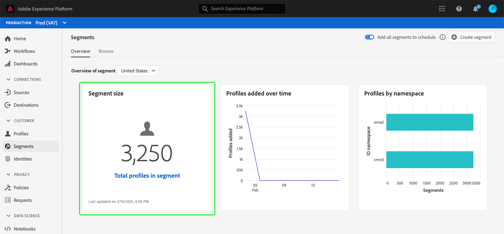

# （ベータ版）セグメントダッシュボード{#segment-dashboard}

>[!IMPORTANT]
>
>このドキュメントで概要を説明しているダッシュボード機能は、現在ベータ版であり、一部のユーザーはご利用いただけません。 ドキュメントと機能は変更される場合があります。

Adobe Experience Platformユーザーインターフェイス(UI)では、毎日のスナップショット時にキャプチャされる、セグメントに関する重要な情報を表示できるダッシュボードが提供されます。 このガイドでは、UIのセグメントダッシュボードにアクセスして操作する方法と、ダッシュボードに表示されるビジュアライゼーションに関する詳細を説明します。

プラットフォームユーザーインターフェイス内のAdobe Experience Platformセグメントサービスのすべての機能の概要については、[Segmentation Service UIガイド](../../segmentation/ui/overview.md)を参照してください。

## セグメントダッシュボードデータ

セグメントダッシュボードには、Experience Platform内のプロファイルストア内に組織が持つ属性（レコード）データのスナップショットが表示されます。 スナップショットには、イベント（時系列）データは含まれません。

スナップショット内の属性データは、スナップショットが作成された特定の時点で表示されるデータとまったく同じ内容を示します。 つまり、スナップショットはデータの近似やサンプルではなく、セグメントダッシュボードはリアルタイムで更新されません。

>[!NOTE]
>
>スナップショットが作成された後にデータに対して行われた変更や更新は、次のスナップショットが作成されるまでダッシュボードに反映されません。

## セグメントダッシュボードの詳細

プラットフォームUI内のセグメントダッシュボードに移動するには、左のナビゲーションバーの「**[!UICONTROL セグメント]**」を選択し、「**[!UICONTROL 概要]**」タブを選択してダッシュボードを表示します。

### セグメントの選択

ダッシュボードは表示するセグメントを自動的に選択しますが、表示するセグメントはドロップダウンメニューで変更できます。 別のセグメントを選択するには、セグメント名の横のドロップダウンを選択し、表示するセグメントを選択します。

>[!NOTE]
>
>ドロップダウンメニューには、貴社がこれまでに作成したすべてのセグメントが表示されます。 これは、使用可能なセグメントの完全なリストを表示するために、スクロールする必要があることを意味します。

### ウィジェットと指標

セグメントダッシュボードはウィジェットで構成され、ウィジェットは選択したセグメントに関する重要な情報を提供する読み取り専用の指標です。 ウィジェットの「最終更新日」の日時は、データの最後のスナップショットが作成された日時を示します。

## 利用可能なウィジェット

Experience Platformは、セグメントに関連する様々な指標を視覚化するために使用できる複数のウィジェットを提供します。 ウィジェット名を以下から選択して、詳細を確認します。

* [[!UICONTROL セグメントサイズ]](#segment-size)
* [[!UICONTROL 時間の経過と共に追加されるプロファイル]](#profiles-added-over-time)
* [[!UICONTROL 名前空間別プロファイル数]](#profiles-by-namespace)

### [!UICONTROL セグメントサイズ] {#segment-size}

**[!UICONTROL セグメントサイズ]**&#x200B;ウィジェットは、スナップショットが作成された時点で、選択したセグメント内に結合されたプロファイルの合計数を表示します。 この数値は、プロファイルフラグメントを結合してセグメント内の個々の個人の単一のプロファイルを形成するために、セグメントの結合ポリシーをプロファイルデータに適用した結果です。

フラグメントと結合されたプロファイルの詳細については、まず[リアルタイム顧客プロファイルの概要](../../profile/home.md)を参照してください。

### [!UICONTROL 時間の経過と共に追加されるプロファイル] {#profiles-added-over-time}

**[!UICONTROL プロファイルが時間]**&#x200B;の経過と共に追加され、過去30日間の、日別スナップショットでキャプチャされたセグメント内のプロファイルの合計数に関する情報が提供されます。 このウィジェットは、新しいプロファイルがセグメントに振り分けられたり、セグメントから離れたりした場合に、30日間にわたってセグメントのサイズがどのように変化したかを表示します。

セグメント評価の詳細、およびプロファイルがセグメントを適用し、セグメントから離脱する方法については、[Segmentation Serviceドキュメント](../../segmentation/home.md)を参照してください。

### [!UICONTROL 名前空間別プロファイル数] {#profiles-by-namespace}

名前空間&#x200B;]**別の**[!UICONTROL &#x200B;プロファイルは、選択したセグメント内の結合されたすべてのプロファイルにおける名前空間の内訳を表示します。 1つのプロファイルに複数の名前空間が関連付けられている場合があるので、ID名前空間別のプロファイルの合計数(ウィジェット内の[!UICONTROL ID名前空間])は、セグメント内のプロファイルの合計数より多くなる可能性があります。 つまり、顧客が複数のチャネルでブランドを操作すると、複数の名前空間がその個々の名前空間に関連付けられる場合があるので、各プロファイルに表示される値を合計すると、セグメント内の合計訪問者数よりも多くなる場合があります。

ID名前空間の詳細については、[Adobe Experience PlatformIDサービスドキュメント](../../identity-service/home.md)を参照してください。

## 次の手順

このドキュメントに従うことで、セグメントダッシュボードを見つけて、表示するセグメントを選択できるようになります。 利用可能なウィジェットに表示される指標も理解する必要があります。 Experience PlatformUIでのセグメントの操作について詳しくは、[Segmentation Service UIガイド](../../segmentation/ui/overview.md)を参照してください。
