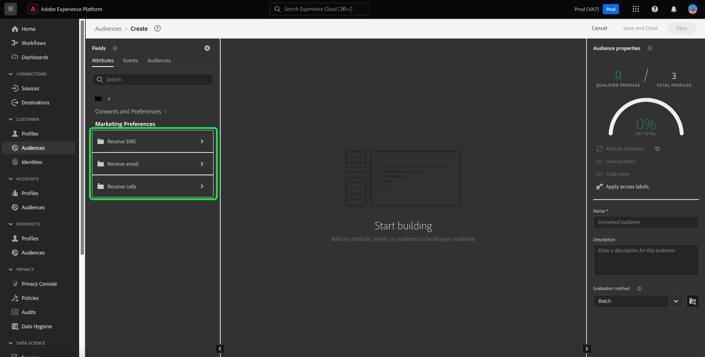

# 同意の分析と追跡

今日のマーケティングの状況では、顧客の同意設定を理解し、尊重する必要があります。 Adobe Real-time Customer Data Platformは、マーケターが顧客の同意を分析し、信頼を構築し、プライバシー規制に準拠し、よりパーソナライズされたエクスペリエンスを提供する機能を提供します。

このドキュメントでは、Real-Time CDPデータの様々なマーケティングユースケースに対応する同意ダッシュボードを作成する方法について詳しく説明します。 特に、ビジネスニーズに適した属性でオーディエンスを作成し、Adobe Experience Platform UI の事前設定済みウィジェットを使用してインサイトを利用する方法に焦点を当てています。 また、ユーザー定義のダッシュボード機能を使用して独自のカスタムウィジェットを作成する別の方法も示します。

## ユースケース {#use-cases}

このガイドで扱う使用例は、同意トレンドと同意の重複です。

- **同意トレンド** ユーザーの同意が経時的にトレンドを追跡します。 同意設定の変更を分析すると、マーケターは、それらのユーザー設定の変更に対応したキャンペーンの計画と実行に役立ちます。 例えば、ターゲットを絞った教育キャンペーン、透明性と信頼のキャンペーン、同意の選択を促すインセンティブキャンペーンを実行したい場合があります。 また、同意に悪影響を与えた可能性のあるキャンペーンを相互に関連付けて、キャンペーンの頻度を積極的に減らすこともできます。
- **同意の重複** は、同意チャネル間の重複を使用して、複数のチャネルに同意した顧客に対して、一貫したパーソナライズされたメッセージを複数のチャネルで配信します。 マーケターは、より高い同意度とパーソナライズされたメッセージが顧客の共感を呼び、より高い応答率を生み出す可能性がある特定のチャネルにリソースを優先順位付けして割り当てることができます。

<!-- ## Build a consent dashboard {#build-a-consent-dashboard} -->

## 同意オーディエンスの作成 {#create-consent-audiences}

同意ダッシュボードを作成するには、まず、連絡を許可したすべてのプロファイルのオーディエンスを作成する必要があります。 Real-time Customer Data Platform Segment Builder に移動するには、「 **[!UICONTROL オーディエンス]** （Platform UI の左側のナビゲーション）を使用します。 次から： [!UICONTROL 顧客] タブ [!UICONTROL オーディエンス] ダッシュボード、選択 **[!UICONTROL オーディエンスを作成]** をクリックし、 **[!UICONTROL ルールの作成]**.

<!-- Update screenshot below to include Create audience -->s

![The [!UICONTROL オーディエンス] 次のダッシュボード [!UICONTROL 顧客], [!UICONTROL オーディエンス]、および [!UICONTROL セグメントを作成] ハイライト表示されました。](../images/insights-use-cases/consent-analysis/create-audience.png)

「セグメントビルダー」が表示されます。次に、「 **[!UICONTROL XDM 個人プロファイル]** を選択します。 詳しくは、ドキュメントを参照してください。 [ルールビルダーキャンバス](../../segmentation/ui/segment-builder.md#rule-builder-canvas).

![セグメントビルダーと [!UICONTROL XDM 個人プロファイル] 属性フォルダがハイライト表示されています。](../images/insights-use-cases/consent-analysis/xdm-individual-profile.png)

使用可能なオプションから同意属性を見つけます。 選択 **[!UICONTROL 同意および環境設定]**.

>[!NOTE]
>
>Adobeが推奨するフィールドグループとは異なる属性でユーザーの同意を維持している場合は、以下に示す属性の代わりに、これらの属性を選択する必要があります。

詳しくは、 [セグメント化における同意の処理](../../segmentation/consents.md#handling-consent-in-segmentation) ドキュメント。

![セグメントビルダーと [!UICONTROL 同意と環境設定] 属性フォルダがハイライト表示されています。](../images/insights-use-cases/consent-analysis/consent-and-preferences.png)

様々な同意および環境設定オプションが表示されます。 このデモでは、様々なマーケティングチャネルに対する連絡に対する同意に焦点を当てているので、 **[!UICONTROL マーケティング環境設定]**.

![セグメントビルダーと [!UICONTROL マーケティング環境設定] ハイライト表示されたフォルダー。](../images/insights-use-cases/consent-analysis/marketing-preferences.png)

マーケティング環境設定のリストが表示されます。 この使用例では、E メール、SMS、呼び出しに焦点を当てていますが、他の組み合わせやオプション全体に関するインサイトを構築することもできます。 各チャネルに対して、以下の手順を実行してオーディエンスを作成します。

オーディエンスの設定を開始するには、「 **[!UICONTROL SMS を受信]** / **[!UICONTROL 電子メールを受信]** / **[!UICONTROL 呼び出しを受信]**.

The [!UICONTROL 購読] フォルダーが表示されます。 使用可能なオプションから、「 」を選択し、 **[!UICONTROL 選択値]** 「 」属性を中央のウィンドウ枠に追加し、ドロップダウンから目的の値を選択します。 この場合、 **はい（オプトイン）**. 次に、ビジネスニーズに応じてオーディエンスに名前を付け、わかりやすい説明を入力します。

>[!NOTE]
>
>作成することを推奨するオーディエンスの数にはソフトリミットがあります。 詳しくは、 [セグメント化ガードレールのドキュメント](https://experienceleague.adobe.com/docs/experience-platform/profile/guardrails.html?lang=en#segmentation-guardrails).

![The [!UICONTROL 選択値] 属性に [!UICONTROL はい（オプトイン）] の値がセグメントビルダーでハイライト表示されている。 オーディエンスの名前と説明もハイライト表示されます。](../images/insights-use-cases/consent-analysis/choice-value.png)

必要なオーディエンスを作成すると、それらのオーディエンスが [!UICONTROL オーディエンス] [!UICONTROL 参照] タブをクリックします。

>[!NOTE]
>
>オーディエンスを作成する場合は、バッチセグメント化ジョブが完了するのを待ってから、データが同意ダッシュボードの作成を開始できるようにする必要があります。 バッチセグメント化は、すべてのプロファイルデータをセグメント定義を通じて一度に移動し、対応するオーディエンスを生成するプロセスを表します。 作成したオーディエンスは保存され、エクスポートして使用できるようになります。 バッチセグメントは、24 時間ごとに自動的に評価されます。

## インサイトを利用 {#consume-insights}

Adobeは、プロファイル、オーディエンス、宛先のダッシュボードで自動的に使用できる様々なインサイトを作成していました。 作成したオーディエンスは、これらの事前設定済みのインサイトを使用して自動的に使用できます。 標準ウィジェットのドキュメントで、 [プロファイル](../guides/profiles.md#standard-widgets), [オーディエンス](../guides/audiences.md#standard-widgets)、および [宛先](../guides/destinations.md) ダッシュボード。

## オーディエンスの重複 {#audience-overlap}

任意の 2 つの同意オーディエンス間の重複をレビューするには、 [!UICONTROL 結合ポリシーによるオーディエンスの重複] をプロファイルダッシュボードに追加し、ドロップダウンメニューで目的のオーディエンスを選択します。 ダッシュボードにウィジェットを追加する手順については、ドキュメントを参照してください。 [*結合ポリシーによるオーディエンスの重複*](../guides/profiles.md#audience-overlap-by-merge-policy) を参照してください。

<!-- Image needs updating to night mode -->

オーディエンスダッシュボードのオーディエンスの重複レポートを使用して、他のすべてのオーディエンスからの呼び出しの受信にユーザーが同意したすべてのオーディエンスの重複を表示できます。 同意オーディエンスの重複を表示するには、まず [!UICONTROL オーディエンス] [!UICONTROL 概要] タブをクリックします。 ここから、 [!UICONTROL オーディエンスの重複レポート] ウィジェットをオーディエンスダッシュボードに追加します。 ウィジェットを作成したら、 **[!UICONTROL 通話に同意したユーザー]** オーディエンスを選択できます。 次に、「 **[!UICONTROL 詳細を表示]** オーディエンスの重複レポートウィジェットでは、上位の重複が 50 個まで、選択したセグメントに関して最も重複が少ない部分が 50 個まで表示されます。

<!-- Image needs updating to night mode -->

オーディエンスの重複レポートダイアログが展開し、追加のオーディエンスの重複データが表示されます。

<!-- Image needs updating to night mode -->

## オーディエンスサイズの傾向 {#audience-size-trends}

同意ベースのオーディエンスを作成すると、オーディエンスを作成した日から 12 ヶ月先まで自動的にトレンドが追加されます。 顧客の同意の完全な機能トレンドを得るには、以下のウィジェットを [!UICONTROL セグメント] [!UICONTROL 概要] ページに貼り付けます。 これらのインサイトは、時間の経過と共に同意がどのように変化しているかを追跡する強力な手段を提供します。 同意にプラスの影響やマイナスの影響を与える可能性のある、並行して実行するキャンペーンとも関連付けられます。 これらのウィジェットに対して提供される説明は、同意の使用例に適用されます。

- [オーディエンスサイズのトレンド](../guides/audiences.md#audience-size-trend)：このウィジェットを使用すると、それぞれの同意が時間の経過と共にどのように変化したかを追跡できます。
- [オーディエンスサイズの変更の傾向](../guides/audiences.md#audience-size-change-trend)：このウィジェットは、顧客の同意が日々どのように変更されたかを追跡します。 例えば、顧客の同意が 10 万件減少した場合、その変化が 1 日ごとにどのように発生したかを確認できます。
- [ID 別のオーディエンスサイズのトレンド](../guides/audiences.md#audience-size-trend-by-identity)：このウィジェットを使用すると、時間の経過と共に各同意がどのように変化したかを追跡できますが、さらに E メールなどの特定の ID でフィルタリングすることもできます。

<!-- Image needs updating to night mode -->

## Audiences の概要ダッシュボード {#audiences-overview-dashboard}

「SMS に同意したユーザー」などの同意関連のオーディエンスを作成したら、オーディエンスの概要ダッシュボードに適切なウィジェットを追加して、オーディエンスに関する主要なパーソナライズされた同意情報を表示できます。 次に移動： [!UICONTROL オーディエンス] [!UICONTROL 概要] ウィジェットライブラリから選択したウィジェットを追加します。 ダッシュボードの表示に追加されたウィジェットは、 [!UICONTROL ダッシュボードを変更] 機能。 パーソナライズされたビューには、経時的なトレンド（最大 12 ヶ月）、他のオーディエンスとの重複、オーディエンスの ID 構成などのインサイトを含めることができます。 ビューの例を以下に示します。

## ユーザー定義ダッシュボード {#usr-defined-dashboards}

ユーザー定義のダッシュボードを使用して、独自のウィジェットを構築することもできます。 独自のウィジェットを作成すると、ウィジェットのタイプを完全に制御できるほか、フィルターを柔軟に追加したり、Adobe Real-Time CDP内で直接管理したりできます。

例えば、同じグラフで複数の同意オーディエンスのトレンドを表示し、時間の経過と共に各同意設定の変更内容を確認できるようにする場合などです。 このタイプのビジュアライゼーションは、最小限の手順で 1 回の設定で、ユーザー定義のダッシュボードで可能です。 まず、「 」を選択します。 **[!UICONTROL ダッシュボード]** をクリックします。 The [!UICONTROL ダッシュボード] ワークスペースが表示されます。 次に、 **[!UICONTROL ダッシュボードを作成]**. 以下の手順に従ってください。 [ダッシュボードとカスタムウィジェットの作成](../user-defined-dashboards.md) は、ユーザー定義ダッシュボードガイドに記載されています。

次の場合： [データモデルを選択](../user-defined-dashboards.md#select-data-model) ウィジェットコンポーザーで、「 」を選択します。 `CDPInsights` 続いて **[!UICONTROL 次へ]**. The [!UICONTROL テーブルを選択] ダイアログが表示されます。

![CDPInsights モデルがハイライト表示された [ データモデルを選択 ] ダイアログボックス。](../images/user-defined-dashboards/select-data-model-dialog.png)

次のビューには、左側のレールで使用可能なテーブルのリストが表示されます。 「`adwh_fact_profile_by_segment_and_namespace_trendlines`」を選択します。

選択したテーブルのデータが Widget Composer に入力されたら、以下の手順を実行します。

- [検索 [!UICONTROL 属性]](../user-defined-dashboards.md#add-filter-attributes) 対象： `[!UICONTROL date]`をクリックした後、 +アイコンを使用して `[!UICONTROL date]` 属性を X 軸に設定する必要があります。
  
- 検索 [!UICONTROL 属性] 対象： `[!UICONTROL count_of_profiles]`をクリックした後、 +アイコンを使用して `[!UICONTROL count_of_profiles]` 属性を Y 軸に設定する必要があります。
- を選択します。 `...` （省略記号）アイコン [!UICONTROL Y 軸] 「 」フィールドで、「 [!UICONTROL SUM] 集計関数を使用できます。
  
- を選択します。 [!UICONTROL トンボ] ドロップダウンメニューを開き、グラフの種類を次のように変更します。 [!UICONTROL 線].
- 検索 [!UICONTROL 属性] （の） `[!UICONTROL segment_name]`をクリックした後、 +アイコンを使用して `segment_name` as a [!UICONTROL フィルター] をドロップダウンメニューから選択します。 The [!UICONTROL フィルター： Segment_name] ダイアログが表示されます。 同意に関連する、以前に作成したオーディエンスを選択します。 この例では、「 **[!UICONTROL 通話に同意したユーザー]**, **[!UICONTROL SMS に同意したユーザー]**、および **[!UICONTROL 電子メールに同意したユーザー]**&#x200B;に続いて **[!UICONTROL 適用]**.
- 検索 [!UICONTROL 属性] 対象： `[!UICONTROL segment_name]`次に、追加する+アイコンを選択します。 `segment_name` as a [!UICONTROL カラー] をドロップダウンメニューから選択します。
- 開く [の [!UICONTROL プロパティ] パネル](../user-defined-dashboards.md#widget-properties) 適切な [!UICONTROL ウィジェットのタイトル] および [!UICONTROL 軸ラベル].
  
- 選択 **[!UICONTROL 保存して閉じる]** をクリックして設定を確定します。

>[!TIP]
>
>ダッシュボードを保存する前に、ウィジェットのサイズを変更したり、ウィジェットを目的の位置に移動したりできるようになりました。

以下の画像は、完成したウィジェットがどのように表示されるか、およびその他の潜在的なカスタムインサイトを示しています。 作成可能なウィジェットのタイプについて詳しくは、 [データモデルのドキュメント](../cdp-insights-data-model.md).

<!-- The diagram shows straight lines due to a lack of data, however in your environment the trends will reflect the actual changes over time. -->

## 同意ポリシーの追跡 {#consent-policies}

自分で作成する同意ダッシュボードが **同意および環境設定属性のみの配布**.

>[!NOTE]
>
>のお客様向け **Adobeヘルスケアシールド** または **Adobeプライバシーとセキュリティシールド**，これらのダッシュボード **しない** 同意ポリシーの追跡を反映します。 使用可能なトラッキングには、作成されたポリシーの数、有効化、オーディエンスメンバーシップへの影響などが含まれます。

## 次の手順

このドキュメントでは、Real-Time CDPのインサイトを使用して、顧客の同意設定を包括的に把握できるダッシュボードを構築する方法を学びました。 このドキュメントでは、Real-Time CDPがプライバシーに焦点を当てた今日の状況に対して堅牢なソリューションを提供する方法を示します。同意データに基づく収集、セグメント化、分析、パーソナライズされたマーケティングキャンペーンがマーケターにとって重要です。
