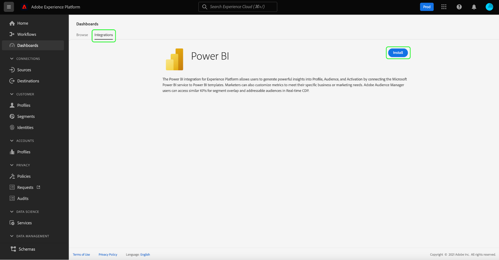

# ダッシュボードの Power BI レポートテンプレート

Power BI レポートテンプレート機能を使用すると、Adobe Experience Platform のデータが入った魅力的なレポートを作成できます。 合理化されたインストールプロセスにより、リアルタイム顧客プロファイル、セグメント化、宛先の標準ウィジェットが自動的にインストールされます。 また、インストールの際には Power BI をデータモデルに接続するので、レポートテンプレートを簡単にカスタマイズして拡張できます。これらのレポートは、Platform 上の IMS 組織の認証情報を必要とする受信者なしで、組織全体で共有できます。

このドキュメントでは、Adobe Experience Platform を Power BI アプリケーションと接続し、レポートテンプレートを使用して主要な Platform データインサイトを外部ユーザーと共有する方法について説明します。

## はじめに

このチュートリアルを続行する前に、 [スキーマ構成](../../xdm/schema/composition.md) Experience Platformに含まれ、 [和集合スキーマ](../../xdm/schema/composition.md#union).

Power BI アプリケーション統合をインストールするには、ユーザーはまず次の Platform 権限を取得している必要があります。

- クエリの管理
- サンドボックスの管理

これらの権限の割り当て方法については、[アクセス制御](../../access-control/home.md)ドキュメントを参照してください。

また、このチュートリアルに従うには、Power BI アカウントが必要です。アカウントを作成するには、[Power BI ホームページ](https://powerbi.microsoft.com/ja-jp/)に移動し、登録プロセスに従います。この Power BI アカウントのユーザーも、Power BI 設定内の「**ワークスペースを作成**」設定を有効にします。この設定は、Power BI 管理ポータルのテナント設定内にあります。アカウントがテナントまたは雇用主によって提供されている場合は、担当の管理者に連絡してこの設定を有効にしてもらってください。

>[!NOTE]
>
>Platform UI の左側のナビゲーションに「ダッシュボード」タブが表示され、ダッシュボードの在庫表示を表示できるようにするには、Platform ライセンスの一部として、プロファイル、セグメント、宛先のいずれかのダッシュボードにアクセスできる必要があります。

## Power BI アプリケーション統合のインストール

Platform UI 内で、左側のナビゲーションの&#x200B;**[!UICONTROL ダッシュボード]**&#x200B;で、[!UICONTROL ダッシュボード]ワークスペースを開きます。この「[!UICONTROL 参照]」タブには、現在使用可能なダッシュボードビューのリストが表示されます。使用可能なダッシュボードの表示について詳しくは、[インベントリドキュメント](../inventory.md)を参照してください。

次に、「**[!UICONTROL 統合]**」タブをクリックします。Power BI アプリケーション統合ページが表示されます。 ここから&#x200B;**[!UICONTROL インストール]**&#x200B;をクリックして、インストールを開始します。

>[!NOTE]
>
>この「[!UICONTROL インストール]」ボタンは、クエリサービスの管理とサンドボックスの管理権限の両方を持っていない限り、無効になります。

### 資格情報を入力

インストールプロセスの最初の手順は、Power BI アプリケーション統合に有効期限のない認証情報を入力することです。これらを入力するオプションは 2 つあります。[[!UICONTROL 新しい認証情報を作成]](#create-new-credentials)または[[!UICONTROL 既存の認証情報を使用]](#use-existing-credentials)です。適切な切り替えを選択して続行します。

#### 新しい認証情報を作成 {#create-new-credentials}

新しい認証情報を生成する際には、次の 2 つの必須フィールドがあります。[!UICONTROL 名前]および[!UICONTROL 割り当て先]です。この[!UICONTROL 割り当て先]フィールドは、Power BI に関連付けられた電子メールアドレスに関連しています。

>[!IMPORTANT]
>
>有効期限のない認証情報を作成するには、自身に特定の権限と役割が割り当てられている必要があります。 必要な権限は、サンドボックスの管理とクエリサービス統合の管理です。 Adobe Experience Platform 管理者と開発者の役割が必要です。これらの権限の割り当て方法については、[アクセス制御](../../access-control/home.md)ドキュメントをお読みください。

有効期限のないクエリサービス認証情報の生成について詳しくは、[有効期限のない認証情報ガイド](../../query-service/ui/credentials.md#non-expiring-credentials)を参照してください。

有効期限のない認証情報が初めて生成された後、JSON ファイルがそのマシンにダウンロードされます。 その後、この JSON ファイルを認証情報として他のユーザーと共有して、インストールプロセスを完了できます。

#### 既存の認証情報を使用 {#use-existing-credentials}

JSON 認証情報ファイルをアップロードして検証にパスすることもできます。有効期限のない秘密鍵証明書の値を含むこれらの JSON ファイルは、有効期限のない秘密鍵証明書の作成時に使用されるローカルマシンにダウンロードされます。

>[!IMPORTANT]
>
>有効期限のない既存の認証情報を使用するには、ユーザーに既に認証情報が割り当てられている必要があります。 ユーザーに認証情報が割り当てられておらず、Adobe Admin Console を使用して新しい認証情報を作成できない場合、ユーザーはインストールプロセスを続行できません。

**[!UICONTROL 秘密鍵証明書ファイルのアップロード]**&#x200B;を選択し、表示されるダイアログでアップロードする適切な JSON ファイルを選択します。

有効期限のない認証情報を指定すると、Platform によって自動的に検証されます。 検証が成功すると、確認メッセージが表示されます。 「**[!UICONTROL 次へ]**」を選択し、Power BI アプリケーションの同意契約を確認します。

### 同意の入力

同意画面が表示されます。「**[!UICONTROL 同意を確認]**」をクリックすると、利用規約およびプライバシーに関する声明に従って、Power BI がデータにアクセスして使用するために必要な権限の詳細を説明する新しいウィンドウが開きます。

「**[!UICONTROL 同意する]**」を選択して、Power BI に対するアクセス権を付与し、Platform データにアクセスして使用します。

>[!NOTE]
>
>同意を得る前にインストールプロセスを終了した場合、Power BI アプリケーション統合はダッシュボードインベントリにインストールされません。

同意を得た後、レポートテンプレートはインストールプロセスの一環として、Power BI 環境に自動的にインストールされます。Power BI は、有効期限のない資格情報を使用して Platform にアクセスし、連続してすべての SQL クエリを実行し、レポートテンプレートに返されたデータを入力します。

「**[!UICONTROL 完了]**」をクリックして、ダッシュボードインベントリに戻ります。

これで Power BI レポートテンプレートがインストールされ、「[!UICONTROL 参照]」タブの下の使用可能なダッシュボードのリストに表示されます。 **[!UICONTROL Power BI]** をリストから選択し、Power BI 環境に移動します。

>[!IMPORTANT]
>
>Power BI 管理者は、ユーザーが Power BI 環境でこれらのダッシュボードを表示するための適切なアクセス権を持っていることを確認する必要があります。

## Power BI ワークスペース

[Power BI ワークスペース](https://dxt.powerbi.com)にログインした後、自分がアクセス権を持っている各サービスでレポートテンプレートを利用できます。対応する表示権限を持っている場合に&#x200B;**のみ**、レポートテンプレートにはプロファイル、セグメント、宛先ダッシュボードが含まれます。

プロファイル、セグメントおよび宛先の標準ウィジェットは、デフォルトで Power BI テンプレートレポート内で使用できます。

>[!NOTE]
>
>ダッシュボードを Power BI 環境にインストールするには、特定のダッシュボードに対する編集権限を有効にしておく必要があります。

ダッシュボードを Power BI にインストールすると、デフォルトではレポートテンプレートがすべてのユーザーに表示されます。任意のレポートテンプレートへのアクセスを制限する場合は、該当するユーザーのアクセスを Power BI 環境内で無効にしてください。

## Power BI レポートテンプレートのカスタマイズ

カスタムウィジェットを使用すると、カスタム属性をデータモデルに追加して、Power BI が提供するレポートテンプレートを強化できます。

>[!NOTE]
>
>カスタムウィジェットに使用できる属性は、和集合スキーマで使用できる属性によって異なります。 カスタムウィジェットの利点を活かすための和集合スキーマの表示および参照方法については、[和集合スキーマ UI ガイド](../../profile/ui/union-schema.md)を参照してください。

### カスタムウィジェットの作成

カスタムウィジェットはウィジェットライブラリを通じて作成されます。 機能の紹介については[ウィジェットライブラリの概要](../customize/widget-library.md)を参照してください。また、特定の手順については[カスタムウィジェットを作成するためのチュートリアル](../customize/custom-widgets.md)を参照してください。

>[!IMPORTANT]
>
>新しく作成されたカスタムウィジェットは、Adobe Experience Platform ダッシュボードと Power BI レポートテンプレート間で自動的に同期&#x200B;**されません**。Platform UI で作成したカスタムウィジェットは、Power BI 環境内で手動で再作成する必要があります。

### カスタムウィジェットを Power BI 環境で再作成

ダッシュボードにカスタムウィジェット内の適切な指標と属性が含まれたら、Power BI 環境内で表示されるレポートテンプレートを変更する準備が整います。 ユーザーインターフェイスを通してレポートを編集する情報については、[Power BI ドキュメント](https://docs.microsoft.com/ja-JP/power-bi/)を参照してください。

## Power BI アプリケーション統合の削除

ダッシュボードを削除するには、ダッシュボードインベントリに移動し、ダッシュボード名の横にある削除アイコン（）をクリックします。

>[!NOTE]
>
>統合を Platform UI から削除できるのは、Power BI ダッシュボードをインストールしたユーザーだけです。

確認ポップオーバーが表示されます。「**[!UICONTROL 削除]**」をクリックしてプロセスを確定します。

>[!IMPORTANT]
>
>Platform UI から Power BI ダッシュボードを削除することによって、お使いの Power BI 環境で使用可能なレポートテンプレートは&#x200B;**削除されません**。Power BI レポートテンプレートに含まれる情報を完全に削除する場合は、Power BI アカウントにログインして、その環境からレポートテンプレートを削除する必要があります。削除したら、ユーザーは前述と同じインストール手順に従って、Power BI ダッシュボードを再インストールできます。

## 次の手順

このドキュメントでは、Power BI レポートテンプレートを Platform に統合して、プロファイル、セグメント、宛先ダッシュボードから魅力的なデータインサイトを共有する方法について、より深く学びます。 詳しくは、[ダッシュボードのカスタマイズの概要](../customize/overview.md)を参照し、ダッシュボードのカスタマイズを確認してください。
