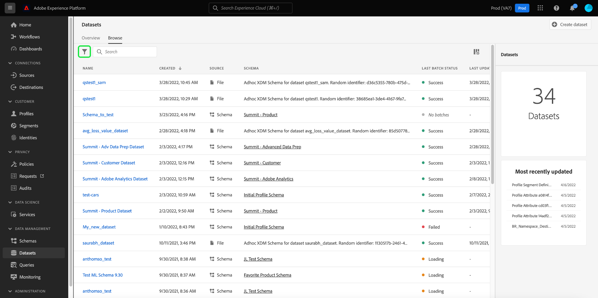

# を使用してダッシュボードデータセットを調査、検証、処理する [!DNL Query Service]

Adobe Experience Platformは、Experience PlatformUI 内で使用できるダッシュボードを通じて、組織のプロファイル、オーディエンス、宛先データに関する重要な情報を提供します。 その後、Adobe Experience Platform [!DNL Query Service] データレイクでこれらのダッシュボードを動作させる未加工データセットを調べ、検証し、処理する。

## [!DNL Query Service] 入門

Adobe Experience Platform [!DNL Query Service] は、標準 SQL を使用してデータレイクのデータに対してクエリを実行できるようにし、マーケターがデータからインサイトを得るのをサポートします。 [!DNL Query Service] は、データレイク内の任意のデータセットを結合し、クエリ結果を新しいデータセットとして取り込み、レポート、機械学習、リアルタイム顧客プロファイルへの取り込みに使用できるユーザーインターフェイスと API を提供します。

詳しくは、以下を参照してください。 [!DNL Query Service] Experience Platform内での役割は、まず読んでください [[!DNL Query Service] 概要](../query-service/home.md).

## 使用可能なデータセットへのアクセス

以下を使用できます。 [!DNL Query Service] プロファイル、オーディエンス、宛先ダッシュボードに対して未加工のデータセットをクエリする。 使用可能なデータセットを表示するには、Experience PlatformUI で「 」を選択します。 **データセット** 左側のナビゲーションで、「データセット」ダッシュボードを開きます。 ダッシュボードリストは、組織で使用可能なすべてのデータセットを管理します。リストに表示された各データセットに関する詳細（名前、データセットが適用されるスキーマ、最新の取り込み実行のステータスなど）が表示されます。


### システム生成データセット

>[!IMPORTANT]
>
>システム生成データセットは、デフォルトでは非表示になっています。 デフォルトでは、 [!UICONTROL 参照] 「 」タブには、データの取り込み先のデータセットのみが表示されます。

システム生成データセットを表示するには、フィルターアイコン () が検索バーの左側に表示されます。



サイドバーが開き、2 つのトグルが表示されます。 [!UICONTROL プロファイルに含まれる] および [!UICONTROL システムデータセットを表示]. 切り替えを選択 [!UICONTROL システムデータセットを表示] を使用して、システム生成データセットをデータセットの参照可能なリストに含めます。


### プロファイル属性データセット

プロファイルダッシュボードのインサイトは、組織で定義された結合ポリシーに結び付けられます。アクティブな結合ポリシーごとに、データレイクで使用できるプロファイル属性データセットがあります。

これらのデータセットの命名規則は、**Profile-Snapshot-Export** の後に、システムで生成されるランダムなアルファ値が続きます。例：`Profile-Snapshot-Export-abbc7093-80f4-4b49-b96e-e743397d763f`。

各プロファイルスナップショット書き出しデータセットの完全なスキーマを理解するには、Experience Platform UI の[データセットビューアを使用](../catalog/datasets/user-guide.md)して、 データセットをプレビューし、調査します。


#### プロファイル属性データセットと結合ポリシー ID のマッピング

システムで生成される各プロファイル属性データセットに割り当てられる英数字の値は、組織が作成した結合ポリシーの 1 つの結合ポリシー ID にマッピングされるランダムな文字列です。 各結合ポリシー ID と関連するプロファイル属性データセット文字列とのマッピングは、`adwh_dim_merge_policies` データセットで保持されます。

`adwh_dim_merge_policies` データセットには、次のフィールドが含まれます。

* `merge_policy_name`
* `merge_policy_id`
* `merge_policy`
* `dataset_id`

このデータセットは、クエリエディター UI を使用して Experience Platform で確認できます。クエリエディターの使用について詳しくは、[クエリエディターの UI ガイド](../query-service/ui/user-guide.md)を参照してください。

### オーディエンスメタデータデータセット

組織の各オーディエンスのメタデータを含むデータレイクで使用できるオーディエンスメタデータデータセットがあります。

このデータセットの命名規則は、**Segmentdefinition-Snapshot-Export** の後に英数字が続きます。例：`Segmentdefinition-Snapshot-Export-acf28952-2b6c-47ed-8f7f-016ac3c6b4e7`

各セグメント定義のスナップショット書き出しデータセットの完全なスキーマを理解するには、[Experience Platform UI のデータセットビューアを使用して、 ](../catalog/datasets/user-guide.md)データセットをプレビューし、調査します。

### 宛先メタデータデータセット

組織でアクティブ化されたすべての宛先のメタデータは、データレイクで未加工データセットとして使用できます。

このデータセットの命名規則は **DIM_Destination** です。

DIM の宛先データセットの完全なスキーマを理解するには、Experience Platform UI の[データセットビューアを使用して、](../catalog/datasets/user-guide.md)データセット をプレビューし、調査します。


## （ベータ版）顧客データプラットフォーム (CDP) のインサイトレポート

>[!IMPORTANT]
>
>CDP インサイトデータモデル機能はベータ版です。 その機能とドキュメントは変更される可能性があります。

CDP インサイトデータモデル機能は、様々なプロファイル、宛先、セグメント化ウィジェットに関するインサイトを強化する SQL を公開します。 これらの SQl クエリテンプレートをカスタマイズして、マーケティングおよび KPI の使用例に応じて CDP レポートを作成できます。

CDP レポートは、プロファイルデータに関するインサイトと、そのオーディエンスおよび宛先との関係を提供します。 の方法の詳細については、 CDP インサイトデータモデルのドキュメントを参照してください。 [特定の KPI 使用例に対する CDP インサイトデータモデルの適用](./cdp-insights-data-model.md).

## クエリの例

次のクエリ例には、 [!DNL Query Service] ダッシュボードの強力な未加工データセットを調べ、検証し、処理する。

### ID 別プロファイル数

このプロファイルインサイトは、データセット内のすべての結合プロファイルにわたって ID の分類を提供します。

>[!NOTE]
>
>1 つのプロファイルに複数の名前空間が関連付けられている可能性があるので、ID 別のプロファイルの合計数（各名前空間に表示される値をまとめたもの）は、結合されたプロファイルの合計数より多くなる場合があります。例えば、顧客が複数のチャネルでブランドとやり取りする場合、複数の名前空間がその個々の顧客に関連付けられます。

**クエリ**

```sql
Select
        Key namespace,
        count(1) count_of_profiles
     from
        (
           Select
               explode(identitymap)
           from
              Profile-Snapshot-Export-abbc7093-80f4-4b49-b96e-e743397d763f
        )
     group by
        namespace;
```

### オーディエンス別プロファイル数

このオーディエンスインサイトは、データセット内の各オーディエンス内の結合プロファイルの合計数を提供します。 この数は、プロファイルフラグメントを結合してオーディエンス内の個々のユーザーに対して 1 つのプロファイルを形成するために、オーディエンス結合ポリシーをプロファイルデータに適用した結果です。

```sql
Select          
        concat_ws('-', key, source_namespace) audience_id,
        count(1) count_of_profiles
      from
        (
            Select
              Upper(key) as source_namespace,
              explode(value)
            from
              (
                  Select
                    explode(Audiencemembership)
                  from
                    Profile-Snapshot-Export-abbc7093-80f4-4b49-b96e-e743397d763f
              )
        )
      group by
      audience_id
```

## 次の手順

このガイドを読むと、 [!DNL Query Service] を使用して、プロファイル、オーディエンス、宛先ダッシュボードを実行する未加工データセットを調査および処理するためのクエリを複数実行します。

各ダッシュボードとその指標について詳しくは、ドキュメントのナビゲーションで使用可能なダッシュボードのリストからダッシュボードを選択してください。
