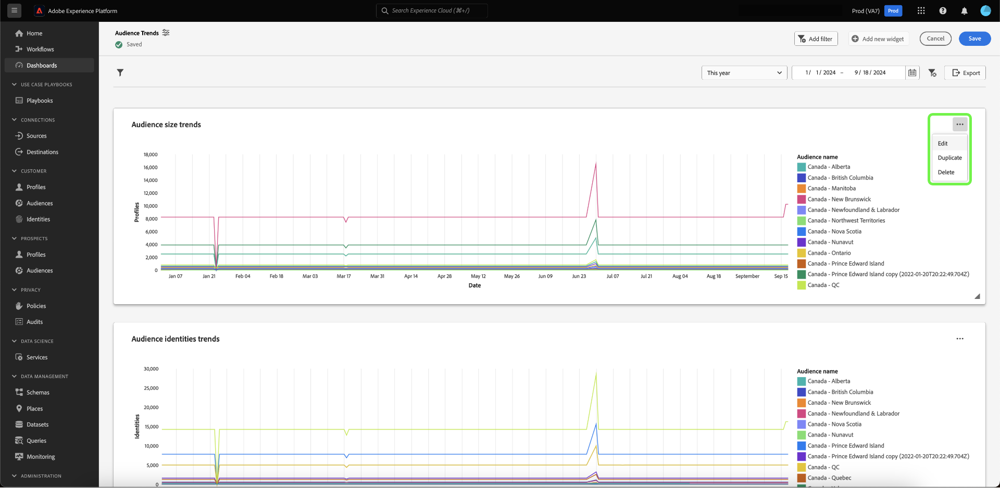

# ドリルスルー {#drill-through}

ドリルスルーを使用すると、任意のグラフから新しいダッシュボードに簡単に移動できるので、多層データ分析が容易になります。 この機能を使用すると、傾向、顧客行動、運用指標などを調査する際に、概要レベルの概要から詳細なレポートに簡単に移行でき、常に必要なコンテキストを確保できます。

システムは、ソースダッシュボードからターゲットダッシュボードにグローバルフィルターと日付範囲フィルターを自動的に渡すことで、開始する分析が、完全なドリルスルーエクスペリエンス全体を通してシームレスに継続されるようにします。 スタディの様々なレイヤー間のナビゲーションを容易にするために、システムは複数レベルのドリルスルーを可能にします。

## ドリルスルーの作成 {#create-drill-through}

ドリルスルーを作成するには、まずダッシュボード・ビューから **[!UICONTROL 編集]** を選択します。

ドリルスルーするチャートの省略記号を選択し、「**[!UICONTROL 編集]**」を選択します。

[!UICONTROL &#x200B; プロパティ &#x200B;] パネルで、切替スイッチを使用して **[!UICONTROL ドリルスルーを有効にする]** を有効にし、ドロップダウンを使用して **[!UICONTROL ターゲット・ダッシュボード]** を選択します。 「**[!UICONTROL フィルターのパススルー]**」の切替スイッチが有効になっていることを確認してから、「**[!UICONTROL 保存して閉じる]**」を選択します。

>[!INFO]
>
>ターゲットダッシュボードで上記のハイライト表示された手順を繰り返して、複数レベルのドリルスルーを設定します。

## ドリルスルーの表示 {#view-drill-through}

ドリルスルーを表示するには、ダッシュボード・ビューからチャートの省略記号を選択し、「**[!UICONTROL ドリルスルー]**」を選択します。

ドリルスルー・ターゲット・ダッシュボードが表示されます。 複数レベルのドリルスルーがある場合は、この手順を繰り返します。

>[!NOTE]
>
>ソースダッシュボードで適用されたフィルターは、ターゲットダッシュボードに渡されます。 ただし、子ダッシュボードでは、日付フィルターとグローバルフィルターは無効です。

## ドリルスルーの削除 {#remove-drill-through}

ドリルスルーを削除するには、まずダッシュボード・ビューから **[!UICONTROL 編集]** を選択します。

ドリルスルーを削除するチャートの省略記号を選択し、「**[!UICONTROL 編集]**」を選択します。

[!UICONTROL &#x200B; プロパティ &#x200B;] パネルで、無効にする切替スイッチ **[!UICONTROL ドリルスルーを有効にする]** を選択してから、「**[!UICONTROL 保存して閉じる]** を選択します。

![&#x200B; 「ドリルスルーの有効化 [!UICONTROL &#x200B; が強調表示された切替スイッチが使用不可になっているグラフのプロパティ &#x200B;] パネル &#x200B;](../images/sql-insights-query-pro-mode/drill-through-disable.png)

## 次の手順

このドキュメントでは、ダッシュボードのドリルスルーの作成方法を確認しました。 また、[&#x200B; ガイド付きデザインモードガイド &#x200B;](../standard-dashboards.md) を使用して、Adobe Experience Platform UI で既存のデータモデルからグラフを生成する方法についても説明します。
