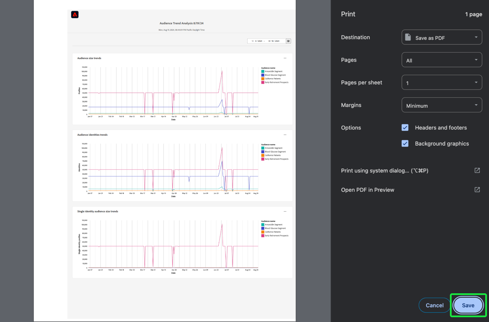

# Export PDF {#export-pdf}

[query pro mode](./overview.md#query-pro-mode) を使用して [ カスタムinsight](./overview.md) を作成したら、グラフデータをPDF形式で書き出すことができます。 このアクションは、カスタムダッシュボードの概要から取得されます。

ダッシュボードワークスペースで、「[!UICONTROL &#x200B; 参照 &#x200B;] タブにリストされているインベントリからカスタムダッシュボードを選択します。

カスタムダッシュボードが表示されます。 次に、UI の右上から **[!UICONTROL 書き出し]** を選択します。

>[!NOTE]
>
>ビジュアライゼーションのみのエクスポートでは、[!UICONTROL &#x200B; ダッシュボードデータのエクスポート &#x200B;] 権限は必要ありません。 詳しくは、[[!UICONTROL &#x200B; 詳細を表示 &#x200B;] ドキュメント ](./view-more.md#export) を参照してください。

**[!UICONTROL ファイルを書き出し]** ダイアログが表示されます。 最後に、「**[!UICONTROL ダウンロード]**」を選択します。

PDF プレビューが表示されます。 「**[!UICONTROL 保存]**」を選択して、プロセスを完了します。

