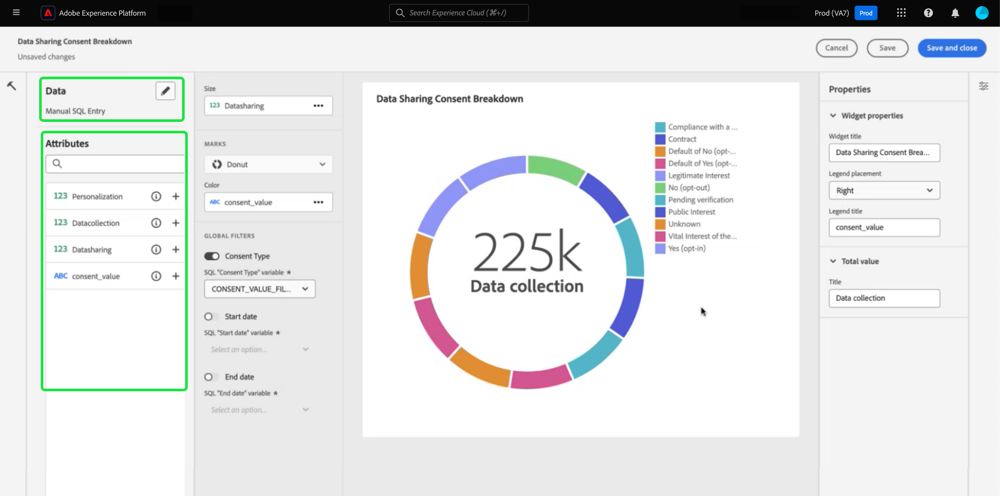

# 拡張アプリケーション レポート用の SQL インサイト

カスタム SQL クエリを使用すると、様々な構造化データセットからインサイトを効果的に抽出できます。 技術者は、query pro モードを使用して SQL で複雑な分析を実行し、カスタムダッシュボードのグラフを使用してこの分析を技術者以外のユーザーと共有したり、CSV ファイルで書き出したりできます。 このinsightの作成方法は、明確な関係を持つテーブルに適しており、ニッチなユースケースに適したインサイトやフィルター内でカスタマイズの度合いを高めることができます。

>[!IMPORTANT]
>
>Query pro モードは、[Data Distiller SKU](../../query-service/data-distiller/overview.md) を購入したユーザーのみが利用できます。

SQL からインサイトを生成するには、まずダッシュボードを作成する必要があります。

## カスタムダッシュボードの作成 {#create-custom-dashboard}

カスタムダッシュボードを作成するには、左側のナビゲーションパネルから **[!UICONTROL Dashboards]** を選択して、ダッシュボード ワークスペースを開きます。 次に、「**[!UICONTROL Create dashboard]**」を選択します。

**[!UICONTROL Create dashboard]** ダイアログが表示されます。 ダッシュボードの作成方法を選択する方法は 2 つあります。 インサイトを作成するには、[[!UICONTROL Guided design mode]](../standard-dashboards.md) で既存のデータモデルを使用するか、[!UICONTROL Query pro mode] で独自の SQL を使用できます。

<!-- Maybe reference Guided design mode in other places on UDD doc. -->

既存のデータモデルを使用すると、特定のビジネスニーズに合わせて構造化された、効率的かつスケーラブルなフレームワークを提供できるというメリットがあります。 [&#x200B; 既存のデータモデルからインサイトを作成する &#x200B;](../standard-dashboards.md#create-widget) 方法については、カスタムダッシュボードガイドを参照してください。

SQL クエリから生成されたインサイトは、はるかに高い柔軟性とカスタマイズを提供します。 技術者は、query pro モードを使用して SQL で複雑な分析を実行し、このダッシュボード機能を通じて技術者以外のユーザーとこの分析を共有できます。 **[!UICONTROL Query pro mode]** を選択し、続けて **[!UICONTROL Save]** を選択します。

>[!NOTE]
>
>選択を行った後は、そのダッシュボード内でこの選択を変更することはできません。 代わりに、別のダッシュボード作成方法で新しいダッシュボードを作成する必要があります。

![Query pro モードと「保存」がハイライト表示された [!UICONTROL Create dashboard] ダイアログ &#x200B;](../images/sql-insights-query-pro-mode/query-pro-mode.png)

## クエリプロモードの概要 {#query-pro-mode}

Query pro モードは、Adobe Experience Platform UI でカスタム SQL クエリを使用してインサイトを生成するプロセスをガイドする、SQL エディターベースのワークフローです。 カスタム SQL クエリでインサイトを生成する前に、まずダッシュボードを作成する必要があります。

## SQL を作成 {#compose-sql}

query pro モードでダッシュボードを作成することを選択すると、**[!UICONTROL Enter SQL]** ダイアログが表示されます。 ドロップダウンメニューからクエリするデータベース（インサイトデータモデル）を選択し、query pro エディターでデータセットに適したクエリを入力します。

>[!NOTE]
>
>Query pro モードは、Data Distiller SKU を購入したユーザーのみが使用できます。 [[!UICONTROL Guided design mode]](../standard-dashboards.md) は、すべてのユーザーが既存のデータモデルからインサイトを作成できます。

UI 要素について詳しくは、[&#x200B; クエリエディターユーザーガイド &#x200B;](../../query-service/ui/user-guide.md#query-authoring) を参照してください。

![&#x200B; データセットのドロップダウンメニューと「実行」アイコンがハイライト表示された [!UICONTROL Enter SQL] ダイアログ。ダイアログには SQL クエリが入力され、「クエリパラメーター」タブが表示されます。](../images/sql-insights-query-pro-mode/enter-sql-database-dropdown.png)

### クエリパラメーター {#query-parameters}

[&#x200B; グローバル &#x200B;](./filters/global-filter.md) または [&#x200B; 日付フィルターを含めるには &#x200B;](./filters/date-filter.md) クエリ **必須** でクエリパラメーターを使用します。 query pro モードで文を作成する場合、クエリでクエリパラメーターを使用する場合は、サンプル値を指定する必要があります。 サンプル値を使用すると、SQL ステートメントを実行してグラフを作成できます。 ステートメントを作成するときに指定するサンプル値は、実行時に日付またはグローバルフィルターに選択する実際の値に置き換えられます。

>[!IMPORTANT]
>
>グローバルフィルターを使用する場合は、SQL にクエリパラメーターを配置し、そのクエリパラメーターをウィジェットコンポーザーのグローバルフィルターにリンクする必要があります。 以下のスクリーンショットでは、SQL でグローバルフィルターのクエリパラメーターとして `CONSENT_VALUE_FILTER` が使用されています。 これを行う方法について詳しくは、[&#x200B; グローバルフィルタードキュメント &#x200B;](./filters/global-filter.md#enable-global-filter) を参照してください。

クエリを実行するには、実行アイコン（）に設定します。 クエリエディターに「結果」タブが表示されます。 次に、設定を確認してウィジェットコンポーザーを開き、「**[!UICONTROL Select]**」を選択します。

>[!TIP]
>
>クエリでクエリパラメーターを使用する場合は、クエリを 1 回実行して、使用されるすべてのクエリパラメーターキーを事前入力します。 クエリは失敗しますが、UI には自動的に「クエリパラメーター」タブが表示され、含まれているすべてのキーが一覧表示されます。 キーに適切な値を追加します。

![SQL 入力を含む [!UICONTROL Enter SQL] ダイアログ、表示された「結果」タブ、「選択」がハイライト表示されています。](../images/sql-insights-query-pro-mode/enter-sql-select.png)

## ウィジェットを入力 {#populate-widget}

ウィジェットコンポーザーに、実行した SQL の列が入力されるようになりました。 ダッシュボードのタイプは、左上に示されます。この場合は [!UICONTROL Manual SQL Entry] です。 鉛筆アイコン（）を選択して、任意の時点で SQL を編集できます。

>[!TIP]
>
>使用可能な属性は、実行された SQL から取得された列です。

ウィジェットを作成するには、[!UICONTROL Attributes] 列にリストされている属性を使用します。 検索バーを使用して、属性を検索したり、リストをスクロールしたりできます。

### 属性を追加 {#add-attributes}

ウィジェットに属性を追加するには、プラスアイコン（）を選択します。 表示されるドロップダウンメニューを使用すると、SQL で決定されたオプションからグラフに属性を追加できます。 グラフのタイプが異なると、X 軸や Y 軸のドロップダウンなど、オプションが異なります。

このドーナツグラフの例では、オプションはサイズと色です。 色はドーナツグラフの結果を色分けし、サイズは使用される実際の指標です。 [!UICONTROL Color] フィールドに属性を追加し、その属性の構成に基づいて結果を異なる色に分割します。

>[!TIP]
>
>上向き矢印アイコンと下向き矢印アイコン（）を選択して、棒グラフまたは折れ線グラフの X 軸と Y 軸の配置を切り替えます。

ウィジェットのグラフまたはグラフのタイプを変更するには、[!UICONTROL Marks] ドロップダウンの使用可能なオプションから選択します。 オプションには、[!UICONTROL Line]、[!UICONTROL Donut]、[!UICONTROL Big number]、[!UICONTROL Bar] があります。 選択すると、ウィジェットの現在の設定のプレビュービジュアライゼーションが生成されます。

## 高度なテーブル属性 {#advanced-attributes}

テーブルの任意の列またはすべての列に自動ソート機能を適用するには、「**[!UICONTROL Edit]**」を選択してダッシュボード全体を編集します。

列の並べ替えを追加するテーブルグラフで省略記号（`...`）を選択し、「**[!UICONTROL Edit]**」を選択します。

任意の列で並べ替えを有効にするには、**[!UICONTROL Sortable]** のチェックボックスをオンにします。

「プロパティ」アイコン（）を選択し、[!UICONTROL Properties] パネルを開きます。 **[!UICONTROL Properties]** パネルで、ドロップダウンを使用して **[!UICONTROL Default sort]** 列を選択し、ドロップダウンを使用して **[!UICONTROL Sort direction]** 列を選択します。 最後に、「**[!UICONTROL Save and close]**」を選択します。

並べ替え、列のサイズ変更、ページネーションの機能の使用について詳しくは、[&#x200B; 詳細を表示 &#x200B;](./view-more.md) を参照してください。

## ウィジェットのプロパティ {#properties}

「プロパティ」アイコン（）を選択し、プロパティパネルを開きます。 [!UICONTROL Properties] パネルの **[!UICONTROL Widget title]** テキストフィールドにウィジェットの名前を入力します。 グラフのさまざまな要素の名前を変更することもできます。

>[!NOTE]
>
>プロパティ サイドバーで使用できる特定のフィールドは、編集しているグラフのタイプによって異なります。

## ウィジェットを保存 {#save-widget}

ウィジェットコンポーザーで保存すると、ウィジェットがダッシュボードにローカルに保存されます。 作業内容を保存し、後で再開する場合は、「**[!UICONTROL Save]**」を選択します。 ウィジェット名の下のチェックマークアイコンは、ウィジェットが保存されたことを示します。 または、ウィジェットの設定が完了したら、「**[!UICONTROL Save and close]**」を選択し、ダッシュボードにアクセスできる他のすべてのユーザーがウィジェットを使用できるようにします。 「キャンセル」を選択して作業を中断し、カスタムダッシュボードに戻ります。

## ダッシュボードとグラフの編集 {#edit}

「**[!UICONTROL Edit]**」を選択して、ダッシュボード全体または任意のインサイトを編集します。 編集モードでは、ウィジェットのサイズ変更、SQL の編集、グローバルおよび時間フィルターの作成と適用を行うことができます。 これらのフィルターは、ダッシュボードウィジェットに表示されるデータを制限します。 これは、様々なユースケースに合わせてインサイトをすばやく更新し、微調整する便利な方法です。

**[!UICONTROL Add filter]** を選択して、[[!UICONTROL Date filter]](#create-date-filter) または [[!UICONTROL Global filter]](#create-global-filter) を作成します。 作成したら、すべてのグローバルフィルターおよび日付フィルターを [&#x200B; フィルターアイコン &#x200B;](#select-global-filter) （）を選択します。

## insightの編集、複製、削除

[&#x200B; 既存のウィジェットを編集、複製、削除する &#x200B;](../standard-dashboards.md#duplicate) 方法については、カスタムダッシュボードガイドを参照してください。

## 次の手順

このドキュメントでは、Adobe Experience Platform UI で SQL クエリを記述して、カスタムダッシュボードのグラフを生成する方法を確認しました。 次に、[&#x200B; 日付フィルターの作成 &#x200B;](./filters/date-filter.md) または [&#x200B; グローバルフィルターの作成 &#x200B;](./filters/global-filter.md) を使用して、データをさらに充実させる方法を説明します。

また、[SQL で分析したデータに対する様々な表示オプション &#x200B;](./view-more.md) または [&#x200B; カスタムインサイトの背後にある SQL を表示 &#x200B;](./view-sql.md) など、他のカスタムインサイト機能についても説明します。
