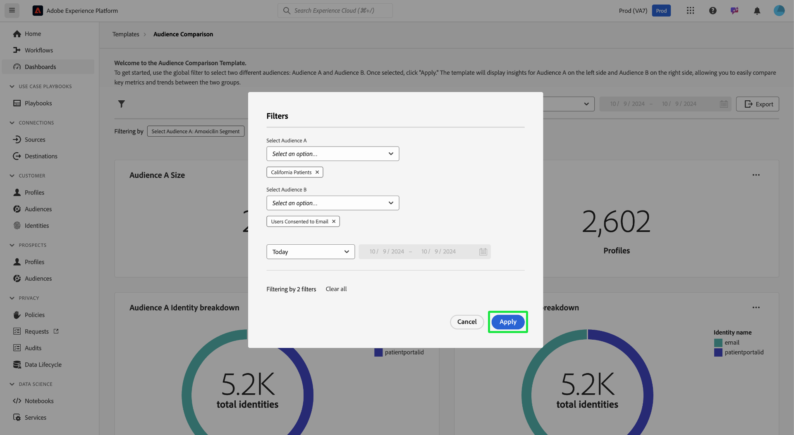

# オーディエンスの比較

[!UICONTROL &#x200B; オーディエンス比較 &#x200B;] ダッシュボードは、主要なオーディエンス指標を並べて表示し、比較できます。 このダッシュボードでは、様々なアクションを実行して、2 つのオーディエンスグループを比較し、それらの間で主要指標を分析できます。 その後、オーディエンスのセグメント化およびターゲティング戦略に関して、データに基づく意思決定を行うことができます。

## オーディエンス比較の設定 {#set-audience-comparisons}

より有意義なインサイトと比較を可能にするには、システムフィルターを使用して、分析するオーディエンスセグメントや期間を正確にターゲットにします。 フィルターアイコン（）を選択して、2 つの異なるオーディエンス（[!UICONTROL &#x200B; オーディエンス A] および [!UICONTROL &#x200B; オーディエンス B]）を選択し、比較する特定のパラメーターを設定します。

[!UICONTROL &#x200B; フィルター &#x200B;] ダイアログが表示されます。 分析する最初のオーディエンスを選択するには、「**[!UICONTROL オーディエンス A を選択]**」ドロップダウンを選択します。 この例では、`California Patients` がオーディエンス A として選択されています。このオーディエンスは、フィルターの適用後、比較の左側に表示されます。

次に、[!UICONTROL &#x200B; オーディエンス B を選択 &#x200B;] ドロップダウンから、**[!UICONTROL オーディエンス A]** と比較する 2 番目のオーディエンスを選択します。 この画像では、[!UICONTROL &#x200B; メールに同意したユーザー &#x200B;] が [!UICONTROL &#x200B; オーディエンス B] として選択されています。 このオーディエンスは、フィルターの適用後、[!UICONTROL &#x200B; オーディエンス比較 &#x200B;] ダッシュボードの右側に表示されます。

### 日付範囲の調整 {#adjust-date-ranges}

また、特定の期間でデータをフィルタリングして、カスタムの日付範囲でこれらのオーディエンスがどのように実行または変化するかを確認することもできます。 オーディエンスデータを特定の期間でフィルタリングする時間範囲を設定するには、カレンダーフィールドから開始日と終了日を選択します。

このダイアログには、適用されているフィルターの数も示されます（以下のスクリーンショットでは、オーディエンス A とオーディエンス B、および日付範囲としての今日の 2 つのフィルターが使用されています）。 適用したすべてのフィルターを削除するには、「**[!UICONTROL すべてクリア]**」を選択します。

オーディエンスと日付範囲を設定したら、「**[!UICONTROL 適用]**」を選択して [!UICONTROL &#x200B; オーディエンス比較 &#x200B;] ダッシュボードを更新します。

ダッシュボードに、オーディエンスごとに並べて表示される比較グラフが表示されるようになりました。

## 使用可能なオーディエンス比較グラフ {#available-charts}

<!-- Potentially could expand this section to include images of each widget.  -->

ダッシュボードには、インサイトを比較するための複数のグラフが表示されます。

- [[!UICONTROL &#x200B; オーディエンスサイズ &#x200B;]](../../guides/audiences.md#audience-size)：各オーディエンスのサイズを、それらが含まれるプロファイルの数に基づいて容易に追跡します。 この指標は、比較する 2 つのオーディエンスの規模を理解するのに役立ちます。
- [!UICONTROL &#x200B; オーディエンス ID の分類 &#x200B;]：円グラフは、各オーディエンス内の ID の相対的な構成の分類を提供します。 ID の合計数を表示し、様々な識別子（メールや CRM ID など）がその合計数にどのように貢献するかを確認できます。 このグラフを使用すると、ID タイプに基づいて各オーディエンスの構成を理解できます。 円グラフのセクションの上にマウスポインターを置くと、ID の正確な数が表示されます。
- [[!UICONTROL &#x200B; オーディエンスサイズのトレンド &#x200B;]](../../guides/audiences.md#audience-size-trend)：このグラフは、選択したオーディエンスのサイズのトレンドの推移を表します。 これらのグラフを使用して、選択した期間における各オーディエンスのサイズの変化を視覚化します。ピークとトラフは、プロファイル数の増加または減少の期間を示します。
- [[!UICONTROL &#x200B; オーディエンスサイズ変化トレンド &#x200B;]](../../guides/audiences.md#audience-size-change-trend)：このグラフには、選択したオーディエンスのサイズ変化トレンドが表示されます。 時間の経過と共にオーディエンスサイズが増加または減少した量を視覚化し、オーディエンス母集団の重要なシフトやトレンドを特定できます。

>[!NOTE]
>
>[!UICONTROL &#x200B; オーディエンスサイズのトレンド &#x200B;] および [!UICONTROL &#x200B; オーディエンスサイズの変化のトレンド &#x200B;] グラフを使用すると、指定した期間の 2 つのオーディエンス間での絶対サイズとサイズの変動の両方を追跡および比較できます。 この情報により、オーディエンスの変更に影響を与えるパターンや要因を理解しやすくなります。

## インサイトの書き出し {#export-insights}

フィルターを適用してオーディエンスを分析したら、オフラインでの分析やレポートに役立てるためにデータを書き出すことができます。 インサイトをエクスポートするには、テーブルの右上にある **[!UICONTROL エクスポート]** を選択します。 印刷PDFダイアログが表示されます。 このダイアログから、PDFとして保存したり、テーブルに表示されているデータを印刷したりできます。

「**[!UICONTROL テンプレート]**」を選択して [!UICONTROL &#x200B; テンプレート &#x200B;] の概要に戻ります。

## 次の手順

このドキュメントでは、**オーディエンス比較** ダッシュボードを使用して、様々なオーディエンスグループ間で主要指標を比較する方法について説明しました。 オーディエンスのセグメント化およびターゲティング戦略を継続的に改善するには、さらなるインサイトを提供する他の Data Distiller テンプレートを参照します。 意思決定をさらに強化し、エンゲージメントの取り組みを最適化するには、[&#x200B; オーディエンスの傾向 &#x200B;](./trends.md)、[&#x200B; オーディエンス ID の重複 &#x200B;](./identity-overlaps.md) および [&#x200B; 高度なオーディエンスの重複 &#x200B;](./overlaps.md) の UI ガイドを参照してください。

