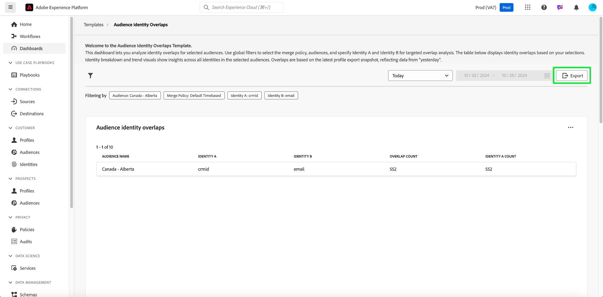

# オーディエンス ID の重複

[!UICONTROL &#x200B; オーディエンス ID の重複 &#x200B;] ダッシュボードを使用して、選択したオーディエンスの ID の重複を分析します。 オーディエンス内の様々な ID の相関関係に関するインサイトを使用して、ステッチ戦略を最適化し、冗長性を軽減し、顧客セグメント化の精度を向上させることができます。 ID タイプ間の重複をより深く理解することで、効果的なターゲティング戦略を策定し、顧客とのインタラクションを効率化します。

## オーディエンスのフィルタリング {#filter-audiences}

カスタムフィルターを使用して、特定のオーディエンスや ID タイプのターゲット分析を行い、提示されたデータが分析目標に確実に合致するようにします。 分析を開始するには、フィルターアイコン（）を選択します。

**[!UICONTROL フィルター]** ダイアログが表示されます。 このビューから、グローバルフィルターを選択して、比較するオーディエンス、結合ポリシーおよび ID を設定します。 各セクションのドロップダウンメニューから分析用の設定を選択します

1. **[!UICONTROL オーディエンス]** の選択：分析するオーディエンスセグメント（例：**カナダ – アルバータ**）を選択します。
2. **[!UICONTROL 結合ポリシー]** を指定：選択したオーディエンス全体で ID を組み合わせる方法を指定する結合ポリシーを定義します（例のスクリーンショットでは、**デフォルトの時間ベース** ポリシーが選択されています）。
3. 比較する **[!UICONTROL ID A]** と **[!UICONTROL ID B]** を選択します&#x200B;**：比較する 2 つの ID タイプを選択します。 例では、**&#x200B;ID A **&#x200B; は「crmId」として選択され、**&#x200B;ID B** は「メール」として選択されます。
4. **日付範囲の設定**:「今日」などの事前定義済みの範囲を選択するか、カレンダーフィールドを使用して開始日と終了日を手動で設定します。

>[!TIP]
>
>すべてのカスタムグローバルフィルターをクリアするには、**[!UICONTROL フィルター]** ダイアログから [!UICONTROL &#x200B; すべてクリア &#x200B;] を選択します。 1 つのフィルターを削除するには、フィルター名の右側にある「[!UICONTROL X]」を選択します。

フィルターを選択したら、「**[!UICONTROL 適用]**」を選択してダッシュボードを更新します。

## 使用可能なダッシュボードインサイト {#available-insights}

**オーディエンス ID の重複** ダッシュボードは、オーディエンス内の ID の重複とトレンドを理解するのに役立つ、複数のビジュアライゼーションと表形式のデータを提供します。

### オーディエンス ID の重複 {#overlaps-table}

**[!UICONTROL オーディエンス ID の重複]** テーブルには、選択したフィルターに基づいて ID の重複が表示されます。 この情報を使用して、異なる ID タイプ間の重複を評価し、ID がどのように効果的に解決されているかを理解します。 次の表に、各列の詳細を示します。

| 列名 | 説明 |
|-----------------|-------------------------------|
| **[!UICONTROL オーディエンス名]** | 分析するオーディエンスの名前。 この列は、対象となるターゲットグループにインサイトが焦点を当てているかどうかを確認するために、レビュー中のオーディエンスセグメントを識別します。 |
| **[!UICONTROL ID A]** および **[!UICONTROL ID B]** | 比較される ID （例：`crmId` および `email`）。 どの ID タイプが比較されているかを把握すると、オーディエンスの重複に貢献する ID 解決戦略を特定し、それらの関係を最適化するのに役立ちます。 |
| **[!UICONTROL 重複数]** | 両方の ID が存在するプロファイルの数。 この指標は、オーディエンス内の ID の重複の程度に関するインサイトを提供します。 この情報は、複数の ID が統合プロファイルにどのように効果的に解決されているかを評価するために重要です。これにより、ターゲティングとパーソナライゼーション戦略を改善できます。 |
| **[!UICONTROL Id A カウント]** | **ID A** を含む、選択したオーディエンスのプロファイルの合計数。 この情報を使用して、オーディエンス内のプライマリ ID タイプの普及率を理解し、重複分析でのその役割を評価します。 |

### ID の分類 {#identity-breakdown}

**[!UICONTROL ID の分類]** グラフには、選択したオーディエンス内の ID の相対的な構成が表示されます。 X 軸は選択したオーディエンス内の ID の合計数を表し、Y 軸は分析するオーディエンス名を表します。 このビジュアライゼーションを使用すると、各 ID タイプの普及率を把握し、ID 管理戦略の影響を評価できます。 グラフは、異なる色を使用して ID タイプを区別し、オーディエンス全体での ID の配布方法の概要を簡単に提供します。

>[!TIP]
>
>列にカーソルを合わせると、各 ID タイプのプロファイルの個人数が表示されます。

### オーディエンス Id のトレンド {#audience-identity-trends}

**[!UICONTROL オーディエンス ID のトレンド]** グラフは、ID の合計数が時間の経過と共にどのように変化したかに関するインサイトを提供します。 X 軸は分析される日付範囲を表し、Y 軸はオーディエンス別の ID の合計数を表します。 この指標を使用して、ID の増加を追跡し、安定性を評価し、進行中の ID 管理作業の有効性を測定します。

>[!TIP]
>
>グラフの日付にポインタを合わせると、特定の日付におけるオーディエンスの ID の合計数が表示されます。

## インサイトの書き出し {#export-insights}

ID の重複を分析した後、オフラインでの分析やレポート用にデータを書き出すことができます。 データを書き出すには、テーブルの右上にある **[!UICONTROL 書き出し]** を選択します。 印刷PDFダイアログが表示され、視覚化されたデータをPDFとして保存したり印刷したりできます。

**オーディエンス ID の重複** ダッシュボードは、選択したオーディエンス間で様々な ID がどのように交差するかについての重要なインサイトを提供します。 これらのインサイトを活用することで、ID ステッチ戦略を調整し、冗長性を軽減し、オーディエンスのセグメント化をより正確かつ効果的にします。

## 次の手順

このドキュメントでは、**オーディエンス ID の重複** ダッシュボードを使用して、選択したオーディエンスの ID の重複に関する貴重なインサイトを得る方法を説明しました。 オーディエンスのセグメント化と ID 管理の理解をさらに深めるには、包括的なインサイトを提供する他の Data Distiller テンプレートを参照します。 ターゲット設定とエンゲージメントの戦略を引き続き改善するには、[ オーディエンスの傾向 ](./trends.md)、[ オーディエンス比較 ](./comparison.md) および [ 高度なオーディエンスの重複 ](./overlaps.md) の UI ガイドを参照してください。

