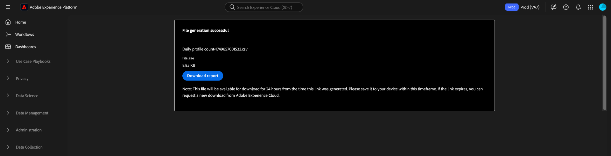
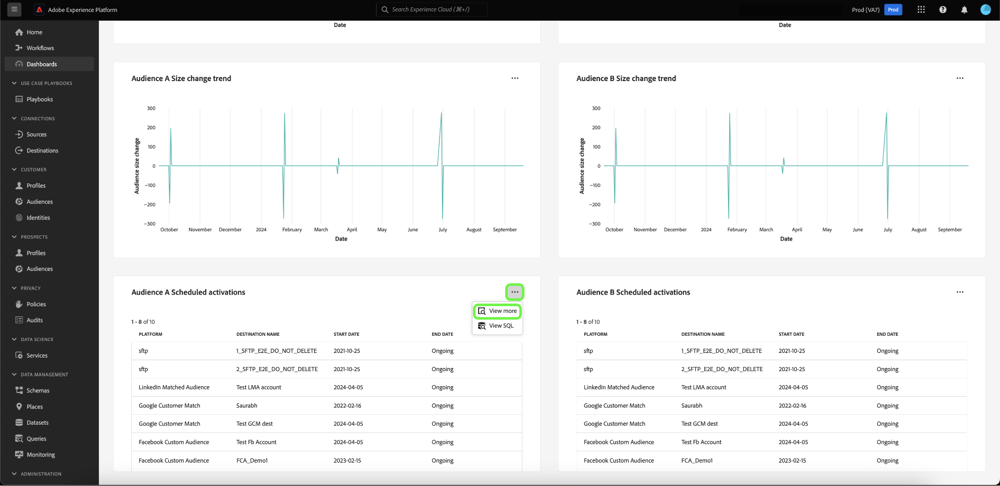

# さらに表示 {#view-more}

[query pro mode](./overview.md#query-pro-mode) を使用して [custom insight](./overview.md) を作成した後、複数の形式でグラフデータを表示できます。 結果の表形式を表示するか、データを CSV 形式またはメールで書き出すことができます。

## 表形式の結果 {#tabulated-results}

SQL から Query pro モードを使用して作成したすべてのグラフについて、Experience Platform UI 内で表形式の分析結果を表示できます。

カスタムダッシュボードから、任意のウィジェットの省略記号（`...`）を選択して、「[!UICONTROL &#x200B; さらに表示 &#x200B;]」および「[!UICONTROL SQL を表示 &#x200B;]」オプションにアクセスします。

## 書き出し {#export}

**[!UICONTROL さらに表示]** ダイアログから、CSV ファイルを直接ダウンロードするか、メールへのリンクを送信して後で安全にダウンロードすることにより、テーブルデータを書き出します。

>[!IMPORTANT]
>
>書き出しオプションにアクセスするには、管理者から **[!UICONTROL ダッシュボードデータの書き出し]** 権限を付与される必要があります。 「[!UICONTROL &#x200B; 書き出し &#x200B;]」ボタンがグレー表示されている場合は、管理者にお問い合わせください。 ダッシュボードの権限について詳しくは、[&#x200B; アクセス制御の概要 &#x200B;](../../access-control/home.md) を参照してください。

>[!NOTE]
>
>ビジュアライゼーションのみのエクスポートでは、[!UICONTROL &#x200B; ダッシュボードデータのエクスポート &#x200B;] 権限は必要ありません。 例えば、[Platform 形式のカスタムダッシュボードインサイト &#x200B;](./export-pdf.md) や [PDF UI ダッシュボードインサイト &#x200B;](../download.md) から処理済みデータを書き出す場合などです。

### CSV をダウンロード {#download-csv}

[!UICONTROL &#x200B; 詳細を表示 &#x200B;] ダイアログで「**[!UICONTROL 書き出し]**」を選択し、「**[!UICONTROL CSV をダウンロード]**」を選択して、チャートデータを CSV 形式でダウンロードします。

>[!NOTE]
>
>CSV のダウンロードは、最初の 500 レコードに制限されます。

### メールとして送信 {#send-as-email}

500 件を超えるレコードを書き出すには、「**[!UICONTROL 書き出し]**」を選択し、「ファイルを書き出し [!UICONTROL &#x200B; ダイアログで **[!UICONTROL メールとして送信]** を選択し &#x200B;] す。 このオプションを選択すると、Adobeに関連付けられたメールアドレスにダウンロードリンクが安全に送信されます。 受信者の名前と登録済みのAdobe メールアドレスが、ダイアログの [!UICONTROL &#x200B; 受信者 &#x200B;] セクションに表示されます。

[!UICONTROL &#x200B; メールとして送信 &#x200B;] を選択すると、Adobeがレポートを生成し、登録済みのAdobe アドレスにメールを送信します。 メールには、Experience Platform経由での認証を必要とするセキュアなダウンロードリンクが含まれています。

>[!NOTE]
>
>リンクの生成後 24 時間以内にレポートをダウンロードする必要があります。その後、ファイルの有効期限が切れます。

データを保護するために、Adobeは、書き出されたファイルを添付ファイルとして送信するのではなく、安全にホストします。 アクセスには、Experience Platform UI を使用した認証が必要で、Adobeが、目的の受信者のみがファイルをダウンロードしているかどうかを確認します。

この方法を使用すると、**最大 10,000 件のレコード** をエクスポートでき、機密データへの安全なアクセスが確保されます。

## 列で並べ替え {#sort-column}

表形式の結果を表示する場合、並べ替え機能を使用して、列を昇順または降順で並べ替えることができます。 カスタムダッシュボードから、任意のテーブルの省略記号（`...`）を選択して、「[!UICONTROL &#x200B; さらに表示 &#x200B;] オプションにアクセスします。

列名の横にあるドロップダウンメニューを選択し、「昇順で並べ替え **[!UICONTROL または「降順で並べ替え]** を選択すると、列を並べ替えるこ **[!UICONTROL ができ]** す。

>[!NOTE]
>
>[!UICONTROL &#x200B; 昇順で並べ替え &#x200B;] および [!UICONTROL &#x200B; 降順で並べ替え &#x200B;] オプションは、[&#x200B; 並べ替え機能 &#x200B;](./overview.md#advanced-attributes) で設定された列にのみ表示されます。

## 列のサイズ変更 {#resize-column}

表形式の結果の列のサイズを変更して、データを読みやすくすることができます。 カスタムダッシュボードから、テーブルの省略記号（`...`）を選択して、「[!UICONTROL &#x200B; 詳細を表示 &#x200B;]」オプションにアクセスします。 列名の横にあるドロップダウンメニューを使用して列名のサイズを変更し、「**[!UICONTROL 列のサイズを変更]**」を選択します。

スライダーを選択して左右にドラッグし、必要に応じて列サイズを調整します。

## テーブルのページネーション {#table-pagination}

[!UICONTROL &#x200B; 詳細を表示 &#x200B;] 機能で、ページネーションがテーブルに自動的に適用されるので、SQL クエリを手動で変更する必要はありません。 この機能により、より管理しやすい形式でデータが表示され、大きなデータセット間を簡単に移動できるようになります。

1 ページにつき最大 500 件のレコードを表示できます。 レコード間を移動するには、ページ下部の **[!UICONTROL >]** を使用します。

## 次の手順

このドキュメントでは、カスタムグラフの SQL 分析の表形式の結果を表示する方法と、そのデータを安全に書き出す方法を確認しました。 [&#x200B; カスタムインサイトの背後にある SQL を表示 &#x200B;](./view-sql.md) する方法については、SQL を表示ドキュメントを参照してください。

また、[&#x200B; ガイド付きデザインモードガイド &#x200B;](../standard-dashboards.md) を使用して、Adobe Experience Platform UI で既存のデータモデルからグラフを生成する方法についても説明します。
