# 標準ダッシュボード

Adobe Experience Platformダッシュボードを使用して、インサイトを迅速に獲得し、ダッシュボード機能で視覚化をカスタマイズできます。 この機能を使用すると、カスタムダッシュボードを構築および管理できます。カスタムダッシュボードでは、カスタムウィジェットを作成、追加および編集して、組織に関連する主要指標を視覚化できます。

<!-- 
Getting started / permissions section commented out for Beta. This will be necessary after GA only

## Getting started

To view dashboards in Adobe Experience Platform you must have the appropriate permissions enabled. Please read the [dashboards permissions documentation](./permissions.md#available-permissions) to learn how to grant users the ability to view, edit, and update Experience Platform dashboards using Adobe Admin Console. If you do not have administrator privileges for your organization, contact your product administrator to obtain the required permissions. 
-->

## カスタムダッシュボードの作成

カスタムダッシュボードを作成するには、まずダッシュボードインベントリに移動します。 Experience Platform UIの左側のナビゲーションから「**[!UICONTROL Dashboards]**」を選択し、**[!UICONTROL Create dashboard]**&#x200B;を選択します。

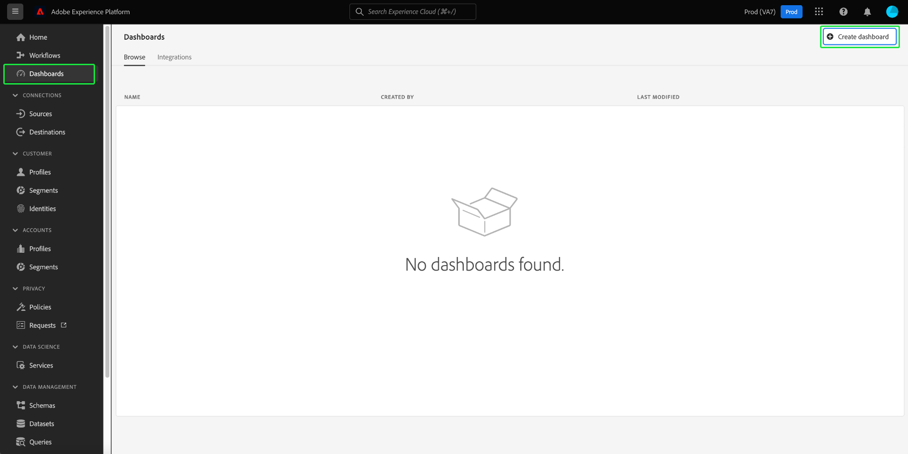

カスタムダッシュボードを追加する前に、ダッシュボードインベントリが空になり、「ダッシュボードが見つかりません」と表示されます。 メッセージ： 作成すると、すべてのダッシュボードがダッシュボードインベントリに一覧表示されます。

<!-- 
>[!NOTE]
>
>To edit an existing dashboard, select the dashboard name from the inventory list followed by the pencil icon ()
>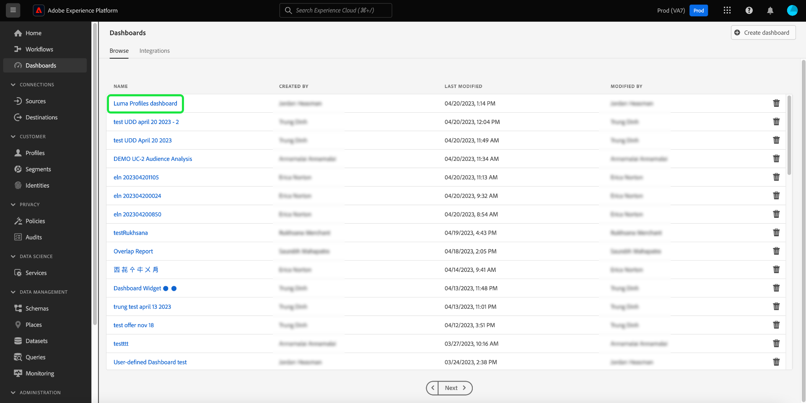{width="100" zoomable="yes"} 
-->

[!UICONTROL Create dashboard] ダイアログが表示されます。 作成するウィジェットのコレクションに、わかりやすい名前を入力し、**[!UICONTROL Save]**&#x200B;を選択します。

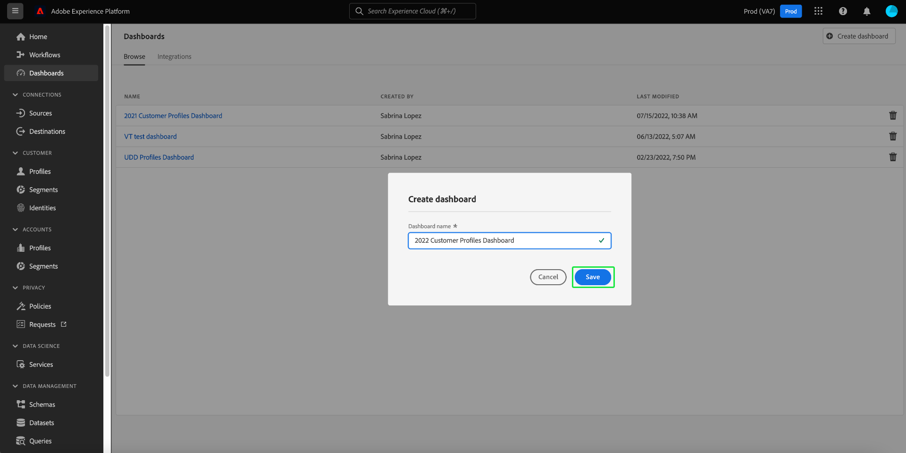

Data Distiller SKUを購入したユーザーは、カスタム SQL クエリを使用してインサイトを作成できます。 このワークフローの手順については、[query pro モードの概要](./sql-insights-query-pro-mode/overview.md)を参照してください。

新しく作成された空白のダッシュボードが、ビューの左上隅に選択した名前で表示されます。

## ウィジェットを作成 {#create-widget}

>[!CONTEXTUALHELP]
>id="platform_dashboards_udd_maxwidgets"
>title="ウィジェットの最大数"
>abstract="ダッシュボードサービスでは、最大 10 個のウィジェットをサポートします。ダッシュボードに10個のウィジェットを追加すると、[!UICONTROL Add new widget] オプションは無効になり、グレーで表示されます。"

新しいダッシュボードビューから、**[!UICONTROL Add new widget]**&#x200B;を選択して、ウィジェット作成プロセスを開始します。

>[!IMPORTANT]
>
>各ダッシュボードは最大10個のウィジェットをサポートします。 ダッシュボードに10個のウィジェットを追加すると、[!UICONTROL Add new widget] オプションは無効になり、グレーで表示されます。

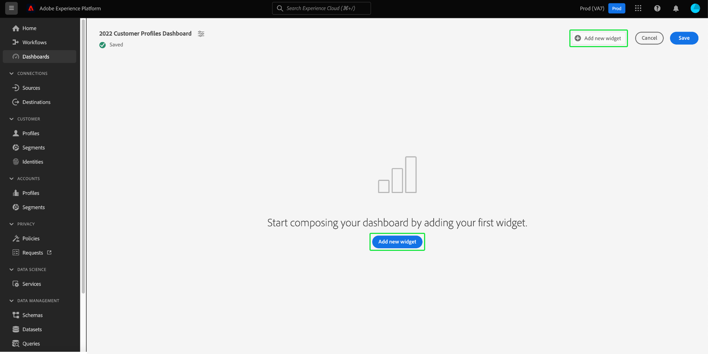

### ウィジェットコンポーザー

ウィジェットコンポーザーワークスペースが表示されます。 次に、**[!UICONTROL Select data]**&#x200B;を選択して、ウィジェットに属性を追加するデータモデルを選択します。

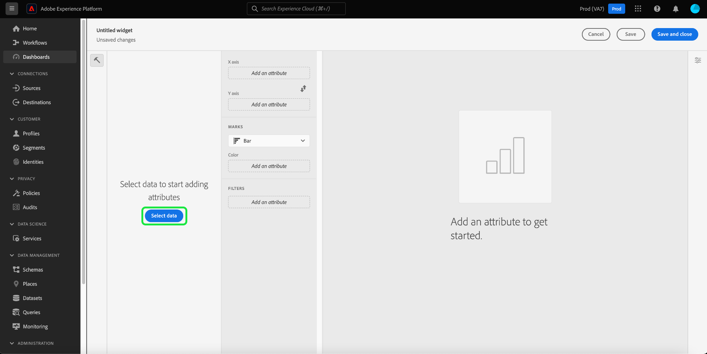

#### データモデルを選択 {#select-data-model}

[!UICONTROL Select data model] ダイアログが表示されます。 左側の列からデータモデルを選択すると、使用可能なすべてのテーブルのプレビューリストが表示されます。 Real-Time Customer Data Platform用に事前設定されたデータモデルの名前は[!UICONTROL CDPInsights]です。

>[!TIP]
>
>情報アイコン （）は、完全なデータモデル名が長すぎてデータパネルに表示されない場合に表示されます。

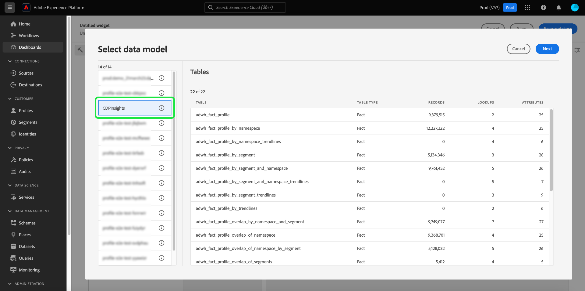

プレビューリストには、データモデルに含まれるテーブルに関する詳細が表示されます。 次の表では、列フィールドとその潜在的な値について説明します。

| 列フィールド | 説明 |
|---|---|
| [!UICONTROL Title] | テーブルの名前。 |
| [!UICONTROL Table type] | テーブルの種類。 潜在的なタイプは`fact`、`dimension`、`none`です。 |
| [!UICONTROL Records] | 選択したテーブルに関連付けられているレコードの数。 |
| [!UICONTROL Lookups] | 選択したテーブルに結合されたテーブルの数。 |
| [!UICONTROL Attributes] | 選択したテーブルの属性の数。 |

**[!UICONTROL Next]**&#x200B;を選択して、選択したデータモデルを確認します。 次のビューには、左側のパネルに使用可能なテーブルのリストが表示されます。 テーブルを選択すると、選択したテーブルに含まれるデータの包括的な分類が表示されます。

### ウィジェットを設定 {#populate-widget}

[!UICONTROL Preview] パネルには、[!UICONTROL Sample records]と[!UICONTROL Attributes]のタブが含まれています。 「[!UICONTROL Sample records]」タブには、選択したテーブルのレコードのサブセットが表形式で表示されます。 「[!UICONTROL Attributes]」タブには、選択したテーブルに関連付けられたすべての属性の属性名、データタイプ、ソーステーブルが表示されます。

左側のパネルで使用可能なリストからテーブルを選択して、ウィジェットのデータを提供し、**[!UICONTROL Select]**&#x200B;を選択してウィジェットコンポーザーに戻ります。

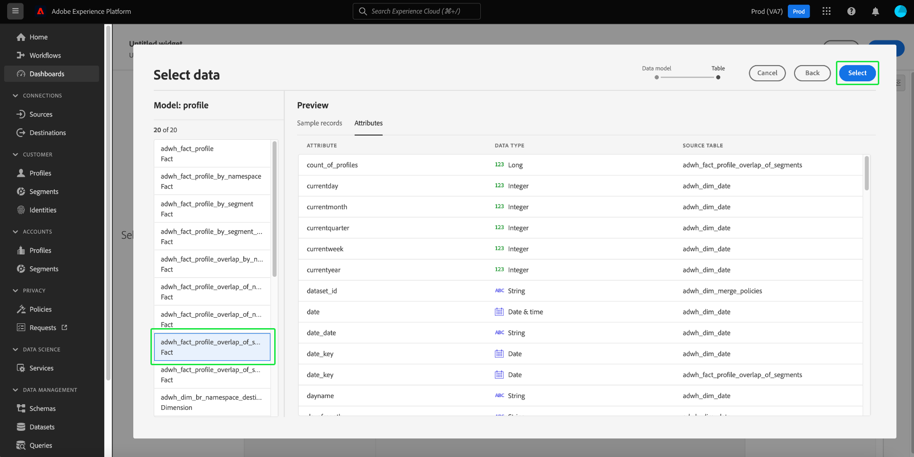

ウィジェットコンポーザーに、選択したテーブルのデータが入力されるようになりました。

データモデルと現在選択されているテーブルが左側のパネルの上部に表示され、ウィジェットの作成に使用できる属性が[!UICONTROL Attributes]列に一覧表示されます。 リストをスクロールする代わりに検索バーを使用して属性を検索したり、鉛筆アイコン（）を左パネルに配置します。

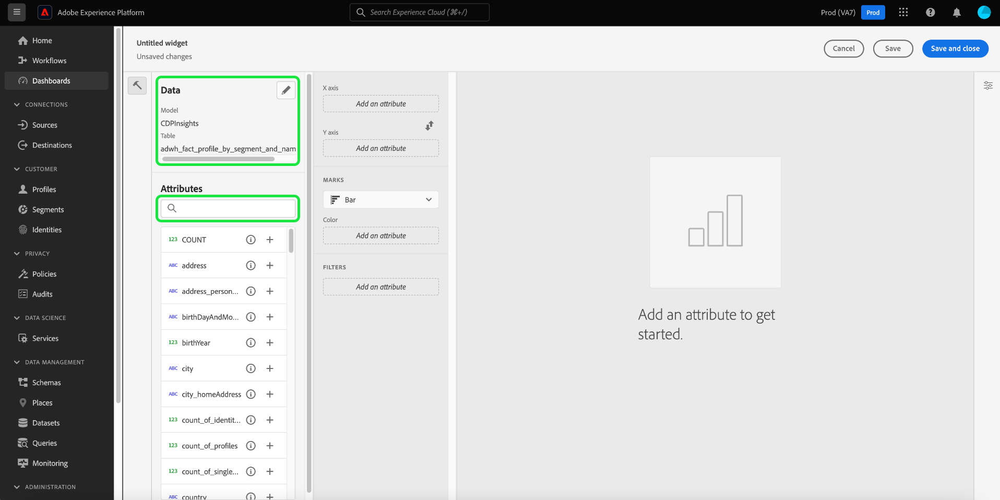

#### 属性の追加とフィルター {#add-and-filter-attributes}

追加アイコン（）属性をウィジェットに追加する属性名の横に表示されます。 表示されるドロップダウンメニューを使用すると、属性をX軸、Y軸、カラー、またはウィジェットのフィルターとして追加できます。 [!UICONTROL Color]属性を使用すると、X軸とY軸のマークの結果を色に基づいて区別できます。 これは、3番目の属性の構成に基づいて結果を異なる色に分割することによって実現します。

>[!TIP]
>
>X軸とY軸の配置を反転する場合は、上下矢印アイコン（）を使用して配置を切り替えます。

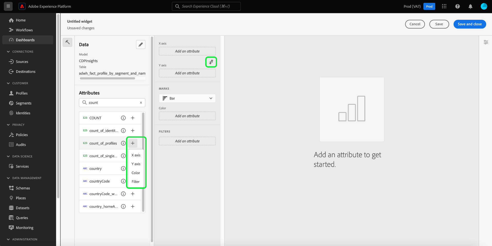

ウィジェットのグラフまたはグラフのタイプを変更するには、[!UICONTROL Marks] ドロップダウンを選択し、使用可能なオプションから選択します。 オプションには、棒グラフ、点グラフ、目盛りグラフ、線グラフまたは領域が含まれます。 選択すると、ウィジェットの現在の設定のプレビュービジュアライゼーションが生成されます。

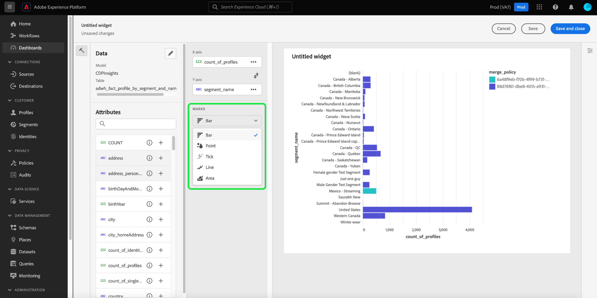

属性をフィルターとして追加することで、ウィジェットに含める値または除外する値を選択できます。 属性リストからフィルターを追加すると、[!UICONTROL Filter] ダイアログが表示され、チェックボックスを使用して値を選択または選択解除できます。

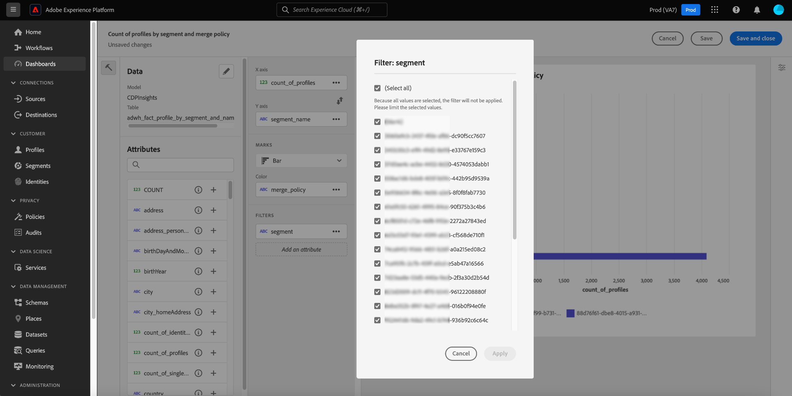

#### 履歴データのフィルタリング {#filter-historical-data}

ウィジェットで生成されたインサイトから履歴データを除外するには、`date_key`属性をフィルターとして追加し、**[!UICONTROL Recent date]**&#x200B;に続いて&#x200B;**[!UICONTROL Apply]**&#x200B;を選択します。 このフィルターにより、インサイトの取得に使用されたデータが、最新のシステムスナップショットから取得されます。

![[!UICONTROL Filter: date_key]と[!UICONTROL Recent date]の[!UICONTROL Apply] ダイアログがハイライト表示されました。](./images/standard-dashboards/recent-date.png)

または、カスタム期間を作成して、データをフィルタリングすることもできます。 使用可能な日付のリストを含むダイアログを拡張するには、**[!UICONTROL Select dates]**&#x200B;を選択します。 **[!UICONTROL Select all]** チェックボックスを使用して、利用可能なすべてのオプションを有効または無効にするか、各日のチェックボックスを個別に選択します。 最後に、**[!UICONTROL Apply]**&#x200B;を選択して選択を確定します。

>[!NOTE]
>
>`date_key`属性が既にフィルターとして追加されている場合は、ドロップダウンオプションから省略記号の後に&#x200B;**[!UICONTROL Edit]**&#x200B;を選択して、フィルター期間を変更します。

![個別の日のチェックボックスがオンになっている[!UICONTROL Filter: date_key] ダイアログとオフになっているダイアログ。](./images/standard-dashboards/select-dates.png)

### ウィジェットのプロパティ

プロパティ アイコン（）を右側のパネルで開き、プロパティパネルを開きます。 [!UICONTROL Properties] パネルで、[!UICONTROL Widget title] テキストフィールドにウィジェットの名前を入力します。

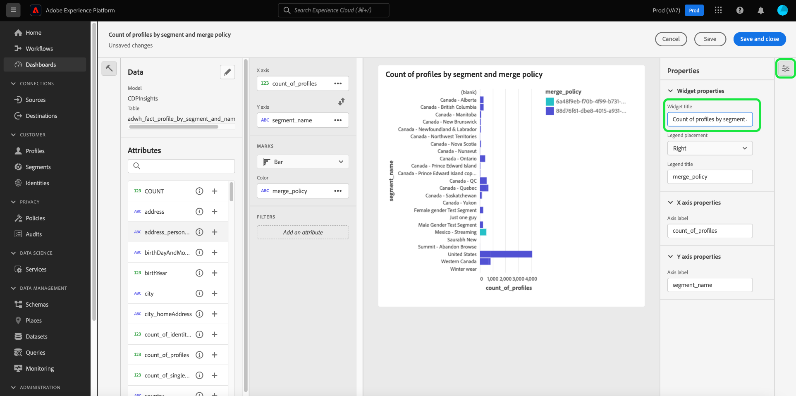

ウィジェットのプロパティパネルでは、ウィジェットの様々な側面を編集できます。 ウィジェットの凡例の場所を編集するための完全な制御が可能です。 凡例を移動するには、[!UICONTROL Legend placement] ドロップダウンを選択し、使用可能なオプションのリストから目的の場所を選択します。 また、凡例に関連付けられているラベル、およびX軸またはY軸の名前を、それぞれ[!UICONTROL Legend title] テキストフィールドまたは[!UICONTROL Axis label] テキストフィールドに新しい名前を入力して変更することもできます。

#### ウィジェットを保存 {#save-widget}

ウィジェットコンポーザーに保存すると、ウィジェットがダッシュボードにローカルに保存されます。 作品を保存して後で再開する場合は、**[!UICONTROL Save]**&#x200B;を選択します。 ウィジェット名の下にあるチェックアイコンは、ウィジェットが保存されたことを示します。 または、ウィジェットに満足したら、**[!UICONTROL Save and close]**&#x200B;を選択して、ダッシュボードへのアクセス権を持つ他のすべてのユーザーがウィジェットを利用できるようにします。 **[!UICONTROL Cancel]**&#x200B;を選択して作業を放棄し、カスタムダッシュボードに戻ります。

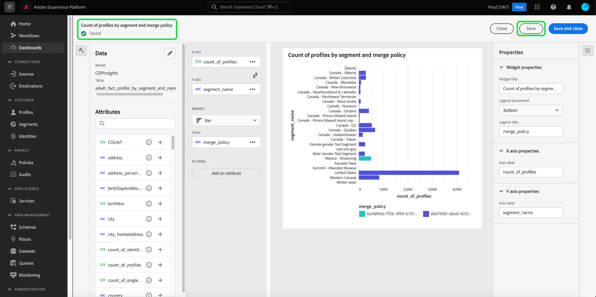

>[!TIP]
>
>プロパティ アイコン（）をクリックして、作成に関する詳細を確認します。 表示されるダイアログで、ダッシュボードの名前を変更できます。

このワークスペース内で、ウィジェットを並べ替えたり、サイズを変更したりできます。 ダッシュボード名と設定されたレイアウトを保持するには、**[!UICONTROL Save]**&#x200B;を選択します。

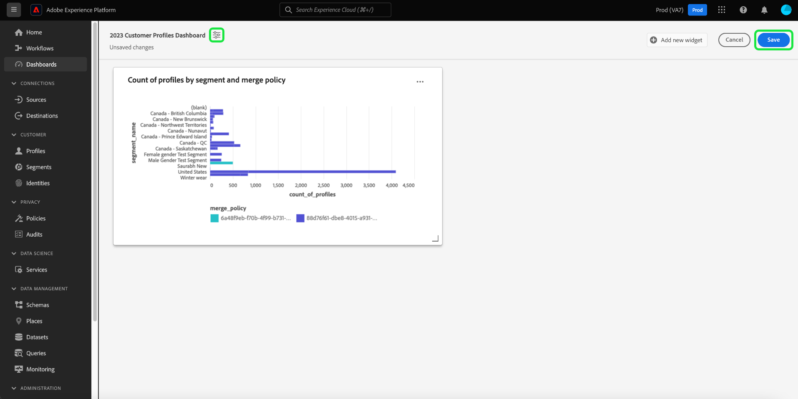

Adobe Real-Time Customer Data Platform インサイトダッシュボードの各クエリに効率的に実行するのに十分なリソースを確保するために、APIは各クエリに同時実行スロットを割り当てることで、リソースの使用状況を追跡します。 システムは最大4つの同時クエリを処理できるため、任意の時点で4つの同時クエリスロットを利用できます。 クエリは同時実行スロットに基づいてキューに入れられ、十分な同時実行スロットが使用可能になるまでキュー内で待機します。

### ウィジェットの編集、複製、削除 {#duplicate}

ウィジェットを作成したら、カスタムダッシュボードからウィジェット全体を編集、複製、削除できます。

>[!TIP]
>
>既存のカスタムダッシュボードのいずれかを切り替えるには、左側のナビゲーションバーで「ダッシュボード」を選択し、在庫リストからダッシュボード名を選択します。

鉛筆アイコン（）をカスタムダッシュボードの右上から編集モードに入ります。

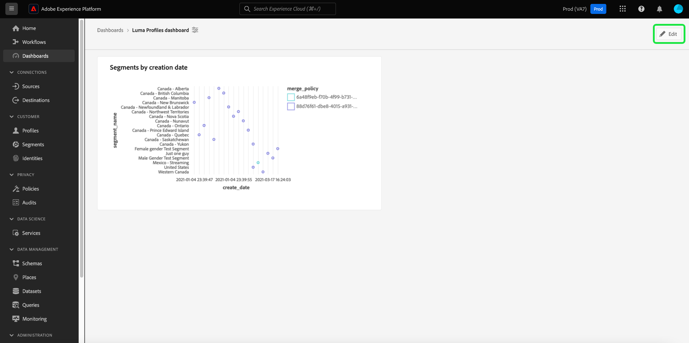

次に、編集、コピーまたは削除するウィジェットの右上にある省略記号を選択します。 ドロップダウンメニューから適切なアクションを選択します。

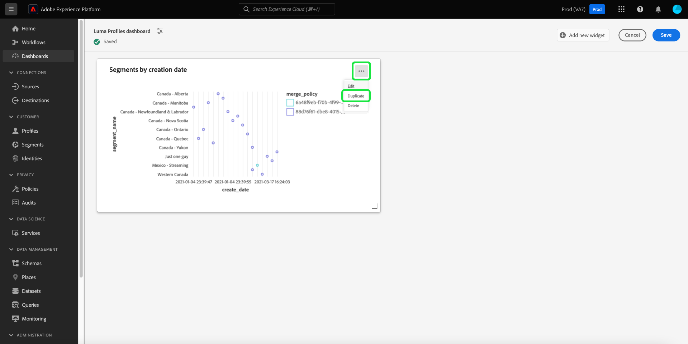

>[!NOTE]
>
>複製を使用すると、insightの属性をカスタマイズして一意のウィジェットを作成できます。最初から開始する必要はありません。 ウィジェットを複製すると、カスタムダッシュボードに表示されます。 次に、新しいウィジェットの省略記号と&#x200B;**[!UICONTROL Edit]**&#x200B;を選択して、insightをカスタマイズします。

## 次の手順とその他のリソース

このドキュメントでは、カスタムダッシュボードの作成方法と、そのダッシュボードのカスタムウィジェットの作成、編集、更新の方法について詳しく説明します。

[ プロファイル ](./guides/profiles.md#standard-widgets)、[ セグメント ](./guides/audiences.md#standard-widgets)、[宛先](./guides/destinations.md#standard-widgets) ダッシュボードで使用できる事前設定済みの指標とビジュアライゼーションについては、それぞれのドキュメントの標準ウィジェットのリストを参照してください。

Experience Platformのダッシュボードについて理解を深めるには、次の動画をご覧ください。

>[!VIDEO](https://video.tv.adobe.com/v/3409637?quality=12&learn=on)
