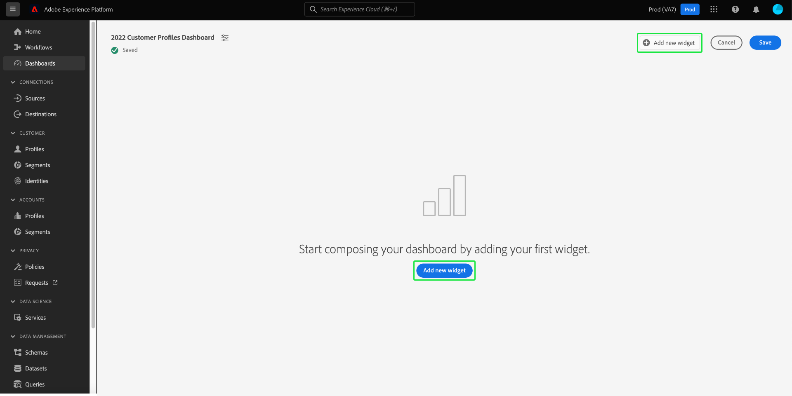
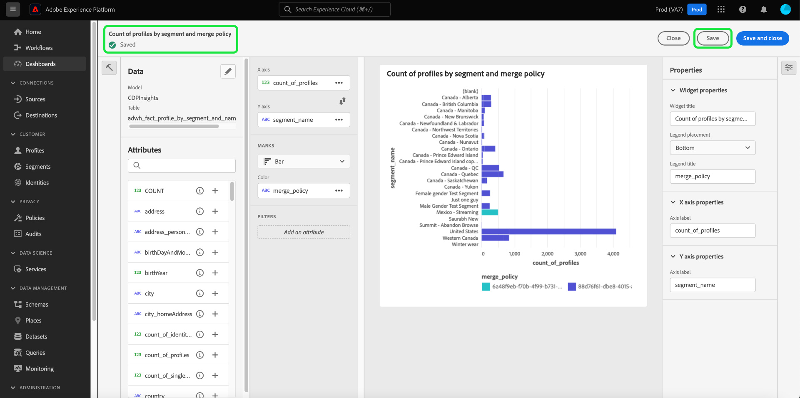

# 標準ダッシュボード

Adobe Experience Platform ダッシュボードを使用すると、ダッシュボード機能を通じて、インサイトを迅速に獲得し、ビジュアライゼーションをカスタマイズできます。 この機能を使用してカスタムダッシュボードを作成および管理します。カスタムダッシュボードでは、カスタムウィジェットを作成、追加および編集して、組織に関連する主要指標を視覚化できます。

<!-- Getting started / permissions section commented out for Beta. This will be necessary after GA only

## Getting started

To view dashboards in Adobe Experience Platform you must have the appropriate permissions enabled. Please read the [dashboards permissions documentation](./permissions.md#available-permissions) to learn how to grant users the ability to view, edit, and update Experience Platform dashboards using Adobe Admin Console. If you do not have administrator privileges for your organization, contact your product administrator to obtain the required permissions. -->

## カスタムダッシュボードの作成

カスタムダッシュボードを作成するには、まずダッシュボードインベントリに移動します。 Experience Platform UI の左側のナビゲーションから **[!UICONTROL ダッシュボード]** を選択し、続いて **[!UICONTROL ダッシュボードを作成]** を選択します。

カスタムダッシュボードを追加する前、ダッシュボードインベントリには何も表示されず、「ダッシュボードが見つかりません」と表示されます。 メッセージ。 作成すると、すべてのダッシュボードがダッシュボードインベントリに表示されます。

<!-- >[!NOTE]
>
>To edit an existing dashboard, select the dashboard name from the inventory list followed by the pencil icon ()
>{width="100" zoomable="yes"} -->

[!UICONTROL &#x200B; ダッシュボードを作成 &#x200B;] ダイアログが表示されます。 作成するウィジェットのコレクションにわかりやすい名前を入力し、「**[!UICONTROL 保存]**」を選択します。

Data Distiller SKU を購入したユーザーは、カスタム SQL クエリを使用してインサイトを作成できます。 このワークフローの手順については、[query pro モードの概要 &#x200B;](./sql-insights-query-pro-mode/overview.md) を参照してください。

新しく作成された空のダッシュボードが表示され、ビューの左上隅に選択した名前が表示されます。

## ウィジェットを作成 {#create-widget}

>[!CONTEXTUALHELP]
>id="platform_dashboards_udd_maxwidgets"
>title="ウィジェットの最大数"
>abstract="ダッシュボードサービスでは、最大 10 個のウィジェットをサポートします。ダッシュボードに 10 個のウィジェットを追加すると、「[!UICONTROL 新しいウィジェットを追加]」オプションが無効になり、グレーで表示されます。"

新しいダッシュボード表示から、「**[!UICONTROL 新しいウィジェットを追加]**」を選択して、ウィジェット作成プロセスを開始します。

>[!IMPORTANT]
>
>各ダッシュボードは、最大 10 個のウィジェットをサポートします。 ダッシュボードに 10 個のウィジェットを追加すると、「[!UICONTROL 新しいウィジェットを追加]」オプションが無効になり、グレーで表示されます。

### ウィジェットコンポーザー

ウィジェットコンポーザーワークスペースが表示されます。 次に、「**[!UICONTROL データを選択]**」を選択して、ウィジェットに属性を追加するデータモデルを選択します。

#### データモデルを選択 {#select-data-model}

[!UICONTROL &#x200B; データモデルを選択 &#x200B;] ダイアログが表示されます。 左側の列からデータモデルを選択し、使用可能なすべてのテーブルのプレビューリストを表示します。 Real-Time Customer Data Platform用の事前設定済みデータモデルの名前は [!UICONTROL CDPInsights] です。

>[!TIP]
>
>情報アイコン（）を選択し、データパネルに表示するには長すぎる場合に、完全なデータモデル名を表示します。

プレビューリストには、データモデルに含まれるテーブルに関する詳細が表示されます。 次の表に、列フィールドとその潜在的な値の説明を示します。

| 列フィールド | 説明 |
|---|---|
| [!UICONTROL タイトル] | テーブルの名前。 |
| [!UICONTROL &#x200B; テーブルタイプ &#x200B;] | テーブルのタイプ。 `fact`、`dimension`、`none` などのタイプが考えられます。 |
| [!UICONTROL &#x200B; レコード &#x200B;] | 選択したテーブルに関連付けられているレコードの数。 |
| [!UICONTROL &#x200B; ルックアップ &#x200B;] | 選択したテーブルに結合されるテーブルの数。 |
| [!UICONTROL &#x200B; 属性 &#x200B;] | 選択したテーブルの属性の数。 |

「**[!UICONTROL 次へ]**」を選択して、データモデルの選択を確定します。 次の表示では、使用可能なテーブルのリストが左パネルに表示されます。 テーブルを選択して、選択したテーブルに含まれるデータの包括的な分類を表示します。

### ウィジェットを入力 {#populate-widget}

[!UICONTROL &#x200B; プレビュー &#x200B;] パネルには、[!UICONTROL &#x200B; サンプルレコード &#x200B;] および [!UICONTROL &#x200B; 属性 &#x200B;] のタブが含まれています。 「[!UICONTROL &#x200B; サンプルレコード &#x200B;]」タブには、選択したテーブルのレコードのサブセットが表形式で表示されます。 「[!UICONTROL &#x200B; 属性 &#x200B;]」タブには、選択したテーブルに関連付けられているすべての属性の属性名、データタイプ、ソーステーブルが表示されます。

左側のパネルにあるリストからテーブルを選択してウィジェットのデータを入力し、「**[!UICONTROL 選択]**」を選択してウィジェットコンポーザーに戻ります。

これで、選択したテーブルのデータがウィジェットコンポーザーに入力されます。

データモデルと現在選択されているテーブルが左側のパネルの上部に表示され、ウィジェットの作成に使用できる属性が「[!UICONTROL &#x200B; 属性 &#x200B;]」列に一覧表示されます。 検索バーを使用して、リストをスクロールする代わりに属性を検索したり、鉛筆アイコン（）を選択します。

#### 属性の追加とフィルター {#add-and-filter-attributes}

追加アイコン（）を選択して、ウィジェットに属性を追加します。 表示されるドロップダウンメニューを使用すると、X 軸、Y 軸、色、ウィジェットのフィルターのいずれかとして属性を追加できます。 [!UICONTROL &#x200B; 色 &#x200B;] 属性を使用すると、X 軸マークと Y 軸マークの結果を色に基づいて区別できます。 これを行うには、3 番目の属性の構成に基づいて、結果を異なる色に分割します。

>[!TIP]
>
>X 軸と Y 軸の配置を反転するには、上向き矢印アイコンと下向き矢印アイコン（）を使用して配置を切り替えます。

ウィジェットのグラフまたはグラフのタイプを変更するには、[!UICONTROL &#x200B; マーク &#x200B;] ドロップダウンを選択し、使用可能なオプションから選択します。 オプションには、バー、点、ティック、線分、または面積があります。 選択すると、ウィジェットの現在の設定のプレビュービジュアライゼーションが生成されます。

属性をフィルターとして追加すると、ウィジェットに含める値と除外する値を選択できます。 属性リストからフィルターを追加すると、「[!UICONTROL &#x200B; フィルター &#x200B;]」ダイアログが表示され、チェックボックスを使用して値を選択または選択解除できます。

#### 履歴データの除外 {#filter-historical-data}

ウィジェットで生成されたインサイトから履歴データを除外するには、`date_key` 属性をフィルターとして追加し、**[!UICONTROL 最近の日付]** に続いて **[!UICONTROL 適用]** を選択します。 このフィルターにより、インサイトの取得に使用されるデータが最新のシステムスナップショットから取得されます。

![[!UICONTROL &#x200B; 最近の日付 [!UICONTROL &#x200B; と &#x200B;] 適用 [!UICONTROL &#x200B; がハイライト表示された &#x200B;] フィルター：date_key] ダイアログ &#x200B;](./images/standard-dashboards/recent-date.png)

または、カスタム期間を作成して、データをフィルタリングすることもできます。 「**[!UICONTROL 日付を選択]**」を選択して、使用可能な日付のリストでダイアログを拡張します。 「**[!UICONTROL すべてを選択]**」チェックボックスを使用して、使用可能なすべてのオプションを有効または無効にするか、各日で個別にチェックボックスを選択します。 最後に「**[!UICONTROL 適用]**」を選択して、選択を確定します。

>[!NOTE]
>
>`date_key` 属性が既にフィルターとして追加されている場合は、省略記号に続いてドロップダウンオプションから **[!UICONTROL 編集]** を選択して、フィルター期間を変更します。

![&#x200B; 個々の日のチェックボックスがオンとオフの両方になっている [!UICONTROL &#x200B; フィルター：date_key] ダイアログ。](./images/standard-dashboards/select-dates.png)

### ウィジェットのプロパティ

「プロパティ」アイコン（）を選択し、プロパティパネルを開きます。 [!UICONTROL &#x200B; プロパティ &#x200B;] パネルの [!UICONTROL &#x200B; ウィジェットタイトル &#x200B;] テキストフィールドにウィジェットの名前を入力します。

ウィジェットのプロパティパネルから、ウィジェットの複数の要素を編集できます。 ウィジェットの凡例の場所を編集するための完全なコントロールがあります。 凡例を移動するには、「[!UICONTROL &#x200B; 凡例の配置 &#x200B;]」ドロップダウンを選択し、使用可能なオプションのリストから目的の場所を選択します。 凡例に関連付けられているラベルや X 軸または Y 軸の名前を変更するには、それぞれ [!UICONTROL &#x200B; 凡例のタイトル &#x200B;] テキストフィールド、または [!UICONTROL &#x200B; 軸ラベル &#x200B;] テキストフィールドに新しい名前を入力します。

#### ウィジェットを保存 {#save-widget}

ウィジェットコンポーザーで保存すると、ウィジェットがダッシュボードにローカルに保存されます。 作業内容を保存し、後で再開する場合は、「**[!UICONTROL 保存]**」を選択します。 ウィジェット名の下のチェックマークアイコンは、ウィジェットが保存されたことを示します。 または、ウィジェットの設定が完了したら、「**[!UICONTROL 保存して閉じる]** を選択して、ダッシュボードにアクセスできる他のすべてのユーザーにウィジェットを公開します。 「**[!UICONTROL キャンセル]**」を選択して作業を中断し、カスタムダッシュボードに戻ります。

>[!TIP]
>
>「プロパティ」アイコン（）を選択すると、ダッシュボードの作成に関する詳細が表示されます。 表示されるダイアログでダッシュボードの名前を変更できます。

このワークスペース内でウィジェットの並べ替えとサイズ変更を行うことができます。 「**[!UICONTROL 保存]**」を選択して、ダッシュボード名と設定済みレイアウトを保持します。

Adobe Real-Time Customer Data Platform インサイトダッシュボードの各クエリに効率的に実行するのに十分なリソースがあることを確認するために、API は、各クエリに同時実行スロットを割り当てることで、リソースの使用状況を追跡します。 システムでは最大 4 つの同時クエリを処理できるので、同時に 4 つのクエリスロットをいつでも使用できます。 クエリは同時実行スロットに基づいてキューに入れられ、同時実行スロットが十分に使用可能になるまでキュー内で待機されます。

### ウィジェットの編集、複製、削除 {#duplicate}

ウィジェットを作成したら、カスタムダッシュボードからウィジェット全体を編集、複製または削除できます。

>[!TIP]
>
>既存のカスタムダッシュボードを切り替えるには、左側のナビゲーションバーのダッシュボードを選択し、インベントリリストからダッシュボード名を選択します。

鉛筆アイコン（）を選択し、編集モードに入ります。

次に、編集、コピー、削除するウィジェットの右上にある省略記号を選択します。 ドロップダウンメニューから適切なアクションを選択します。

>[!NOTE]
>
>複製を使用すると、insightの属性をカスタマイズして、最初から始めなくても一意のウィジェットを作成できます。 ウィジェットを複製すると、カスタムダッシュボードに表示されます。 その後、新しいウィジェットの省略記号を選択し、続けて **[!UICONTROL 編集]** をクリックして、insightをカスタマイズできます。

## 次の手順とその他のリソース

このドキュメントでは、カスタムダッシュボードの作成方法と、そのダッシュボードのカスタムウィジェットを作成、編集、更新する方法について、より深く理解しました。

[&#x200B; プロファイル &#x200B;](./guides/profiles.md#standard-widgets)、[&#x200B; セグメント &#x200B;](./guides/audiences.md#standard-widgets)、[&#x200B; 宛先 &#x200B;](./guides/destinations.md#standard-widgets) ダッシュボードで使用可能な事前設定済みの指標とビジュアライゼーションについては、それぞれのドキュメントの標準ウィジェットのリストを参照してください。

Experience Platformのダッシュボードの理解を深めるために、次のビデオを視聴してください。

>[!VIDEO](https://video.tv.adobe.com/v/3413783?quality=12&learn=on&captions=jpn)
