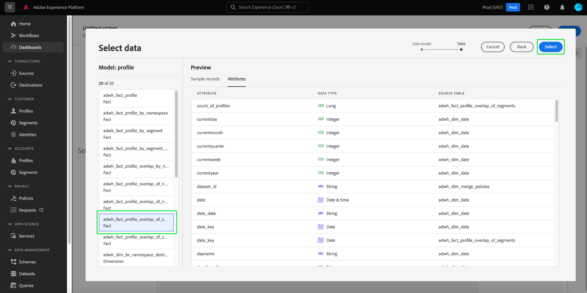

# ダッシュボード標準

Adobe Experience Platformダッシュボードを使用して、洞察を迅速化し、ダッシュボード機能を使用して視覚化をカスタマイズします。 この機能を使用して、オーダーメイドのウィジェットを作成、追加、編集して組織に関連する主要指標視覚化できるカスタムダッシュボードをビルドおよび管理します。

<!-- Getting started / permissions section commented out for Beta. This will be necessary after GA only

## Getting started

To view dashboards in Adobe Experience Platform you must have the appropriate permissions enabled. Please read the [dashboards permissions documentation](./permissions.md#available-permissions) to learn how to grant users the ability to view, edit, and update Experience Platform dashboards using Adobe Admin Console. If you do not have administrator privileges for your organization, contact your product administrator to obtain the required permissions. -->

## カスタムダッシュボード作成

カスタムダッシュボードを作成するには、まずダッシュボードインベントリに移動します。 Experience Platformの左ナビゲーションから **[!UICONTROL Dashboards]** を選択しUIその後に **[!UICONTROL Create dashboard]**&#x200B;を選択します。

カスタムダッシュボードを追加する前は、ダッシュボードインベントリは空で、「ダッシュボードが見つかりません」と表示されます。 メッセージ。 作成したダッシュボードは、ダッシュボード インベントリに一覧表示されます。

<!-- >[!NOTE]
>
>To edit an existing dashboard, select the dashboard name from the inventory list followed by the pencil icon ()
>{width="100" zoomable="yes"} -->

[!UICONTROL Create dashboard]ダイアログが表示されます。作成するウィジェットのコレクションにわかりやすいわかりやすい名前を入力し、[ **[!UICONTROL Save]**] を選択します。

データ Distiller SKUを購入したユーザーは、カスタム SQL クエリを使用して分析情報を作成するオプションがあります。 このワークフローに関する手順については[&#128279;](./sql-insights-query-pro-mode/overview.md)クエリプロモードの概要を参照してください。

新しく作成された空のダッシュボードが表示され、選択した名前が表示の左上隅に表示されます。

## ウィジェットを作成 {#create-widget}

>[!CONTEXTUALHELP]
>id="platform_dashboards_udd_maxwidgets"
>title="ウィジェットの最大数"
>abstract="ダッシュボードサービスでは、最大 10 個のウィジェットをサポートします。ダッシュボードに 10 個のウィジェットを追加すると、[ [!UICONTROL Add new widget] ] オプションは無効になり、グレーで表示されます。"

新しいダッシュボード 表示で、[ **[!UICONTROL Add new widget]** ] を選択してウィジェット作成プロセスを開始します。

>[!IMPORTANT]
>
>各ダッシュボードは、10 個までのウィジェットをサポートします。 ダッシュボードに 10 個のウィジェットを追加すると、[ [!UICONTROL Add new widget] ] オプションは無効になり、グレーで表示されます。

### ウィジェットコンポーザー

ウィジェットコンポーザーワークスペースが表示されます。 次に、「**[!UICONTROL Select data]**」を選択して、ウィジェットに属性を追加するデータモデルを選択します。

#### データモデルを選択 {#select-data-model}

[!UICONTROL Select data model] ダイアログが表示されます。 左側の列からデータモデルを選択し、使用可能なすべてのテーブルのプレビューリストを表示します。 Real-Time Customer Data Platform用の事前設定済みデータモデルの名前は [!UICONTROL CDPInsights] です。

>[!TIP]
>
>情報アイコン（）を選択し、データパネルに表示するには長すぎる場合に、完全なデータモデル名を表示します。

プレビューリストには、データモデルに含まれるテーブルに関する詳細が表示されます。 次の表に、列フィールドとその潜在的な値の説明を示します。

| 列フィールド | 説明 |
|---|---|
| [!UICONTROL Title] | テーブルの名前。 |
| [!UICONTROL Table type] | テーブルの種類。 指定できるタイプには、 `fact`、 `dimension`、および `none`があります。 |
| [!UICONTROL Records] | 選択したテーブルに関連付けられているレコードの数。 |
| [!UICONTROL Lookups] | 選択したテーブルに結合されたテーブルの数。 |
| [!UICONTROL Attributes] | 選択したテーブルの属性の数。 |

[ **[!UICONTROL Next]** ] を選択して、選択したデータ モデルを確定します。 次の表示では、使用可能なテーブルのリストが左側のパネルに表示されます。 テーブルを選択すると、選択したテーブルに含まれているデータの包括的な分類が表示されます。

### ウィジェットに値を入力 {#populate-widget}

[!UICONTROL Preview]パネルには、[!UICONTROL Sample records]と[!UICONTROL Attributes]のタブが含まれています。[!UICONTROL Sample records]タブは、選択したテーブルのレコードのサブセットを表形式の表示で提供します。[!UICONTROL Attributes] タブは、選択したテーブルに関連付けられているすべての属性の属性名、データ型、およびソース テーブルを提供します。

左側のパネルで使用可能なリストからテーブルを選択してウィジェットのデータを提供し、[ **[!UICONTROL Select]** ] を選択してウィジェットコンポーザーに戻ります。

これで、ウィジェットコンポーザーに、選択したテーブルのデータが入力されました。

データ モデルと現在選択されているテーブルが左側のパネルの上部に表示され、ウィジェットの作成に使用できる属性が [ [!UICONTROL Attributes] ] 列に一覧表示されます。 リストをスクロールする代わりに検索バーを使用して属性を検索したり、鉛筆アイコン()パネルをクリックします。

#### 追加属性とフィルター属性 {#add-and-filter-attributes}

追加アイコン()をクリックして、ウィジェットに属性を追加します。 表示されるドロップダウンメニューでは、ウィジェットのX軸、Y軸、色、またはフィルターとして属性を追加できます。 [!UICONTROL Color] 属性を使用すると、X 軸と Y 軸のマークの結果を色に基づいて区別できます。これは、3番目の属性の構成に基づいて結果を異なる色に分割することによって行われます。

>[!TIP]
>
>X軸とY軸の配置を反転する場合は、上下の矢印アイコン()をクリックして配置を切り替えます。

ウィジェットのグラフまたはチャートのタイプを変更するには、 [!UICONTROL Marks] ドロップダウンを選択し、使用可能なオプションから選択します。 オプションには、棒グラフ、点、目盛り、線、または面グラフがあります。 選択すると、ウィジェットの現在の設定のプレビュービジュアライゼーションが生成されます。

![[マーク] ドロップダウンが強調表示されたウィジェットコンポーザー。](./images/standard-dashboards/marks-dropdown.png)

属性をフィルターとして追加することで、ウィジェットに含める値または除外する値を選択できます。 属性リストからフィルターを追加すると、[ [!UICONTROL Filter] ] ダイアログが表示され、チェックボックスを使用して値を選択または選択解除できます。

#### フィルターアウト履歴データ {#filter-historical-data}

ウィジェットによって生成された分析情報から履歴データを除外するには、 `date_key` 属性をフィルターとして追加し、[ **[!UICONTROL Recent date]** ]、[ **[!UICONTROL Apply]**] の順に選択します。 このフィルターにより、分析情報の派生に使用されるデータが最新のシステム スナップショットから取得されます。

![[!UICONTROL Filter: date_key]と[!UICONTROL Recent date]がハイライトされた[!UICONTROL Apply]ダイアログ。](./images/standard-dashboards/recent-date.png)

または、カスタム期間を作成してデータをフィルタリングすることもできます。 利用可能な日付のリストでダイアログを拡張するには、 **[!UICONTROL Select dates]** を選択します。 [ **[!UICONTROL Select all]** ] チェックボックスをオンにして、使用可能なすべてのオプションを有効または無効にするか、日ごとに個別にチェックボックスをオンにします。 最後に、[ **[!UICONTROL Apply]** ] を選択して選択内容を確認します。

>[!NOTE]
>
>`date_key`属性が既にフィルターとして追加されている場合は、省略記号を選択し、その後にドロップダウン オプションから&#x200B;**[!UICONTROL Edit]**&#x200B;を選択して、フィルター期間を変更します。

![[!UICONTROL Filter: date_key]ダイアログでは個人日のチェックボックスがオンとオフの両方になっています。](./images/standard-dashboards/select-dates.png)

### ウィジェットのプロパティ

プロパティアイコン(パネル)をクリックして、プロパティパネルを開きます。 [!UICONTROL Properties]パネルで、[!UICONTROL Widget title]テキストフィールドにウィジェットの名前を入力します。

ウィジェットのプロパティパネルから、ウィジェットのいくつかの要素を編集できます。 ウィジェットの凡例の場所を編集するには、完全に制御できます。 凡例を移動するには、[ [!UICONTROL Legend placement] ] ドロップダウンを選択し、使用可能なオプションのリストから目的の場所を選択します。 また、凡例に関連付けられているラベル、および X 軸または Y 軸の名前を変更するには、 [!UICONTROL Legend title] テキストフィールドまたはテキストフィールドにそれぞれ新しい名前を入力して [!UICONTROL Axis label] 。

#### ウィジェット保存 {#save-widget}

ウィジェットコンポーザーに保存すると、ウィジェットがダッシュボードにローカルに保存されます。 作業内容を保存して後で再開する場合は、[ **[!UICONTROL Save]**] を選択します。 ウィジェット名の下のチェックマークアイコンは、ウィジェットが保存されたことを示します。 または、ウィジェットに問題がなければ、[ **[!UICONTROL Save and close]** ] を選択して、ダッシュボードにアクセスできる他のすべてのユーザーがウィジェットを使用できるようにします。 **[!UICONTROL Cancel]**&#x200B;を選択して作業を中断し、カスタムダッシュボードに戻ります。

>[!TIP]
>
>「プロパティ」アイコン（）を選択すると、ダッシュボードの作成に関する詳細が表示されます。 表示されるダイアログでダッシュボードの名前を変更できます。

ウィジェットは、このワークスペース中に再配置およびサイズ変更できます。 **[!UICONTROL Save]**&#x200B;を選択すると、ダッシュボード名と設定済みレイアウトが保持されます。

Adobe Real-Time Customer Data Platform インサイトダッシュボードの各クエリに効率的に実行するのに十分なリソースがあることを確認するために、API は、各クエリに同時実行スロットを割り当てることで、リソースの使用状況を追跡します。 システムでは最大 4 つの同時クエリを処理できるので、同時に 4 つのクエリスロットをいつでも使用できます。 クエリは同時実行スロットに基づいてキューに入れられ、同時実行スロットが十分に使用可能になるまでキュー内で待機されます。

### ウィジェットの編集、複製、削除 {#duplicate}

ウィジェットを作成したら、カスタムダッシュボードからウィジェット全体を編集、複製または削除できます。

>[!TIP]
>
>既存のカスタムダッシュボードを切り替えるには、左側のナビゲーションバーのダッシュボードを選択し、インベントリリストからダッシュボード名を選択します。

鉛筆アイコン（)をクリックして、編集モードに入ります。

次へ、ウィジェットの右上にある、編集、コピー、削除する省略記号を選択します。 ドロップダウンメニューから適切なアクションを選択します。

>[!NOTE]
>
>複製を使用すると、インサイトの属性をカスタマイズして、最初から開始することなく一意のウィジェットを作成できます。 ウィジェット重複すると、カスタムダッシュボードに表示されます。 次に、新しいウィジェットの省略記号を選択し、次に **[!UICONTROL Edit]**&#x200B;を選択して、インサイトをカスタマイズできます。

## 次の手順とその他のリソース

このドキュメントでは、カスタムダッシュボードの作成方法と、そのダッシュボードのカスタムウィジェットを作成、編集、更新する方法について、より深く理解しました。

[&#x200B; プロファイル &#x200B;](./guides/profiles.md#standard-widgets)、[&#x200B; セグメント &#x200B;](./guides/audiences.md#standard-widgets)、[&#x200B; 宛先 &#x200B;](./guides/destinations.md#standard-widgets) ダッシュボードで使用可能な事前設定済みの指標とビジュアライゼーションについては、それぞれのドキュメントの標準ウィジェットのリストを参照してください。

Experience Platform のダッシュボードについての理解を深めるには、次のビデオを視聴してください。

>[!VIDEO](https://video.tv.adobe.com/v/3413783?captions=jpn&quality=12&learn=on)
