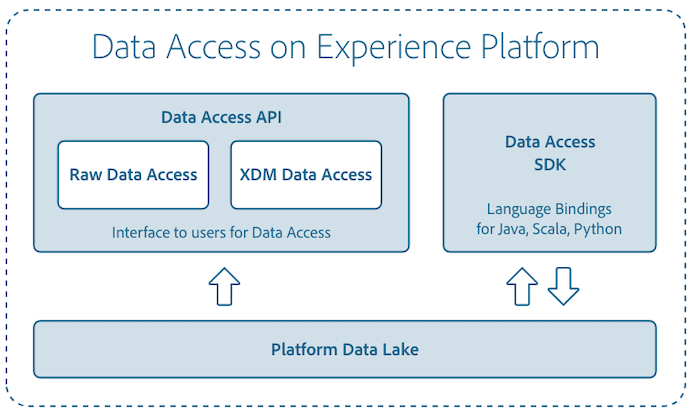

# [!DNL Data Access] の概要

[!DNL Data Access] は、[!DNL Experience Platform] 内で取り込まれたデータセットの検出可能性とアクセシビリティに焦点を当てたツールをユーザーに提供することにより、Adobe Experience Platform をサポートします。

## [!DNL Data Access] API

[!DNL Data Access] APIを使用して[!DNL Platform]と接続する方法について詳しくは、『[データアクセス開発者ガイド](api.md)』を参照してください。

## Data Science Workspace のデータへのアクセス

Data Science Workspace でのレシピおよびモデル開発の際、[!DNL Python] や [!DNL Spark] を使用して、データセットに対する読み取りや書き込みをおこなうことができます。データへのアクセスについて詳しくは、[Python のデータアクセス](../data-science-workspace/authoring/python.md)または[Spark のデータアクセス](../data-science-workspace/authoring/spark.md)のドキュメントを参照してください。

[!DNL Data Science Workspace]の詳細については、[Data Science Workspace の概要](../data-science-workspace/home.md)を読んで開始してください。

## データ取得イベントへのサブスクライブ

[!DNL Platform] は、 [Adobe Developer Console](https://www.adobe.com/go/devs_console_ui) を介して特定の価値の高いイベントをサブスクリプションで利用できるようにします。例えば、データ取り込みイベントに登録して、遅延や障害の可能性についての通知を受け取ることができます。詳しくは、[データ取得通知のサブスクライブ](../ingestion/quality/subscribe-events.md)のチュートリアルを参照してください。
