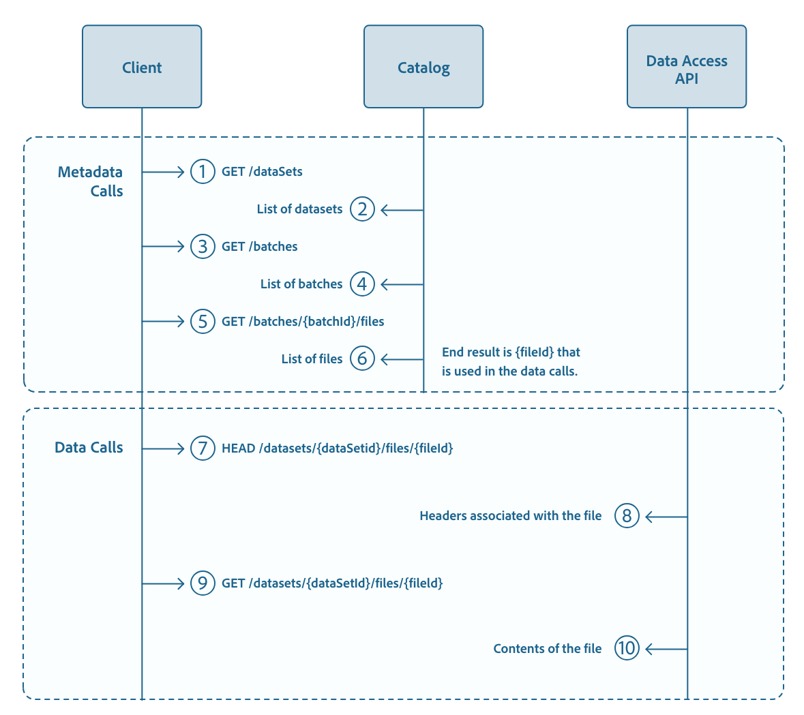

# [!DNL Data Access] APIを使用したデータセット データの表示

このステップバイステップのチュートリアルでは、Adobe Experience Platformの[!DNL Data Access] APIを使用して、データセット内に保存されているデータを検索、アクセス、ダウンロードする方法について説明します。 このドキュメントでは、ページングや部分的なダウンロードなど、[!DNL Data Access] APIの固有の機能の一部を紹介します。

## はじめに

このチュートリアルでは、データセットの作成方法と設定方法について理解する必要があります。 詳しくは、「[データセ ット作成のチュートリアル](../../catalog/datasets/create.md)」を参照してください。

以下の節では、Experience Platform APIを正常に呼び出すために知っておく必要がある追加情報を提供します。

### API 呼び出し例の読み取り {#reading-sample-api-calls}

このチュートリアルでは、API 呼び出しの例を提供し、リクエストの形式を設定する方法を示します。これには、パス、必須ヘッダー、適切な形式のリクエストペイロードが含まれます。また、API レスポンスで返されるサンプル JSON も示されています。ドキュメントで使用される API 呼び出し例の表記について詳しくは、 トラブルシューテングガイドの[API 呼び出し例の読み方](../../landing/troubleshooting.md#how-do-i-format-an-api-request)に関する節を参照してください[!DNL Experience Platform]。

### 必須ヘッダーの値の収集

[!DNL Experience Platform]個のAPIを呼び出すには、まず[認証チュートリアル &#x200B;](../../landing/api-authentication.md)を完了する必要があります。 次に示すように、すべての [!DNL Experience Platform] API 呼び出しに必要な各ヘッダーの値は認証チュートリアルで説明されています。

- Authorization： Bearer `{ACCESS_TOKEN}`
- x-api-key： `{API_KEY}`
- x-gw-ims-org-id： `{ORG_ID}`

[!DNL Experience Platform] のすべてのリソースは、特定の仮想サンドボックスに分離されています。[!DNL Experience Platform] APIへのすべてのリクエストには、操作が行われるサンドボックスの名前を指定するヘッダーが必要です。

- x-sandbox-name：`{SANDBOX_NAME}`

>[!NOTE]
>
>[!DNL Experience Platform] のサンドボックスについて詳しくは、[サンドボックスの概要に関するドキュメント](../../sandboxes/home.md)を参照してください。

ペイロード（POST、PUT、PATCH）を含んだすべてのリクエストには、以下の追加ヘッダーが必要です。

- Content-Type: application/json

## シーケンス図

このチュートリアルは、以下のシーケンス図で概説されている手順に従い、[!DNL Data Access] APIのコア機能を強調します。



バッチとファイルに関する情報を取得するには、[!DNL Catalog] APIを使用します。 ファイルのサイズに応じて、HTTP経由でこれらのファイルにアクセスしてダウンロードするには、[!DNL Data Access] APIを使用します。

## データの検索

[!DNL Data Access] APIの使用を開始する前に、アクセスするデータの場所を特定する必要があります。 [!DNL Catalog] APIには、組織のメタデータを参照し、アクセスするバッチまたはファイルのIDを取得するために使用できる2つのエンドポイントがあります。

- `GET /batches`：組織内のバッチのリストを返します
- `GET /dataSetFiles`：組織内のファイルのリストを返します

[!DNL Catalog] APIのエンドポイントの包括的なリストについては、[API リファレンス &#x200B;](https://developer.adobe.com/experience-platform-apis/references/catalog/)を参照してください。

## 組織の下のバッチのリストの取得

[!DNL Catalog] APIを使用すると、組織の下のバッチのリストを返すことができます。

**API 形式**

```http
GET /batches
```

**リクエスト**

```shell
curl -X GET 'https://platform.adobe.io/data/foundation/catalog/batches/' \
  -H 'Authorization: Bearer {ACCESS_TOKEN}' \
  -H 'x-api-key: {API_KEY}' \
  -H 'x-gw-ims-org-id: {ORG_ID}' \
  -H 'x-sandbox-name: {SANDBOX_NAME}'
```

**応答**

応答には、組織に関連するすべてのバッチをリストするオブジェクトが含まれ、各トップレベル値はバッチを表します。 個々のバッチオブジェクトには、その特定のバッチの詳細が含まれます。以下の応答は、スペースのために最小化されています。

```json
{
    "{BATCH_ID_1}": {
        "imsOrg": "{ORG_ID}",
        "created": 1516640135526,
        "createdClient": "{CREATED_CLIENT}",
        "createdUser": "{CREATED_BY}",
        "updatedUser": "{CREATED_BY}",
        "updated": 1516640135526,
        "status": "processing",
        "version": "1.0.0",
        "availableDates": {}
    },
    "{BATCH_ID_2}": {
    ...
    }
}
```

### バッチのリストのフィルター {#filter-batches-list}

フィルターは、特定のユースケースに関連するデータを取得するために、特定のバッチを見つけるために必要になることがよくあります。 返された応答をフィルタリングするために、`GET /batches` リクエストにパラメーターを追加できます。 以下のリクエストは、特定のデータセット内で、指定された時間の後に作成されたすべてのバッチを、作成時に並べ替えて返します。

**API 形式**

```http
GET /batches?createdAfter={START_TIMESTAMP}&dataSet={DATASET_ID}&sort={SORT_BY}
```

| プロパティ | 説明 |
| -------- | ----------- |
| `{START_TIMESTAMP}` | 開始のタイムスタンプ（ミリ秒）（例：1514836799000）。 |
| `{DATASET_ID}` | データセット識別子。 |
| `{SORT_BY}` | 指定された値で応答を並べ替えます。たとえば、`desc:created`は作成日を降順に並べ替えてオブジェクトをソートします。 |

**リクエスト**

```shell
curl -X GET 'https://platform.adobe.io/data/foundation/catalog/batches?createdAfter=1521053542579&dataSet=5cd9146b21dae914b71f654f&orderBy=desc:created' \
  -H 'Authorization: Bearer {ACCESS_TOKEN}' \
  -H 'x-api-key: {API_KEY}' \
  -H 'x-gw-ims-org-id: {ORG_ID}' \
  -H 'x-sandbox-name: {SANDBOX_NAME}'
```

**応答**

```json
{   "{BATCH_ID_3}": {
        "imsOrg": "{ORG_ID}",
        "relatedObjects": [
            {
                "id": "5c01a91863540f14cd3d0439",
                "type": "dataSet"
            },
            {
                "id": "00998255b4a148a2bfd4804c2f327324",
                "type": "batch"
            }
        ],
        "status": "success",
        "metrics": {
            "recordsFailed": 0,
            "recordsWritten": 2,
            "startTime": 1550791835809,
            "endTime": 1550791994636
        },
        "errors": [],
        "created": 1550791457173,
        "createdClient": "{CLIENT_CREATED}",
        "createdUser": "{CREATED_BY}",
        "updatedUser": "{CREATED_BY}",
        "updated": 1550792060301,
        "version": "1.0.116"
    },
    "{BATCH_ID_4}": {
        "imsOrg": "{ORG_ID}",
        "status": "success",
        "relatedObjects": [
            {
                "type": "batch",
                "id": "00aff31a9ae84a169d69b886cc63c063"
            },
            {
                "type": "dataSet",
                "id": "5bfde8c5905c5a000082857d"
            }
        ],
        "metrics": {
            "startTime": 1544571333876,
            "endTime": 1544571358291,
            "recordsRead": 4,
            "recordsWritten": 4
        },
        "errors": [],
        "created": 1544571077325,
        "createdClient": "{CLIENT_CREATED}",
        "createdUser": "{CREATED_BY}",
        "updatedUser": "{CREATED_BY}",
        "updated": 1544571368776,
        "version": "1.0.3"
    }
}
```

パラメーターとフィルターの完全なリストについては、「[カタログ API リファレンス](https://developer.adobe.com/experience-platform-apis/references/catalog/)」を参照してください。

## 特定のバッチに属するすべてのファイルのリストを取得する

アクセスするバッチのIDを取得したので、[!DNL Data Access] APIを使用して、そのバッチに属するファイルのリストを取得できます。

**API 形式**

```http
GET /batches/{BATCH_ID}/files
```

| プロパティ | 説明 |
| -------- | ----------- |
| `{BATCH_ID}` | アクセスしようとしているバッチのバッチ識別子。 |

**リクエスト**

```shell
curl -X GET 'https://platform.adobe.io/data/foundation/export/batches/5c6f332168966814cd81d3d3/files' \
  -H 'Authorization: Bearer {ACCESS_TOKEN}' \
  -H 'x-api-key: {API_KEY}' \
  -H 'x-gw-ims-org-id: {ORG_ID}' \
  -H 'x-sandbox-name: {SANDBOX_NAME}'
```

**応答**

```json
{
    "data": [
        {
            "dataSetFileId": "8dcedb36-1cb2-4496-9a38-7b2041114b56-1",
            "dataSetViewId": "5cc6a9b60d4a5914b7940a7f",
            "version": "1.0.0",
            "created": "1558522305708",
            "updated": "1558522305708",
            "isValid": false,
            "_links": {
                "self": {
                    "href": "https://platform.adobe.io:443/data/foundation/export/files/8dcedb36-1cb2-4496-9a38-7b2041114b56-1"
                }
            }
        }
    ],
    "_page": {
        "limit": 100,
        "count": 1
    }
}
}
```

| プロパティ | 説明 |
| -------- | ----------- |
| `data._links.self.href` | このファイルにアクセスする URL。 |

応答には、指定したバッチ内のすべてのファイルをリストするデータ配列が含まれます。ファイルは、そのファイル ID によって参照されます。このファイルは、`dataSetFileId`フィールドの下にあります。

## ファイル ID を使用したファイルへのアクセス {#access-file-with-file-id}

一意のファイル IDを取得したら、[!DNL Data Access] APIを使用して、ファイルの名前、バイト単位のサイズ、ダウンロード用のリンクなど、ファイルに関する特定の詳細にアクセスできます。

**API 形式**

```http
GET /files/{FILE_ID}
```

| プロパティ | 説明 |
| -------- | ----------- |
| `{FILE_ID}` | アクセスするファイルの識別子。 |

**リクエスト**

```shell
curl -X GET 'https://platform.adobe.io/data/foundation/export/files/8dcedb36-1cb2-4496-9a38-7b2041114b56-1' \
  -H 'Authorization: Bearer {ACCESS_TOKEN}' \
  -H 'x-api-key: {API_KEY}' \
  -H 'x-gw-ims-org-id: {ORG_ID}' \
  -H 'x-sandbox-name: {SANDBOX_NAME}'
```

ファイル ID が個々のファイルを指すかディレクトリを指すかに応じて、返されるデータ配列には、そのディレクトリに属するファイルの 1 つのエントリまたはリストが含まれる場合があります。各ファイル要素には、ファイルの名前、バイト単位のサイズ、ファイルをダウンロードするためのリンクなどの詳細が含まれます。

**ケース 1：ファイル ID が単一のファイルを指す**

**応答**

```json
{
    "data": [
        {
            "name": "{FILE_NAME}.parquet",
            "length": "249058",
            "_links": {
                "self": {
                    "href": "https://platform.adobe.io/data/foundation/export/files/{FILE_ID_1}?path={FILE_NAME_1}.parquet"
                }
            }
        }
    ],
    "_page": {
        "limit": 100,
        "count": 1
    }
}
```

| プロパティ | 説明 |
| -------- | ----------- |
| `{FILE_NAME}.parquet` | ファイルの名前。 |
| `_links.self.href` | ファイルをダウンロードする URL。 |

**ケース 2：ファイル ID がディレクトリを指す**

**応答**

```json
{
    "data": [
        {
            "dataSetFileId": "{FILE_ID_2}",
            "dataSetViewId": "460590b01ba38afd1",
            "version": "1.0.0",
            "created": "150151267347",
            "updated": "150151267347",
            "isValid": true,
            "_links": {
                "self": {
                    "href": "https://platform.adobe.io/data/foundation/export/files/{FILE_ID_2}"
                }
            }
        },
        {
            "dataSetFileId": "{FILE_ID_3}",
            "dataSetViewId": "460590b01ba38afd1",
            "version": "1.0.0",
            "created": "150151267685",
            "updated": "150151267685",
            "isValid": true,
            "_links": {
                "self": {
                    "href": "https://platform.adobe.io/data/foundation/export/files/{FILE_ID_3}"
                }
            }
        }
    ],
    "_page": {
        "limit": 100,
        "count": 2
    }
}
```

| プロパティ | 説明 |
| -------- | ----------- |
| `data._links.self.href` | 関連ファイルをダウンロードする URL。 |

この応答は、ID `{FILE_ID_2}`と`{FILE_ID_3}`を持つ 2 つの異なるファイルを含むディレクトリを返します。このシナリオでは、各ファイルのURLに従ってファイルにアクセスする必要があります。

## ファイルのメタデータの取得

HEAD リクエストをおこなうことで、ファイルのメタデータを取得できます。これは、サイズ（バイト単位）やファイル形式を含む、ファイルのメタデータヘッダーを返します。

**API 形式**

```http
HEAD /files/{FILE_ID}?path={FILE_NAME}
```

| プロパティ | 説明 |
| -------- | ----------- |
| `{FILE_ID}` | ファイルの識別子。 |
| `{FILE_NAME}` | ファイル名（例：profiles.parquet） |

**リクエスト**

```shell
curl -I 'https://platform.adobe.io/data/foundation/export/files/8dcedb36-1cb2-4496-9a38-7b2041114b56-1?path=profiles.parquet' \
  -H 'Authorization: Bearer {ACCESS_TOKEN}' \
  -H 'x-api-key: {API_KEY}' \
  -H 'x-gw-ims-org-id: {ORG_ID}' \
  -H 'x-sandbox-name: {SANDBOX_NAME}'
```

**応答**

応答ヘッダーには、次のような、クエリされたファイルのメタデータが含まれます。

- `Content-Length`：ペイロードのサイズをバイト単位で示します
- `Content-Type`：ファイルのタイプを示します。

## ファイルのコンテンツへのアクセス

[!DNL Data Access] APIを使用して、ファイルのコンテンツにアクセスすることもできます。

**API 形式**

```shell
GET /files/{FILE_ID}?path={FILE_NAME}
```

| プロパティ | 説明 |
| -------- | ----------- |
| `{FILE_ID}` | ファイルの識別子。 |
| `{FILE_NAME}` | ファイル名（例：profiles.parquet）。 |

**リクエスト**

```shell
curl -X GET 'https://platform.adobe.io/data/foundation/export/files/8dcedb36-1cb2-4496-9a38-7b2041114b56-1?path=profiles.parquet' \
  -H 'Authorization: Bearer {ACCESS_TOKEN}' \
  -H 'x-api-key: {API_KEY}' \
  -H 'x-gw-ims-org-id: {ORG_ID}' \
  -H 'x-sandbox-name: {SANDBOX_NAME}'
```

**応答**

成功した場合は、ファイルの内容が返されます。

## ファイルの一部コンテンツのダウンロード {#download-partial-file-contents}

ファイルから特定の範囲のバイトをダウンロードするには、`GET /files/{FILE_ID}` リクエスト中に[!DNL Data Access] APIに範囲ヘッダーを指定します。 範囲が指定されていない場合、APIはデフォルトでファイル全体をダウンロードします。

[前の節](#retrieve-the-metadata-of-a-file)の HEAD の例では、特定のファイルのサイズをバイト単位で示しています。

**API 形式**

```http
GET /files/{FILE_ID}?path={FILE_NAME}
```

| プロパティ | 説明 |
| -------- | ----------- |
| `{FILE_ID}` | ファイルの識別子。 |
| `{FILE_NAME}` | ファイル名（例：profiles.parquet） |

**リクエスト**

```shell
curl -X GET 'https://platform.adobe.io/data/foundation/export/files/8dcedb36-1cb2-4496-9a38-7b2041114b56-1?path=profiles.parquet' \
  -H 'Authorization: Bearer {ACCESS_TOKEN}' \
  -H 'x-api-key: {API_KEY}' \
  -H 'x-gw-ims-org-id: {ORG_ID}' \
  -H 'x-sandbox-name: {SANDBOX_NAME}' \
  -H 'Range: bytes=0-99'
```

| プロパティ | 説明 |
| -------- | ----------- |
| `Range: bytes=0-99` | ダウンロードするバイトの範囲を指定します。これが指定されていない場合、APIはファイル全体をダウンロードします。 この例では、最初の100 バイトがダウンロードされます。 |

**応答**

応答本体には、（リクエストの「範囲」ヘッダーで指定された）ファイルの最初の 100 バイトと、HTTP ステータス 206（部分的な内容）が含まれます。応答には、次のヘッダーも含まれます。

- コンテンツの長さ：100（返されるバイト数）
- Content-type: application/parquet （Parquet ファイルが要求されたため、応答コンテンツタイプは`parquet`です）
- コンテンツ範囲：バイト 0～99／249058（合計バイト数（249058）のうち、リクエストされた範囲（0-99））

## API 応答のページネーションの設定 {#configure-response-pagination}

[!DNL Data Access] API内の応答はページ分割されます。 デフォルトでは、1 ページあたりの最大エントリ数は 100 です。ページングパラメーターを使用して、デフォルトの動作を変更できます。

- `limit`：「limit」パラメーターを使用して、必要に応じて 1 ページあたりのエントリ数を指定できます。
- `start`：オフセットは、「開始」クエリパラメーターで設定できます。
- `&`：アンパサンドを使用すると、1 回の呼び出しで複数のパラメーターを組み合わせることができます。

**API 形式**

```http
GET /batches/{BATCH_ID}/files?start={OFFSET}
GET /batches/{BATCH_ID}/files?limit={LIMIT}
GET /batches/{BATCH_ID}/files?start={OFFSET}&limit={LIMIT}
```

| プロパティ | 説明 |
| -------- | ----------- |
| `{BATCH_ID}` | アクセスしようとしているバッチのバッチ識別子。 |
| `{OFFSET}` | 結果配列を開始するインデックス（例：開始= 0） |
| `{LIMIT}` | 結果の配列で返される結果の数を制御します（例：limit=1）。 |

**リクエスト**

```shell
curl -X GET 'https://platform.adobe.io/data/foundation/export/batches/5c102cac7c7ebc14cd6b098e/files?start=0&limit=1' \
  -H 'Authorization: Bearer {ACCESS_TOKEN}' \
  -H 'x-api-key: {API_KEY}' \
  -H 'x-gw-ims-org-id: {ORG_ID}' \
  -H 'x-sandbox-name: {SANDBOX_NAME}'
```

**応答**:

応答には、リクエストパラメーター`limit=1`で指定された単一の要素を持つ`"data"`配列が含まれます。この要素は、リクエストの`start=0`パラメーターで指定された、最初に使用可能なファイルの詳細を含むオブジェクトです（0 から始まる番号では、最初の要素は「0」になります）。

この`_links.next.href`値には、応答の次のページへのリンクが含まれています。このリンクで、`start`パラメーターの詳細`start=1`がわかります。

```json
{
    "data": [
        {
            "dataSetFileId": "{FILE_ID_1}",
            "dataSetViewId": "5a9f264c2aa0cf01da4d82fa",
            "version": "1.0.0",
            "created": "1521053793635",
            "updated": "1521053793635",
            "isValid": false,
            "_links": {
                "self": {
                    "href": "https://platform.adobe.io/data/foundation/export/files/{FILE_ID_1}"
                }
            }
        }
    ],
    "_page": {
        "limit": 1,
        "count": 6
    },
    "_links": {
        "next": {
            "href": "https://platform.adobe.io/data/foundation/export/batches/5c102cac7c7ebc14cd6b098e/files?start=1&limit=1"
        },
        "page": {
            "href": "https://platform.adobe.io/data/foundation/export/batches/5c102cac7c7ebc14cd6b098e/files?start=0&limit=1",
            "templated": true
        }
    }
}
```
