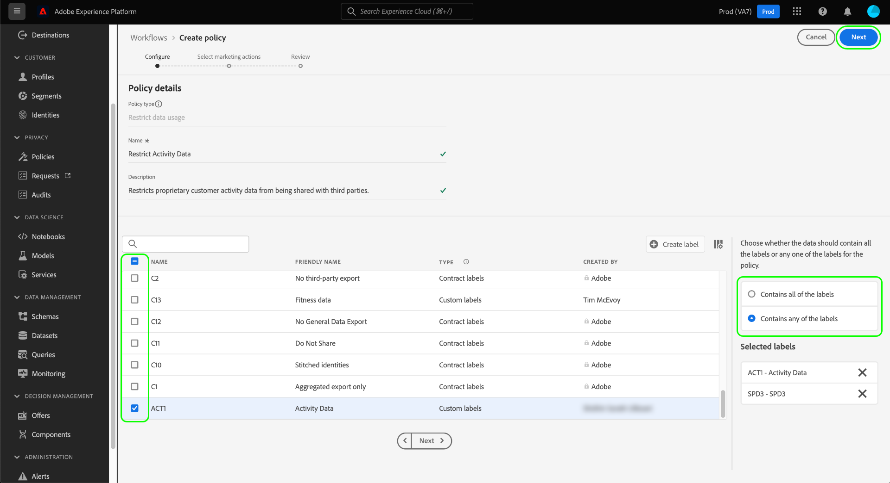

# データガバナンスのエンドツーエンドガイド

Adobe Experience Platform の特定のデータセットやフィールドに対して実行できるマーケティングアクションを制御するには、次の設定を行う必要があります。

1. 使用を制限するデータセットとフィールドに[ラベルを適用](#labels)します。
1. 特定のマーケティングアクションに使用できるラベル付きデータの種類を決定する[データガバナンスポリシーを設定し有効に](#policy)します。
1. [宛先にマーケティングアクションを適用](#destinations)して、その宛先に送信されるデータに適用するポリシーを指定します。

ラベル、ガバナンスポリシーおよびマーケティングアクションの設定が完了したら、[ポリシーの適用をテスト](#test)して、想定どおりに機能していることを確認できます。

このガイドでは、Platform UI でデータガバナンスポリシーを設定し適用する完全なプロセスを順を追って説明します。このガイドで使用される機能について詳しくは、次のトピックの概要ドキュメントを参照してください。

* [Adobe Experience Platform のデータガバナンス](./home.md)
* [データ使用ラベル](./labels/overview.md)
* [データ使用ポリシー](./policies/overview.md)
* [ポリシーの適用](./enforcement/overview.md)

>[!NOTE]
>
>このガイドでは、Experience Platform でデータを使用またはアクティブ化する方法を定めるポリシーの設定および適用方法に的を絞って説明します。組織内の特定の Platform ユーザーに対して、データそのものへの&#x200B;**アクセス**&#x200B;を制限しようとしている場合は、[属性ベースのアクセス制御](../access-control/abac/end-to-end-guide.md)に関するエンドツーエンドガイドを参照してください。属性ベースのアクセス制御でもラベルとポリシーを使用しますが、データガバナンスとは異なるユースケースに使用します。

## ラベルの適用 {#labels}

データ使用制約の適用対象となる特定のデータセットがある場合は、[そのデータセットにラベルを直接適用する](#dataset-labels)か、そのデータセット内の特定のフィールドに適用することができます。

または、[スキーマにラベルを適用](#schema-labels)して、そのスキーマに基づくすべてのデータセットが同じラベルを継承するように設定できます。

>[!NOTE]
>
>様々なデータ使用ラベルとその使用目的について詳しくは、[データ使用ラベルのリファレンス](./labels/reference.md)を参照してください。使用可能なコアラベルが、目的とするユースケースの一部に対応していない場合は、[独自のカスタムラベルを定義](./labels/user-guide.md#manage-custom-labels)することもできます。

### データセットにラベルを適用する {#dataset-labels}

左側のナビゲーションで「**[!UICONTROL データセット]**」を選択してから、ラベルを適用するデータセットの名前を選択します。必要に応じて、検索フィールドを使用して、表示されるデータセットのリストを絞り込むことができます。

データセットの詳細ビューが表示されます。 「**[!UICONTROL データガバナンス]**」タブを選択して、データセットのフィールドとそれらに既に適用されているラベルのリストが表示されます。 ラベルの追加先となるフィールドの横にあるチェックボックスをオンにし、右側のパネルで「**[!UICONTROL ガバナンスラベルを編集]**」を選択します。

>[!NOTE]
>
>データセット全体にラベルを追加する場合は、「**[!UICONTROL フィールド名]**」の横にあるチェックボックスをオンにしてすべてのフィールドをハイライト表示してから、「**[!UICONTROL ガバナンスラベルを編集]**」を選択します。
>
>

次のダイアログで、前の手順で選択したデータセットフィールドに適用するラベルを選択します。完了したら「**[!UICONTROL 変更を保存]**」を選択します。

引き続き上記の手順に従って、異なるフィールド（または異なるデータセット）に必要に応じてラベルを適用します。 完了したら、次の手順（[データガバナンスポリシーの有効化](#policy)）に進むことができます。

### スキーマへのラベルの適用 {#schema-labels}

左側のナビゲーションで「**[!UICONTROL スキーマ]**」を選択し、ラベルの追加先となるスキーマをリストから選択します。

>[!TIP]
>
>特定のデータセットに適用されるスキーマが不明な場合は、左側のナビゲーションで「**[!UICONTROL データセット]**」を選択し、目的のデータセットの「**[!UICONTROL スキーマ]**」列の下にあるリンクを選択します。表示されるポップオーバーでスキーマ名を選択して、スキーマをスキーマエディターで開きます。
>
>

スキーマの構造がスキーマエディターに表示されます。 ここから、「**[!UICONTROL ラベル]**」タブを選択すると、スキーマのフィールドとそれらに既に適用されているラベルのリストが表示されます。ラベルの追加先となるフィールドの横にあるチェックボックスをオンにし、右側のパネルで「**[!UICONTROL ガバナンスラベルを編集]**」を選択します。

>[!NOTE]
>
>スキーマ内のすべてのフィールドにラベルを追加する場合は、1 行目の鉛筆アイコンを選択します。
>
>

次のダイアログで、前の手順で選択したスキーマフィールドに適用するラベルを選択します。 完了したら「**[!UICONTROL 保存]**」を選択します。

引き続き上記の手順に従って、異なるフィールド（または異なるスキーマ）に必要に応じてラベルを適用します。 完了したら、次の手順（[データガバナンスポリシーの有効化](#policy)）に進むことができます。

## データガバナンスポリシーの有効化 {#policy}

スキーマやデータセットにラベルを適用したら、特定のラベルの使用対象となるマーケティングアクションを制限するデータガバナンスポリシーを作成できます。

左側のナビゲーションで「**[!UICONTROL ポリシー]**」を選択すると、アドビが定義したコアポリシーと、組織が以前に作成したカスタムポリシーのリストが表示されます。

各コアラベルにはコアポリシーが関連付けられており、そのポリシーを有効にすると、そのラベルを含んだあらゆるデータに適切なアクティベーション制約が適用されます。コアポリシーを有効にするには、それをリストから選択し、「**[!UICONTROL ポリシーのステータス]**」切替スイッチを&#x200B;**[!UICONTROL 有効]**&#x200B;に設定します。

使用可能なコアポリシーが必ずしもすべてのユースケースに対応していない場合（例えば、組織で定義したカスタムラベルを採用している場合など）は、代わりにカスタムポリシーを定義できます。**[!UICONTROL ポリシー]**&#x200B;ワークスペースから、「**[!UICONTROL ポリシーを作成]**」を選択します。

![UI で「[!UICONTROL ポリシーを作成]」ボタンが選択されている様子を示す画像](./images/e2e/create-policy.png)

ポップオーバーが表示され、作成するポリシーのタイプを選択するように求められます。「**[!UICONTROL データガバナンスポリシー]**」を選択し、「**[!UICONTROL 続行]**」を選択します。

![「[!UICONTROL データガバナンスポリシー]」オプションが選択されている様子を示す画像](./images/e2e/governance-policy.png)

次の画面で、ポリシーの「**[!UICONTROL 名前]**」と「**[!UICONTROL 説明]**」を入力します（説明は任意）。次の表で、このポリシーの確認対象となるラベルを選択します。つまり、これらは、ポリシーによって、次の手順で指定するマーケティングアクションに使用されなくなるラベルです。

複数のラベルを選択する場合は、右側のパネルのオプションを使用して、ポリシーで使用制限を適用するためにすべてのラベルが存在する必要があるか、またはラベルの 1 つだけが存在する必要があるかを決定できます。終了したら、「**[!UICONTROL 次へ]**」を選択します。

次の画面では、このポリシーによって、以前に選択したラベルの使用が制限されるマーケティングアクションを選択します。「**[!UICONTROL 次へ]**」をクリックして続行します。

最後の画面には、ポリシーの詳細の概要と、ポリシーによってラベルの使用が制限されるアクションが表示されます。「**[!UICONTROL 完了]**」を選択して、ポリシーを作成します。

ポリシーは作成されますが、デフォルトでは[!UICONTROL 無効]に設定されます。リストからポリシーを選択し、「**[!UICONTROL ポリシーのステータス]**」切替スイッチを&#x200B;**[!UICONTROL 有効]**&#x200B;に設定してポリシーを有効にします。

次の手順に進む前に、引き続き上記の手順に従って必要なポリシーを作成し有効にします。

## 宛先のマーケティングアクションの管理 {#destinations}

宛先に対してアクティブ化できるデータを有効なポリシーで正確に決定するには、その宛先に特定のマーケティングアクションを割り当てる必要があります。

例えば、`C2` ラベルを含むデータがマーケティングアクション「[!UICONTROL サードパーティに書き出し]」に使用されないようにする有効なポリシーについて考えてみます。宛先に対してデータをアクティブ化する場合、ポリシーはその宛先に存在するマーケティングアクションを確認します。「[!UICONTROL サードパーティに書き出し]」が存在する場合、`C2` ラベルの付いたデータをアクティブ化しようとすると、ポリシー違反になります。「[!UICONTROL サードパーティに書き出し]」が存在しない場合、ポリシーは宛先に適用されず、`C2` ラベルの付いたデータは自由にアクティブ化できます。

[UI で宛先を接続](../destinations/ui/connect-destination.md)すると、ワークフローの&#x200B;**[!UICONTROL ガバナンス]**&#x200B;ステップで、この宛先に適用されるマーケティングアクションを選択でき、その結果、宛先に適用されるデータガバナンスポリシーが最終的に決定されます。

## ポリシー適用のテスト {#test}

データにラベルを付け、データガバナンスポリシーを有効にし、マーケティングアクションを宛先に割り当てたら、ポリシーが想定どおりに適用されるかどうかをテストできます。

正しく設定した場合、ポリシーによって制限されているデータをアクティブ化しようとすると、アクティベーションは自動的に拒否され、違反の原因に関する詳細なデータ系列情報の概要を示すポリシー違反メッセージが表示されます。

ポリシー違反メッセージの解釈方法について詳しくは、[ポリシーの自動適用](./enforcement/auto-enforcement.md)に関するドキュメントを参照してください。

## 次の手順

このガイドでは、アクティベーションワークフローでデータガバナンスポリシーを設定および適用するために必要な手順について説明しました。このガイドに含まれるデータガバナンスコンポーネントについて詳しくは、次のドキュメントを参照してください。

* [データ使用ラベル](./labels/overview.md)
* [データ使用ポリシー](./policies/overview.md)
* [ポリシーの適用](./enforcement/overview.md)
