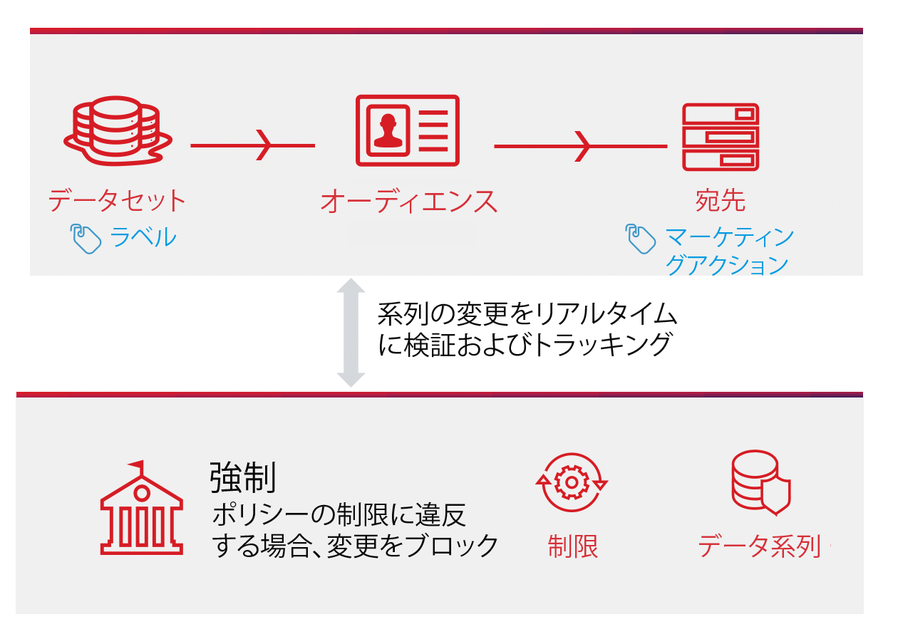

# ポリシーの自動適用

データにラベルが付けられ、使用ポリシーが定義されたら、データ使用に対するポリシーのコンプライアンスを適用できます。宛先に対してオーディエンスセグメントをアクティブ化すると、Adobe Experience Platform は、違反が発生した場合に使用ポリシーを自動的に適用します。

## 前提条件

このガイドでは、自動適用に関連する Platform サービスについて十分に理解している必要があります。このガイドに進む前に、次のドキュメントで詳細を確認してください。

* [Adobe Experience Platform Data Governance](../home.md)：Platform がラベルとポリシーを通じてデータ使用のコンプライアンスを適用するフレームワークです。
* [リアルタイム顧客プロファイル](../../profile/home.md)：複数のソースから集約されたデータに基づいて、統合されたリアルタイムのコンシューマープロファイルを提供します。
* [Adobe Experience Platform セグメント化サービス](../../segmentation/home.md)：[!DNL Platform] 内のセグメントエンジンは、顧客の行動と属性に基づいて、顧客プロファイルからオーディエンスセグメントを作成するのに使用されます。
* [宛先](../../destinations/home.md)：宛先は、一般に使用されるアプリケーションとの事前定義済みの統合であり、Platform のデータをシームレスにアクティブ化してクロスチャネルマーケティングキャンペーン、E メールキャンペーン、ターゲット広告などを実現できます。

## 適用フロー {#flow}

次の図は、ポリシーの実施により、セグメントのアクティベーションのデータフローにどのように統合されるかを示しています。

セグメントが初めてアクティブ化されると、[!DNL Policy Service] は、次の要因に基づいてポリシー違反をチェックします。

* アクティブ化するセグメント内のフィールドおよびデータセットに適用される、データ使用ラベル。
* 宛先のマーケティングの目的。

>[!NOTE]
>
>データセット内の特定のフィールド（データセット全体ではなく）のみに適用されたデータ使用ラベルがある場合、アクティブ化時のこれらのフィールドレベルラベルの適用は、次の条件のみで発生します。
>
>* これらのフィールドは、セグメント定義で使用されます。
>* フィールドは、ターゲット先の予測属性として設定されます。

## データ系列 {#lineage}

データ系列は、Platform でのポリシーの適用方法において重要な役割を果たします。一般的に、データ系列とは、一連のデータの接触チャネルであり、時間の経過に伴ってその一連のデータに何が起こるか（またはデータがどこに移動するか）を示します。

データガバナンスのコンテキストでは、系列を使用すると、データ使用ラベルを、データセットから、リアルタイム顧客プロファイルや宛先などのデータを使用するダウンストリームサービスに伝達できます。 これにより、Platform を介したデータのジャーニーのいくつかの重要なポイントでポリシーを評価および適用でき、ポリシー違反が発生した理由に関して、データコンシューマーにコンテキストが提供されます。

Experience Platform では、ポリシーの適用は次の系列に関係しています。

1. データは Platform に取り込まれ、**データセット**&#x200B;に格納されます。
1. 顧客プロファイルは、**結合ポリシー**&#x200B;に従ってデータフラグメントを結合することにより、これらのデータセットから識別および構築されます。
1. プロファイルのグループは、共通の属性に基づいて&#x200B;**セグメント**&#x200B;に分けられます。
1. セグメントは、ダウンストリームの&#x200B;**宛先**&#x200B;に対してアクティブ化されます。

上記のタイムラインの各ステージは、次の表に示すように、ポリシー違反の要因になる可能性のあるエンティティを表します。

| データ系列のステージ | ポリシー適用における役割 |
| --- | --- |
| データセット | データセットには、データセット全体または特定のフィールドをどのユースケースに使用できるかを定義するデータ使用量ラベル（データセットレベルまたはフィールドレベルで適用）が含まれます。ポリシー違反は、ポリシーが制限する目的で特定のラベルを含むデータセットまたはフィールドを使用した場合に発生します。 |
| 結合ポリシー | 結合ポリシーは、複数のデータセットからフラグメントを結合する際に、データの優先順位付け方法を決定するために Platform で使用されるルールです。制限付きラベルを含むデータセットが宛先に対してアクティブ化されるように結合ポリシーが設定されている場合、ポリシー違反が発生します。詳しくは、[結合ポリシーの概要](../../profile/merge-policies/overview.md)を参照してください。 |
| セグメント | セグメントルールは、顧客プロファイルから含める属性を定義します。セグメント定義に含まれるフィールドに応じて、セグメントは、これらのフィールドに適用された使用ラベルを継承します。ポリシー違反は、継承ラベルがターゲット先の適用可能なポリシーによって制限されているセグメントを、そのマーケティングユースケースに基づいてアクティブ化すると発生します。 |
| 宛先 | 宛先を設定する際に、マーケティングアクション（マーケティングユースケースとも呼ばれます）を定義できます。このユースケースは、データ使用ポリシーで定義されているように、マーケティングアクションに関連しています。つまり、宛先に対して定義したマーケティングユースケースによって、その宛先に適用されるデータ使用ポリシーが決まります。ポリシー違反は、使用ラベルがターゲット先の適用可能なポリシーによって制限されているセグメントをアクティブ化すると発生します。 |

>[!IMPORTANT]
>
>一部のデータ使用ポリシーでは、AND 関係を持つ複数のラベルを指定する場合があります。例えば、ラベル `C1` と `C2` の両方が存在する場合は、ポリシーによりマーケティングアクションが制限され、ラベルが 1 つだけ存在する場合は同じアクションが制限されない、といった場合です。
>
>自動執行に関しては、データガバナンスフレームワークでは、宛先に対する個別のセグメントのアクティブ化はデータの組み合わせとは見なされません。したがって、これらのラベルが別々のセグメントに含まれる場合、例の `C1 AND C2` ポリシーは適用され **ません** 。代わりに、このポリシーは、アクティブ化時に両方のラベルが同じセグメントに存在する場合にのみ適用されます。

ポリシー違反が発生した場合、UI に表示される結果のメッセージには、違反の要因になったデータ系列を調べて問題を解決するためのツールが提示されます。詳しくは、次の節を参照してください。

## ポリシー違反メッセージ {#enforcement}

セグメントをアクティブ化（または[既にアクティブ化されたセグメントを編集](#policy-enforcement-for-activated-segments)）しようとするとポリシー違反が発生した場合、アクションは実行されず、1 つ以上のポリシーに違反したことを示すポップオーバーが表示されます。違反がトリガーされると、適切なコンポーネントを更新してデータ使用ポリシーに準拠するようになるまで、「**[!UICONTROL 保存]**」ボタンは、変更するエンティティに対して無効になります。

ポリシー違反の詳細を表示するには、その違反の左列のポップオーバーでポリシー違反を選択します。

違反メッセージには、違反をチェックするためにポリシーが設定されている条件、違反をトリガーした特定のアクション、問題の解決策のリストなど、ポリシー違反に関する概要が表示されます。

違反の概要の下にデータ系列グラフが表示され、ポリシー違反に関与したデータセット、結合ポリシー、セグメント、および宛先を視覚化できます。グラフ内では現在変更中のエンティティがハイライト表示され、違反が発生する原因となっているフロー内のポイントを示します。グラフ内でエンティティ名を選択して、対象のエンティティの詳細ページを開くことができます。

また、**[!UICONTROL フィルター]**&#x200B;アイコン（）を使用して、表示されたエンティティをカテゴリでフィルターすることもできます。データを表示するには、少なくとも 2 つのカテゴリを選択する必要があります。

「**[!UICONTROL リスト表示]**」を選択し、データ系列をリストとして表示します。ビジュアルグラフに戻すには、「**[!UICONTROL パス表示]**」を選択します。

## アクティブ化されたセグメントに対するポリシー施行 {#policy-enforcement-for-activated-segments}

ポリシーの施行は、アクティブ化された後も引き続きセグメントに適用され、ポリシー違反の原因となったセグメントや宛先に対する変更が制限されます。[データ系列](#lineage)がポリシーの適用でどのように機能するかにより、次のアクションが違反をトリガーする可能性があります。

* データ使用ラベルの更新
* セグメントのデータセットの変更
* セグメント述語の変更
* 宛先設定の変更

上記のアクションのいずれかで違反がトリガーされると、そのアクションは保存されず、ポリシー違反のメッセージが表示され、データ使用ポリシーが変更されると、アクティブ化されたセグメントが引き続きそのポリシーを遵守するようにします。

## 次の手順

このドキュメントでは、Experience Platform でのポリシー自動適用の仕組みを説明しました。API 呼び出しを使用して、ポリシーの適用をプログラムでアプリケーションに統合する方法については、[API ベースの適用](./api-enforcement.md)に関するガイドを参照してください。
