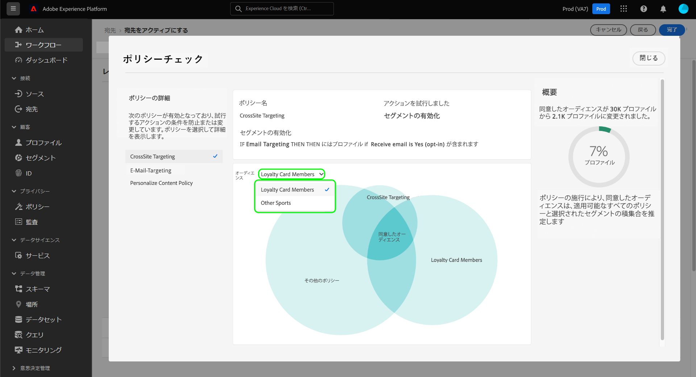

# ポリシーの自動適用

>[!IMPORTANT]
>
>ポリシーの自動適用は、**Adobe Healthcare Shield** または **Adobe Privacy &amp; Security Shield** を購入した組織のみが利用できます。

データにラベルを付け、データ使用ポリシーを定義したら、データ使用のコンプライアンスをポリシーで適用できます。宛先に対するオーディエンスをアクティブ化する場合、Adobe Experience Platformは、違反が発生した場合に使用ポリシーを自動的に適用します。

>[!NOTE]
>
>このドキュメントでは、データガバナンスと同意ポリシーの適用について重点的に説明しています。アクセス制御ポリシーについて詳しくは、[属性ベースのアクセス制御](../../access-control/abac/overview.md)に関するドキュメントを参照してください。

## 前提条件

このガイドでは、自動適用に関連する Platform サービスについて十分に理解している必要があります。このガイドに進む前に、次のドキュメントで詳細を確認してください。

* [Adobe Experience Platform Data Governance](../home.md)：Platform がラベルとポリシーを通じてデータ使用のコンプライアンスを適用するフレームワークです。
* [リアルタイム顧客プロファイル](../../profile/home.md)：複数のソースから集計したデータに基づいて、統合されたリアルタイムの顧客プロファイルを提供します。
* [Adobe Experience Platform Segmentation Service](../../segmentation/home.md):内のセグメント化エンジン [!DNL Platform] を使用して、顧客の行動と属性に基づいて顧客プロファイルからオーディエンスを作成します。
* [宛先](../../destinations/home.md)：宛先は、一般に使用されるアプリケーションとの事前定義済みの統合であり、Platform のデータをシームレスにアクティブ化してクロスチャネルマーケティングキャンペーン、E メールキャンペーン、ターゲット広告などを実現できます。

## 適用フロー {#flow}

次の図は、ポリシーの実施によって、オーディエンスのアクティベーションのデータフローにどのように統合されるかを示しています。

オーディエンスが最初にアクティブ化されたとき、 [!DNL Policy Service] は、次の要因に基づいて、該当するポリシーをチェックします。

* アクティブ化するオーディエンス内のフィールドとデータセットに適用されるデータ使用ラベル。
* 宛先のマーケティングの目的。
* 設定した同意ポリシーに基づいて、オーディエンスのアクティベーションに含めることに同意したプロファイル。

>[!NOTE]
>
>データセット内の特定のフィールド（データセット全体ではなく）のみに適用されたデータ使用ラベルがある場合、アクティブ化時のこれらのフィールドレベルラベルの適用は、次の条件のみで発生します。
>
>* これらのフィールドは、オーディエンスで使用されます。
>* フィールドは、ターゲット先の予測属性として設定されます。

## データ系列 {#lineage}

データ系列は、Platform でのポリシーの適用方法において重要な役割を果たします。一般的に、データ系列とは、一連のデータの接触チャネルであり、時間の経過に伴ってその一連のデータに何が起こるか（またはデータがどこに移動するか）を示します。

データガバナンスのコンテキストでは、系列を使用すると、データ使用ラベルをスキーマから、データを使用するダウンストリームサービス（リアルタイム顧客プロファイルや宛先など）に生成することができます。これにより、Platform を介したデータのジャーニーのいくつかの重要なポイントでポリシーを評価および適用でき、ポリシー違反が発生した理由に関して、データコンシューマーにコンテキストが提供されます。

Experience Platform では、ポリシーの適用は次の系列に関係しています。

1. データは Platform に取り込まれ、**データセット**&#x200B;に格納されます。
1. 顧客プロファイルは、**結合ポリシー**&#x200B;に従ってデータフラグメントを結合することにより、これらのデータセットから識別および構築されます。
1. プロファイルのグループは、 **audiences** 共通の属性に基づく。
1. オーディエンスがアクティブ化されてダウンストリームに **宛先**.

上記のタイムラインの各ステージは、次の表に示すように、ポリシーの施行に貢献する可能性のあるエンティティを表します。

| データ系列のステージ | ポリシー適用における役割 |
| --- | --- |
| データセット | データセットには、データセット全体または特定のフィールドをどのユースケースに使用できるかを定義するデータ使用ラベル（スキーマフィールドレベルまたはデータセット全体レベルで適用）が含まれます。ポリシー違反は、ポリシーが制限する目的で特定のラベルを含むデータセットまたはフィールドを使用した場合に発生します。  顧客から収集された同意属性も、データセットに保存されます。 同意ポリシーへのアクセス権を持っている場合、ポリシーの同意属性要件を満たさないプロファイルは、宛先に対してアクティブ化されたオーディエンスから除外されます。 |
| 結合ポリシー | 結合ポリシーは、複数のデータセットからフラグメントを結合する際に、データの優先順位付け方法を決定するために Platform で使用されるルールです。制限付きラベルを含むデータセットが宛先に対してアクティブ化されるように結合ポリシーが設定されている場合、ポリシー違反が発生します。詳しくは、[結合ポリシーの概要](../../profile/merge-policies/overview.md)を参照してください。 |
| オーディエンス | セグメント化ルールは、顧客プロファイルから含める属性を定義します。 セグメント定義に含まれるフィールドに応じて、オーディエンスは、それらのフィールドに適用された使用ラベルを継承します。 継承されたラベルがターゲットの宛先の適用可能なポリシーによって制限されるオーディエンスを、そのマーケティング使用例に基づいてアクティブ化すると、ポリシー違反が発生します。 |
| 宛先 | 宛先を設定する際に、マーケティングアクション（マーケティングユースケースとも呼ばれます）を定義できます。このユースケースは、ポリシーで定義されているように、マーケティングアクションに関連しています。つまり、宛先に対して定義したマーケティングアクションによって、その宛先に適用されるデータ使用ポリシーと同意ポリシーが決まります。  データ使用ポリシーの違反は、使用ラベルがターゲットの宛先のマーケティングアクションに対して制限されているオーディエンスをアクティブ化すると発生します。  （ベータ版）オーディエンスがアクティブ化されると、（同意ポリシーによって定義された）マーケティングアクションに必要な同意属性を含まないプロファイルは、アクティブ化されたオーディエンスから除外されます。 |

>[!IMPORTANT]
>
>一部のデータ使用ポリシーでは、AND 関係を持つ複数のラベルを指定する場合があります。例えば、ラベル `C1` と `C2` の両方が存在する場合は、ポリシーによりマーケティングアクションが制限され、ラベルが 1 つだけ存在する場合は同じアクションが制限されない、といった場合です。
>
>自動実施に関しては、データガバナンスフレームワークでは、別のオーディエンスの宛先へのアクティブ化をデータの組み合わせと見なしません。 したがって、例 `C1 AND C2` ポリシーは **NOT** これらのラベルが別のオーディエンスに含まれる場合に適用されます。 代わりに、このポリシーは、アクティブ化時に両方のラベルが同じオーディエンスに存在する場合にのみ適用されます。

ポリシー違反が発生した場合、UI に表示される結果のメッセージには、違反の要因になったデータ系列を調べて問題を解決するためのツールが提示されます。詳しくは、次の節を参照してください。

## ポリシー適用メッセージ {#enforcement}

以下の節では、Platform UI に表示される様々なポリシー適用メッセージの概要を説明します。

* [データ使用ポリシー違反](#data-usage-violation)
* [同意ポリシーの評価](#consent-policy-evaluation)

### データ使用ポリシー違反 {#data-usage-violation}

オーディエンス ( または [既にアクティブ化されているオーディエンスに編集を加える](#policy-enforcement-for-activated-audiences)) アクションが実行されず、1 つ以上のポリシーに違反したことを示すポップオーバーが表示されます。 違反がトリガーされると、適切なコンポーネントを更新してデータ使用ポリシーに準拠するようになるまで、「**[!UICONTROL 保存]**」ボタンは、変更するエンティティに対して無効になります。

ポリシー違反の詳細を表示するには、その違反の左列のポップオーバーでポリシー違反を選択します。

違反メッセージには、違反をチェックするためにポリシーが設定されている条件、違反をトリガーした特定のアクション、問題の解決策のリストなど、ポリシー違反に関する概要が表示されます。

データ系列グラフが違反概要の下に表示され、ポリシー違反に関係したデータセット、結合ポリシー、オーディエンスおよび宛先を視覚化できます。 グラフ内では現在変更中のエンティティがハイライト表示され、違反が発生する原因となっているフロー内のポイントを示します。グラフ内でエンティティ名を選択して、対象のエンティティの詳細ページを開くことができます。

また、**[!UICONTROL フィルター]**&#x200B;アイコン（）を使用して、表示されたエンティティをカテゴリでフィルターすることもできます。データを表示するには、少なくとも 2 つのカテゴリを選択する必要があります。

「**[!UICONTROL リスト表示]**」を選択し、データ系列をリストとして表示します。ビジュアルグラフに戻すには、「**[!UICONTROL パス表示]**」を選択します。

### 同意ポリシーの評価 {#consent-policy-evaluation}

次の場合： [同意ポリシーを作成しました](../policies/user-guide.md#consent-policy) およびは、宛先に対するオーディエンスをアクティブ化しているときに、同意ポリシーがアクティベーションに含まれるプロファイルの割合にどのように影響するかを確認できます。

#### 有料メディアの同意ポリシーの強化 {#consent-policy-enhancement}

有料メディアのアクティベーションなど、[バッチ](../../destinations/destination-types.md#file-based)や[ストリーミング](../../destinations/destination-types.md#streaming-destinations)宛先に対する同意ポリシーの適用が強化されました。 この強化機能は、Privacy and Security Shield または Healthcare Shield のお客様が利用できるもので、同意ステータスの変更に応じて、バッチやストリーミング宛先からプロアクティブにプロファイルを削除します。 また、適切なオーディエンスが常にターゲットになるように、同意の変更が即座に反映されます。

これらの改善により、マーケターがセグメント式に同意属性を手動で追加しなくてもよくなるので、マーケティング戦略に対する信頼が高まります。 これにより、同意が取り下げられたり、同意ポリシーに適さなくなったりした場合に、プロファイルが誤ってマーケティングエクスペリエンスのターゲットになることを防止できます。 様々なマーケティングワークフローで同意または環境設定データを管理する方法に関するルールを設定するマーケティング同意ポリシーが、ダウンストリームソリューションのアクティブ化ワークフローで自動的に適用されるようになりました。

>[!NOTE]
>
>この強化による UI の変更はありません。

#### アクティベーション前の評価

[宛先をアクティブ化する](../../destinations/ui/activation-overview.md)てきに&#x200B;**[!UICONTROL レビュー]**&#x200B;のステップに到達したら、**[!UICONTROL 適用されたポリシーを表示]**&#x200B;を選択します。

ポリシーチェックダイアログが表示され、アクティブ化されたオーディエンスの同意されたオーディエンスに対する同意ポリシーの影響のプレビューが示されます。

ダイアログには、一度に 1 人のオーディエンスの同意済みオーディエンスが表示されます。 別のオーディエンスのポリシー評価を表示するには、図の上にあるドロップダウンメニューを使用して、リストから選択します。

左側のレールを使用して、選択したオーディエンスに適用される同意ポリシーを切り替えます。 選択されていないポリシーは、この図の「[!UICONTROL その他のポリシー]」セクションに表示されます。

この図は、次の 3 つのプロファイルグループ間の重複を示しています。

1. 選択したオーディエンスに適合するプロファイル
1. 選択した同意ポリシーに適合するプロファイル
1. オーディエンスに適用されるその他の同意ポリシー ([!UICONTROL その他のポリシー]」と表示されます。

上記の 3 つのグループすべてに該当するプロファイルは、右側のパネルに要約された同意済みのオーディエンスを表します。

ダイアグラム内の 1 つのオーディエンスの上にマウスポインターを置くと、その中に含まれるプロファイルの数が表示されます。

同意されたオーディエンスは、図の中央の重複で表され、他のセクションと同様にハイライト表示できます。

#### フロー実行の強制

データが宛先に対してアクティブ化されると、フロー実行の詳細には、アクティブな同意ポリシーによって除外された ID の数が示されます。

## アクティブ化されたオーディエンスのポリシー適用 {#policy-enforcement-for-activated-audiences}

ポリシーの強制は、アクティブ化された後も引き続きオーディエンスに適用され、ポリシー違反の原因となるオーディエンスまたはその宛先に対する変更が制限されます。 [データ系列](#lineage)がポリシーの適用でどのように機能するかにより、次のアクションが違反をトリガーする可能性があります。

* データ使用ラベルの更新
* オーディエンスのデータセットの変更
* オーディエンスの述語の変更
* 宛先設定の変更

上記のアクションのいずれかが違反をトリガーした場合、そのアクションは保存されず、ポリシー違反メッセージが表示されます。アクティブなオーディエンスは、変更時にも引き続きデータ使用ポリシーに従います。

## 次の手順

このドキュメントでは、Experience Platform でのポリシー自動適用の仕組みを説明しました。API 呼び出しを使用して、ポリシーの適用をプログラムでアプリケーションに統合する方法については、[API ベースの適用](./api-enforcement.md)に関するガイドを参照してください。
