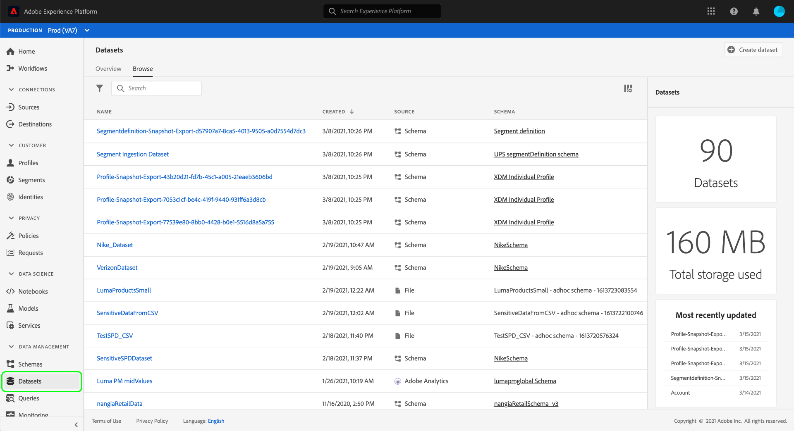
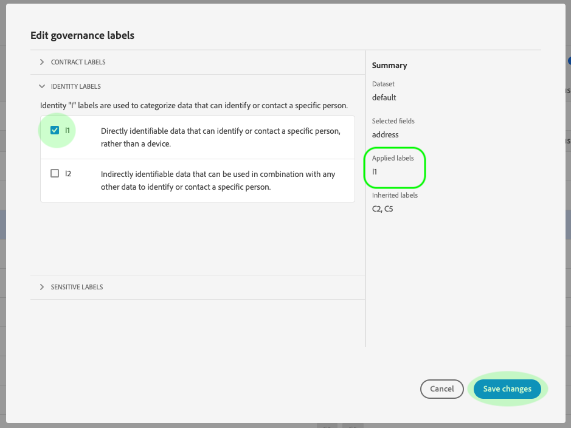

# UI でのデータ使用ラベルの管理 {#user-guide}

>[!CONTEXTUALHELP]
>id="platform_privacyConsole_dataGovernance_description"
>title="Platform でのデータ使用の管理"
>abstract="<h2>説明</h2>
Experience Platform のデータガバナンスフレームワークを使用すると、データ使用制限に従って属性やデータセットにラベルを付け、これらの制限を識別し遵守するポリシーを特定のマーケティングアクションに設定できます。
"

このユーザガイドでは、[!DNL Experience Platform] ユーザーインターフェイス内でデータ使用ラベルを使用する手順を説明します。

## データセットレベルでのラベルの管理

>[!IMPORTANT]
>
>データセットレベルでのラベルの適用は、データガバナンスのユースケースでのみサポートされています。データのアクセスポリシーを作成しようとしている場合は、データセットが基づいている[スキーマにラベルを適用](../../xdm/tutorials/labels.md)する必要があります。詳しくは、[属性ベースのアクセス制御](../../access-control/abac/overview.md)の概要を参照してください。

データセットレベルでデータ使用状況ラベルを管理するには、既存のデータセットを選択するか、新しいデータセットを作成する必要があります。Adobe Experience Platform にログインした後、左側のナビゲーションで「**[!UICONTROL データセット]**」を選択し、「**[!UICONTROL データセット]**」ワークスペースを開きます。このページには、組織に属するすべての作成済みデータセットと、各データセットに関する有用な詳細情報がリストされます。

次の節では、ラベルの適用先の新しいデータセットを作成する手順を説明します。既存のデータセットのラベルを編集する場合は、リストからデータセットを選択し、「[データセットへのデータ使用状況ラベルの追加](#add-labels)」に進みます。

### 新しいデータセットの作成

>[!NOTE]
>
>この例では、事前設定済みの [!DNL Experience Data Model]（XDM）スキーマを使用してデータセットを作成します。XDM スキーマについて詳しくは、「[XDM システムの概要](../../xdm/home.md)」と「[スキーマ構成の基本](../../xdm/schema/composition.md)」を参照してください。

新しいデータセットを作成するには、**[!UICONTROL データセット]**&#x200B;ワークスペースの右上にある&#x200B;**[!UICONTROL データセットを作成]**&#x200B;をクリックします。

「**[!UICONTROL データセットを作成]**」画面が表示されます。ここで、「**[!UICONTROL スキーマからデータセットを作成]**」をクリックします。

「**[!UICONTROL スキーマを選択]**」画面が表示され、データセットの作成に使用できるすべてのスキーマが示されます。スキーマの横にあるラジオボタンをクリックして、スキーマを選択します。右側の「**[!UICONTROL スキーマ]**」セクションには、選択したスキーマの追加の詳細が表示されます。スキーマを選択したら、「**[!UICONTROL 次へ]**」をクリックします。

「**[!UICONTROL データセットを設定]**」画面が表示されます。新しいデータセットの名前（必須）と説明（任意ですが推奨）を指定し、「**[!UICONTROL 終了]**」をクリックします。

「**[!UICONTROL データセットアクティビティ]**」ページが開き、新しく作成したデータセットに関する情報が表示されます。この例では、データセットの名前は「ロイヤルティーメンバー」なので、トップナビゲーションには&#x200B;**データセット／ロイヤルティーメンバー**&#x200B;と表示されます。

### データセットへのデータ使用ラベルの追加 {#add-labels}

**[!UICONTROL データセット]**&#x200B;ワークスペースのリストから既存のデータセットを選択するか、新しいデータセットしたら、「**[!UICONTROL データガバナンス]**」をクリックして&#x200B;**[!UICONTROL データガバナンス]** ワークスペースを開きます。ワークスペースでは、データセットレベルとフィールドレベルでデータ使用状況ラベルを管理できます。

データセットレベルでデータ使用ラベルを編集するには、まずデータセット名の横にある鉛筆アイコンをクリックします。

「**[!UICONTROL ガバナンスラベルを編集]**」ダイアログが開きます。ダイアログ内で、データセットに適用するラベルの横にあるボックスをオンにします。これらのラベルは、データセット内のすべてのフィールドに継承されることに注意してください。各ボックスをオンにすると、「**[!UICONTROL 適用されたラベル]**」ヘッダーが更新され、選択したラベルが表示されます。目的のラベルを選択したら、「**[!UICONTROL 変更を保存]**」をクリックします。

「**[!UICONTROL データガバナンス]**」ワークスペースが再び表示され、データセットレベルで適用したラベルが示されます。また、ラベルがデータセット内の各フィールドに継承されていることも確認できます。

データセットレベルでラベルの横に「x」が表示されていることに注意してください。この場合、ラベルを削除できます。各フィールドの継承されたラベルの横には「x」がなく、「灰色表示」になっています。これらのラベルは削除したり、編集したりできません。これは、**継承されたフィールドは読み取り専用**&#x200B;で、フィールドレベルでは削除できないためです。

「**[!UICONTROL 継承されたラベルを表示]**」トグルはデフォルトでオンになっており、データセットからフィールドに継承されたラベルを表示できます。トグルをオフに切り替えると、データセット内の継承されたラベルが非表示になります。

## データセットフィールドレベルでのラベルの管理 {#manage-labels-at-dataset-field-level}

>[!CONTEXTUALHELP]
>id="platform_privacyConsole_dataGovernance_instructions"
>title="手順"
>abstract="<ol><li>左側のナビゲーションで「<a href="https://experienceleague.adobe.com/docs/experience-platform/data-governance/labels/user-guide.html?lang=ja">データセット</a>」を選択してから、データを制限するデータセットを選択します。</li><li>データセットの詳細ビューで、「<b>データガバナンス</b>」タブを選択します。</li><li>制限するデータセットフィールドを選択し、「<b>ガバナンスラベルを編集</b>」を選択して、使用制限に基づいてデータにラベルを付けます。</li><li>データにラベルを付けた後、左側のナビゲーションで「<a href="https://experienceleague.adobe.com/docs/experience-platform/data-governance/policies/overview.html?lang=ja">ポリシー</a>」を選択してから、「<b>ポリシーを作成</b>」を選択します。</li><li><a href="https://experienceleague.adobe.com/docs/experience-platform/data-governance/policies/user-guide.html?lang=ja#create-governance-policy">データガバナンスポリシー</a>の作成を選択したあと、ポリシーに適用されるデータ使用ラベルを選択します。</li><li>これらのラベルを含んだデータに対してポリシーによって拒否するマーケティングアクションを選択します。ポリシーを作成したら、リストから選択し、右側のパネルの切替スイッチを使用して有効にします。</li><li>Platform では、有効になっているポリシーごとに、指定のラベルを含んだデータが、定義されたマーケティングアクションに使用されないようにします。この適用は、関連付けられたマーケティングアクション（ユースケース）でラベル付きデータを宛先に対してアクティブ化しようとすると、自動的に行われます。</li></ol>"

>[!IMPORTANT]
>
>データセットフィールドレベルでのラベルの適用は、データガバナンスの使用例でのみサポートされています。データのアクセスポリシーを作成しようとしている場合は、データセットが基づいている[スキーマにラベルを適用](../../xdm/tutorials/labels.md)する必要があります。詳しくは、[属性ベースのアクセス制御](../../access-control/abac/overview.md)の概要を参照してください。

[データセットレベルでのデータ使用状況ラベルの追加と編集](#add-labels)のワークフローを継続して、そのデータセットの「**[!UICONTROL データガバナンス]**」ワークスペース内のフィールドレベルのラベルを管理することもできます。

データ使用ラベルを個々のフィールドに適用するには、フィールド名の横にあるチェックボックスをオンにし、「**[!UICONTROL ガバナンスラベルを編集]**」をクリックします。

「**[!UICONTROL ガバナンスラベルを編集]**」ダイアログが表示されます。このダイアログには、選択されたフィールド、適用されたラベル、継承されたラベルを示すヘッダーが表示されます。継承されたラベル（C2 と C5）は、ダイアログで灰色表示になることに注意してください。これらのラベルは、データセットレベルから継承された読み取り専用のラベルなので、データセットレベルのみで編集できます。

使用する各ラベルの横にあるチェックボックスをオンにして、フィールドレベルのラベルを選択します。ラベルを選択すると、「**[!UICONTROL 適用されたラベル]**」ヘッダーが更新され、「**[!UICONTROL 選択されたフィールド]**」ヘッダーに表示されるフィールドに適用されるラベルが表示されます。フィールドレベルのラベルの選択が完了したら、「**[!UICONTROL 変更を保存]**」をクリックします。

「**[!UICONTROL データガバナンス]**」ワークスペースが再び表示され、フィールド名の横の行にフィールドレベルの選択済みラベルが表示されます。フィールドレベルのラベルの横には「x」が表示され、ラベルを削除できます。

これらの手順を繰り返して、追加のフィールドに対してフィールドレベルのラベルの追加と編集を続けることができます。複数のフィールドを選択して、フィールドレベルのラベルを同時に適用することもできます。

継承は最上位レベルから下のレベル（データセットからフィールド）のみに移動するため、フィールドレベルで適用されたラベルは他のフィールドやデータセットには反映されないことに注意する必要があります。

## スキーマレベルでのラベルの管理

ラベルをスキーマまたはそのスキーマ内のフィールドに直接追加できます。スキーマレベルで適用されたフィールドは、そのスキーマに基づいてすべてのデータセットに反映されます。

詳しくは、[スキーマレベルのラベルの管理](../../xdm/tutorials/labels.md)に関するチュートリアルを参照してください。

## カスタムラベルの管理 {#manage-custom-labels}

>[!CONTEXTUALHELP]
>id="platform_governance_createlabels"
>title="ラベルの作成"
>abstract="ラベルを使用すると、データに適用される使用ポリシーに従ってデータセットとフィールドを分類できます。Platform には、使用するラベルの標準セットが用意されていますが、組織に固有のカスタムラベルを作成することもできます。"

[!DNL Experience Platform] UI の&#x200B;**[!UICONTROL ポリシー]**&#x200B;ワークスペース内に、独自のカスタム使用ラベルを作成できます。左側のナビゲーションで&#x200B;**[!UICONTROL ポリシー]**&#x200B;を選択し、**[!UICONTROL ラベル]**&#x200B;を選択して、既存のラベルのリストを表示します。ここから、**[!UICONTROL ラベルを作成]**&#x200B;を選択します。

**[!UICONTROL ラベルを作成]**&#x200B;ダイアログが表示されます。ここから、新しいラベルに次の情報を入力します。

* **[!UICONTROL 識別情報]**：ラベルの一意の ID。この値は参照用に使用するので、短く簡潔にする必要があります。
* **[!UICONTROL 名前]**：ラベルのわかりやすい表示名。
* **[!UICONTROL 説明]**：（オプション）詳細なコンテキストを提供するためのラベルの説明。

完了したら、「**[!UICONTROL 作成]**」をクリックします。

ダイアログが閉じ、新しく作成したカスタムラベルが「**[!UICONTROL ラベル]**」タブのリストに表示されます。

データセットやフィールドの使用ラベルを編集する場合や、データ使用ポリシーを作成する場合に、「**[!UICONTROL カスタムラベル]**」でラベルを選択できるようになりました。

 

## 次の手順

データセットレベルとフィールドレベルでデータ使用状況ラベルを追加したら、データを [!DNL Experience Platform] に取り込み始めます。詳しくは、[データ取得ドキュメント](../../ingestion/home.md)を参照してください。

適用したラベルに基づいてデータ使用状況ポリシーを定義することもできます。詳しくは、「[データ使用状況ポリシーの概要](../policies/overview.md)」を参照してください。

## その他のリソース

次のビデオは、データガバナンスに関する理解を深めるために、データセットと個々のフィールドにラベルを適用する方法の概要を説明しています。

>[!VIDEO](https://video.tv.adobe.com/v/29709?quality=12&enable10seconds=on&speedcontrol=on)
