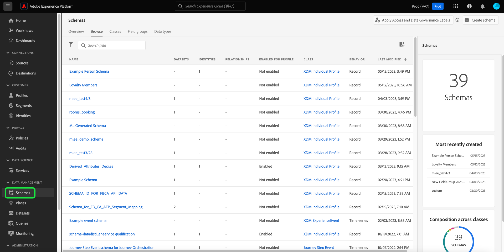

# UI でのデータ使用ラベルの管理 {#user-guide}

>[!CONTEXTUALHELP]
>id="platform_privacyConsole_dataGovernance_description"
>title="Platform でのデータ使用の管理"
>abstract="<h2>説明</h2>
Experience Platformのデータガバナンスフレームワークを使用すると、データ使用制限に従って属性とスキーマにラベルを付け、特定のマーケティングアクションに対してこれらの制限を識別し遵守するポリシーを設定できます。
"

このユーザガイドでは、[!DNL Experience Platform] ユーザーインターフェイス内でデータ使用ラベルを使用する手順を説明します。

## ラベルの管理 {#manage-labels}

データにラベルを適用するには、 **[!UICONTROL 使用状況ラベルを管理]** 「prod」というデフォルトの実稼動サンドボックスで使用する権限です。 カスタムラベルを作成するには、製品プロファイルに対する管理権限も必要です。 各組織には適用可能なラベルのリストが 1 つしかなく、現在、ラベルの削除はサポートされていません。

方法に関するガイドを参照してください。 [権限の設定](https://experienceleague.adobe.com/docs/platform-learn/getting-started-for-data-architects-and-data-engineers/configure-permissions.html) または [アクセス制御の概要](../../access-control/home.md) 権限の割り当て方法の詳細については、を参照してください。 組織のAdmin Consoleへのアクセス権がない場合は、組織の管理者にお問い合わせください。

## スキーマレベルでのラベルの管理

ラベルをスキーマまたはそのスキーマ内のフィールドに直接追加できます。スキーマレベルで適用されたフィールドは、そのスキーマに基づいてすべてのデータセットに反映されます。

スキーマレベルでデータ使用状況ラベルを管理するには、既存のスキーマを選択するか、新しく作成する必要があります。 Adobe Experience Platformにログインした後、 **[!UICONTROL スキーマ]** 左側のナビゲーションで、 **[!UICONTROL スキーマ]** ワークスペース。 このページには、組織に属する作成済みのすべてのスキーマと、各スキーマに関する有用な詳細が一覧表示されます。

次の節では、ラベルを適用する新しいスキーマを作成する手順を説明します。 既存のスキーマのラベルを編集する場合は、リストからスキーマを選択し、次に進みます： [スキーマへのデータ使用ラベルの追加](#add-labels).

### 新しいスキーマの作成

新しいスキーマを作成するには、「 **[!UICONTROL スキーマを作成]** の右上隅に **[!UICONTROL スキーマ]** ワークスペース。 詳しくは、 [スキーマエディターを使用してスキーマを作成する方法](../../xdm/tutorials/create-schema-ui.md#create) 」を参照してください。 または、 [スキーマレジストリ API を使用してスキーマを作成する](../../xdm/tutorials/create-schema-api.md) （必要に応じて）

### スキーマへのデータ使用状況ラベルの追加 {#add-labels-to-schema}

新しいスキーマを作成した後、または [!UICONTROL 参照] タブ [!UICONTROL スキーマ] ワークスペースで、スキーマエディターのスキーマからフィールドを選択します。 内 [!UICONTROL フィールドプロパティ] サイドバー、選択 **[!UICONTROL アクセスおよびデータガバナンスラベルの適用]**.

スキーマレベルとフィールドレベルでデータ使用状況ラベルを適用および管理できるダイアログが表示されます。 詳しい手順については、 XDM チュートリアル ( [XDM スキーマのデータ使用ラベルを追加または編集する方法](../../xdm/tutorials/labels.md#select-schema-field).

### 特定のデータセットへのデータ使用状況ラベルの追加 {#add-labels-to-dataset}

>[!CONTEXTUALHELP]
>id="platform_privacyConsole_dataGovernance_instructions"
>title="手順"
>abstract="<ol><li>左側のナビゲーションで「<a href="https://experienceleague.adobe.com/docs/experience-platform/data-governance/labels/user-guide.html?lang=ja">データセット</a>」を選択してから、データを制限するデータセットを選択します。</li><li>データセットの詳細ビューで、「<b>データガバナンス</b>」タブを選択します。</li><li>制限するデータセットフィールドを選択し、「<b>ガバナンスラベルを編集</b>」を選択して、使用制限に基づいてデータにラベルを付けます。</li><li>データにラベルを付けた後、左側のナビゲーションで「<a href="https://experienceleague.adobe.com/docs/experience-platform/data-governance/policies/overview.html?lang=ja">ポリシー</a>」を選択してから、「<b>ポリシーを作成</b>」を選択します。</li><li><a href="https://experienceleague.adobe.com/docs/experience-platform/data-governance/policies/user-guide.html?lang=ja#create-governance-policy">データガバナンスポリシー</a>の作成を選択したあと、ポリシーに適用されるデータ使用ラベルを選択します。</li><li>これらのラベルを含んだデータに対してポリシーによって拒否するマーケティングアクションを選択します。ポリシーを作成したら、リストから選択し、右側のパネルの切替スイッチを使用して有効にします。</li><li>Platform では、有効になっているポリシーごとに、指定のラベルを含んだデータが、定義されたマーケティングアクションに使用されないようにします。この適用は、関連付けられたマーケティングアクション（ユースケース）でラベル付きデータを宛先に対してアクティブ化しようとすると、自動的に行われます。</li></ol>"

>[!IMPORTANT]
>
>データセットレベルのフィールドにラベルを適用できなくなりました。 スキーマレベルでラベルを適用するため、このワークフローは廃止されました。 データセットオブジェクトレベルで以前に適用されたラベルは、2024 年 5 月 31 日まで、引き続き Platform UI を通じてサポートされます。 すべてのスキーマでラベルの一貫性を確保するには、データセットレベルで以前フィールドに関連付けられていたラベルを、来年度にユーザーがスキーマレベルに移行する必要があります。 手順については、ドキュメントを参照してください。 [以前に適用したラベルをデータセットからスキーマレベルに移行する方法](../e2e.md#migrate-labels).

ラベルは、 **[!UICONTROL データガバナンス]** タブ **[!UICONTROL データセット]** ワークスペース。 ワークスペースでは、データセットレベルでデータ使用状況ラベルを管理できます。

![この [!UICONTROL データガバナンス] タブ [!UICONTROL データセット] 「データガバナンスを含むワークスペース」が強調表示されています。](../images/labels/dataset-governance.png)

データセットレベルでデータ使用状況ラベルを編集するには、まず鉛筆アイコン () をクリックします。

![この [!UICONTROL データガバナンス] タブ [!UICONTROL データセット] 鉛筆アイコンをハイライト表示したワークスペース](../images/labels/dataset-level-edit.png)

「**[!UICONTROL ガバナンスラベルを編集]**」ダイアログが開きます。ダイアログ内で、データセットに適用するラベルの横にあるボックスをオンにします。これらのラベルは、データセット内のすべてのフィールドに継承されることに注意してください。各ボックスをオンにすると、「**[!UICONTROL 適用されたラベル]**」ヘッダーが更新され、選択したラベルが表示されます。目的のラベルを選択したら、「**[!UICONTROL 変更を保存]**」をクリックします。

この **[!UICONTROL データガバナンス]** workspace が再び表示され、テーブルの最初の行のデータセットレベルで適用したラベルが表示されます。 また、データセット内の各フィールドに継承される個々のカードで示されるラベルを確認することもできます。

![この [!UICONTROL データガバナンス] タブ [!UICONTROL データセット] データセットレベルのラベルが適用されたワークスペースと、継承されたデータセットフィールドラベルがハイライト表示されています。](../images/labels/applied-dataset-labels.png)

### データセットからラベルを削除する {#remove-labels-from-a-dataset}

データセットレベルで追加されたラベルの場合、カードの横には「x」が表示されます。 これにより、データセット全体からラベルを削除できます。 各フィールドの継承されたラベルの横には「x」がなく、「灰色表示」になっています。 これら **継承されたラベルは読み取り専用です**&#x200B;の場合、フィールドレベルで削除または編集することはできません。

<!-- ## View labels at the dataset field level {#view-labels-at-dataset-field-level} -->

<!-- To view labels inherited by the dataset from the schema level, select **[!UICONTROL Datasets]** to navigate to the datasets workspace and select the relevant dataset from the list. 

Next, select the **[!UICONTROL Data Governance]** tab to show the labels that have been applied to the dataset. You can also see that the labels are inherited down to each of the fields within the dataset.

The inherited labels beside each field do not have an "x" next to them and appear "greyed out" with no ability to remove or edit. This is because **inherited fields are read-only**, meaning they cannot be removed at the field level. -->

<!--Beleive can cut above here  -->

この **[!UICONTROL 継承されたラベルを表示]** デフォルトではオンになっており、スキーマからフィールドに継承されたラベルを表示できます。 トグルをオフに切り替えると、データセット内の継承されたラベルが非表示になります。

<!-- Labels applied to the dataset appear in read-only form within the **[!UICONTROL Data Governance]** view for that dataset. 

 -->

>[!NOTE]
>
>データセットのラベル付け機能の廃止前に適用されたラベルは、関連するデータセットを見つけ、ラベルの「キャンセル」アイコンを選択することで、データセットから削除できます。
>
>手順については、ドキュメントを参照してください。 [以前に適用したラベルをデータセットからスキーマレベルに移行する方法](../e2e.md#migrate-labels).

## カスタムラベルの管理 {#manage-custom-labels}

>[!CONTEXTUALHELP]
>id="platform_governance_createlabels"
>title="ラベルの作成"
>abstract="ラベルを使用すると、データに適用される使用ポリシーに従ってデータセットとフィールドを分類できます。Platform には、使用するラベルの標準セットが用意されていますが、組織に固有のカスタムラベルを作成することもできます。"

[!DNL Experience Platform] UI の&#x200B;**[!UICONTROL ポリシー]**&#x200B;ワークスペース内に、独自のカスタム使用ラベルを作成できます。左側のナビゲーションで&#x200B;**[!UICONTROL ポリシー]**&#x200B;を選択し、**[!UICONTROL ラベル]**&#x200B;を選択して、既存のラベルのリストを表示します。ここから、**[!UICONTROL ラベルを作成]**&#x200B;を選択します。

**[!UICONTROL ラベルを作成]**&#x200B;ダイアログが表示されます。ここから、新しいラベルに次の情報を入力します。

* **[!UICONTROL 名前]**:ラベルの一意の ID。 この値は参照用に使用するので、短く簡潔にする必要があります。
* **[!UICONTROL わかりやすい名前]**:ラベルのわかりやすい表示名。
* **[!UICONTROL 説明]**：（オプション）詳細なコンテキストを提供するためのラベルの説明。

完了したら、「**[!UICONTROL 作成]**」をクリックします。

ダイアログが閉じ、新しく作成したカスタムラベルが「**[!UICONTROL ラベル]**」タブのリストに表示されます。

データセットやフィールドの使用ラベルを編集する場合や、データ使用ポリシーを作成する場合に、「**[!UICONTROL カスタムラベル]**」でラベルを選択できるようになりました。

## 次の手順

データセットレベルとフィールドレベルでデータ使用状況ラベルを追加したら、データを [!DNL Experience Platform] に取り込み始めます。詳しくは、[データ取得ドキュメント](../../ingestion/home.md)を参照してください。

適用したラベルに基づいてデータ使用状況ポリシーを定義することもできます。詳しくは、「[データ使用状況ポリシーの概要](../policies/overview.md)」を参照してください。

<!-- The workflow of this video is now outdated. This can be enabled once the video has been updated

## Additional resources

The following video is intended to support your understanding of Data Governance, and outlines how to apply labels to a dataset and individual fields.

>[!VIDEO](https://video.tv.adobe.com/v/29709?quality=12&enable10seconds=on&speedcontrol=on) -->
