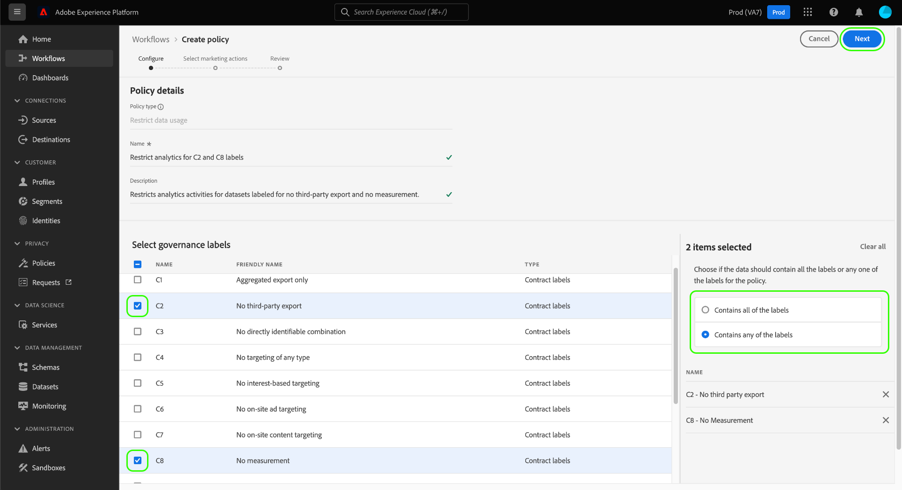

# UI でのデータ使用ポリシーの管理

Adobe Experience Platform データガバナンスは、データ使用ポリシーを作成および管理できるユーザーインターフェイスを提供します。このドキュメントでは、 **ポリシー** ワークスペース [!DNL Experience Platform] ユーザーインターフェイス。

>[!IMPORTANT]
>
>すべてのデータ使用ポリシー（アドビが提供するコアポリシーを含む）は、デフォルトで無効になっています。個々のポリシーを適用対象と見なすには、そのポリシーを手動で有効にする必要があります。UI でこれをおこなう手順については、[ポリシーの有効化](#enable)に関する節を参照してください。

## 前提条件

このガイドでは、次の [!DNL Experience Platform] の概念に関する十分な知識が必要です。

* [データガバナンス](../home.md)
* [データ使用ポリシー](./overview.md)

## 既存のポリシーの表示 {#view-policies}

[!DNL Experience Platform] UI で、「**[!UICONTROL ポリシー]**」を選択して、「**[!UICONTROL ポリシー]**」ワークスペースを開きます。「**[!UICONTROL 参照]**」タブには、使用可能なポリシー（関連するラベル、マーケティングアクション、ステータスなど）が一覧表示されます。

同意ポリシーへのアクセス権がある場合は、 **[!UICONTROL 同意ポリシー]** 切り替えて [!UICONTROL 参照] タブをクリックします。

リストされているポリシーを選択すると、説明と種類が表示されます。カスタムポリシーを選択すると、ポリシーを編集、削除、[有効／無効にする](#enable)ための追加のコントロールが表示されます。

## カスタムポリシーの作成 {#create-policy}

新しいカスタムデータ使用ポリシーを作成するには、「**[!UICONTROL ポリシー]**」ワークスペースの「 **[!UICONTROL 参照]**」タブの右上にある「**[!UICONTROL ポリシーの作成]**」をクリックします。

同意ポリシーに関するベータ版に含まれているかどうかに応じて、次のいずれかが発生します。

* ベータ版に参加していない場合は、すぐに [データガバナンスポリシーの作成](#create-governance-policy).
* ベータ版のユーザーには、次のような追加のオプションが用意されています。 [同意ポリシーを作成する](#consent-policy).
   

### データガバナンスポリシーの作成 {#create-governance-policy}

**[!UICONTROL ポリシーの作成]**&#x200B;ワークフローが表示されます。まず、新しいポリシーの名前と説明を指定します。

次に、ポリシーの基にするデータ使用ラベルを選択します。複数のラベルを選択する場合は、ポリシーが適用するために、データにすべてのラベルを含めるか、1 つのラベルのみを含めるかを選択できます。完了したら、「**[!UICONTROL 次へ]**」をクリックします。

「**[!UICONTROL マーケティングアクションの選択]**」手順が表示されます。表示されたリストから適切なマーケティングアクションを選択してから、「**[!UICONTROL 次へ]**」を選択して続行します。

>[!NOTE]
>
> 複数のマーケティングアクションを選択する場合、ポリシーはそれらを「OR」ルールとして解釈します。つまり、選択したマーケティングアクションの&#x200B;**いずれか**&#x200B;が実行された場合に、ポリシーが適用されます。

「**[!UICONTROL 確認]**」手順が表示され、新しいポリシーを作成する前にその詳細を確認できます。確認したら、「**[!UICONTROL 完了]**」を選択して、ポリシーを作成します。

「**[!UICONTROL 参照]**」タブが再び表示され 、新しく作成したポリシーが「草案」ステータスでリストに表示されるようになります。ポリシーを有効にするには、次の節を参照してください。

### 同意ポリシーの作成 {#consent-policy}

>[!IMPORTANT]
>
>同意ポリシーは、現在、を購入した組織でのみ使用できます **Adobeヘルスケアシールド** または **Adobeプライバシーとセキュリティシールド**.

同意ポリシーの作成を選択すると、新しい画面が表示され、新しいポリシーを設定できます。

同意ポリシーを利用するには、プロファイルデータに同意属性が存在する必要があります。 詳しくは、 [Experience Platformでの同意処理](../../landing/governance-privacy-security/consent/adobe/overview.md) を参照してください。

同意ポリシーは、次の 2 つの論理コンポーネントで構成されます。

* **[!UICONTROL If]**:ポリシーチェックをトリガーにする条件。 これは、実行される特定のマーケティングアクション、特定のデータ使用ラベルの有無、またはこれら 2 つの組み合わせに基づくことができます。
* **[!UICONTROL 次に、]**:プロファイルをポリシーをトリガーしたアクションに含めるために存在する必要がある同意属性。

#### 条件の設定 {#consent-conditions}

>[!CONTEXTUALHELP]
>id="platform_governance_policies_consentif"
>title="If 条件"
>abstract="まず、ポリシーチェックをトリガーする条件を定義します。 条件には、特定のマーケティングアクションが実行される、特定のデータガバナンスラベルが存在する、またはその両方の組み合わせが含まれます。"

以下 **[!UICONTROL If]** 「 」セクションで、このポリシーをトリガーするマーケティングアクションやデータ使用ラベルを選択します。 選択 **[!UICONTROL すべて表示]** および **[!UICONTROL ラベルを選択]** をクリックすると、使用可能なマーケティングアクションとラベルの完全なリストがそれぞれ表示されます。

1 つ以上の条件を追加したら、「 **[!UICONTROL 条件を追加]** 必要に応じて条件の追加を続けるには、ドロップダウンから適切な条件タイプを選択します。

複数の条件を選択する場合は、条件間に表示されるアイコンを使用して、「AND」と「OR」の条件付き関係を切り替えることができます。

#### 同意属性を選択 {#consent-attributes}

>[!CONTEXTUALHELP]
>id="platform_governance_policies_consentthen"
>title="Then 条件"
>abstract="「If」条件を定義したら、「Then」セクションを使用して、和集合スキーマから少なくとも 1 つの同意属性を選択します。 これは、このポリシーで管理されるアクションにプロファイルを含めるために存在する必要がある属性です。"

以下 **[!UICONTROL 次に、]** 「 」セクションで、和集合スキーマから少なくとも 1 つの同意属性を選択します。 これは、このポリシーで管理されるアクションにプロファイルを含めるために存在する必要がある属性です。 リストから提供されたオプションの 1 つを選択するか、「 」を選択します。 **[!UICONTROL すべて表示]** ：和集合スキーマから直接属性を選択します。

同意属性を選択する場合、このポリシーで確認する属性の値を選択します。

1 つ以上の同意属性を選択した後、 **[!UICONTROL ポリシーのプロパティ]** パネルが更新され、このポリシーで許可されるプロファイルの推定数（合計プロファイルストアに対する割合を含む）が表示されます。 この見積もりは、ポリシー設定を調整すると自動的に更新されます。

ポリシーに同意属性を追加するには、 **[!UICONTROL 結果を追加]**.

必要に応じて、ポリシーに条件と同意属性を引き続き追加および調整できます。 設定が完了したら、ポリシーの名前と説明（オプション）を入力してから、「 」を選択します **[!UICONTROL 保存]**.

同意ポリシーが作成され、そのステータスが「 」に設定されます。 [!UICONTROL 無効] デフォルトでは。 すぐにポリシーを有効にするには、 **[!UICONTROL ステータス]** 右側のパネルを切り替えます。

#### ポリシーの適用を検証

同意ポリシーを作成して有効にしたら、宛先に対するセグメントをアクティブ化する際に、同意したオーディエンスに与える影響をプレビューできます。 詳しくは、 [同意ポリシーの評価](../enforcement/auto-enforcement.md#consent-policy-evaluation) を参照してください。

## ポリシーの有効化または無効化 {#enable}

すべてのデータ使用ポリシー（アドビが提供するコアポリシーを含む）は、デフォルトで無効になっています。個々のポリシーを適用対象として考慮するには、API または UI を使用して、そのポリシーを手動で有効にする必要があります。

「**[!UICONTROL ポリシー]**」ワークスペースの「**[!UICONTROL 参照]**」タブで、ポリシーを有効または無効にできます。リストからカスタムポリシーを選択して、右側に詳細を表示します。「**[!UICONTROL ステータス]**」で、ポリシーを有効または無効にする切り替えボタンを選択します。

## マーケティングアクションの表示 {#view-marketing-actions}

「**[!UICONTROL ポリシー]**」ワークスペースで、「**[!UICONTROL マーケティングアクション]**」タブを選択し、アドビおよび自分の組織で定義されている使用可能なマーケティングアクションのリストを表示します。

## マーケティングアクションの作成 {#create-marketing-action}

新しいカスタムマーケティングアクションを作成するには、「**[!UICONTROL ポリシー]**」ワークスペースの「**[!UICONTROL マーケティングアクション]**」タブの右上隅にある「**[!UICONTROL マーケティングアクションを作成]**」を選択します。

「**[!UICONTROL マーケティングアクションを作成]**」ダイアログが表示されます。マーケティングアクションの名前と説明を入力し、「**[!UICONTROL 作成]**」を選択します。

新しく作成したアクションは、「**[!UICONTROL マーケティングアクション]**」タブに表示されます。これで、[新しいデータ使用ポリシーを作成](#create-policy)するときに、マーケティングアクションを使用できるようになりました。

## マーケティングアクションの編集または削除 {#edit-delete-marketing-action}

>[!NOTE]
>
>編集できるのは、組織で定義されたカスタムマーケティングアクションのみです。アドビによって定義されたマーケティングアクションは、変更または削除できません。

「**[!UICONTROL ポリシー]**」ワークスペースで、「**[!UICONTROL マーケティングアクション]**」タブを選択し、アドビおよび自分の組織で定義されている使用可能なマーケティングアクションのリストを表示します。リストからカスタムマーケティングアクションを選択し、右側のセクションに表示されるフィールドを使用して、マーケティングアクションの詳細を編集します。

既存の使用ポリシーでマーケティングアクションが使用されていない場合は、「**[!UICONTROL マーケティングアクションを削除]**」を選択して削除できます。

>[!NOTE]
>
>既存のポリシーで使用されているマーケティングアクションを削除しようとすると、削除の試行に失敗したことを示すエラーメッセージが表示されます。

## 次の手順

このドキュメントでは、[!DNL Experience Platform] UI でデータ使用ポリシーを管理する方法の概要を説明しました。[!DNL Policy Service API] を使用してポリシーを管理する手順については、[デベロッパーガイド](../api/getting-started.md)を参照してください。データ使用ポリシーの適用方法について詳しくは、「[ポリシー実施の概要](../enforcement/overview.md)」を参照してください。

次のビデオでは、[!DNL Experience Platform] UI で使用ポリシーを操作する方法のデモを示します。

>[!VIDEO](https://video.tv.adobe.com/v/32977?quality=12&learn=on)
