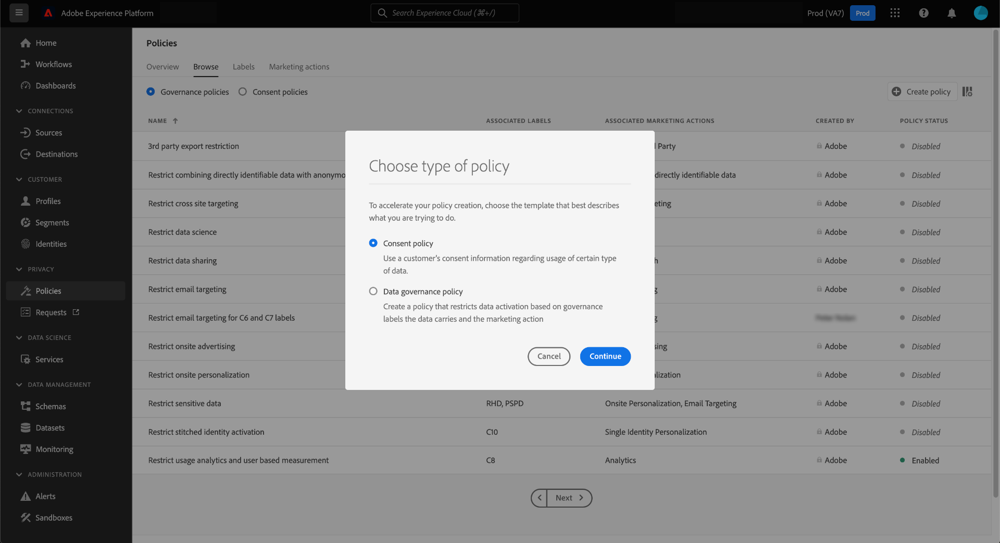

# UI でのデータ使用ポリシーの管理 {#user-guide}

>[!CONTEXTUALHELP]
>id="platform_privacyConsole_dataUsagePolicies_description"
>title="プロファイルデータへの顧客同意の統合と適用"
>abstract="<h2>説明</h2>
Experience Platform を使用すると、顧客から収集した同意データを各顧客のプロファイルに統合できます。その後、同意ポリシーを設定して、特定の宛先に対してアクティブ化されるセグメントにこのデータを含めることができるかどうかを決定できます。
"

このドキュメントでは、Adobe Experience Platform UI の **[!UICONTROL Policies]** ワークスペースを使用して、データ使用ポリシーを作成および管理する方法について説明します。

>[!NOTE]
>
>UI でアクセス制御ポリシーを管理する方法については、代わりに[属性ベースのアクセス制御 UI ガイド](../../access-control/abac/ui/policies.md)を参照してください。

>[!IMPORTANT]
>
>すべてのデータ使用ポリシー（アドビが提供するコアポリシーを含む）は、デフォルトで無効になっています。個々のポリシーを適用対象と見なすには、そのポリシーを手動で有効にする必要があります。UI でこれをおこなう手順については、[ポリシーの有効化](#enable)に関する節を参照してください。

## 前提条件

このガイドでは、次の [!DNL Experience Platform] の概念に関する十分な知識が必要です。

* [データガバナンス](../home.md)
* [データ使用ポリシー](./overview.md)

## 既存のポリシーの表示 {#view-policies}

[!DNL Experience Platform]UIで、「**[!UICONTROL Policies]**」を選択して&#x200B;**[!UICONTROL Policies]**&#x200B;ワークスペースを開きます。**[!UICONTROL Browse]**&#x200B;タブでは、関連付けられたラベル、マーケティングアクション、ステータスなど、使用可能なポリシーのリストを確認できます。

同意ポリシーにアクセスできる場合は、 [ **[!UICONTROL Consent policies]** ] トグルを選択して [ [!UICONTROL Browse] ] タブに表示します。

リストされているポリシーを選択すると、説明と種類が表示されます。カスタムポリシーを選択すると、ポリシーを編集、削除、[有効／無効にする](#enable)ための追加のコントロールが表示されます。

## カスタムポリシーの作成 {#create-policy}

新しいカスタムデータ使用ポリシーを作成するには、**[!UICONTROL Create policy]** ワークスペースの「**[!UICONTROL Browse]**」タブの右上隅にある「**[!UICONTROL Policies]**」を選択します。

[!UICONTROL Choose type of policy] ダイアログが表示されます。 [ 同意ポリシー ](#consent-policy) または [ データガバナンスポリシー ](#create-governance-policy) のいずれかを選択します。

### データガバナンスポリシーと同意ポリシーの併用 {#combine-policies}

>[!NOTE]
>
>同意ポリシーは、現在、Adobe Healthcare Shield または Adobe Privacy and Security Shield を購入した組織でのみ使用できます。

ガバナンスポリシーと同意ポリシーを併用すると、宛先にマッピングされたオーディエンスを管理するための堅牢なルールを作成できます。同意ポリシーは本質的に包括的です。つまり、各マーケティングエクスペリエンスに含めるプロファイルを決定します。逆に、ガバナンスポリシーでは、特定のラベル付き属性の使用がアクティブ化の設定から除外されます。

この動作を使用すると、正しいプロファイルを含むポリシーと同意ルールの組み合わせを設定できますが、設定された組織ルールに違反するデータは含めないようにすることができます。サンプルシナリオとしては、機密データを含めないように除外したいが、同意したユーザーをソーシャルメディア経由でマーケティングのターゲットにする場合などです。このシナリオに必要な手順の概要を以下のインフォグラフィックに示します。

### データガバナンスポリシーの作成 {#create-governance-policy}

**[!UICONTROL Create policy]** ワークフローが表示されます。 まず、新しいポリシーの名前と説明を指定します。

次に、ポリシーの基にするデータ使用ラベルを選択します。複数のラベルを選択する場合は、ポリシーが適用するために、データにすべてのラベルを含めるか、1 つのラベルのみを含めるかを選択できます。終了したら「**[!UICONTROL Next]**」を選択します。

**[!UICONTROL Select marketing actions]** の手順が表示されます。 表示されたリストから適切なマーケティングアクションを選択し、[ **[!UICONTROL Next]** ] を選択して続行します。

>[!NOTE]
>
> 複数のマーケティングアクションを選択する場合、ポリシーはそれらを「OR」ルールとして解釈します。つまり、選択したマーケティングアクションの&#x200B;**いずれか**&#x200B;が実行された場合に、ポリシーが適用されます。

**[!UICONTROL Review]**&#x200B;ステップが表示され、作成前に新しいポリシーの詳細を確認できます。確認したら、[ **[!UICONTROL Finish]** ] を選択してポリシーを作成します。

**[!UICONTROL Browse]**&#x200B;タブが再度表示され、新しく作成されたポリシーが「ドラフト」ステータスで表示されます。ポリシーを有効にするには、次の節を参照してください。

### 同意ポリシーの作成 {#consent-policy}

>[!CONTEXTUALHELP]
>id="platform_privacyConsole_dataUsagePolicies_instructions"
>title="手順"
>abstract="<ul><li>OneTrust ソースコネクタまたは同意用の標準 XDM スキーマを使用して、環境設定データを結合スキーマに取り込もうとしていることを確認します。</li><li>左側のナビゲーションで「<a href="https://experienceleague.adobe.com/docs/experience-platform/data-governance/policies/overview.html?lang=ja">ポリシー</a>」を選択し、「<a href="https://experienceleague.adobe.com/docs/experience-platform/data-governance/policies/user-guide.html?lang=ja#create-governance-policy">ポリシーを作成</a>」を選択します。</li><li>「<b>If</b>」セクションで、ポリシーチェックをトリガーする条件またはアクションを記述します。</li><li>「<b>Then</b>」セクションで、ポリシーをトリガーしたアクションにプロファイルを含めるために存在する必要がある同意属性を入力します。</li><li>「<b>保存</b>」を選択して、ポリシーを作成します。ポリシーを有効にするには、右側のパネルで「<b>ステータス</b>」切替スイッチを選択します。</li><li>Experience Platform では、宛先に対してセグメントをアクティブ化すると、有効な同意ポリシーを自動的に適用し、各ポリシーがオーディエンスサイズに与える影響の詳細を指定します。</li><li>この機能について詳しくは、Experience League の<a href="https://experienceleague.adobe.com/docs/experience-platform/data-governance/policies/user-guide.html?lang=ja#consent-policy">同意ポリシーの作成</a>に関するガイドを参照してください。</li></ul>"

>[!IMPORTANT]
>
>同意ポリシーは、**Adobe Healthcare Shield** または **Adobe Privacy &amp; Security Shield** を購入した組織でのみ使用できます。

同意ポリシーの作成を選択すると、新しい画面が表示され、新しいポリシーを設定できます。

同意ポリシーを利用するには、プロファイルデータに同意属性が存在する必要があります。結合スキーマに必要な属性を含める手順について詳しくは、[Experience Platform での同意処理](../../landing/governance-privacy-security/consent/adobe/overview.md)を参照してください。

同意ポリシーは、次の 2 つの論理コンポーネントで構成されます。

* **[!UICONTROL If]**: ポリシーチェックをトリガーにする条件。 これは、実行される特定のマーケティングアクション、特定のデータ使用ラベルの有無またはこれら 2 つの組み合わせに基づくことができます。
* **[!UICONTROL Then]**: プロファイルをポリシーをトリガーしたアクションに含めるために存在する必要がある同意属性。

>[!NOTE]
>
>同意ポリシーは、様々なフィールドタイプや演算子を使用した高度なルールの作成をサポートします。 サポートされるフィールドタイプ、演算子、ルール作成例について詳しくは、[ 同意ポリシールールのリファレンス ](./consent-policy-rule-building-reference.md) を参照してください。

#### 条件の設定 {#consent-conditions}

>[!CONTEXTUALHELP]
>id="platform_governance_policies_consentif"
>title="If 条件"
>abstract="まず、ポリシーチェックをトリガーする条件を定義します。条件には、特定のマーケティングアクションが実行されていること、特定のデータガバナンスラベルが存在すること、またはその両方の組み合わせが含まれます。 AND/OR ロジックを使用して、複数の条件間に複雑な条件関係を作成します。"

「**[!UICONTROL If]**」セクションで、このポリシーをトリガーにするマーケティングアクションやデータ使用ラベルを選択します。 **[!UICONTROL View all]** と **[!UICONTROL Select labels]** を選択すると、使用可能なマーケティングアクションとラベルの完全なリストがそれぞれ表示されます。

少なくとも 1 つの条件を追加したら、「**[!UICONTROL Add condition]**」を選択して、必要に応じてさらに条件を追加し、ドロップダウンから適切な条件タイプを選択できます。

複数の条件を選択する場合は、条件間に表示されるアイコンを使用して、「AND」と「OR」の条件関係を切り替えることができます。

#### 同意属性を選択 {#consent-attributes}

>[!CONTEXTUALHELP]
>id="platform_governance_policies_consentthen"
>title="Then 条件"
>abstract="「If」条件を定義したら、「Then」セクションを使用して、結合スキーマから少なくとも 1 つの同意属性を選択します。ルール構築のプリミティブフィールド（文字列、数値、ブール値など）に到達するには、コンテナフィールド（オブジェクト、マップ、配列）間を移動する必要があります。 このプリミティブフィールドは、プロファイルをこのポリシーによって管理されるアクションに含めるために存在する必要がある属性です。"

「**[!UICONTROL Then]**」セクションで、結合スキーマから少なくとも 1 つの同意属性を選択します。 これは、このポリシーが管理するアクションにプロファイルを含めるために存在する必要がある属性です。 推奨されるオプションの 1 つを選択するか、**[!UICONTROL View all]** を選択して結合スキーマから直接属性を選択できます。

>[!NOTE]
>
>同意ポリシーでは、プリミティブ フィールド型 (文字列、数字、ブール型、日付) とコンテナ型 (オブジェクト、マップ、配列) がサポートされています。 コンテナに移動して特定の属性を選択し、AND/OR ロジックを適用してルールを組み合わせることができます。 サポートされているフィールドの種類、演算子、およびルール作成の例の完全なリファレンスについては、「 [同意ポリシールール作成リファレンス](./consent-policy-rule-building-reference.md)を参照してください。

**[!UICONTROL View all]**&#x200B;を選択すると、**[!UICONTROL Select consent attribute]**&#x200B;ダイアログが表示されます。このポリシーで確認する同意属性を選択します。 または、このダイアログで「**[!UICONTROL Advanced Schema search]**」を選択して、ポリシーの一部として評価する、ネストされたプリミティブフィールドを選択することもできます。 「**[!UICONTROL Done]**」を選択して、設定を確定します。

### 高度なスキーマ検索 {#advanced-schema-search}

**[!UICONTROL Select consent attribute]** ダイアログで、「**[!UICONTROL Advanced Schema search]**」を選択して **[!UICONTROL Select union schema field]** ダイアログを開きます。 このビューから、文字列、数値、ブール値、日付などのプリミティブフィールドタイプのルートレベルまたはネストされた属性と、オブジェクト、マップ、配列などのコンテナタイプを選択します。

#### ポリシー条件の固定値フィールド {#fixed-value-fields}

固定値フィールドをポリシー条件として選択すると、データスキーマで定義されている事前定義済みの値が [!UICONTROL Selected attributes] 定パネルに表示されます。

>[!NOTE]
>
>フィールドが値の固定セットで設定されている場合（列挙やその他の制御された語彙など）、ポリシービルダーはその制約を適用して、有効な標準化されたデータに対してのみ条件が評価されるようにします。

データ品質と一貫性を維持するために、UI ではこれらの値をフリーテキストフィールドではなく、選択可能なチェックボックスとしてレンダリングします。 このアプローチは、手動による検証を減らし、同意ポリシーがデータを確実に評価するのに役立ちます。

条件を定義するには、ポリシーで評価する値のチェックボックスをオンにします。

#### ポリシー条件のデータタイプフィールドのマッピング {#map-data-type-fields}

Map データタイプに含まれるプリミティブフィールドを選択すると、追加の設定オプションが **[!UICONTROL Selected attributes]** パネルに表示されます。 これらのオプションを使用すると、各キーに個別のポリシーを必要とせずに、複数のキーに対して同意チェックを設定できます。 この設定方法を使用すると、作成する必要のあるポリシーの数を減らすことで、ポリシー管理を簡素化できます。

##### マップデータタイプ属性の設定 {#configure-map-attributes}

マップタイプ属性を設定するには、次の手順に従います。

和集合スキーマ図で、Map データタイプ内に含まれるプリミティブフィールド（文字列や数値など）を選択します。 **[!UICONTROL Selected attributes]** パネルが更新され、そのフィールドに追加の設定オプションが表示されます。

**[!UICONTROL Selected attributes]** のパネルで、「キー」チェックボックスをオンまたはオフにして、ポリシーによるマップキ **[!UICONTROL Find any matching item]** の評価方法を設定します。

| オプション | アクション | ポリシーの動作 |
| --- | --- | --- |
| チェックボック **[!UICONTROL Find any matching item]** は **選択** です | **[!UICONTROL within]** テキストフィールドは無効です。 | ポリシーは、マップ内の **すべてのキー** をチェックします。 ネストされたフィールドが値条件を満たすキーは、ポリシーの一致と見なされます。 これは、動的にキー設定される属性全体にグローバルなコンプライアンスを適用する場合に役立ちます。 |
| **[!UICONTROL Find any matching item]** チェックボックスは **未選択** です。 | **[!UICONTROL within]** テキストフィールドに特定のキー名を入力する必要があります。 | このポリシーは、**[!UICONTROL within]** フィールドで指定されたマップキーのみをチェックします。 特定のキーのネストされたフィールドが定義済みの値と一致するプロファイルのみが一致します。 これは、特定のプログラムまたは頻度キー（`frequencyMap.m1` など）をターゲットにしたポリシーに便利です。 |

選択したプリミティブフィールドで、ポリシーが評価する値を入力します。 例えば、フィールドタイプが `Integer` の場合は、数値を入力します。

![マップ構成オプションがハイライト表示された [選択された属性] サイドバー。](../images/policies/within-option.png)

**[!UICONTROL Select]**&#x200B;を選択して構成を確認し、ポリシービルダーに戻ります。

少なくとも 1 つの同意属性を選択すると、 **[!UICONTROL Policy properties]** パネルが更新され、このポリシーに含まれるプロファイルの推定数と、プロフィールストア内の影響を受けるプロファイルの割合が表示されます。 推定プロファイル数は、ポリシー設定を変更すると自動的に更新されます。

同意属性を追加するには、**[!UICONTROL Add result]** を選択します。 これにより、これらの属性に基づいてプロファイルを含めるための別のルールが作成されます。

>[!NOTE]
>
>既存の属性を編集するには、属性名を選択してから、鉛筆アイコン（）に設定します。 変更を加えるための **[!UICONTROL Select union schema field]** ダイアログが開きます。
>
>

ポリシーが要件を満たすまで、条件と同意属性の追加または調整を続行します。 完了したら、名前と（オプションで）説明を入力し、「**[!UICONTROL Save]**」を選択してポリシーを作成します。

これで同意ポリシーが作成され、そのステータスはデフォルトで [!UICONTROL Disabled] に設定されます。 すぐにポリシーを有効にするには、右側のパネルにある **[!UICONTROL Status]** 切り替えスイッチを選択します。

#### ポリシーの適用を検証

同意ポリシーを作成して有効にしたら、宛先に対するセグメントをアクティブ化する際に、同意されたオーディエンスに与える影響をプレビューできます。詳しくは、[同意ポリシーの評価](../enforcement/auto-enforcement.md#consent-policy-evaluation)に関する節を参照してください。

## ポリシーの有効化または無効化 {#enable}

すべてのデータ使用ポリシー（アドビが提供するコアポリシーを含む）は、デフォルトで無効になっています。個々のポリシーの適用が考慮されるようにするには、API または UI を使用して手動でそのポリシーを有効にする必要があります。

**[!UICONTROL Browse]** Workspace の「**[!UICONTROL Policies]**」タブで、ポリシーを有効または無効にできます。 リストからカスタムポリシーを選択して、右側に詳細を表示します。「**[!UICONTROL Status]**」で、切り替えボタンを選択してポリシーを有効または無効にします。

## マーケティングアクションの表示 {#view-marketing-actions}

[ **[!UICONTROL Policies]** ] ワークスペースで、 **[!UICONTROL Marketing actions]** タブを選択して、Adobe Systems および独自の組織で定義されている使用可能なマーケティングアクションのリスト表示します。

## マーケティングアクションの作成 {#create-marketing-action}

新しいカスタム マーケティング アクションを作成するには、**[!UICONTROL Create marketing action]**&#x200B;の右上隅にある [**[!UICONTROL Marketing actions]**] タブ **[!UICONTROL Policies]** ワークスペースを選択します。

**[!UICONTROL Create marketing action]**&#x200B;ダイアログが表示されます。マーケティングアクションの名前と説明を入力し、[ **[!UICONTROL Create]**] を選択します。

新しく作成されたアクションが **[!UICONTROL Marketing actions]** タブに表示されます。 これで、[新しいデータ使用ポリシーを作成](#create-policy)するときに、マーケティングアクションを使用できるようになりました。

## マーケティングアクションの編集または削除 {#edit-delete-marketing-action}

>[!NOTE]
>
>編集できるのは、組織で定義されたカスタムマーケティングアクションのみです。アドビによって定義されたマーケティングアクションは、変更または削除できません。

**[!UICONTROL Policies]** Workspace で、「**[!UICONTROL Marketing actions]**」タブを選択して、Adobeおよび自分の組織で定義されている使用可能なマーケティングアクションのリストを表示します。 リストからカスタムマーケティングアクションを選択し、右側のセクションに表示されるフィールドを使用して、マーケティングアクションの詳細を編集します。

既存の使用ポリシーでマーケティングアクションが使用されていない場合は、**[!UICONTROL Delete marketing action]** を選択して削除できます。

>[!NOTE]
>
>既存のポリシーで使用されているマーケティングアクションを削除しようとすると、削除の試行に失敗したことを示すエラーメッセージが表示されます。

## 次の手順

このドキュメントでは、[!DNL Experience Platform] UI でデータ使用ポリシーを管理する方法の概要を説明しました。[!DNL Policy Service API] を使用してポリシーを管理する手順については、[デベロッパーガイド](../api/getting-started.md)を参照してください。データ使用ポリシーの適用方法について詳しくは、「[ポリシー実施の概要](../enforcement/overview.md)」を参照してください。

次のビデオでは、[!DNL Experience Platform] UI で使用ポリシーを操作する方法のデモを示します。

>[!VIDEO](https://video.tv.adobe.com/v/32977?quality=12&learn=on)
