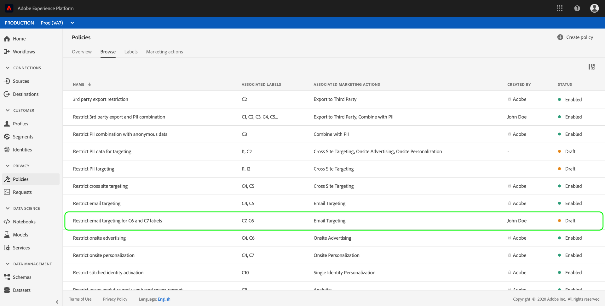

# Data usage policiesユーザーガイド

Adobe Experience Platform Data Governanceは、データ使用ポリシーの作成と管理を可能にするユーザーインターフェイスを提供します。 このドキュメントでは、エクスペリエンスプラットフォームUIの _ポリシー_ ワークスペースで実行できるアクションの概要を説明します。

## 前提条件

このガイドでは、次のエクスペリエンスプラットフォームの概念について、十分に理解している必要があります。

- [データガバナンス](../home.md)
- [データ使用ポリシー](./overview.md)

## 表示データ使用ポリシー

エクスペリエンスプラットフォームUIで、「 **[!UICONTROL ポリシー]** 」をクリックして *[!UICONTROL ポリシー]* ワークスペースを開きます。 「 **[!UICONTROL 参照]** 」タブには、関連付けられたラベル、マーケティングアクション、ステータスなど、使用可能なポリシーのリストが表示されます。

表示されたポリシーをクリックして、その説明とタイプを表示します。 カスタムポリシーを選択すると、そのポリシーを編集、削除、 [有効/無効にするための追加のコントロールが表示されます](#enable)。

## カスタムデータ使用ポリシーの作成

新しいカスタムデータ使用ポリシーを作成するには、 **[!UICONTROL ポリシー]** ワークスペースの右上隅にある「ポリシーを *作成* 」をクリックします。

「 *[!UICONTROL ポリシーの作成]* 」ワークフローが表示されます。 新しいポリシーの名前と説明を入力して開始します。

次に、ポリシーの基にするデータ使用ラベルを選択します。 複数のラベルを選択する場合、ポリシーを適用するために、データにすべてのラベルを含めるか、ラベルの1つだけを含めるかを選択できます。 終了したら「**[!UICONTROL 次へ]**」をクリックします。

「マーケティングアクション *[!UICONTROL の選択]* 」手順が表示されます。 表示されたリストから適切なマーケティングアクションを選択し、「 **[!UICONTROL 次へ]** 」をクリックして続行します。

>[!NOTE] 複数のマーケティングアクションを選択する場合、ポリシーはそれらを「OR」ルールとして解釈します。 つまり、選択したい _ずれかのマーケティング操作が実行された場合_ 、ポリシーが適用されます。

「 *[!UICONTROL レビュー]* 」手順が表示され、新しいポリシーを作成する前にその詳細を確認できます。 問題が解決したら、「 **[!UICONTROL 完了]** 」をクリックしてポリシーを作成します。

「 *[!UICONTROL 参照]* 」タブが再び表示され、新しく作成したポリシーが「ドラフト」ステータスでリストされます。 ポリシーを有効にするには、次のセクションを参照してください。

## データ使用ポリシーの有効化または無効化 {#enable}

カスタムデータ使用ポリシーは、ポリシー *[!UICONTROL ワークスペースの「]* 参照 ** 」タブで有効または無効にできます。 リストからカスタムポリシーを選択し、詳細を右側に表示します。 「 *[!UICONTROL ステータス]*」で、切り替えボタンを選択してポリシーを有効または無効にします。

## 次の手順

このドキュメントでは、Experience Platform UIでデータ使用ポリシーを管理する方法の概要を説明しました。 DULE Policy APIを使用してポリシーを管理する手順については、 [開発者ガイドを参照してください](../api/getting-started.md)。 データ使用ポリシーの適用方法について詳しくは、「 [ポリシー適用の概要](../enforcement/overview.md)」を参照してください。

次のビデオでは、エクスペリエンスプラットフォームUIでの使用ポリシーの操作方法のデモを提供します。

>[!VIDEO](https://video.tv.adobe.com/v/32977?quality=12&learn=on)