# データ準備 UI ガイド

このドキュメントでは、Adobe Experience Platformユーザーインターフェイスのデータ準備関数を使用して CSV ファイルを XDM スキーマにマッピングする方法について説明します。

## はじめに

このチュートリアルでは、次の Platform コンポーネントに関する十分な知識が必要です。

* [[!DNL Experience Data Model (XDM)] システム](../../xdm/home.md):Platform が顧客体験データを整理する際に使用する標準化されたフレームワーク。
   * [スキーマ構成の基本](../../xdm/schema/composition.md)：スキーマ構成の主要な原則やベストプラクティスなど、XDM スキーマの基本的な構成要素について学びます。
   * [スキーマエディターのチュートリアル](../../xdm/tutorials/create-schema-ui.md):スキーマエディター UI を使用してカスタムスキーマを作成する方法を説明します。
* [ID サービス](../../identity-service/home.md)：デバイスやシステム間で ID を関連付けることで、個々の顧客とそのビヘイビアーへの理解を深めることができます。
* [[!DNL Real-time Customer Profile]](../../profile/home.md)：複数のソースからの集計データに基づいて、統合されたリアルタイムの顧客プロファイルを提供します。
* [ソース](../../sources/home.md):Experience Platformを使用すると、様々なソースからデータを取り込みながら、Platform サービスを使用して、受信データの構造化、ラベル付け、拡張をおこなうことができます。

## データフローの詳細

>[!TIP]
>
>ソースカタログから任意のソースを選択することで、データフローの詳細にアクセスできます。 詳しくは、 [ソースの概要](../../sources/home.md).

CSV データを XDM スキーマにマッピングする前に、まずデータフローの詳細を確立する必要があります。

この [!UICONTROL データフローの詳細] ページでは、CSV データを既存のターゲットデータセットに取り込むか、新しいターゲットデータセットに取り込むかを選択できます。 既存のデータセットには、データのマッピング先となる事前定義済みのターゲットスキーマが付属していますが、新しいデータセットでは、データのマッピング先として既存のスキーマを選択するか、新しいスキーマを作成する必要があります。

### 既存のターゲットデータセットを使用

CSV データを既存のデータセットに取り込むには、「 」を選択します。 **[!UICONTROL 既存のデータセット]**. 既存のデータセットは、 [!UICONTROL 詳細検索] 」オプションを使用するか、ドロップダウンメニュー内の既存のデータセットのリストをスクロールします。

データセットを選択し、データフローの名前と説明（オプション）を入力します。

このプロセスの間に、 [!UICONTROL エラー診断] および [!UICONTROL 部分取り込み]. [!UICONTROL エラー診断] は、データフローで発生するエラーレコードに対して、詳細なエラーメッセージ生成を有効にします。 [!UICONTROL 部分取り込み] では、エラーを含むデータを、手動で定義した特定のしきい値まで取り込むことができます。 詳しくは、 [部分バッチ取得の概要](../../ingestion/batch-ingestion/partial.md) を参照してください。

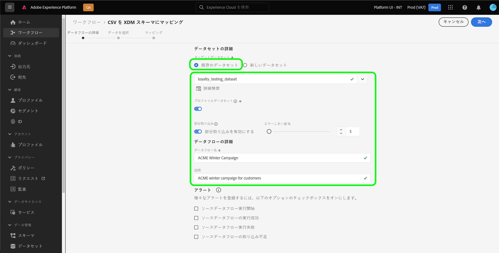

### 新しいターゲットデータセットを使用

CSV データを新しいデータセットに取り込むには、「 」を選択します。 **[!UICONTROL 新しいデータセット]** 次に、出力データセット名とオプションの説明を入力します。 次に、 [!UICONTROL 詳細検索] 」オプションを使用するか、ドロップダウンメニュー内の既存のスキーマのリストをスクロールします。

スキーマを選択し、データフローの名前とオプションの説明を入力して、 [!UICONTROL エラー診断] および [!UICONTROL 部分取り込み] の設定を使用します。 終了したら、「**[!UICONTROL 次へ]**」を選択します。

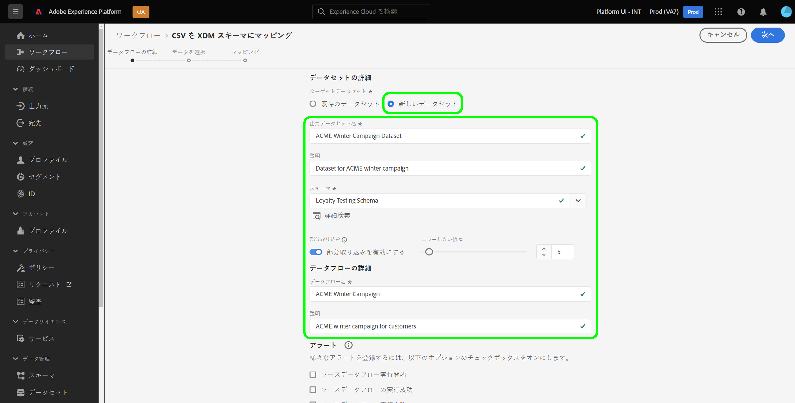

## データを選択

この [!UICONTROL データを選択] の手順が表示され、ローカルファイルをアップロードし、構造とコンテンツをプレビューするためのインターフェイスが表示されます。 選択 **[!UICONTROL ファイルを選択]** をクリックして、ローカルシステムから CSV ファイルをアップロードします。 または、アップロードする CSV ファイルをにドラッグ&amp;ドロップすることもできます [!UICONTROL ファイルをドラッグ&amp;ドロップ] パネル。

>[!TIP]
>
>現在、ローカルファイルのアップロードでは CSV ファイルのみがサポートされています。 各ファイルの最大ファイルサイズは 1 GB です。

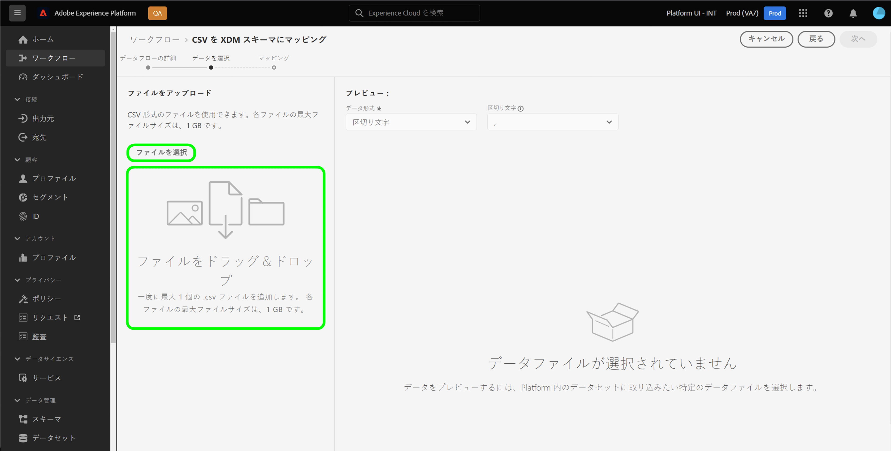

ファイルがアップロードされると、プレビューインターフェイスが更新され、ファイルのコンテンツと構造が表示されます。

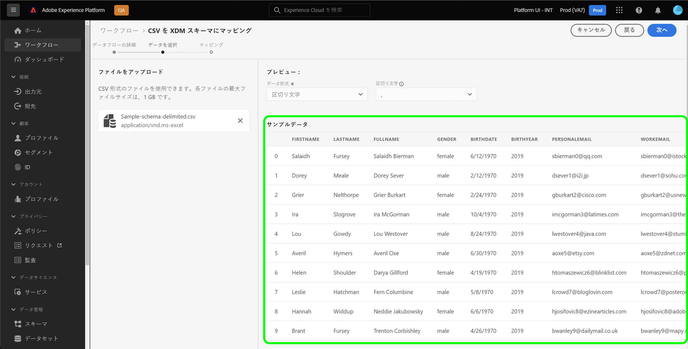

ファイルに応じて、ソースデータの列区切り文字（タブ、コンマ、パイプ、カスタム列区切り文字など）を選択できます。 を選択します。 **[!UICONTROL 区切り]** ドロップダウン矢印をクリックし、メニューから適切な区切り文字を選択します。

終了したら、「**[!UICONTROL 次へ]**」を選択します。

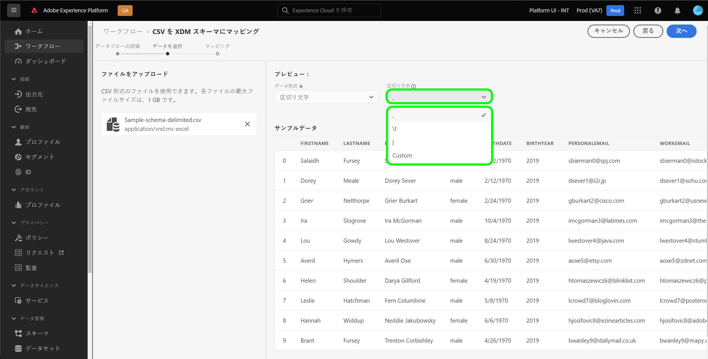

## マッピング

この **[!UICONTROL マッピング]** インターフェイスには、ソーススキーマのソースフィールドを、ターゲットスキーマ内の適切なターゲット XDM フィールドにマッピングする包括的なツールが用意されています。

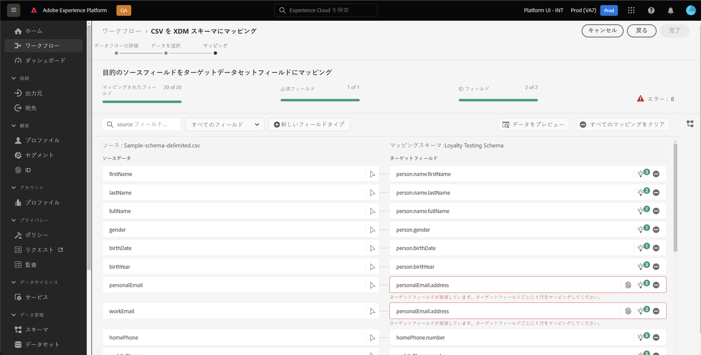

### マッピングインターフェイスについて

マッピングインターフェイスには、インジェストワークフローのコンテキスト内のマッピングフィールドの状態に関する情報を提供するダッシュボードが含まれます。 ダッシュボードには、マッピングフィールドに関する次の詳細が表示されます。

| プロパティ | 説明 |
| --- | --- |
| [!UICONTROL マッピングされたフィールド] | エラーに関係なく、ターゲット XDM フィールドにマッピングされたソースフィールドの合計数を表示します。 |
| [!UICONTROL 必須フィールド] | 必須マッピングフィールドの数を表示します。 |
| [!UICONTROL ID フィールド] | ID として定義されたマッピングフィールドの合計数を表示します。 これらのマッピングフィールドは、指紋アイコンで表されます。 |
| [!UICONTROL エラー] | 誤ったマッピングフィールドの数を表示します。 |

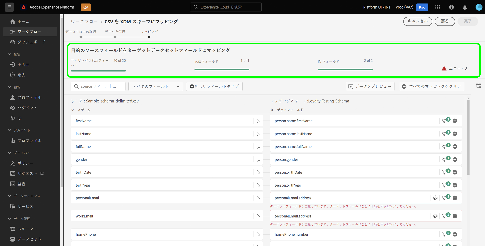

また、マッピングインターフェイスには、より適切なインタラクションを行うために選択したり、マッピングフィールドを使用してフィルタリングしたりするためのオプションのパネルも用意されています。

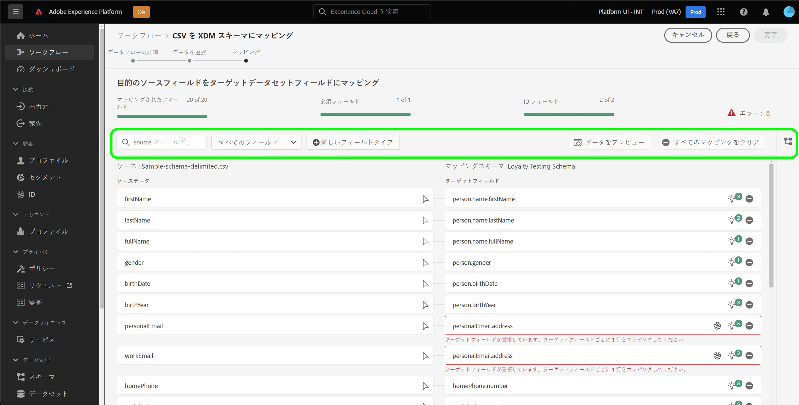

特定のマッピング・セットを検索するには、 **[!UICONTROL 検索ソースフィールド]** をクリックし、分離するソースデータの名前を入力します。

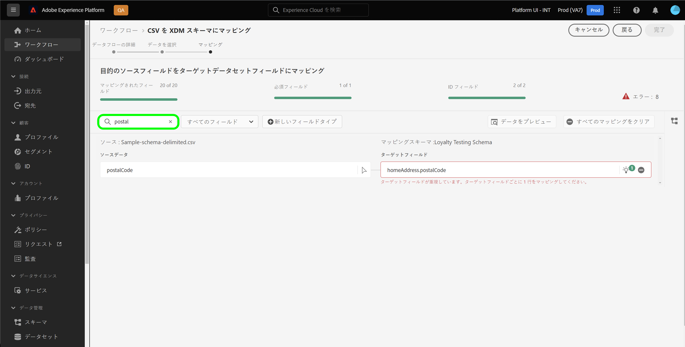

選択 **[!UICONTROL すべてのソースフィールド]** をクリックして、マッピングインターフェイスの表示をより細かく絞り込むためのフィルタリングオプションのドロップダウンメニューを表示します。

フィルターオプションは次のとおりです。

| ソースフィールド | 説明 |
| --- | --- |
| [!UICONTROL すべてのソースフィールド] | このオプションは、ソーススキーマのすべてのソースフィールドを表示します。 このオプションはデフォルトで表示されます。 |
| [!UICONTROL 必須フィールド] | このオプションでは、ソーススキーマをフィルタリングして、マッピングの完了に必要なフィールドのみを表示します。 |
| [!UICONTROL ID フィールド] | このオプションでは、ソーススキーマをフィルタリングして、ID としてマークされたフィールドのみを表示します。 |
| [!UICONTROL マッピングされたフィールド] | このオプションでは、ソーススキーマをフィルタリングして、既にマッピングされているフィールドのみを表示します。 |
| [!UICONTROL マッピングされていないフィールド] | このオプションでは、ソーススキーマをフィルタリングして、まだマッピングされていないフィールドのみを表示します。 |
| [!UICONTROL レコメンデーションのあるフィールド] | このオプションでは、ソーススキーマをフィルタリングして、マッピングレコメンデーションを含むフィールドのみを表示します。 |

選択 **[!UICONTROL エラーのあるフィールド]** をクリックすると、エラーが発生したすべてのマッピングフィールドが表示されます。

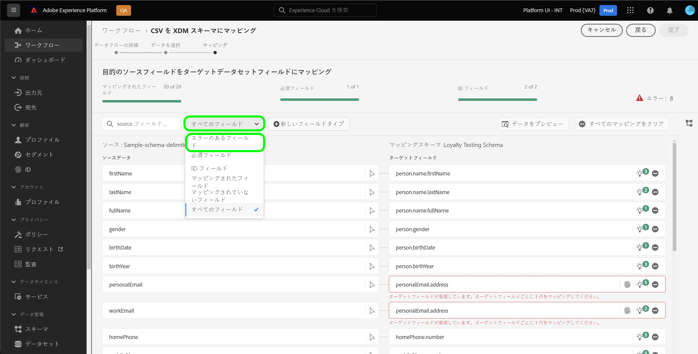

誤ったマッピングフィールドの分離された表示が表示され、インテリジェントマッピングレコメンデーションまたは手動マッピングツリーを使用してエラーに対処できます。

### 新しいフィールドタイプを追加

新しいマッピングフィールドまたは計算フィールドを追加するには、 **[!UICONTROL 新しいフィールドタイプ]**.

#### 新しいマッピングフィールド

新しいマッピングフィールドを追加するには、「 **[!UICONTROL 新しいフィールドタイプ]** 次に、 **[!UICONTROL 新しいフィールドを追加]** を選択します。

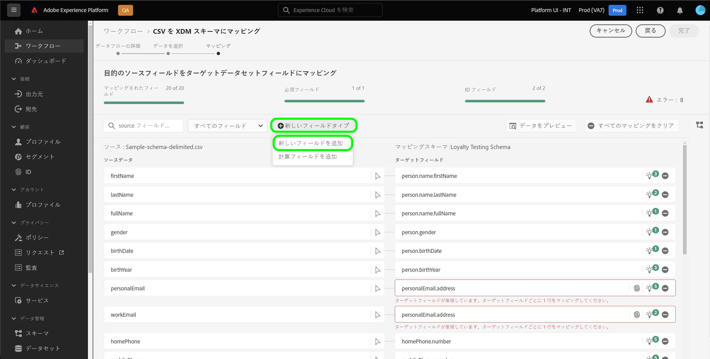

次に、表示されるソーススキーマツリーから追加するソースフィールドを選択し、「 」を選択します。 **[!UICONTROL 選択]**.

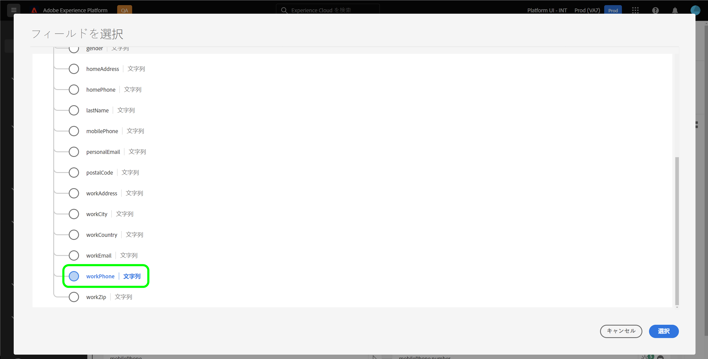

マッピングインターフェイスは、選択したソースフィールドと空のターゲットフィールドで更新されます。 選択 **[!UICONTROL ターゲットフィールドをマッピング]** をクリックして、新しいソースフィールドの適切なターゲット XDM フィールドへのマッピングを開始します。

インタラクティブなターゲットスキーマツリーが表示され、ターゲットスキーマを手動でトラバースして、ソースフィールドに適したターゲット XDM フィールドを見つけることができます。

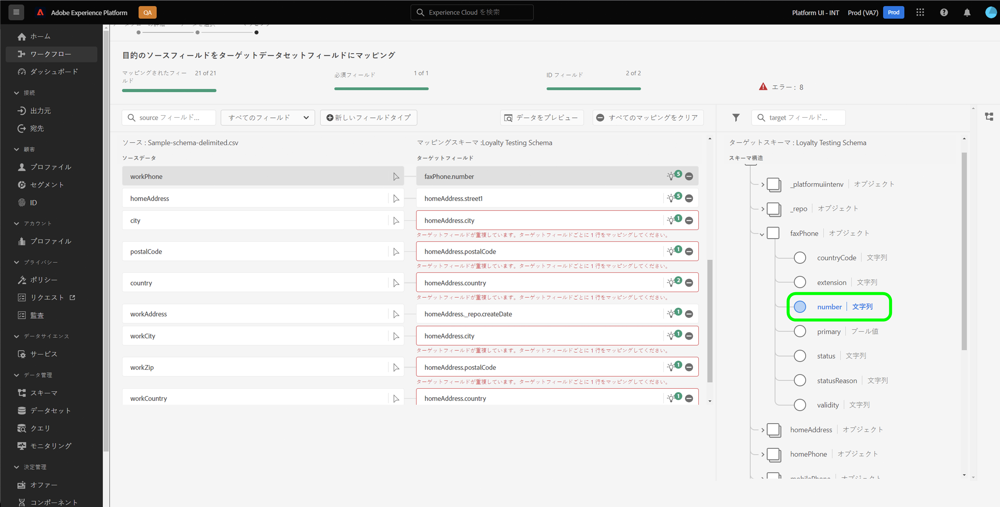

完了したら、スキーマアイコンを選択して、ターゲットスキーマインターフェイスを閉じます。

#### 計算フィールド {#calculated-fields}

計算フィールドでは、入力スキーマの属性に基づいて値を作成できます。 これらの値をターゲットスキーマの属性に割り当て、名前と説明を指定して参照を容易にできます。

計算フィールドを作成するには、「 **[!UICONTROL 新しいフィールドタイプ]** 次に、 **[!UICONTROL 計算フィールドを追加]**

**[!UICONTROL 計算フィールドの作成]** パネルが表示されます。 左側のダイアログボックスには、計算フィールドでサポートされるフィールド、関数、演算子が含まれています。タブの 1 つを選択して、式エディターに関数、フィールドまたは演算子を追加します。

| タブ | 説明 |
| --- | ----------- |
| [!UICONTROL 関数] | 「関数」タブには、データの変換に使用できる関数が一覧表示されます。計算フィールド内で使用できる関数の詳細については、 [データ準備（マッパー）関数の使用](../functions.md) に関するガイドを参照してください。 |
| [!UICONTROL フィールド] | 「フィールド」タブには、ソーススキーマで使用できるフィールドと属性が表示されます。 |
| [!UICONTROL 演算子] | 「演算子」タブには、データの変換に使用できる演算子が一覧表示されます。 |

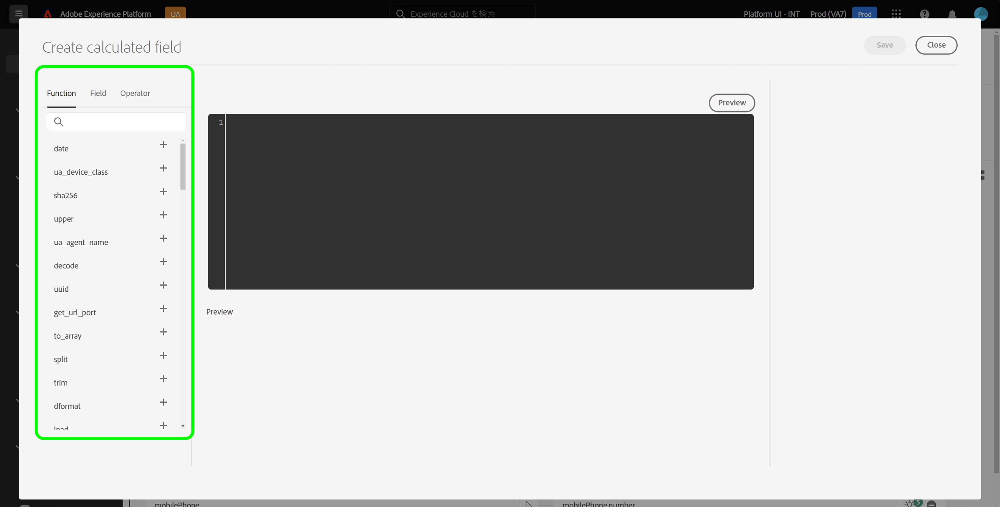

中央にある式エディターを使用して、フィールド、関数、演算子を手動で追加できます。 式の作成を開始するには、エディターを選択します。完了したら、「 」を選択します。 **[!UICONTROL 保存]** をクリックして続行します。

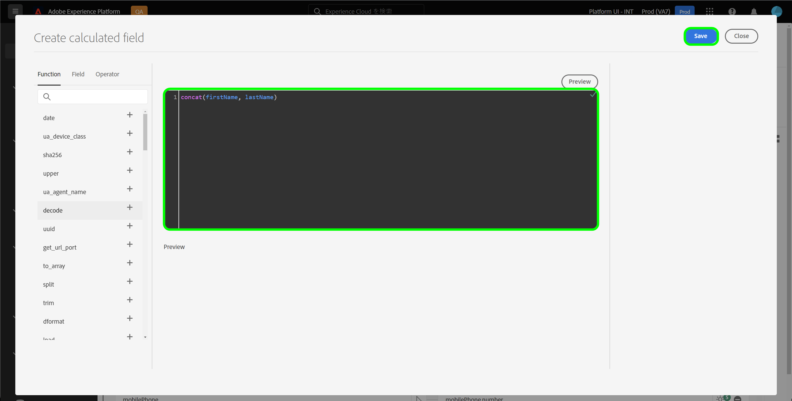

選択 **[!UICONTROL データをプレビュー]** ：選択したデータセットから最大 100 行のサンプルデータのマッピング結果を確認します。

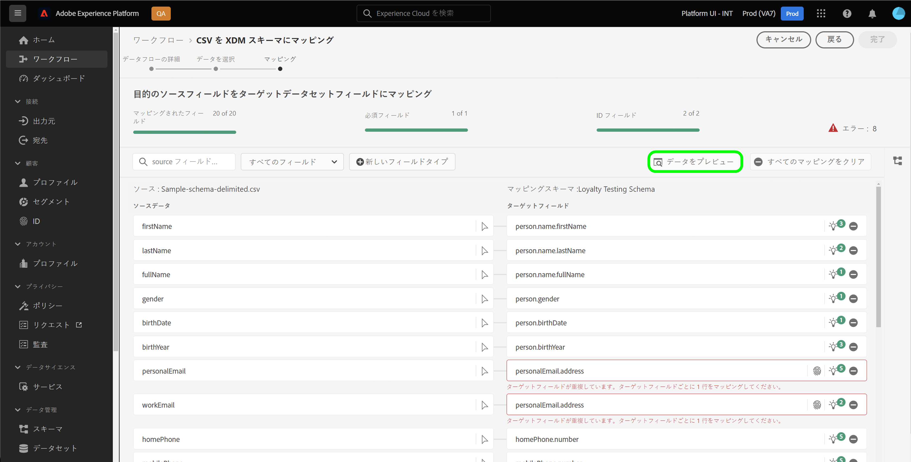

プレビュー中、ID 列は、マッピング結果を検証する際に必要な重要な情報なので、最初のフィールドとして優先付けされます。 終了したら、「 」を選択します。 **[!UICONTROL 閉じる]**.

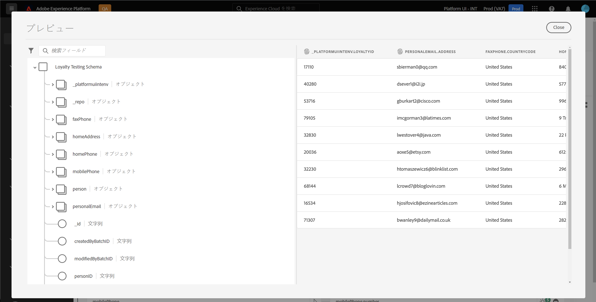

すべてのマッピングフィールドを削除するには、「 **[!UICONTROL すべてのマッピングをクリア]**.

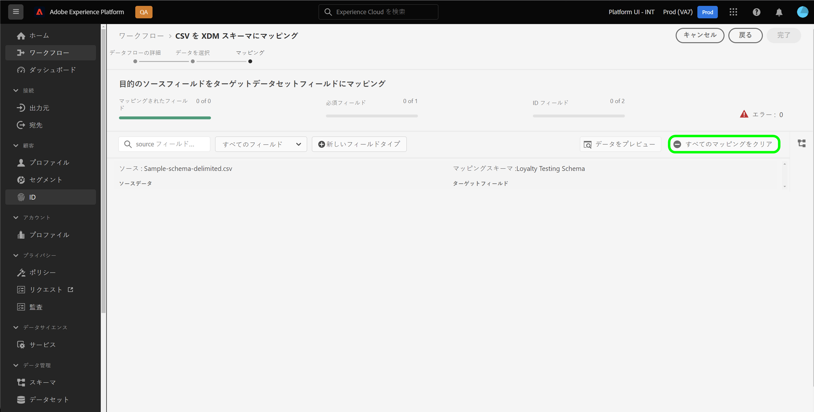

### マッピングインターフェイスの使用

Platform は、選択したターゲットスキーマまたはデータセットに基づいて、自動マッピングされたフィールドに対して、インテリジェントなレコメンデーションを自動的に提供します。 マッピングルールをユースケースに合わせて手動で調整したり、重複したマッピングフィールドを修正してエラーをクリアしたりできます。

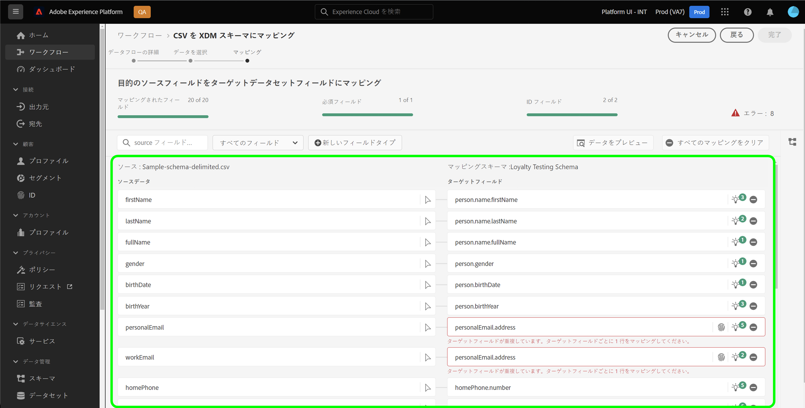

調整するターゲットフィールドの電球アイコンを選択します。

この [!UICONTROL マッピングレコメンデーション] ポップアップパネルが表示され、特定のソースフィールドにマッピングできる推奨ターゲットフィールドのリストが表示されます。 デフォルトでは、最初のレコメンデーションが自動的に適用されます。

ソーススキーマに複数のレコメンデーションが使用できる場合があります。 これが発生すると、マッピングカードに最も目立つレコメンデーションが表示され、その後に使用可能なレコメンデーションの数を含むアイコンが表示されます。 電球アイコンを選択すると、追加の推奨事項のリストが表示されます。 代わりに、マッピング先のレコメンデーションの横にあるチェックボックスをオンにして、代替レコメンデーションの 1 つを選択できます。

ここから、選択したターゲットフィールドを変更して、エラーを修正したり、ユースケースに合わせたりできます。

または、 **[!UICONTROL 手動で選択]** をクリックして、インタラクティブターゲットスキーママッピングツリーを手動で使用します。

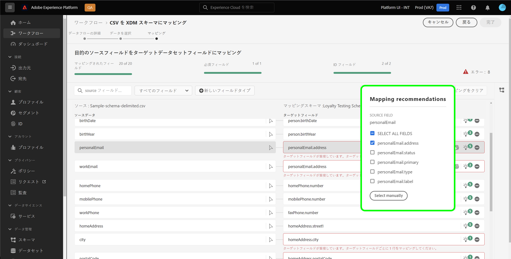

ターゲットスキーママッピングインターフェイスは、マッピングフィールドと同じビューに表示され、同じ画面でマッピングペアを変更できます。 使用例に合うターゲットフィールドを選択するか、エラーを修正します。

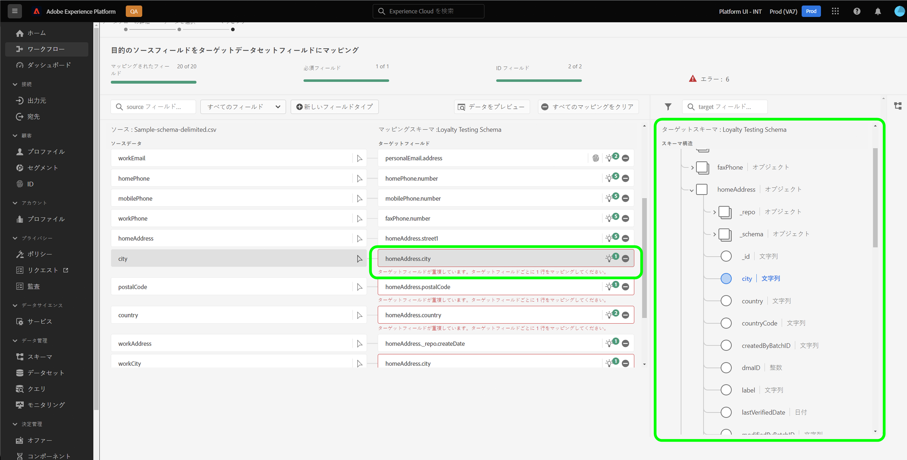

終了したら、「 」を選択します。 **[!UICONTROL 完了]** をクリックして続行します。

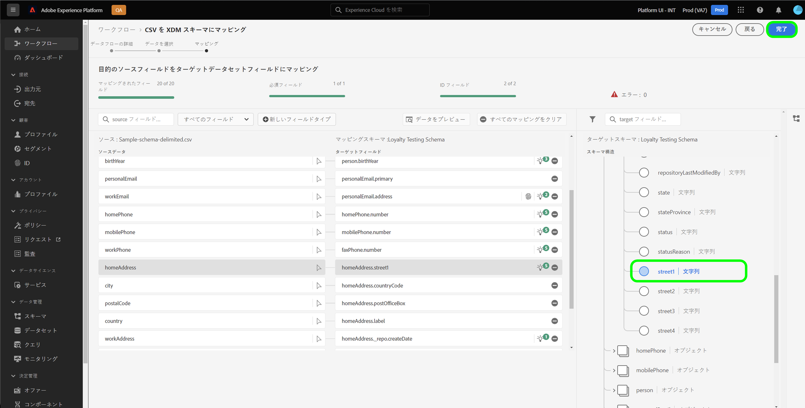

## 次の手順

このドキュメントを読むと、Platform UI のマッピングインターフェイスを使用して、CSV ファイルをターゲット XDM スキーマに正常にマッピングできました。 詳しくは、次のドキュメントを参照してください。

* [Data Prep の概要](../home.md)
* [ソースの概要](../../sources/home.md)
* [UI でのソースデータフローの監視](../../dataflows/ui/monitor-sources.md)
