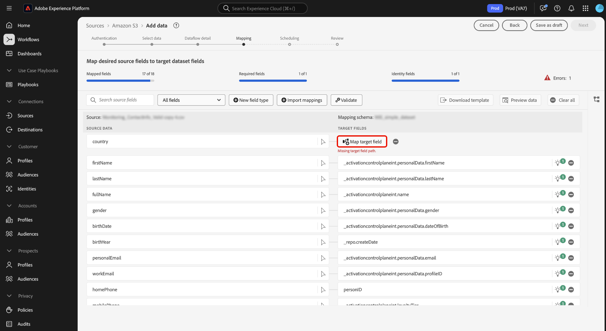
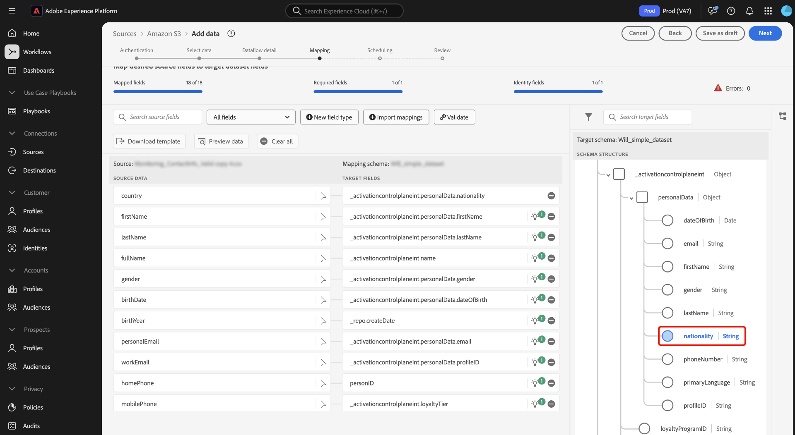

# データ準備 UI ガイド {#data-prep-ui-guide}

>[!CONTEXTUALHELP]
>id="platform_data_prep_import_mapping"
>title="テンプレートをダウンロード"
>abstract="csv テンプレートをダウンロードして、オフラインでマッピングを実行します。"

このガイドでは、Adobe Experience Platform ユーザーインターフェイスの [ データ準備 ](../home.md) マッピング機能を使用して、CSV ファイルを [ エクスペリエンスデータモデル（XDM）スキーマ ](../../xdm/home.md) にマッピングする方法について説明します。

## 基本を学ぶ

このチュートリアルでは、次のExperience Platform コンポーネントに関する十分な知識が必要です。

* [[!DNL Experience Data Model (XDM)] システム](../../xdm/home.md)：Experience Platform が顧客体験データの整理に使用する標準化されたフレームワーク。
   * [スキーマ構成の基本](../../xdm/schema/composition.md)：スキーマ構成の主要な原則やベストプラクティスなど、XDM スキーマの基本的な構成要素について学びます。
   * [スキーマエディターのチュートリアル](../../xdm/tutorials/create-schema-ui.md)：スキーマエディター UI を使用してカスタムスキーマを作成する方法を説明します。
* [ID サービス](../../identity-service/home.md)：デバイスやシステム間で ID を関連付けることで、個々の顧客とその行動への理解を深めることができます。
* [[!DNL Real-Time Customer Profile]](../../profile/home.md)：複数のソースからの集計データに基づいて、統合されたリアルタイムの顧客プロファイルを提供します。
* [ ソース ](../../sources/home.md):Experience Platformを使用すると、データを様々なソースから取得しながら、Experience Platform サービスを使用して受信データの構造化、ラベル付け、拡張を行うことができます。

## UI でマッピングインターフェイスにアクセスする

UI では、2 つの異なるパスからマッピングインターフェイスにアクセスできます。

1. Experience Platform UI で、左側のナビゲーションから「**[!UICONTROL Workflows]**」を選択し、「**[!UICONTROL Map CSV to XDM schema]**」を選択します。 次に、データフローの詳細を入力し、取り込むデータを選択します。 完了すると、マッピングインターフェイスに移動し、ソースデータと XDM スキーマ間のマッピングを設定できます。
2. ソースワークスペースからマッピングインターフェイスにアクセスすることもできます。

## CSV ファイルを XDM スキーマにマッピングする

マッピングインターフェイスと、それが提供する包括的なツールセットを使用して、ソーススキーマのデータフィールドを、ターゲットスキーマ内の適切なターゲット XDM フィールドに正常にマッピングします。

### マッピングインターフェイスについて {#mapping-interface}

取り込みワークフローのコンテキスト内のマッピングフィールドの正常性については、インターフェイスの上部にあるダッシュボードを参照してください。 ダッシュボードには、マッピングフィールドに関する次の詳細が表示されます。

| プロパティ | 説明 |
| --- | --- |
| [!UICONTROL Mapped fields] | エラーに関係なく、ターゲット XDM フィールドにマッピングされたソースフィールドの合計数を表示します。 |
| [!UICONTROL Required fields] | 必須マッピングフィールドの数を表示します。 |
| [!UICONTROL Identity fields] | ID として定義されたマッピングフィールドの合計数を表示します。 これらのマッピングフィールドは、指紋アイコンで表されます。 |
| [!UICONTROL Errors] | エラーが発生したマッピングフィールドの数を表示します。 |

{style="table-layout:auto"}

次に、ヘッダーにリストされたオプションを使用して、マッピングフィールドの操作やフィルタリングを改善できます。

| オプション | 説明 |
| --- | --- |
| [!UICONTROL Search source fields] | 検索バーを使用して、特定のソースフィールドに移動します。 |
| [!UICONTROL All fields] | 「**[!UICONTROL All fields]**」を選択すると、マッピングをフィルタリングするためのオプションのドロップダウンメニューが表示されます。 使用可能なフィルタリングオプションを次に示します。<ul><li>**[!UICONTROL Required fields]**：ワークフローの完了に必要なフィールドのみを表示するようにインターフェイスをフィルタリングします。</li><li> **[!UICONTROL Identity fields]**:ID としてマークされたフィールドのみを表示するようにインターフェイスをフィルタリングします。</li><li>**[!UICONTROL Mapped fields]**：既にマッピングされているフィールドのみを表示するようにインターフェイスをフィルタリングします。</li><li>**[!UICONTROL Unmapped fields]**：まだマッピングされていないフィールドのみを表示するようにインターフェイスをフィルタリングします。</li><li>**[!UICONTROL Fields with errors]**: インターフェイスをフィルタリングして、エラーのあるフィールドのみを表示します。</li></ul> |
| [!UICONTROL New field type] | 新しいフィールドまたは計算フィールドを追加するには、「**[!UICONTROL New field type]**」を選択します。 詳しくは、[ 新しいフィールドタイプの追加 ](#add-a-new-field-type) の節を参照してください。 |
| [!UICONTROL Import mappings] | 既存のファイルまたはデータフローからマッピングをインポートするには、「**[!UICONTROL Import mappings]**」を選択します。 詳しくは、[ マッピングのインポート ](#import-mapping) の節を参照してください。 |
| [!UICONTROL Validate] | 「**[!UICONTROL Validate]**」を選択すると、マッピングのエラーを確認できます。 |
| [!UICONTROL Download template] | 「**[!UICONTROL Download template]**」を選択して、マッピングの CSV ファイルを書き出し、ダウンロードします。 |
| [!UICONTROL Preview data] | 「**[!UICONTROL Preview data]**」を選択してプレビューパネルを使用し、ソースデータセットの構造と内容を調べます。 |
| [!UICONTROL Clear all] | **[!UICONTROL Clear all]** を選択すると、インターフェイス内のすべてのマッピングが削除されます。 |

{style="table-layout:auto"}

### 新しいフィールドタイプを追加 {#add-a-new-field-type}

新しいマッピングフィールドまたは計算フィールドを選択して追加 **[!UICONTROL New field type]** きます。

#### 新しいマッピングフィールド

新しいマッピングフィールドを追加するには、「**[!UICONTROL New field type]**」を選択した後、表示されるドロップダウンメニューから「**[!UICONTROL Add new field]**」を選択します。

次に、表示されるソーススキーマツリーから追加するソースフィールドをクリックし、「**[!UICONTROL Select]**」をクリックします。

マッピングインターフェイスは、選択したソースフィールドと空のターゲットフィールドを使用して更新されます。 「**[!UICONTROL Map target field]**」を選択して、新しいソースフィールドの適切なターゲット XDM フィールドへのマッピングを開始します。

インタラクティブなターゲットスキーマツリーが表示され、ターゲットスキーマを手動でトラバースして、ソースフィールドに適したターゲット XDM フィールドを見つけることができます。

#### 計算フィールド {#calculated-fields}

計算フィールドでは、入力スキーマの属性に基づいて値を作成できます。 これらの値をターゲットスキーマの属性に割り当て、名前と説明を指定して参照を容易にできます。計算フィールドの最大長は 4096 文字です。

計算フィールドを作成するには、「**[!UICONTROL New field type]**」を選択してから「**[!UICONTROL Add calculated field]**」を選択します。

**[!UICONTROL Create calculated field]** ウィンドウが表示されます。 インターフェイスを使用して計算フィールドを入力し、サポートされるフィールド、関数、演算子については、左側のダイアログボックスを参照してください。

| タブ | 説明 |
| --- | ----------- |
| [!UICONTROL Function] | 「関数」タブには、データの変換に使用できる関数が一覧表示されます。計算フィールド内で使用できる関数の詳細については、 [データ準備（マッパー）関数の使用](../functions.md) に関するガイドを参照してください。 |
| [!UICONTROL Field] | 「フィールド」タブには、ソーススキーマで使用できるフィールドと属性が表示されます。 |
| [!UICONTROL Operator] | 「演算子」タブには、データの変換に使用できる演算子が一覧表示されます。 |

中央にある式エディターを使用して、フィールド、関数、演算子を手動で追加できます。 式の作成を開始するには、エディターを選択します。完了したら、「**[!UICONTROL Save]**」を選択して続行します。

### マッピングを読み込む {#import-mapping}

データ準備の読み込みマッピング機能を使用すると、データ取り込みプロセスの手動による設定時間を短縮し、ミスを制限できます。 マッピングは、既存のフローまたは書き出されたファイルから読み込むことができます。

>[!BEGINTABS]

>[!TAB  フローからマッピングを読み込む ]

類似のソースファイルとターゲットスキーマに基づく複数のデータフローがある場合は、既存のマッピングを読み込んで、新しいデータフローに再利用できます。

既存のデータフローからマッピングを読み込むには、「**[!UICONTROL Import mappings]**」を選択してから「**[!UICONTROL Import mapping from flow]**」を選択します。

次に、ポップアップウィンドウを使用して、マッピングを読み込むデータフローを見つけます。 この手順では、検索機能を使用して特定のデータフローを分離し、そのマッピングを取得することもできます。 終了したら「**[!UICONTROL Select]**」を選択します。

>[!TAB  ファイルからマッピングを読み込み ]

場合によっては、データに対して多数のマッピングを実装する必要があります。 この作業はマッピングインターフェイスを使用して手動で行うことができますが、マッピングテンプレートを書き出してオフラインのスプレッドシートでマッピングを設定することで時間を節約し、Experience Platformでのユーザーのタイムアウトを回避することもできます。

書き出されたファイルからマッピングを読み込むには、「**[!UICONTROL Import mappings]**」を選択してから「**[!UICONTROL Import mapping from file]**」を選択します。

次に、[!UICONTROL Upload template] のウィンドウを使用して、マッピングの CSV コピーをダウンロードします。 その後、CSV ファイルタイプの編集をサポートするソフトウェアを使用して、デバイス上でローカルにマッピングを設定できます。 この手順では、ソースファイルとターゲットスキーマで提供されるフィールドのみを使用していることを確認する必要があります。

+++エクスポートされたマッピング ファイルの例を表示する場合に選択します

+++

終了したら、「**[!UICONTROL Upload file]**」を選択し、マッピングの更新された csv ファイルを選択します。 システムが処理するまで少し待ってから、「**[!UICONTROL Done]**」を選択します。

>[!ENDTABS]

マッピングが完了したら、「**[!UICONTROL Finish]**」を選択し、次の手順に進んでデータフローを完了できます。

>[!TIP]
>
>マッピングの作成が完了したら、データ取り込みを開始する前に最大 10 分待ちます。 この待機期間により、新しいマッピングが完全に保存され、システムで使用できるようになります。

## 次の手順

Experience Platform UI のマッピングインターフェイスを使用して、CSV ファイルをターゲット XDM スキーマに正常にマッピングできるようになりました。 詳しくは、次のドキュメントを参照してください。

* [データ準備の概要](../home.md)
* [ソースの概要](../../sources/home.md)
* [UI でのソースデータフローの監視](../../dataflows/ui/monitor-sources.md)
