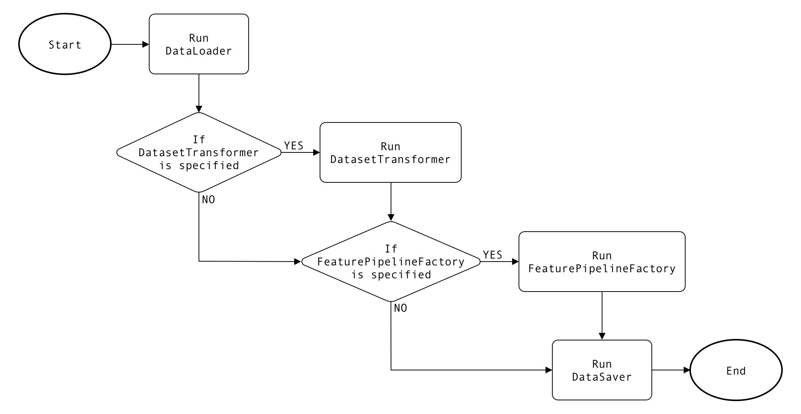

# モデルオーサリング SDK を使用した機能パイプラインの作成

>[!IMPORTANT]
>
> 機能パイプラインは、現在、API 経由でのみ使用できます。

Adobe Experience Platformでは、カスタム機能パイプラインを構築して作成し、Sensei Machine Learning Framework Runtime（以下「Runtime」）を通じて、大規模な機能エンジニアリングを実行できます。

このドキュメントでは、機能パイプラインに含まれる様々なクラスについて説明し、を使用してカスタム機能パイプラインを作成する手順を示すチュートリアルを提供します。 [モデルオーサリング SDK](./sdk.md) PySpark 内。

機能パイプラインの実行時には、次のワークフローが実行されます。

1. レシピは、データセットをパイプラインに読み込みます。
2. 機能の変換は、データセットでおこなわれ、Adobe Experience Platformに書き戻されます。
3. 変換されたデータは、トレーニング用に読み込まれます。
4. フィーチャパイプラインは、選択したモデルとして勾配ブースティング回帰を使用してステージを定義します。
5. パイプラインは、トレーニングデータに合わせて使用され、トレーニング済みモデルが作成されます。
6. モデルは、スコアリングデータセットで変換されます。
7. 出力の注目の列が選択され、に保存されます。 [!DNL Experience Platform] と関連するデータが含まれます。

## はじめに

任意の組織でレシピを実行するには、次が必要です。
- 入力データセット。
- データセットのスキーマ。
- 変換済みのスキーマと、そのスキーマに基づく空のデータセット。
- 出力スキーマと、そのスキーマに基づく空のデータセット。

上記のすべてのデータセットを、 [!DNL Platform] UI これを設定するには、Adobeが提供する [ブートストラップスクリプト](https://github.com/adobe/experience-platform-dsw-reference/tree/master/bootstrap).

## 機能パイプラインのクラス

次の表に、機能パイプラインを構築するために拡張する必要がある主な抽象クラスを示します。

| 抽象クラス | 説明 |
| -------------- | ----------- |
| DataLoader | DataLoader クラスは、入力データを取得するための実装を提供します。 |
| DatasetTransformer | DatasetTransformer クラスは、入力データセットを変換するための実装を提供します。DatasetTransformer クラスを指定する代わりに、FeaturePipelineFactory クラス内に機能エンジニアリングロジックを実装することもできます。 |
| FeaturePipelineFactory | FeaturePipelineFactory クラスは、一連の Spark Transformer から成り、機能エンジニアリングを実施する Spark パイプラインを構築します。FeaturePipelineFactory クラスを指定する代わりに、DatasetTransformer クラス内に機能エンジニアリングロジックを実装することもできます。 |
| DataSaver | DataSaver クラスは、機能データセットのストレージのロジックを提供します。 |

機能パイプラインジョブが開始されると、Runtime は、まず DataLoader を実行して入力データを DataFrame として読み込み、次に DatasetTransformer、FeaturePipelineFactory、またはその両方を実行して DataFrame を変更します。 最後に、生成された機能データセットが DataSaver を通して保存されます。

次のフローチャートに、Runtime の実行順序を示します。




## 機能パイプラインのクラスを実装する {#implement-your-feature-pipeline-classes}

以下の節では、機能パイプラインに必要なクラスの説明とその実装例を示します。

### 設定 JSON ファイルで変数を定義する {#define-variables-in-the-configuration-json-file}

設定 JSON ファイルはキーと値のペアで構成され、後から実行時に定義する変数を指定することを目的としています。これらのキーと値のペアでは、入力データセットの場所、出力データセット ID、テナント ID、列ヘッダーなどのプロパティを定義できます。

次の例は、設定ファイル内にあるキーと値のペアを示しています。

**設定 JSON の例**

```json
[
    {
        "name": "fp",
        "parameters": [
            {
                "key": "dataset_id",
                "value": "000"
            },
            {
                "key": "featureDatasetId",
                "value": "111"
            },
            {
                "key": "tenantId",
                "value": "_tenantid"
            }
        ]
    }
]
```

設定 JSON にアクセスするには、任意のクラスメソッドで `config_properties` をパラメーターとして定義します。以下に例を示します。

**PySpark**

```python
dataset_id = str(config_properties.get(dataset_id))
```

詳しくは、 [pipeline.json](https://github.com/adobe/experience-platform-dsw-reference/blob/master/recipes/feature_pipeline_recipes/pyspark/pipeline.json) Data Science Workspace によって提供されるファイルを参照してください。

### DataLoader を使用して入力データを準備する {#prepare-the-input-data-with-dataloader}

DataLoader では、入力データの取得とフィルタリングをおこないます。DataLoader の実装では、抽象クラス `DataLoader` を拡張し、抽象メソッド `load` をオーバーライドする必要があります。

次の例では、 [!DNL Platform] データセットを ID でデータセット化し、DataFrame として返します。このデータセット ID(`dataset_id`) は、設定ファイル内で定義されたプロパティです。

**PySpark の例**

```python
# PySpark

from pyspark.sql.types import StringType, TimestampType
from pyspark.sql.functions import col, lit, struct
import logging

class MyDataLoader(DataLoader):
    def load_dataset(config_properties, spark, tenant_id, dataset_id):
    PLATFORM_SDK_PQS_PACKAGE = "com.adobe.platform.query"
    PLATFORM_SDK_PQS_INTERACTIVE = "interactive"

    service_token = str(spark.sparkContext.getConf().get("ML_FRAMEWORK_IMS_ML_TOKEN"))
    user_token = str(spark.sparkContext.getConf().get("ML_FRAMEWORK_IMS_TOKEN"))
    org_id = str(spark.sparkContext.getConf().get("ML_FRAMEWORK_IMS_ORG_ID"))
    api_key = str(spark.sparkContext.getConf().get("ML_FRAMEWORK_IMS_CLIENT_ID"))

    dataset_id = str(config_properties.get(dataset_id))

    for arg in ['service_token', 'user_token', 'org_id', 'dataset_id', 'api_key']:
        if eval(arg) == 'None':
            raise ValueError("%s is empty" % arg)

    query_options = get_query_options(spark.sparkContext)

    pd = spark.read.format(PLATFORM_SDK_PQS_PACKAGE) \
        .option(query_options.userToken(), user_token) \
        .option(query_options.serviceToken(), service_token) \
        .option(query_options.imsOrg(), org_id) \
        .option(query_options.apiKey(), api_key) \
        .option(query_options.mode(), PLATFORM_SDK_PQS_INTERACTIVE) \
        .option(query_options.datasetId(), dataset_id) \
        .load()
    pd.show()

    # Get the distinct values of the dataframe
    pd = pd.distinct()

    # Flatten the data
    if tenant_id in pd.columns:
        pd = pd.select(col(tenant_id + ".*"))

    return pd
```

### DatasetTransformer を使用してデータセットを変換する {#transform-a-dataset-with-datasettransformer}

DatasetTransformer は、入力 DataFrame を変換するロジックを提供し、新しい派生 DataFrame を返します。このクラスは、FeaturePipelineFactory と協働するように、または唯一の機能エンジニアリングコンポーネントとして動作するように実装できます。また、このクラスを実装しないことも可能です。

次の例では、 DatasetTransformer クラスが拡張されています。

**PySpark の例**

```python
# PySpark

from sdk.dataset_transformer import DatasetTransformer
from pyspark.ml.feature import StringIndexer
from pyspark.sql.types import IntegerType
from pyspark.sql.functions import unix_timestamp, from_unixtime, to_date, lit, lag, udf, date_format, lower, col, split, explode
from pyspark.sql import Window
from .helper import setupLogger

class MyDatasetTransformer(DatasetTransformer):
    logger = setupLogger(__name__)

    def transform(self, config_properties, dataset):
        tenant_id = str(config_properties.get("tenantId"))

        # Flatten the data
        if tenant_id in dataset.columns:
            self.logger.info("Flatten the data before transformation")
            dataset = dataset.select(col(tenant_id + ".*"))
            dataset.show()

        # Convert isHoliday boolean value to Int
        # Rename the column to holiday and drop isHoliday
        pd = dataset.withColumn("holiday", col("isHoliday").cast(IntegerType())).drop("isHoliday")
        pd.show()

        # Get the week and year from date
        pd = pd.withColumn("week", date_format(to_date("date", "MM/dd/yy"), "w").cast(IntegerType()))
        pd = pd.withColumn("year", date_format(to_date("date", "MM/dd/yy"), "Y").cast(IntegerType()))

        # Convert the date to TimestampType
        pd = pd.withColumn("date", to_date(unix_timestamp(pd["date"], "MM/dd/yy").cast("timestamp")))

        # Convert categorical data
        indexer = StringIndexer(inputCol="storeType", outputCol="storeTypeIndex")
        pd = indexer.fit(pd).transform(pd)

        # Get the WeeklySalesAhead and WeeklySalesLag column values
        window = Window.orderBy("date").partitionBy("store")
        pd = pd.withColumn("weeklySalesLag", lag("weeklySales", 1).over(window)).na.drop(subset=["weeklySalesLag"])
        pd = pd.withColumn("weeklySalesAhead", lag("weeklySales", -1).over(window)).na.drop(subset=["weeklySalesAhead"])
        pd = pd.withColumn("weeklySalesScaled", lag("weeklySalesAhead", -1).over(window)).na.drop(subset=["weeklySalesScaled"])
        pd = pd.withColumn("weeklySalesDiff", (pd['weeklySales'] - pd['weeklySalesLag'])/pd['weeklySalesLag'])

        pd = pd.na.drop()
        self.logger.debug("Transformed dataset count is %s " % pd.count())

        # return transformed dataframe
        return pd
```

### FeaturePipelineFactory を使用してデータ機能を開発する {#engineer-data-features-with-featurepipelinefactory}

FeaturePipelineFactory を使用すると、機能エンジニアリングロジックを実装できます。そのためには、Spark パイプラインを通じて、一連の Spark Transformer を定義および連結します。このクラスは、DatasetTransformer と協働するように、または唯一の機能エンジニアリングコンポーネントとして動作するように実装できます。また、このクラスを実装しないことも可能です。

次の例では、FeaturePipelineFactory クラスを拡張しています。

**PySpark の例**

```python
# PySpark

from pyspark.ml import Pipeline
from pyspark.ml.regression import GBTRegressor
from pyspark.ml.feature import VectorAssembler

import numpy as np

from sdk.pipeline_factory import PipelineFactory

class MyFeaturePipelineFactory(FeaturePipelineFactory):

    def apply(self, config_properties):
        if config_properties is None:
            raise ValueError("config_properties parameter is null")

        tenant_id = str(config_properties.get("tenantId"))
        input_features = str(config_properties.get("ACP_DSW_INPUT_FEATURES"))

        if input_features is None:
            raise ValueError("input_features parameter is null")
        if input_features.startswith(tenant_id):
            input_features = input_features.replace(tenant_id + ".", "")

        learning_rate = float(config_properties.get("learning_rate"))
        n_estimators = int(config_properties.get("n_estimators"))
        max_depth = int(config_properties.get("max_depth"))

        feature_list = list(input_features.split(","))
        feature_list.remove("date")
        feature_list.remove("storeType")

        cols = np.array(feature_list)

        # Gradient-boosted tree estimator
        gbt = GBTRegressor(featuresCol='features', labelCol='weeklySalesAhead', predictionCol='prediction',
                       maxDepth=max_depth, maxBins=n_estimators, stepSize=learning_rate)

        # Assemble the fields to a vector
        assembler = VectorAssembler(inputCols=cols, outputCol="features")

        # Construct the pipeline
        pipeline = Pipeline(stages=[assembler, gbt])

        return pipeline

    def train(self, config_properties, dataframe):
        pass

    def score(self, config_properties, dataframe, model):
        pass

    def getParamMap(self, config_properties, sparkSession):
        return None
```

### DataSaver を使用して機能データセットを保存する {#store-your-feature-dataset-with-datasaver}

DataSaver は、結果の機能データセットをストレージの場所に保存します。 DataSaver の実装では、抽象クラス `DataSaver` を拡張し、抽象メソッド `save` をオーバーライドする必要があります。

次の例では、データを [!DNL Platform] データセットを ID で指定し、ここで、データセット ID(`featureDatasetId`) およびテナント ID (`tenantId`) は、設定で定義されたプロパティです。

**PySpark の例**

```python
# PySpark

from sdk.data_saver import DataSaver
from pyspark.sql.types import StringType, TimestampType
from pyspark.sql.functions import col, lit, struct


class MyDataSaver(DataSaver):
    def save(self, configProperties, data_feature):

        # Spark context
        sparkContext = data_features._sc

        # preliminary checks
        if configProperties is None:
            raise ValueError("configProperties parameter is null")
        if data_features is None:
            raise ValueError("data_features parameter is null")
        if sparkContext is None:
            raise ValueError("sparkContext parameter is null")

        # prepare variables
        timestamp = "2019-01-01 00:00:00"
        output_dataset_id = str(
            configProperties.get("featureDatasetId"))
        tenant_id = str(
            configProperties.get("tenantId"))
        service_token = str(
            sparkContext.getConf().get("ML_FRAMEWORK_IMS_ML_TOKEN"))
        user_token = str(
            sparkContext.getConf().get("ML_FRAMEWORK_IMS_TOKEN"))
        org_id = str(
            sparkContext.getConf().get("ML_FRAMEWORK_IMS_ORG_ID"))
        api_key = str(
            sparkContext.getConf().get("ML_FRAMEWORK_IMS_CLIENT_ID"))

        # validate variables
        for arg in ['output_dataset_id', 'tenant_id', 'service_token', 'user_token', 'org_id', 'api_key']:
            if eval(arg) == 'None':
                raise ValueError("%s is empty" % arg)

        # create and prepare DataFrame with valid columns
        output_df = data_features.withColumn("date", col("date").cast(StringType()))
        output_df = output_df.withColumn(tenant_id, struct(col("date"), col("store"), col("features")))
        output_df = output_df.withColumn("timestamp", lit(timestamp).cast(TimestampType()))
        output_df = output_df.withColumn("_id", lit("empty"))
        output_df = output_df.withColumn("eventType", lit("empty"))

        # store data into dataset
        output_df.select(tenant_id, "_id", "eventType", "timestamp") \
            .write.format("com.adobe.platform.dataset") \
            .option('orgId', org_id) \
            .option('serviceToken', service_token) \
            .option('userToken', user_token) \
            .option('serviceApiKey', api_key) \
            .save(output_dataset_id)
```


### アプリケーションファイルで実装済みクラス名を指定する {#specify-your-implemented-class-names-in-the-application-file}

機能パイプラインのクラスを定義して実装したら、YAML アプリケーションのファイルでクラスの名前を指定する必要があります。

次の例では、実装済みのクラス名を指定します。

**PySpark の例**

```yaml
#Name of the class which contains implementation to get the input data.
feature.dataLoader: InputDataLoaderForFeaturePipeline

#Name of the class which contains implementation to get the transformed data.
feature.dataset.transformer: MyDatasetTransformer

#Name of the class which contains implementation to save the transformed data.
feature.dataSaver: DatasetSaverForTransformedData

#Name of the class which contains implementation to get the training data
training.dataLoader: TrainingDataLoader

#Name of the class which contains pipeline. It should implement PipelineFactory.scala
pipeline.class: TrainPipeline

#Name of the class which contains implementation for evaluation metrics.
evaluator: Evaluator
evaluateModel: True

#Name of the class which contains implementation to get the scoring data.
scoring.dataLoader: ScoringDataLoader

#Name of the class which contains implementation to save the scoring data.
scoring.dataSaver: MyDatasetSaver
```

## API を使用して機能パイプラインエンジンを作成する {#create-feature-pipeline-engine-api}

機能パイプラインを作成したら、Docker イメージを作成して、 [!DNL Sensei Machine Learning] API 機能パイプラインエンドポイントを呼び出すには、Docker 画像 URL が必要です。

>[!TIP]
>
>Docker URL がない場合は、 [ソースファイルのレシピへのパッケージ化](../models-recipes/package-source-files-recipe.md) Docker ホスト URL の作成手順を示すチュートリアルです。

また、次のPostmanコレクションを使用して、機能パイプライン API ワークフローの完了に役立てることもできます。

https://www.postman.com/collections/c5fc0d1d5805a5ddd41a

### フィーチャパイプラインエンジンを作成する {#create-engine-api}

Docker イメージの場所を取得したら、次の操作を実行できます。 [フィーチャパイプラインエンジンを作成する](../api/engines.md#feature-pipeline-docker) の使用 [!DNL Sensei Machine Learning] API を使用するには、次の操作に対してPOSTを実行します。 `/engines`. 機能パイプラインエンジンが正常に作成されると、エンジンの一意の識別子 (`id`) をクリックします。 続行する前に、この値を必ず保存してください。

### MLInstance の作成 {#create-mlinstance}

新しく作成したを使用 `engineID`、 [MLIstance の作成](../api/mlinstances.md#create-an-mlinstance) に対してPOSTリクエストを行う `/mlInstance` endpoint. 正常な応答は、新たに作成された MLInstance の一意の識別子 (`id`) が次の API 呼び出しで使用されます。

### Experiment の作成 {#create-experiment}

次に、 [実験の作成](../api/experiments.md#create-an-experiment). 実験を作成するには、MLIstance の一意の識別子 (`id`) をクリックし、 `/experiment` endpoint. 成功応答は、新たに作成された実験の詳細（一意の識別子を含む）を含むペイロードを返します (`id`) が次の API 呼び出しで使用されます。

### 実験実行機能のパイプラインタスクを指定 {#specify-feature-pipeline-task}

実験を作成した後、実験のモードをに変更する必要があります。 `featurePipeline`. モードを変更するには、次の手順で追加のPOSTを行います。 [`experiments/{EXPERIMENT_ID}/runs`](../api/experiments.md#experiment-training-scoring) を `EXPERIMENT_ID` そして死体の中に `{ "mode":"featurePipeline"}` をクリックして、機能パイプラインの Experiment Run を指定します。

完了したら、に対してGETリクエストを実行します。 `/experiments/{EXPERIMENT_ID}` から [実験ステータスの取得](../api/experiments.md#retrieve-specific) と、Experiment のステータスが更新されて完了するまで待ちます。

### 実験実行のトレーニングタスクを指定 {#training}

次に、 [トレーニング実行タスクの指定](../api/experiments.md#experiment-training-scoring). POSTする `experiments/{EXPERIMENT_ID}/runs` 本文で、モードを `train` およびトレーニングパラメーターを含むタスクの配列を送信します。 成功応答は、要求された実験の詳細を含むペイロードを返します。

完了したら、に対してGETリクエストを実行します。 `/experiments/{EXPERIMENT_ID}` から [実験ステータスの取得](../api/experiments.md#retrieve-specific) と、Experiment のステータスが更新されて完了するまで待ちます。

### 実験実行のスコア付けタスクを指定 {#scoring}

>[!NOTE]
>
> この手順を完了するには、1 つ以上の成功したトレーニング実行を実験に関連付ける必要があります。

トレーニングを正常に実行した後、次の操作を行う必要があります。 [スコアリング実行タスクの指定](../api/experiments.md#experiment-training-scoring). POSTする `experiments/{EXPERIMENT_ID}/runs` そして体に `mode` 属性を「score」に設定します。 これにより、スコアリング Experiment Run が開始されます。

完了したら、に対してGETリクエストを実行します。 `/experiments/{EXPERIMENT_ID}` から [実験ステータスの取得](../api/experiments.md#retrieve-specific) と、Experiment のステータスが更新されて完了するまで待ちます。

スコアリングが完了したら、機能パイプラインが動作可能になります。

## 次の手順 {#next-steps}

[//]: # (Next steps section should refer to tutorials on how to score data using the feature pipeline Engine. Update this document once those tutorials are available)

このドキュメントでは、Model Authoring SDK を使用して機能パイプラインをオーサリングし、Docker 画像を作成し、Docker 画像 URL を使用して、 [!DNL Sensei Machine Learning] API これで、データセットの変換を続行し、 [[!DNL Sensei Machine Learning API]](../api/getting-started.md).
