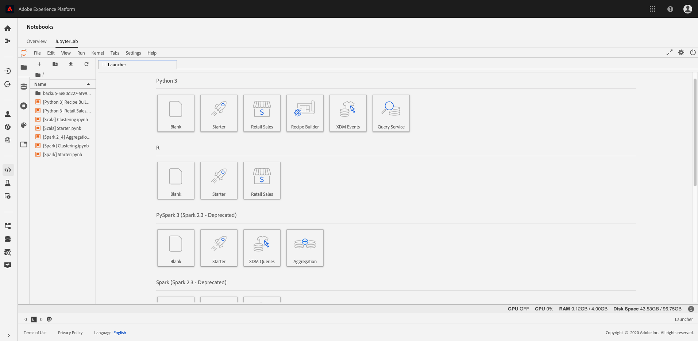

# Data Science Workspace の概要

Adobe Experience Platform [!DNL Data Science Workspace] uses machine learning and artificial intelligence to unleash insights from your data. Integrated into Adobe Experience Platform, [!DNL Data Science Workspace] helps you make predictions using your content and data assets across Adobe solutions.

あらゆるスキルレベルのデータサイエンティストは、機械学習レシピの迅速な開発、トレーニング、調整をサポートする高度で使いやすいツールを見つけ、複雑な手順なしに、AI テクノロジーのすべてのメリットを享受できます。

With [!DNL Data Science Workspace], data scientists can easily create intelligent services APIs - powered by machine learning. これらのサービスは、Adobe Target や Adobe Analytics Cloud などの他のアドビサービスと連携して、web、デスクトップ、およびモバイルアプリでパーソナライズされたターゲットデジタルエクスペリエンスを自動化することに役立ちます。

This guide provides an overview of the key concepts related to [!DNL Data Science Workspace].

## 概要

現在の大規模法人は、顧客体験をパーソナライズし、顧客や法人により多くの価値を提供するのに役立つ予測やインサイトを導き出すために、ビッグデータのマイニングを重要視しています。
同様に重要な点は、データからインサイトを獲得するためのコストが高くなる可能性があることです。通常、インテリジェントなサービスを提供する機械学習モデルまたはレシピを開発するには、集約的で時間のかかるデータ調査をおこなう熟練したデータサイエンティストが必要です。このプロセスは長く、テクノロジーは複雑であり、熟練したデータサイエンティストを見つけるのは容易ではありません。

With [!DNL Data Science Workspace], Adobe Experience Platform allows you to bring experience-focused AI across the enterprise, streamlining and accelerating data-to-insights-to-code with:
- 機械学習フレームワークとランタイム
- Adobe Experience Platform に保存されたデータへの統合アクセス
- XDM(統合データスキーマ) [!DNL Experience Data Model] を基盤とした統合データ管理
- 機械学習 / AI と大規模なデータセットの管理に不可欠なコンピューティング能力
- AI 駆動型のエクスペリエンスへの飛躍を促進する、事前に作成された機械学習レシピ
- 様々なスキルレベルのデータサイエンティスト向けのレシピの作成、再利用、変更を簡素化
- 開発者の介入なしに、インテリジェントなサービスの公開と共有を数回のクリックで行い、パーソナライズされた顧客体験の継続的な最適化のために監視と再トレーニングを実行

すべてのスキルレベルのデータサイエンティストは、インサイトと効果的なデジタルエクスペリエンスを迅速に生み出せるようになります。

## はじめに

Before diving into the details of [!DNL Data Science Workspace], here is a brief summary of the key terms:

| 用語 | 定義 |
|---------------------|------------------------------------------------------------------------------------------------------------------------------------------------------------------------------------------------------------------------------------------------------------------------------------------------------------------------------------------------------------------------------------------------------------------------------------------------------------------|
| [!DNL Data Science Workspace] | [!DNL Data Science Workspace] を使用す [!DNL Experience Platform] ると、お客様は、様々なAdobeソリューションのデータを利用して機械学習モデルを作成でき [!DNL Experience Platform] ます。インテリジェントなインサイトと予測を生み出し、快適なエンドユーザーのデジタルエクスペリエンスを組み立てることができます。 |
| 人工知能 | 人工知能とは、視覚、音声認識、意思決定、言語間の翻訳など、通常は人間の知性を必要とするタスクを実行できるコンピュータシステムの理論と開発のことを指します。 |
| 機械学習 | 機械学習とは、コンピューターが明示的にプログラムされることなく学習できるようにする研究分野です。 |
| [!DNL Sensei] MLフレームワーク | [!DNL Sensei] ML フレームワークはアドビ全体の統合機械学習フレームワークであり、 上のデータを活用して、機械学習主導型のインテリジェンスサービスを迅速でスケーラブルかつ再利用可能な方法で開発するデータサイエンティストをサポートします。[!DNL Experience Platform] |
| [!DNL Experience Data Model] | [!DNL Experience Data Model] (XDM)は、Adobeがリードする標準化の取組みで、Customer Experience Managementの標準スキーマ( [!DNL Profile] やなど)を定義 [!DNL ExperienceEvent]します。 |
| [!DNL JupyterLab] | [!DNL JupyterLab] は、Project Jupyter向けのオープンソースのwebベースのインターフェースで、と緊密に統合されてい [!DNL Experience Platform]ます。 |
| レシピ | レシピは、アドビのモデル仕様を表す用語です。トレーニング済みモデルを作成して実行し、ビジネスに関する特定の問題を解決するために必要な特定の機械学習、AI アルゴリズム（またはアルゴリズムのアンサンブル）、処理ロジック、設定を表すトップレベルのコンテナです。 |
| モデル | モデルとは、履歴データと設定を使用してトレーニングされた機械学習レシピのインスタンスであり、ビジネス上の使用例について解決します。 |
| トレーニング | トレーニングとは、ラベル付きのデータからパターンやインサイトを学習するプロセスです。 |
| トレーニング済みモデル | トレーニング済みモデルは、モデルのトレーニングプロセスの実行可能な出力を表します。トレーニングプロセスでは、トレーニングデータのセットがモデルインスタンスに適用されます。トレーニングを受けたモデルは、そこから作成されたインテリジェントWebサービスへの参照を維持します。 トレーニング済みモデルは、インテリジェント Web サービスのスコアリングと作成に適しています。トレーニング済みモデルに対する変更は、新しいバージョンとして追跡できます。 |
| スコアリング | スコアリングは、トレーニング済みモデルを使用して、データからインサイトを生成するプロセスです。 |
| サービス | デプロイされたサービスは、人工知能、機械学習モデル、または高度なアルゴリズムの機能を API 経由で公開し、他のサービスやアプリケーションで利用してインテリジェントなアプリを作成できるようにします。 |

次の表に、レシピ、モデル、トレーニング実行、スコアリング実行の階層関係の概要を示します。

## [!DNL Data Science Workspace]について 

With [!DNL Data Science Workspace], your data scientists can streamline the cumbersome process of uncovering insights in large datasets. Built on a common machine learning framework and runtime, [!DNL Data Science Workspace] delivers advanced workflow management, model management, and scalability. インテリジェントサービスは、機械学習レシピの再利用をサポートし、アドビの製品やソリューションを使用して作成された様々なアプリケーションを強化します。

### 1 か所でデータアクセス

データは AI と機械学習の基礎です。

[!DNL Data Science Workspace] は、Data Lake、およびを含むAdobe Experience Platformと完全に統合さ [!DNL Real-time Customer Profile]れてい [!DNL Unified Edge]ます。 Explore all your organizational data stored in Adobe Experience Platform at once, along with common big data and deep learning libraries, such as [!DNL Spark] ML and [!DNL TensorFlow]. 必要なデータが見つからない場合は、XDM 標準スキーマを使用して独自のデータセットを取り込めます。

### 事前に作成された機械学習レシピ

[!DNL Data Science Workspace] には、小売販売の予測や異常値検出など、一般的なビジネスニーズに対応した事前に作成された機械学習レシピが含まれているため、データサイエンティストや開発者は最初から始める必要はありません。現在、[製品購入予測](./pre-built-recipes/product-purchase-prediction.md)、[製品推奨](./pre-built-recipes/product-recommendations.md)、[小売販売](./pre-built-recipes/retail-sales.md)の 3 つのレシピが提供されています。

[//]: # (The built-in recipe gallery offers recommendations for prebuilt recipes based on your business needs.)

必要に応じて、事前に作成したレシピをニーズに合わせたり、レシピを読み込んだり、カスタムレシピを最初から作成したりできます。ただし、レシピのトレーニングとハイパーチューニングをおこなうと、カスタムインテリジェントサービスを作成する際に、開発者からのサポートは不要になり、数回クリックするだけで、ターゲットを絞ったパーソナライズされたデジタルエクスペリエンスを構築する準備が整います。

### データサイエンティストに焦点を当てたワークフロー

Whatever your level of data science expertise, [!DNL Data Science Workspace] helps simplify and accelerate the process of finding insights in data and applying them to digital experiences.

### データの調査

適切なデータを見つけ、それらのデータを準備することは、効果的なレシピを作成する上で最も労力のかかる作業です。[!DNL Data Science Workspace] と Adobe Experience Platform は、データからインサイトをよりすばやく獲得できるようにします。

Adobe Experience Platform では、XDM 標準スキーマでクロスチャネルデータが一元化されて保存されるため、データの検出、把握、クリーンアップがより簡単になります。共通のスキーマに基づいて、データを 1 つのストアに保存することでデータの調査と準備に必要な時間を大幅に短縮できます。

As you browse, use R, [!DNL Python], or Scala with the integrated, hosted [!DNL Jupyter Notebook] to browse the catalog of data on [!DNL Platform]. Using one of these languages, you can also take advantage of [!DNL Spark] ML and TensorFlow. 最初から始めるか、特定のビジネス上の問題に対して提供されているノートブックテンプレートの 1 つを使用します。

データ調査ワークフローの一部として、新しいデータを取り込んだり、既存の機能を使用したりしてデータを準備することもできます。

### オーサリング

With [!DNL Data Science Workspace], you decide how you want to author recipes.

- ビジネスニーズに対応した、事前に作成されたレシピを参照し、そのまま使用したり、特定の要件に合わせて設定したりすることで、時間を節約できます。
- Jupyter Notebook のオーサリングランタイムを使用して、レシピを最初から作成し、レシピを開発して登録します。
- Upload a recipe authored outside Adobe Experience Platform into [!DNL Data Science Workspace] or import recipe code from a repository, such as [!DNL Git], using the authentication and integration available between [!DNL Git] and [!DNL Data Science Workspace].

### 実験

Data Science Workspace は、実験プロセスの柔軟性を大幅に高めます。レシピから開始します。次に、ハイパーチューニングパラメーターなどの固有の特性と組み合わされた同じコアアルゴリズムを使用して、別個のインスタンスを作成します。必要な数のインスタンスを作成し、各インスタンスのトレーニングやスコアリングを必要に応じて何回でも行えます。As you train them, [!DNL Data Science Workspace] tracks recipes, recipe instances, and trained instances, along with evaluation metrics, so you don&#39;t have to.

### 運用

レシピに満足したら、数回クリックするだけで、インテリジェントサービスを作成できます。コーディングは不要であり、開発者やエンジニアに協力を求める必要なしに、自分でサービスを作成できます。最後に、インテリジェントサービスを Adobe IO に公開すると、デジタルエクスペリエンスチームが利用できるようになります。

<!--You can also publish your intelligent service to the Service Gallery, where it's available to specific people, specific organizations, or everyone who develops data solutions on Adobe Experience Platform. You can even share it with your external partners, and they can share their intelligent service with you. And the next time you're starting a new recipe, you can check the Service Gallery to see if there's a similar intelligent service you can use to get started. -->

### 継続的な改善

[!DNL Data Science Workspace] インテリジェントサービスが呼び出される場所と、その実行方法を追跡します。 データがロールインしたら、インテリジェントサービスの正確性を評価してループを閉じ、必要に応じてレシピを再トレーニングしてパフォーマンスを向上させることができます。その結果、顧客のパーソナライゼーションの精度を継続的に改善することができます。

### 新機能とデータセットへのアクセス

データサイエンティストは、アドビのサービスを通じて新しいテクノロジーとデータセットの利用が可能になり次第、すぐに活用できます。アドビは頻繁な更新を通じて、データセットとテクノロジーを Platform に統合しているため、ユーザーが統合をおこなう必要はありません。

### セキュリティと安全

データの保護は、アドビの最優先事項です。アドビは、業界で認められた標準、規制、および認定に準拠するために開発されたセキュリティプロセスと制御を使用して、ユーザーのデータを保護します。

セキュリティは、Adobe Secure Product Lifecycle の一環としてソフトウェアとサービスに組み込まれています。
アドビのデータおよびソフトウェアのセキュリティやコンプライアンスなどの詳細については、セキュリティページ（https://www.adobe.com/security.html）を参照してください。

## [!DNL Data Science Workspace] 実行中

web サイトを訪問したり、コールセンターに連絡したり、他のデジタルエクスペリエンスに関与したりする各顧客に高度にパーソナライズされたエクスペリエンスを配信するには、予測とインサイトから導出される情報が必要です。Here&#39;s how your day-to-day work happens with [!DNL Data Science Workspace].

### 問題の定義

すべては、ビジネス上の問題から始まります。例えば、オンラインコールセンターでは、顧客の否定的な意見を肯定的なものに変えるコンテキストが必要となります。

顧客に関するデータはたくさんあります。顧客はサイトを閲覧し、買い物かごに商品を入れ、実際に注文しました。また、以前に電子メールを受信したり、クーポンを使用したり、コールセンターに連絡したりした場合があります。その後、レシピでは、顧客とその行動に関して利用可能なデータを使用して、購入傾向を判断し、顧客が喜んで受け入れる可能性が高いオファーを推奨する必要があります。

顧客はコールセンターに連絡したときに、買い物かごに 2 組の靴を入れたままでしたが、シャツを削除していました。インテリジェントサービスはこの情報に基づいて、顧客からの電話中に、コールセンターエージェントに靴を 20% 引きにするクーポンを提案するように推奨できます。顧客がクーポンを使用すると、その情報がデータセットに追加され、次に顧客が電話かけてきた際の予測がさらに改善されます。

### データの調査と準備

レシピでは、定義されたビジネス上の問題に基づいて、サイト訪問、検索、ページ表示、クリックされたリンク、買い物かごの操作、受け取ったオファー、受信した電子メール、コールセンターとのやり取りなど、顧客の web トランザクションをすべて調べる必要があります。

通常、データサイエンティストは、レシピの作成に必要な時間の最大 75% を費やして、データを調査したり、変換したりしています。多くの場合、データは複数のリポジトリーから収集され、様々なスキーマに保存されます。データをレシピの作成に使用する前に、データを組み合わせたり、マッピングしたりする必要があります。

[//]: # (Your first step is to check the recipe gallery to see if an existing recipe meets your needs, or comes close. An alternative is to import a recipe you created outside of Adobe Experience Platform. Starting with an existing recipe often streamlines the data exploration phase and makes it easier for a data scientist.)

最初から始める場合や、既存のレシピを設定する場合は、組織の一元化および標準化されたデータカタログでデータの検索を開始すると、検索が大幅に簡単になります。組織内の別のデータサイエンティストが同様のデータセットを既に特定している場合もあり、最初から始めるのではなく、そのデータセットを微調整することもできます。
Adobe Experience Platform のすべてのデータは標準化された XDM スキーマに準拠しているため、データを結合するために複雑なモデルを作成したり、データエンジニアにサポートを求めたりする必要はありません。

必要なデータがすぐに見つからず、Adobe Experience Platform の外部に存在する場合でも、追加のデータセットを取り込むのは比較的単純なタスクです。これらのデータも標準化された XDM スキーマに変換されます。\
You can use [!DNL Jupyter Notebook] to simplify data pre-processing - possibly starting with a notebook template or a notebook you&#39;ve used previously for propensity to buy.

### レシピの作成

すべてのニーズを満たすレシピを既に見つけている場合は、実験に進むことができます。Or, you can modify the recipe a bit or create one from scratch - taking advantage of the [!DNL Data Science Workspace] authoring runtime in [!DNL Jupyter Notebook]. Using the authoring runtime ensures that you can both use the [!DNL Data Science Workspace] training and scoring workflow and convert the recipe later so it can be stored and reused by others in your organization.

You can also import a recipe in to [!DNL Data Science Workspace] and take advantage of the experimentation workflows as you create your intelligent service.

### レシピを使用した実験

コア機械学習アルゴリズムを組み込んだレシピを使用すると、1 つのレシピで多くのレシピインスタンスを作成できます。これらのレシピインスタンスはモデルと呼ばれます。モデルには、運用効率と有効性を最適化するためのトレーニングと評価が必要です。このプロセスは、通常、試行錯誤で構成されます。

モデルをトレーニングすると、トレーニング実行と評価が生成されます。[!DNL Data Science Workspace] は、一意の各モデルとそのトレーニング実行の評価指標を追跡します。実験を通じて生成された評価指標を使用すると、最もパフォーマンスの高いトレーニング実行を判別できます。

でのモデルのトレーニングと評価方法については、 [API](./models-recipes/train-evaluate-model-api.md) または [UI](./models-recipes/train-evaluate-model-ui.md) チュートリアルを参照してく [!DNL Data Science Workspace]ださい。

### モデルの運用

When you&#39;ve selected the best trained recipe to address your business needs, you can create an intelligent service in [!DNL Data Science Workspace] without developer assistance. 数回のクリックで作成でき、コーディングは不要です。公開されたインテリジェントサービスは、モデルを再作成する必要なく、組織の他のメンバーがアクセスできます。

公開されたインテリジェントサービスは、利用可能になった新しいデータを使用して、自己トレーニングを自動的に随時実行するように設定できます。これにより、サービスの効率と有効性が継続的に維持されます。

## 次の手順

[!DNL Data Science Workspace] データ収集からアルゴリズム、あらゆるスキルレベルのデータ科学者向けのインテリジェントサービスまで、データ科学ワークフローを合理化し、シンプル化します。 With the sophisticated tools [!DNL Data Science Workspace] provides, you can significantly shorten the time from data to insights.

More importantly, [!DNL Data Science Workspace] puts the data science and algorithmic optimization capabilities of Adobe&#39;s leading marketing platform in the hands of enterprise data scientists. 企業は初めて、独自のアルゴリズムを Platform に取り入れ、アドビの強力な機械学習機能と AI 機能を利用して、高度にパーソナライズされた顧客体験を大規模に提供できるようになりました。

ブランドの専門知識とアドビの機械学習および AI の能力が結び付けられているため、企業は、顧客が求める前に、顧客に必要なオファーを提供することにより、より大きなビジネス価値とブランドロイヤルティを促進できます。

日々のワークフローの完了など、その他の情報については、「[Data Science Workspace の紹介](./walkthrough.md)」のドキュメントを最初に参照してください。

## その他のリソース

The following video is designed to support your understanding of [!DNL Data Science Workspace].

>[!VIDEO](https://video.tv.adobe.com/v/30567?quality=12&amp;enable10seconds=on&amp;speedcontrol=on)

