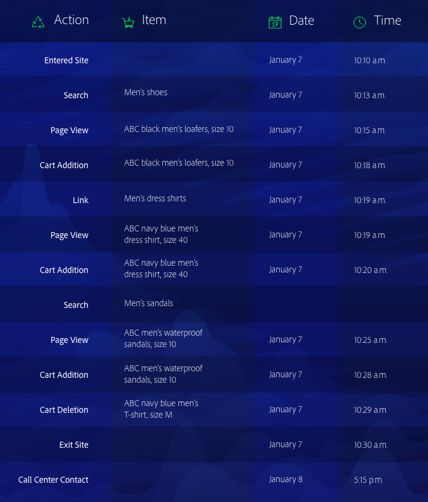

# Data Science Workspaceの概要

Adobe Experience Platform [!DNL Data Science Workspace] は、機械学習と人工知能を使用して、データから洞察を引き出します。 Adobe Experience Platformに統合され [!DNL Data Science Workspace] 、アドビのソリューション全体でコンテンツやデータアセットを使用して予測を行うのに役立ちます。

すべてのスキルレベルのデータ科学者は、機械学習レシピの迅速な開発、トレーニング、調整をサポートする、高度で使いやすいツールを見つけ出します。AIテクノロジーのすべてのメリットを、複雑さを伴わずに実現できます。

データ科学者 [!DNL Data Science Workspace]は、機械学習を利用したインテリジェントなサービスAPIを簡単に作成できます。 これらのサービスは、Adobe TargetやAdobeAnalyticsクラウドなど、他のアドビサービスと連携して、Web、デスクトップおよびモバイルアプリで、ターゲットを絞り込んでパーソナライズしたデジタルエクスペリエンスを自動化します。

このガイドでは、に関連する主要概念の概要を説明し [!DNL Data Science Workspace]ます。

## はじめに

今日の企業は、ビッグデータを分析し、予測や洞察を行うことを優先しています。これにより、顧客体験をパーソナライズし、顧客やビジネスに対してより多くの価値を提供することができます。
重要な点は、データからインサイトに至るまでのコストが高くなることです。 通常、インテリジェントなサービスを実現する機械学習モデル（レシピ）を開発するために、集中的で時間のかかるデータ調査を行う熟練のデータ科学者が必要です。 プロセスは長く、テクノロジーは複雑で、熟練したデータ科学者は見つけにくい場合があります。

Adobe Experience Platform [!DNL Data Science Workspace]により、企業全体で経験に重点を置いたAIを提供し、次の機能を使用してデータからの洞察を合理化し、迅速化できます。
- 機械学習フレームワークとランタイム
- Adobe Experience Platformに保存されたデータへの統合アクセス
- XDM(統合データスキーマ) [!DNL Experience Data Model] を基盤とした統合データ管理
- 機械学習/AIと大規模なデータセットの管理に不可欠なコンピューティング能力
- AIに基づくエクスペリエンスへの飛躍を加速する、事前に設計された機械学習レシピ
- さまざまなスキル・レベルのデータ・サイエンスティスト向けに、レシピの作成、再利用、変更を合理化
- 数回のクリックでインテリジェントなサービス公開と共有（開発者を除く）、およびパーソナライズされた顧客体験の継続的な最適化の監視と再トレーニング

すべてのスキルレベルのデータ科学者は、インサイトをより迅速かつ効果的に、より早く得ることができます。

## はじめに

の詳細を確認する前に、主な用語の簡単な要約を [!DNL Data Science Workspace]以下に示します。

| 用語 | 定義 |
|---------------------|------------------------------------------------------------------------------------------------------------------------------------------------------------------------------------------------------------------------------------------------------------------------------------------------------------------------------------------------------------------------------------------------------------------------------------------------------------------|
| [!DNL Data Science Workspace] | [!DNL Data Science Workspace] を使用す [!DNL Experience Platform][!DNL Experience Platform] ると、お客様は、様々なアドビソリューションのデータを利用して機械学習モデルを作成でき、インテリジェントなインサイトと予測を生み出し、優れたエンドユーザーのデジタルエクスペリエンスを組み立てることができます。 |
| 人工知能 | 人工知能とは、視覚、音声認識、意思決定、言語間の翻訳など、通常は人間の知性を必要とするタスクを実行できるコンピュータシステムの理論と開発です。 |
| 機械学習 | 機械学習とは、コンピューターが明示的にプログラミングされることなく学習できるようにする研究の分野です。 |
| [!DNL Sensei] MLフレームワーク | [!DNL Sensei] ML Frameworkは、データを活用して、機械学習に基づくインテリジェンスサービスを迅速、拡張性、再利用可能な方法で開発する際に、データ科学者 [!DNL Experience Platform] を強化する、アドビの統合された機械学習フレームワークです。 |
| [!DNL Experience Data Model] | [!DNL Experience Data Model] (XDM)は、Customer Experience Managementの標準スキーマ( [!DNL Profile] およびなど)を定義するためにアドビが主導する標準化作業 [!DNL ExperienceEvent]です。 |
| [!DNL JupyterLab] | [!DNL JupyterLab] は、Project Jupyter向けのオープンソースのwebベースのインターフェースで、と緊密に統合されてい [!DNL Experience Platform]ます。 |
| レシピ | レシピは、アドビのモデル仕様を表す用語で、トレーニングを受けたモデルを作成して実行し、特定のビジネス上の問題の解決に役立つ、特定の機械学習、AIアルゴリズム、アルゴリズムのアンサンブル、処理ロジック、設定を表す最上位コンテナです。 |
| モデル | モデルは、機械学習手法のインスタンスで、過去のデータと構成を使用してトレーニングを受け、ビジネスの使用事例に対して解決します。 |
| トレーニング | トレーニングは、ラベル付きのデータからパターンや洞察を学ぶプロセスです。 |
| トレーニングモデル | トレーニングされたモデルは、モデルのトレーニングプロセスの実行可能な出力を表し、この中で、一連のトレーニングデータがモデルインスタンスに適用されました。 トレーニングを受けたモデルは、そこから作成されたインテリジェントWebサービスへの参照を維持します。 トレーニングを受けたモデルは、インテリジェントなWebサービスのスコアリングと作成に適しています。 トレーニングを受けたモデルに対する変更は、新しいバージョンとして追跡できます。 |
| スコア | スコアリングは、トレーニングを受けたモデルを使用して、データからインサイトを生成するプロセスです。 |
| サービス | デプロイされたサービスは、APIを介して人工知能、機械学習モデル、または高度なアルゴリズムの機能を公開するので、他のサービスやアプリケーションで利用してインテリジェントアプリを作成できます。 |

次の表に、レシピ、モデル、トレーニング実行、スコアリング実行の間の階層関係の概要を示します。

## Understanding [!DNL Data Science Workspace]

データサイエンティスト [!DNL Data Science Workspace]は、大規模なデータセットに対してインサイトを明らかにする煩雑なプロセスを合理化できます。 共通の機械学習フレームワークとランタイムに基づいて構築され、高度なワークフロー管理、モデル管理、拡張性を [!DNL Data Science Workspace] 提供します。 インテリジェントサービスは、機械学習レシピの再利用をサポートし、アドビの製品やソリューションを使用して作成された様々なアプリケーションに電力を供給します。

### ワンストップのデータアクセス

データは、AIと機械学習の基礎となります。

[!DNL Data Science Workspace] は、Data Lake、およびを含むAdobe Experience Platformと完全に統合さ [!DNL Real-time Customer Profile]れてい [!DNL Unified Edge]ます。 一度にAdobe Experience Platformに保存されたすべての組織データを、一般的なビッグデータや、 [!DNL Spark] MLやディープラーニングライブラリなどのディープラーニングライブラリと共に調べ [!DNL TensorFlow]ます。 必要なものが見つからない場合は、XDM標準化スキーマを使用して独自のデータセットを取り込みます。

### 事前に作成された機械学習レシピ

[!DNL Data Science Workspace] 小売売上高の予測や異常値の検出など、一般的なビジネスニーズに対応した事前に作成された機械学習レシピが含まれているので、データ科学者や開発者は一から開始する必要がありません。 現在、 [商品購入予測](./pre-built-recipes/product-purchase-prediction.md)、 [商品レコメンデーション](./pre-built-recipes/product-recommendations.md)、 小売売上の3つのレシピが提供されています。

[//]: # (The built-in recipe gallery offers recommendations for prebuilt recipes based on your business needs.)

必要に応じて、事前に作成されたレシピをニーズに合わせたり、レシピを読み込んだり、開始を一から読み込んでカスタムレシピを作成することもできます。 しかし、レシピのトレーニングと調整を行った後は、カスタムのインテリジェントサービスを作成する場合、開発者は必要ありません。わずか数回クリックするだけで、ターゲットを絞ったパーソナライズされたデジタルエクスペリエンスを構築できます。

### データサイエンティストに焦点を当てたワークフロー

データ科学の専門知識レベルに関係なく、データ内のインサイトを見つけ、それらをデジタルエクスペリエンスに適用するプロセスをシンプル化し、 [!DNL Data Science Workspace] 高速化できます。

### データ調査

適切なデータを見つけて準備することは、効果的なレシピを作成する上で最も労力を要する部分です。 [!DNL Data Science Workspace] およびAdobe Experience Platformは、データからインサイトに素早くアクセスできるようにします。

Adobe Experience Platform上、チャネル間のデータはXDM標準化スキーマに一元化され、保存されるので、データの検索、理解、クリーン性が向上します。 共通のスキーマに基づくデータを1つのストアに保存することで、データの調査と準備に要する時間を数え切れないほど短縮できます。

統合されたホストのR、 [!DNL Python]またはScalaを使用して、上のデータのカタログ [!DNL Jupyter Notebook] を参照し [!DNL Platform]ます。 これらの言語の1つを使用して、 [!DNL Spark] MLとTensorFlowの利点も活用できます。 一から開始するか、特定のビジネス上の問題に対応したノートブックのテンプレートの1つを使用します。

データ調査ワークフローの一環として、新しいデータを取り込んだり、既存の機能を使用してデータの準備を行ったりすることもできます。

### オーサリング

で [!DNL Data Science Workspace]は、レシピの作成方法を決定します。

- ビジネスニーズに対応する事前設計されたレシピを参照し、特定の要件に合わせてそのまま使用したり、設定したりできるので、時間を節約できます。
- レシピを一から作成し、ジュピター・ノートブックのオーサリング・ランタイムを使用してレシピを作成し、登録します。
- Adobe Experience Platform外で作成したレシピをリポジトリにアップロードし [!DNL Data Science Workspace] たり、との間で使用可能な認証と統合を使用して、レシピコードをリポジトリ [!DNL Git]にインポート [!DNL Git] し [!DNL Data Science Workspace]たりします。

### 実験

Data Science Workspaceは、実験プロセスに大幅な柔軟性をもたらします。 レシピとの開始。 次に、同じコアアルゴリズムと、ハイパーチューニングパラメーターなどの独自の特性を組み合わせて使用し、別のインスタンスを作成します。 各インスタンスに必要な数のインスタンスを作成し、トレーニングやスコアを何回でも作成できます。 トレーニングを行う際、レシピ、レシピインスタンス、トレーニングを受けたインスタンス、および評価指標を追跡するので、必要ありません。 [!DNL Data Science Workspace]

### 運用化

レシピに満足したら、インテリジェントなサービスを作成するのは数回のクリックだけです。 コーディングは不要。開発者やエンジニアを登録することなく、自分で行うことができます。 最後に、インテリジェントサービスをAdobe IOに公開し、デジタルエクスペリエンスチームが利用できるようにします。

<!--You can also publish your intelligent service to the Service Gallery, where it's available to specific people, specific organizations, or everyone who develops data solutions on Adobe Experience Platform. You can even share it with your external partners, and they can share their intelligent service with you. And the next time you're starting a new recipe, you can check the Service Gallery to see if there's a similar intelligent service you can use to get started. -->

### 継続的な改善

[!DNL Data Science Workspace] インテリジェントサービスが呼び出される場所と、その実行方法を追跡します。 データがロールインするに従って、インテリジェントなサービスの正確性を評価し、ループを閉じ、必要に応じてレシピを再トレーニングしてパフォーマンスを向上させることができます。 その結果、顧客のパーソナライゼーションの精度を継続的に細分化することができます。

### 新機能とデータセットへのアクセス

データ科学者は、アドビのサービスを通じて新しいテクノロジーとデータセットを利用できるようになれば、すぐに利用できます。 頻繁な更新を通じて、データセットとテクノロジーをプラットフォームに統合する作業を行うので、お客様は必要ありません。

### アクセス制御 [!DNL Data Science Workspace]

Access control for [!DNL Experience Platform] is administered through the [Adobe Admin Console](https://adminconsole.adobe.com). この機能は、Admin Consoleの製品プロファイルを利用して、ユーザーを権限およびサンドボックスにリンクします。 See the [access control overview](../access-control/home.md) for more information.

>[!IMPORTANT]
>
>を使用するに [!DNL Data Science Workspace]は、「データサイエンスワークスペース [!UICONTROL を管理] 」権限を有効にする必要があります。

次の表に、この権限を有効または無効にした場合の影響を示します。

| 権限 | 有効 | 無効 |
|---|---|---|
| [!DNL Manage Data Science Workspace] | のすべてのサービスへのアクセスを提供し [!DNL Data Science Workspace]ます。 | 内のすべてのサービスへのAPIとUIのアクセス [!DNL Data Science Workspace] は無効になります。 無効にすると、 [!DNL Data Science Workspace] モデル *[!UICONTROL と]* サービス ** ページのルーティングは防げます。 |

### 安心と安全

データの保護は、アドビにとって最も優先される作業です。 アドビは、業界で受け入れられた標準、規制、および認定に準拠するために開発されたセキュリティプロセスとコントロールによって、お客様のデータを保護します。

セキュリティは、アドビのセキュア製品のライフサイクルの一部として、ソフトウェアとサービスに組み込まれています。
アドビのデータおよびソフトウェアのセキュリティ、コンプライアンス、その他の詳細については、セキュリティのページ(https://www.adobe.com/security.html)を参照してください。

### Sandboxのサポート

サンドボックスは、の1つのインスタンス内の仮想パーティション [!DNL Experience Platform]です。 各 [!DNL Platform] インスタンスは1つの実稼働用サンドボックスと複数の非実稼働用サンドボックスをサポートし、それぞれが独自の [!DNL Platform] リソースライブラリを維持します。 実稼動用以外のサンドボックスを使用すると、実稼働用サンドボックスに影響を与えることなく、機能のテスト、実験の実行、カスタム設定を行うことができます。 サンドボックスについて詳しくは、 [サンドボックスの概要を参照してください](../sandboxes/home.md)。

現在、サンドボックス [!DNL Data Science Workspace] にはいくつかの制限があります。

- コンピューティングリソースは、実稼働用サンドボックスと実稼働用以外のサンドボックスで共有されます。 本番用サンドボックスの分離は、将来提供されるように設定されます。
- ノートブックとレシピの両方のScala/[!DNL Spark] およびPySparkワークロードは、現在、実稼働用のSandboxでのみサポートされています。 非実稼働用サンドボックスのサポートは、将来的に提供されるように設定されます。

## [!DNL Data Science Workspace] 実行中

予測とインサイトは、Webサイトの訪問者、コールセンターへの連絡、その他のデジタルエクスペリエンスに関与する各顧客に、パーソナライズ度の高いエクスペリエンスを提供するために必要な情報を提供します。 日常の仕事は次のようにして起こり [!DNL Data Science Workspace]ます

### 問題の定義

ビジネス上の問題を抱えるすべての開始です。 例えば、オンラインコールセンターで顧客の否定的なセンチメントを肯定的に見せるには、コンテキストが必要です。

お客様に関するデータはたくさんあります。 サイトを閲覧し、買い物かごに商品を入れ、さらに注文を入れた。 以前に電子メールを受信したか、クーポンを使用したか、コールセンターに連絡した可能性があります。 次に、顧客とそのアクティビティに関するデータを使用して購入傾向を判断し、顧客が高く評価し、利用する可能性が高いオファーを推奨する必要があります。

コールセンターの連絡時に、顧客は買い物かごに2組の靴を入れていますが、シャツは取り除いています。 この情報により、インテリジェントサービスは、コールセンターエージェントに対して、コール中の靴の20%オフのクーポンをオファーすることを推奨する場合があります。 顧客がクーポンを使用する場合は、その情報がデータセットに追加され、次に訪問者が電話をかけたときの予測がさらに改善されます。

### データの表示と準備

定義したビジネス上の問題に基づいて、レシピはサイト訪問数、検索数、ページ表示数、クリックされたリンク数、買い物かごのアクション、受信オファー数、受信電子メール数、コールセンターでのインタラクション数など、顧客のWebトランザクションをすべて調べる必要があります。

通常、データサイエンティストは、データを調査および変換するレシピの作成に要する時間の最大75%を費やします。 データは多くの場合、複数のリポジトリから収集され、異なるスキーマに保存されます。レシピの作成に使用する前に、組み合わせてマッピングする必要があります。

[//]: # (Your first step is to check the recipe gallery to see if an existing recipe meets your needs, or comes close. An alternative is to import a recipe you created outside of Adobe Experience Platform. Starting with an existing recipe often streamlines the data exploration phase and makes it easier for a data scientist.)

ゼロから始める場合や、既存のレシピを設定する場合は、組織の一元化された標準化されたデータカタログからデータ検索を開始します。これにより、大量の検索が簡単になります。 また、社内の別のデータサイエンティストが類似したデータセットを既に特定しており、一から開始するのではなく、そのデータセットを微調整することもできます。
Adobe Experience Platform内のすべてのデータは標準化されたXDMスキーマに準拠しているため、データを結合する複雑なモデルを作成したり、データエンジニアからヘルプを得たりする必要がありません。

必要なデータがすぐに見つからないが、Adobe Experience Platform外に存在する場合は、追加のデータセットを取り込むのは比較的単純なタスクで、これも標準化されたXDMスキーマに変換されます。\
データの前処理 [!DNL Jupyter Notebook] をシンプルにするために、を使用できます。ノートブックテンプレートや、以前に購入傾向に使用したノートブックから始める場合があります。

### レシピの作成

すべてのニーズを満たすレシピが既に見つかっている場合は、次に実験に移ります。 または、の [!DNL Data Science Workspace] オーサリングランタイムを利用して、レシピを少し変更したり、新規に作成したりでき [!DNL Jupyter Notebook]ます。 オーサリングランタイムを使用すると、トレーニングとスコアリングワークフローの両方を使用して、後でレシピを変換し、組織内の他のユーザーが保存して再利用できるようにすることができます。 [!DNL Data Science Workspace]

また、にレシピを読み込んで、インテリジェントサービスを作成する際に実験ワークフロー [!DNL Data Science Workspace] を活用することもできます。

### レシピを試す

コア機械学習アルゴリズムを組み込んだレシピを使用すると、1つのレシピで多数のレシピインスタンスを作成できます。 これらのレシピインスタンスは、モデルと呼ばれます。 モデルの動作効率と有効性を最適化するために、トレーニングと評価が必要です。これは、通常、試用とエラーから成るプロセスです。

モデルをトレーニングすると、トレーニングの実行と評価が生成されます。 [!DNL Data Science Workspace] は、個別のモデルとそのトレーニングの実行に関する評価指標を追跡します。 実験を通じて生成された評価指標を使用して、最もパフォーマンスの高いトレーニングの実施状況を判断できます。

でのモデルのトレーニングと評価の方法に関するチュートリアルについては、 [このセクション](https://www.adobe.io/apis/experienceplatform/home/tutorials/data-science-workspace/dsw-tutorials/trainmodel.html) を参照してく [!DNL Data Science Workspace]ださい。

### モデルの操作

ビジネスニーズに対応するために最適なトレーニングを受けたレシピを選択した場合は、開発者の支援を受け [!DNL Data Science Workspace] ずに、でインテリジェントサービスを作成できます。 数回のクリックでコーディングは不要です。 発行済みのインテリジェントサービスは、モデルを再作成する必要なく、組織の他のメンバーがアクセスできます。

公開されたインテリジェントサービスは設定可能で、新しいデータが利用可能になった時点で自動的にトレーニングを行います。 これにより、お客様のサービスは時間の経過とともに効率と有効性を維持できます。

## 次の手順

[!DNL Data Science Workspace] データ収集からアルゴリズム、インテリジェントサービスまで、あらゆるスキルレベルのデータ科学者向けに、データ科学ワークフローを合理化し、シンプル化します。 高度なツール [!DNL Data Science Workspace] を使用すると、データからインサイトまでの時間を大幅に短縮できます。

さらに重要なの [!DNL Data Science Workspace] は、アドビの主要マーケティングプラットフォームのデータ科学とアルゴリズムによる最適化機能を、企業のデータ科学者の手に委ねることです。 企業は初めて独自のアルゴリズムをプラットフォームに導入でき、アドビの強力な機械学習機能とAI機能を利用して、パーソナライズの高い顧客体験を大規模に提供できます。

ブランドの専門知識とアドビの機械学習機能、AIプロセスが結び付いているため、企業は顧客が求める前に、顧客に何を求めるかを伝えることで、より多くのビジネス価値とブランド忠誠度を高める力を持っています。

日々のワークフロー全体などの詳細については、まず [Data Science Workspaceのウォークスルードキュメントを読んでください](./walkthrough.md) 。

## その他のリソース

次のビデオは、の理解を深めるためのもので [!DNL Data Science Workspace]す。

>[!VIDEO](https://video.tv.adobe.com/v/30567?quality=12&amp;enable10seconds=on&amp;speedcontrol=on)

