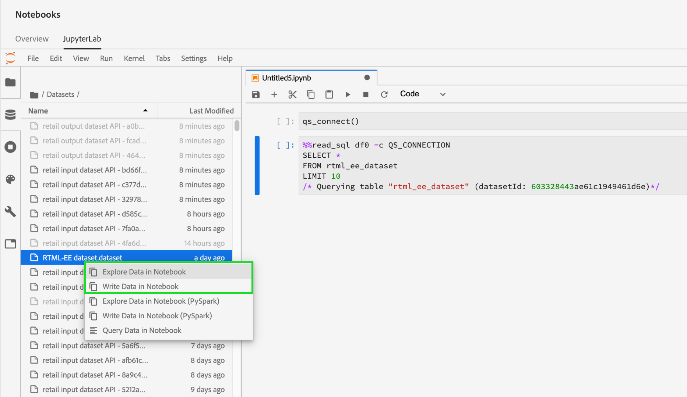
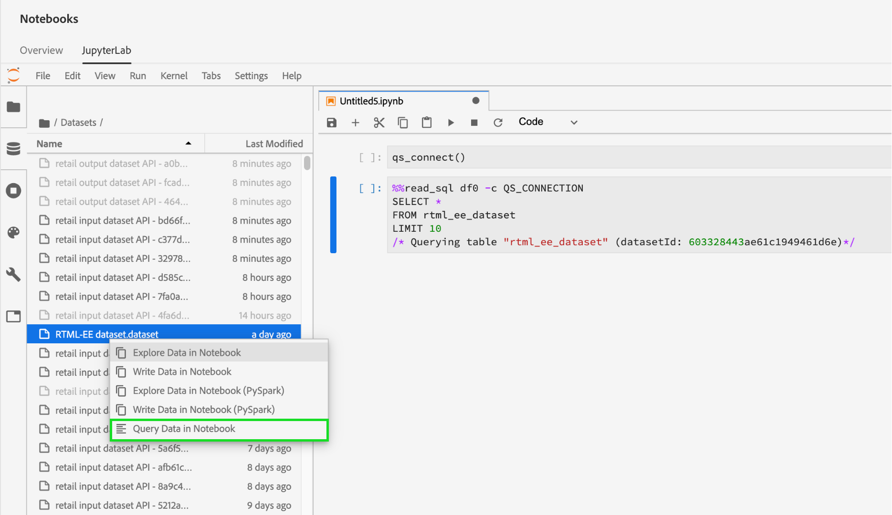
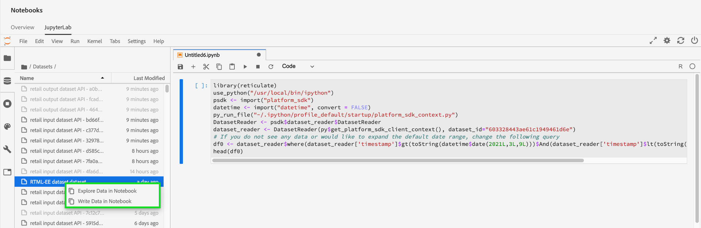
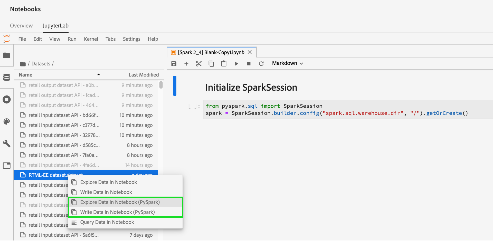
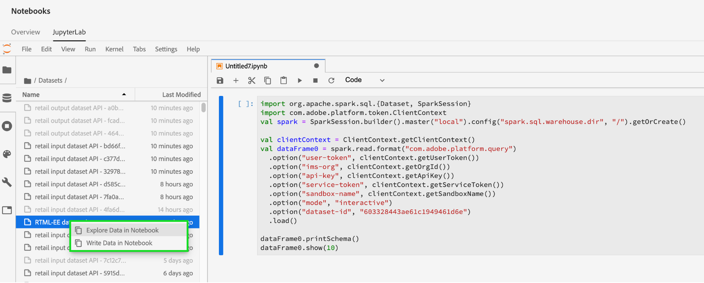

# [!DNL Jupyterlab] ノートブックのデータ アクセス

>[!NOTE]
>
>Data Science Workspaceは購入できなくなりました。
>
>このドキュメントは、Data Science Workspaceの使用権限を以前に持つ既存のお客様向けです。

サポートされている各カーネルには、ノートブック内のデータセットからExperience Platform データを読み取ることができる組み込み機能が用意されています。 現在、Adobe Experience Platform Data Science WorkspaceのJupyterLabは、[!DNL Python]、R、PySpark、Scalaのノートブックをサポートしています。 ただし、ページ分割データのサポートは[!DNL Python]とR ノートブックに限定されています。 このガイドでは、JupyterLab ノートブックを使用してデータにアクセスする方法について説明します。

## はじめに

このガイドを読む前に、[[!DNL JupyterLab]  ユーザーガイド &#x200B;](./overview.md)を確認して、[!DNL JupyterLab]の概要とData Science Workspace内での役割を確認してください。

## ノートブックのデータ制限 {#notebook-data-limits}

>[!IMPORTANT]
>
>PySparkおよびScala ノートブックで、「リモート RPC クライアントの関連付けが解除されました」という理由でエラーが発生した場合。 これは通常、ドライバーまたはエグゼクティブがメモリ不足であることを意味します。 このエラーを解決するには、[&#x200B; 「バッチ」モード &#x200B;](#mode)に切り替えてみてください。

次の情報は、読み取り可能なデータの最大量、使用されたデータの種類、データを読み取る推定期間を定義します。

[!DNL Python]およびRの場合、ベンチマークには40 GB RAMで構成されたノートブックサーバーが使用されました。 PySparkおよびScalaでは、以下に概説するベンチマークに、64GB RAM、8 コア、最大4 ワーカーを含む2 DBUで構成されたdatabricks クラスターを使用しました。

使用されるExperienceEvent スキーマデータのサイズは、100 （1K）行から10億（1B）行まで様々です。 PySparkおよび[!DNL Spark]指標の場合、XDM データには10日間の日付範囲が使用されていることに注意してください。

アドホックスキーマデータは、[!DNL Query Service] テーブルを選択として作成（CTAS）を使用して事前処理されました。 このデータは、10億行（1B）までの1000行（1K）から始まるサイズも変化しました。

### バッチモードとインタラクティブモードの使用例 {#mode}

PySparkおよびScala ノートブックでデータセットを読み取る場合は、インタラクティブモードまたはバッチモードを使用してデータセットを読み取ることができます。 インタラクティブ機能は、高速な結果を得るために利用できます。一方、バッチモードは、大規模なデータセットに対して利用します。

- PySparkおよびScala ノートブックの場合、500万行を超えるデータが読み取られている場合は、バッチモードを使用する必要があります。 各モードの効率について詳しくは、以下の[PySpark](#pyspark-data-limits)または[Scala](#scala-data-limits) データ制限テーブルを参照してください。

### [!DNL Python]個のノートブック データ制限

**XDM ExperienceEvent スキーマ：** XDM データの最大200万行（ディスク上の約6.1 GB データ）を22分以内に読み取ることができます。 行を追加すると、エラーが発生する場合があります。

| 行数 | 1K | 10K | 100,000 | 1M | 2M |
| ----------------------- | ------ | ------ | ----- | ----- | ----- |
| ディスクのサイズ （MB） | 18.73 | 187.5 | 308 | 3000 | 6050 |
| SDK （秒単位） | 20.3 | 86.8 | 63 | 659 | 1315 |

**アドホックスキーマ：**&#x200B;非XDM （アドホック）データの最大500万行（ディスク上で約5.6 GB データ）を14分以内に読み取ることができるようにする必要があります。 行を追加すると、エラーが発生する場合があります。

| 行数 | 1K | 10K | 100,000 | 1M | 2M | 3M | 5M |
| ----------------------- | ------- | ------- | ----- | ----- | ----- | ----- | ------ |
| ディスク上のサイズ （MB単位） | 1.21 | 11.72 | 115 | 1120 | 2250 | 3380 | 5630 |
| SDK （秒単位） | 7.27 | 9.04 | 27.3 | 180 | 346 | 487 | 819 |

### R ノートブックのデータ制限

**XDM ExperienceEvent スキーマ：**&#x200B;最大100万行のXDM データ（ディスク上の3GB データ）を13分以内に読み取ることができます。

| 行数 | 1K | 10K | 100,000 | 1M |
| ----------------------- | ------ | ------ | ----- | ----- |
| ディスクのサイズ （MB） | 18.73 | 187.5 | 308 | 3000 |
| R Kernel （秒単位） | 14.03 | 69.6 | 86.8 | 775 |

**アドホックスキーマ：**&#x200B;最大300万行のアドホックデータ（ディスク上の293MB データ）を約10分で読み取ることができます。

| 行数 | 1K | 10K | 100,000 | 1M | 2M | 3M |
| ----------------------- | ------- | ------- | ----- | ----- | ----- | ----- |
| ディスク上のサイズ （MB単位） | 0.082 | 0.612 | 9.0 | 91 | 188 | 293 |
| R SDK （秒単位） | 7.7 | 4.58 | 35.9 | 233 | 470.5 | 603 |

### PySpark （[!DNL Python] カーネル） ノートブックのデータ制限： {#pyspark-data-limits}

**XDM ExperienceEvent スキーマ：** インタラクティブ モードでは、XDM データの最大500万行（ディスク上の約13.42 GB データ）を約20分で読み取ることができます。 インタラクティブモードは、最大500万行までしかサポートしません。 より大きなデータセットを読み取りたい場合は、バッチモードに切り替えることをお勧めします。 バッチモードでは、約14時間で最大5億行（ディスク上の最大1.31 TBのデータ）のXDM データを読み取ることができます。

| 行数 | 1K | 10K | 100,000 | 1M | 2M | 3M | 5M | 10M | 50M | 100M | 500M |
|-------------------------|--------|--------|-------|-------|-------|-------|---------|---------|----------|--------|--------|
| ディスク上のサイズ | 2.93MB | 4.38MB | 29.02 | 2.69GB | 5.39GB | 8.09GB | 13.42GB | 26.82GB | 134.24GB | 268.39GB | 1.31 TB |
| SDK （インタラクティブモード） | 33秒 | 32.4秒 | 55.1秒 | 253.5秒 | 489.2秒 | 729.6秒 | 1206.8秒 | - | - | - | - |
| SDK（バッチモード） | 815.8秒 | 492.8秒 | 379.1秒 | 637.4秒 | 624.5秒 | 869.2秒 | 1104.1秒 | 1786年代 | 5387.2秒 | 10624.6s | 50547s |

**アドホックスキーマ：** インタラクティブモードでは、非XDM データの最大500万行（ディスク上の約5.36 GB データ）を3分未満で読み取ることができます。 バッチモードでは、非XDM データの最大10億行（ディスク上の最大1.05 TB データ）を約18分で読み取ることができます。

| 行数 | 1K | 10K | 100,000 | 1M | 2M | 3M | 5M | 10M | 50M | 100M | 500M | 1B |
|--------------|--------|---------|---------|-------|-------|-------|--------|--------|---------|--------|---------|-------|
| ディスク上のサイズ | 1.12MB | 11.24MB | 109.48MB | 2.69GB | 2.14GB | 3.21GB | 5.36GB | 10.71GB | 53.58GB | 107.52GB | 535.88GB | 1.05 TB |
| SDK インタラクティブモード（秒単位） | 28.2秒 | 18.6秒 | 20.8秒 | 20.9秒 | 23.8秒 | 21.7秒 | 24.7秒 | - | - | - | - | - |
| SDK バッチモード（秒単位） | 428.8秒 | 578.8秒 | 641.4秒 | 538.5秒 | 630.9秒 | 467.3秒 | 411秒 | 675秒 | 702秒 | 719.2秒 | 1022.1秒 | 1122.3秒 |

### [!DNL Spark] （Scala カーネル） ノートブックのデータ制限： {#scala-data-limits}

**XDM ExperienceEvent スキーマ：** インタラクティブ モードでは、XDM データの最大500万行（ディスク上の約13.42 GB データ）を約18分で読み取ることができます。 インタラクティブモードは、最大500万行までしかサポートしません。 より大きなデータセットを読み取りたい場合は、バッチモードに切り替えることをお勧めします。 バッチモードでは、約14時間で最大5億行（ディスク上の最大1.31 TBのデータ）のXDM データを読み取ることができます。

| 行数 | 1K | 10K | 100,000 | 1M | 2M | 3M | 5M | 10M | 50M | 100M | 500M |
|---------------|--------|--------|-------|-------|-------|-------|---------|---------|----------|--------|--------|
| ディスク上のサイズ | 2.93MB | 4.38MB | 29.02 | 2.69GB | 5.39GB | 8.09GB | 13.42GB | 26.82GB | 134.24GB | 268.39GB | 1.31 TB |
| SDK インタラクティブモード（秒単位） | 37.9秒 | 22.7秒 | 45.6秒 | 231.7秒 | 444.7秒 | 660.6秒 | 1100年代 | - | - | - | - |
| SDK バッチモード（秒単位） | 374.4秒 | 398.5秒 | 527秒 | 487.9秒 | 588.9秒 | 829年代 | 939.1秒 | 1441年代 | 5473.2秒 | 10118.8 | 49207.6 |

**アドホックスキーマ：** インタラクティブモードでは、非XDM データの最大500万行（ディスク上の約5.36 GB データ）を3分未満で読み取ることができます。 バッチモードでは、非XDM データの最大10億行（ディスク上の最大1.05 TB データ）を約16分で読み取ることができます。

| 行数 | 1K | 10K | 100,000 | 1M | 2M | 3M | 5M | 10M | 50M | 100M | 500M | 1B |
|--------------|--------|---------|---------|-------|-------|-------|---------|---------|---------|--------|---------|-------|
| ディスク上のサイズ | 1.12MB | 11.24MB | 109.48MB | 2.69GB | 2.14GB | 3.21GB | 5.36GB | 10.71GB | 53.58GB | 107.52GB | 535.88GB | 1.05 TB |
| SDK インタラクティブモード（秒単位） | 35.7秒 | 31秒 | 19.5秒 | 25.3秒 | 23秒 | 33.2秒 | 25.5秒 | - | - | - | - | - |
| SDK バッチモード（秒単位） | 448.8秒 | 459.7秒 | 519秒 | 475.8秒 | 599.9秒 | 347.6秒 | 407.8秒 | 397秒 | 518.8秒 | 487.9秒 | 760.2秒 | 975.4秒 |

## Python ノートブック {#python-notebook}

[!DNL Python] ノートブックを使用すると、データセットにアクセスする際にデータをページネーションできます。 ページネーションの有無にかかわらずデータを読み取るサンプルコードを以下に示します。 利用可能なスターターPython ノートブックについて詳しくは、JupyterLab ユーザーガイド内の[[!DNL JupyterLab] Launcher](./overview.md#launcher) セクションを参照してください。

以下のPython ドキュメントでは、次の概念の概要を説明しています。

- [データセットから読み取り](#python-read-dataset)
- [データセットへの書き込み](#write-python)
- [クエリデータ](#query-data-python)
- [ExperienceEvent データのフィルタリング](#python-filter)

### Pythonでのデータセットからの読み取り {#python-read-dataset}

**ページなし：**

次のコードを実行すると、データセット全体が読み取られます。実行が成功した場合、データは `df` 変数で参照される Pandas データフレームとして保存されます。

```python
# Python

from platform_sdk.dataset_reader import DatasetReader
dataset_reader = DatasetReader(get_platform_sdk_client_context(), dataset_id="{DATASET_ID}")
df = dataset_reader.read()
df.head()
```

**ページネーション：**

次のコードを実行すると、指定したデータセットからデータが読み取られます。ページ番号付けは、`limit()` 関数を使用してデータを制限し、`offset()` 関数を使用してデータをオフセットすることで実現します。データの制限とは、読み取るデータポイントの最大数を指し、オフセットとは、データの読み取り前にスキップするデータポイントの数を指します。読み取り操作が正常に実行された場合、データは `df` 変数が参照する Pandas データフレームとして保存されます。

```python
# Python

from platform_sdk.dataset_reader import DatasetReader

dataset_reader = DatasetReader(get_platform_sdk_client_context(), dataset_id="{DATASET_ID}")
df = dataset_reader.limit(100).offset(10).read()
```

### Pythonでのデータセットへの書き込み {#write-python}

JupyterLab ノートブックのデータセットに書き込むには、JupyterLabの左側のナビゲーションで「データアイコン」タブ（以下に強調表示）を選択します。 **[!UICONTROL Datasets]**&#x200B;および&#x200B;**[!UICONTROL Schemas]** ディレクトリが表示されます。 **[!UICONTROL Datasets]**&#x200B;を選択して右クリックし、使用するデータセットのドロップダウンメニューから&#x200B;**[!UICONTROL Write Data in Notebook]** オプションを選択します。 ノートブックの下部に実行コードエントリが表示されます。



- **[!UICONTROL Write Data in Notebook]**&#x200B;を使用して、選択したデータセットで書き込みセルを生成します。
- **[!UICONTROL Explore Data in Notebook]**&#x200B;を使用して、選択したデータセットで読み取りセルを生成します。
- **[!UICONTROL Query Data in Notebook]**&#x200B;を使用して、選択したデータセットで基本的なクエリ セルを生成します。

または、次のコードセルをコピーして貼り付けることができます。 `{DATASET_ID}`と`{PANDA_DATAFRAME}`の両方を置き換えます。

```python
from platform_sdk.models import Dataset
from platform_sdk.dataset_writer import DatasetWriter

dataset = Dataset(get_platform_sdk_client_context()).get_by_id(dataset_id="{DATASET_ID}")
dataset_writer = DatasetWriter(get_platform_sdk_client_context(), dataset)
write_tracker = dataset_writer.write({PANDA_DATAFRAME}, file_format='json')
```

### [!DNL Query Service]の[!DNL Python]を使用してデータをクエリします {#query-data-python}

[!DNL JupyterLab]の[!DNL Experience Platform]では、[!DNL Python] ノートブックのSQLを使用して、[Adobe Experience Platform Query Service](https://experienceleague.adobe.com/docs/experience-platform/query/home.html?lang=ja)経由でデータにアクセスできます。 [!DNL Query Service] を通じたデータへのアクセスは実行時間が短いので、大規模なデータセットの処理に役立ちます。[!DNL Query Service] を使用したデータのクエリには 10 分間の処理時間制限があることに注意してください。

[!DNL JupyterLab] で [!DNL Query Service] を使用する前に、[[!DNL Query Service] SQL 構文](https://experienceleague.adobe.com/docs/experience-platform/query/sql/syntax.html?lang=ja)について実践的に理解していることを確認してください。

[!DNL Query Service]を使用してデータをクエリするには、ターゲット データセットの名前を指定する必要があります。 **[!UICONTROL Data explorer]**&#x200B;を使用して目的のデータセットを見つけることで、必要なコードセルを生成できます。 データセットのリストを右クリックし、**[!UICONTROL Query Data in Notebook]**&#x200B;をクリックして、ノートブックに2つのコードセルを生成します。 これら2つのセルの概要を以下に示します。



[!DNL Query Service]で[!DNL JupyterLab]を利用するには、まず作業中の[!DNL Python] ノートブックと[!DNL Query Service]の間に接続を作成する必要があります。 これは、最初に生成されたセルを実行することで達成できます。

```python
qs_connect()
```

2 番目に生成されたセルでは、最初の行を SQL クエリの前に定義する必要があります。デフォルトでは、生成されたセルは、クエリ結果を Pandas データフレームとして保存するオプションの変数（`df0`）を定義します。<br>引数`-c QS_CONNECTION`は必須であり、カーネルに[!DNL Query Service]に対してSQL クエリを実行するように指示します。 その他の引数のリストは、[付録](#optional-sql-flags-for-query-service)を参照してください。

```python
%%read_sql df0 -c QS_CONNECTION
SELECT *
FROM name_of_the_dataset
LIMIT 10
/* Querying table "name_of_the_dataset" (datasetId: {DATASET_ID})*/
```

Python 変数は、次の例に示すように、文字列形式の構文を使用して中括弧（`{}`）で囲むことで、SQL クエリ内で直接参照できます。

```python
table_name = 'name_of_the_dataset'
table_columns = ','.join(['col_1','col_2','col_3'])
```

```python
%%read_sql demo -c QS_CONNECTION
SELECT {table_columns}
FROM {table_name}
```

### [!DNL ExperienceEvent] データをフィルタリング {#python-filter}

[!DNL ExperienceEvent] ノートブック内の[!DNL Python] データセットにアクセスしてフィルタリングするには、データセットのID （`{DATASET_ID}`）と、論理演算子を使用して特定の時間範囲を定義するフィルタールールを指定する必要があります。 時間範囲を定義すると、指定されたページ番号は無視され、データセット全体が考慮されます。

フィルタリング操作のリストを以下に示します。

- `eq()`：と等しい
- `gt()`：より大きい
- `ge()`：より大きいか等しい
- `lt()`：より小さい
- `le()`：より小さいか等しい
- `And()`：論理積演算子
- `Or()`：論理和演算子

次のセルは、2019年1月1日から2019年12月31日までの間にのみ存在するデータに[!DNL ExperienceEvent] データセットをフィルタリングします。

```python
# Python

from platform_sdk.dataset_reader import DatasetReader

dataset_reader = DatasetReader(get_platform_sdk_client_context(), dataset_id="{DATASET_ID}")
df = dataset_reader.\
    where(dataset_reader["timestamp"].gt("2019-01-01 00:00:00").\
    And(dataset_reader["timestamp"].lt("2019-12-31 23:59:59"))\
).read()
```

## R ノートブック {#r-notebooks}

R ノートブックを使用すると、データセットにアクセスする際にデータをページネーションできます。 ページネーションの有無にかかわらずデータを読み取るサンプルコードを以下に示します。 利用可能なスターターまたはノートブックについて詳しくは、JupyterLab ユーザーガイド内の[[!DNL JupyterLab] Launcher](./overview.md#launcher) セクションを参照してください。

以下のR ドキュメントでは、次の概念の概要を説明しています。

- [データセットから読み取り](#r-read-dataset)
- [データセットへの書き込み](#write-r)
- [ExperienceEvent データのフィルタリング](#r-filter)

### Rのデータセットから読み取る {#r-read-dataset}

**ページなし：**

次のコードを実行すると、データセット全体が読み取られます。実行が成功した場合、データは `df0` 変数で参照される Pandas データフレームとして保存されます。

```R
# R

library(reticulate)
use_python("/usr/local/bin/ipython")
psdk <- import("platform_sdk")
datetime <- import("datetime", convert = FALSE)
py_run_file("~/.ipython/profile_default/startup/platform_sdk_context.py")
DatasetReader <- psdk$dataset_reader$DatasetReader
dataset_reader <- DatasetReader(py$get_platform_sdk_client_context(), dataset_id="{DATASET_ID}")
df0 <- dataset_reader$read()
head(df0)
```

**ページネーション：**

次のコードを実行すると、指定したデータセットからデータが読み取られます。ページ番号付けは、`limit()` 関数を使用してデータを制限し、`offset()` 関数を使用してデータをオフセットすることで実現します。データの制限とは、読み取るデータポイントの最大数を指し、オフセットとは、データの読み取り前にスキップするデータポイントの数を指します。読み取り操作が正常に実行された場合、データは `df0` 変数が参照する Pandas データフレームとして保存されます。

```R
# R

library(reticulate)
use_python("/usr/local/bin/ipython")
psdk <- import("platform_sdk")
datetime <- import("datetime", convert = FALSE)
py_run_file("~/.ipython/profile_default/startup/platform_sdk_context.py")

DatasetReader <- psdk$dataset_reader$DatasetReader
dataset_reader <- DatasetReader(py$get_platform_sdk_client_context(), dataset_id="{DATASET_ID}") 
df0 <- dataset_reader$limit(100L)$offset(10L)$read()
```

### Rでのデータセットへの書き込み {#write-r}

JupyterLab ノートブックのデータセットに書き込むには、JupyterLabの左側のナビゲーションで「データアイコン」タブ（以下に強調表示）を選択します。 **[!UICONTROL Datasets]**&#x200B;および&#x200B;**[!UICONTROL Schemas]** ディレクトリが表示されます。 **[!UICONTROL Datasets]**&#x200B;を選択して右クリックし、使用するデータセットのドロップダウンメニューから&#x200B;**[!UICONTROL Write Data in Notebook]** オプションを選択します。 ノートブックの下部に実行コードエントリが表示されます。



- **[!UICONTROL Write Data in Notebook]**&#x200B;を使用して、選択したデータセットで書き込みセルを生成します。
- **[!UICONTROL Explore Data in Notebook]**&#x200B;を使用して、選択したデータセットで読み取りセルを生成します。

または、次のコードセルをコピーして貼り付けることができます。

```R
psdk <- import("platform_sdk")
dataset <- psdk$models$Dataset(py$get_platform_sdk_client_context())$get_by_id(dataset_id="{DATASET_ID}")
dataset_writer <- psdk$dataset_writer$DatasetWriter(py$get_platform_sdk_client_context(), dataset)
write_tracker <- dataset_writer$write(df, file_format='json')
```

### [!DNL ExperienceEvent] データをフィルタリング {#r-filter}

R ノートブック内の[!DNL ExperienceEvent] データセットにアクセスしてフィルタリングするには、データセットのID （`{DATASET_ID}`）と、論理演算子を使用して特定の時間範囲を定義するフィルタールールを指定する必要があります。 時間範囲を定義すると、指定されたページ番号は無視され、データセット全体が考慮されます。

フィルタリング操作のリストを以下に示します。

- `eq()`：と等しい
- `gt()`：より大きい
- `ge()`：より大きいか等しい
- `lt()`：より小さい
- `le()`：より小さいか等しい
- `And()`：論理積演算子
- `Or()`：論理和演算子

次のセルは、2019年1月1日から2019年12月31日までの間にのみ存在するデータに[!DNL ExperienceEvent] データセットをフィルタリングします。

```R
# R

library(reticulate)
use_python("/usr/local/bin/ipython")
psdk <- import("platform_sdk")
datetime <- import("datetime", convert = FALSE)
py_run_file("~/.ipython/profile_default/startup/platform_sdk_context.py")

client_context <- py$PLATFORM_SDK_CLIENT_CONTEXT
DatasetReader <- psdk$dataset_reader$DatasetReader
dataset_reader <- DatasetReader(py$get_platform_sdk_client_context(), dataset_id="{DATASET_ID}") 

df0 <- dataset_reader$
    where(dataset_reader["timestamp"]$gt("2019-01-01 00:00:00")$
    And(dataset_reader["timestamp"]$lt("2019-12-31 23:59:59"))
)$read()
```

## PySpark 3 ノートブック {#pyspark-notebook}

以下のPySpark ドキュメントでは、次の概念の概要を説明しています。

- [SparkSessionの初期化](#spark-initialize)
- [データの読み取りと書き込み](#magic)
- [ローカルデータフレームの作成](#pyspark-create-dataframe)
- [ExperienceEvent データのフィルタリング](#pyspark-filter-experienceevent)

### sparkSessionの初期化 {#spark-initialize}

すべての[!DNL Spark] 2.4 ノートブックでは、次のボイラープレートコードを使用してセッションを初期化する必要があります。

```scala
from pyspark.sql import SparkSession
spark = SparkSession.builder.getOrCreate()
```

### %datasetを使用してPySpark 3 ノートブックで読み書きを行う {#magic}

[!DNL Spark] 2.4の導入により、PySpark 3 （`%dataset` 2.4） ノートブックで使用するためのカスタムマジックが[!DNL Spark]個提供されます。 IPython カーネルで利用できるマジック コマンドについて詳しくは、[IPython マジック ドキュメント &#x200B;](https://ipython.readthedocs.io/en/stable/interactive/magics.html)を参照してください。


**用途**

```scala
%dataset {action} --datasetId {id} --dataFrame {df} --mode batch
```

**説明**

[!DNL Data Science Workspace] ノートブック （[!DNL PySpark] 3 カーネル）からデータセットを読み取るか書き込むためのカスタム [!DNL Python] マジックコマンド。

| 名前 | 説明 | 必須 |
| --- | --- | --- |
| `{action}` | データセットに対して実行するアクションのタイプ。 2つのアクションが「読み取り」または「書き込み」で利用できます。 | ○ |
| `--datasetId {id}` | 読み取りまたは書き込むデータセットのIDを指定するために使用します。 | ○ |
| `--dataFrame {df}` | pandas データフレームです。 <ul><li> アクションが「読み取り」の場合、{df}は、データセット読み取り操作の結果（データフレームなど）が使用可能な変数です。 </li><li> アクションが「書き込み」の場合、このデータフレーム {df}はデータセットに書き込まれます。 </li></ul> | ○ |
| `--mode` | データの読み取り方法を変更する追加パラメーター。 許可されるパラメーターは、「バッチ」および「インタラクティブ」です。 デフォルトでは、モードは「バッチ」に設定されています。<br>小さいデータセットでクエリのパフォーマンスを向上させるには、「インタラクティブ」モードを使用することをお勧めします。 | ○ |

>[!TIP]
>
>[&#x200B; ノートブックデータ制限](#notebook-data-limits) セクション内のPySpark テーブルを確認して、`mode`を`interactive`または`batch`に設定する必要があるかどうかを判断します。

**例**

- **例を読む**: `%dataset read --datasetId 5e68141134492718af974841 --dataFrame pd0 --mode batch`
- **例の書き込み**: `%dataset write --datasetId 5e68141134492718af974842 --dataFrame pd0 --mode batch`

>[!IMPORTANT]
>
> データを書き込む前に`df.cache()`を使用してデータをキャッシュすると、ノートブックのパフォーマンスが大幅に向上します。 これは、次のいずれかのエラーが発生した場合に役立ちます。
> 
> - ステージの失敗によりジョブが中止されました … 各パーティション内の要素数が同一の RDD のみを圧縮できます。
> - リモート RPC クライアントの関連付けが解除され、その他のメモリエラーが発生しました。
> - データセットの読み取り時や書き込み時のパフォーマンスが低下しています。
> 
> 詳しくは、[&#x200B; トラブルシューティング ガイド &#x200B;](../troubleshooting-guide.md)を参照してください。

JupyterLab購入では、次の方法を使用して上記の例を自動生成できます。

JupyterLabの左側のナビゲーションで「データ」アイコン タブ（以下で強調表示）を選択します。 **[!UICONTROL Datasets]**&#x200B;および&#x200B;**[!UICONTROL Schemas]** ディレクトリが表示されます。 **[!UICONTROL Datasets]**&#x200B;を選択して右クリックし、使用するデータセットのドロップダウンメニューから&#x200B;**[!UICONTROL Write Data in Notebook]** オプションを選択します。 ノートブックの下部に実行コードエントリが表示されます。

- 読み取りセルを生成するには、**[!UICONTROL Explore Data in Notebook]**&#x200B;を使用します。
- 書き込みセルを生成するには、**[!UICONTROL Write Data in Notebook]**&#x200B;を使用します。



### ローカルデータフレームの作成 {#pyspark-create-dataframe}

PySpark 3を使用してローカルデータフレームを作成するには、SQL クエリを使用します。 例：

```scala
date_aggregation.createOrReplaceTempView("temp_df")

df = spark.sql('''
  SELECT *
  FROM sparkdf
''')

local_df
```

```scala
df = spark.sql('''
  SELECT *
  FROM sparkdf
  LIMIT limit
''')
```

```scala
sample_df = df.sample(fraction)
```

>[!TIP]
>
>また、置換、二重分数、または長いシードを含むブール値などのオプションのシードサンプルを指定することもできます。

### [!DNL ExperienceEvent] データをフィルタリング {#pyspark-filter-experienceevent}

PySpark ノートブック内の[!DNL ExperienceEvent] データセットにアクセスしてフィルタリングするには、データセット ID （`{DATASET_ID}`）、組織のIMS ID、特定の時間範囲を定義するフィルタールールを指定する必要があります。 フィルタリング時間範囲は、関数`spark.sql()`を使用して定義されます。関数パラメーターはSQL クエリ文字列です。

次のセルは、2019年1月1日から2019年12月31日までの間にのみ存在するデータに[!DNL ExperienceEvent] データセットをフィルタリングします。

```python
# PySpark 3 (Spark 2.4)

from pyspark.sql import SparkSession
spark = SparkSession.builder.getOrCreate()

%dataset read --datasetId {DATASET_ID} --dataFrame df --mode batch

df.createOrReplaceTempView("event")
timepd = spark.sql("""
    SELECT *
    FROM event
    WHERE timestamp > CAST('2019-01-01 00:00:00.0' AS TIMESTAMP)
    AND timestamp < CAST('2019-12-31 23:59:59.9' AS TIMESTAMP)
""")
timepd.show()
```

## Scala ノートブック {#scala-notebook}

以下のドキュメントには、次の概念の例が含まれています。

- [SparkSessionの初期化](#scala-initialize)
- [データセットを読む](#read-scala-dataset)
- [データセットへの書き込み](#scala-write-dataset)
- [ローカルデータフレームの作成](#scala-create-dataframe)
- [ExperienceEvent データのフィルタリング](#scala-experienceevent)

### SparkSessionの初期化 {#scala-initialize}

すべてのScala ノートブックでは、次のボイラープレートコードを使用してセッションを初期化する必要があります。

```scala
import org.apache.spark.sql.{ SparkSession }
val spark = SparkSession
  .builder()
  .master("local")
  .getOrCreate()
```

### データセットを読む {#read-scala-dataset}

Scalaでは、`clientContext`を読み込んでExperience Platform値を取得および返すことができるため、`var userToken`などの変数を定義する必要がなくなります。 以下のScalaの例では、`clientContext`を使用して、データセットを読み取るために必要なすべての値を取得して返します。

>[!IMPORTANT]
>
> データを書き込む前に`df.cache()`を使用してデータをキャッシュすると、ノートブックのパフォーマンスが大幅に向上します。 これは、次のいずれかのエラーが発生した場合に役立ちます。
> 
> - ステージの失敗によりジョブが中止されました … 各パーティション内の要素数が同一の RDD のみを圧縮できます。
> - リモート RPC クライアントの関連付けが解除され、その他のメモリエラーが発生しました。
> - データセットの読み取り時や書き込み時のパフォーマンスが低下しています。
> 
> 詳しくは、[&#x200B; トラブルシューティング ガイド &#x200B;](../troubleshooting-guide.md)を参照してください。

```scala
import org.apache.spark.sql.{Dataset, SparkSession}
import com.adobe.platform.token.ClientContext
val spark = SparkSession.builder().master("local").config("spark.sql.warehouse.dir", "/").getOrCreate()

val clientContext = ClientContext.getClientContext()
val df1 = spark.read.format("com.adobe.platform.query")
  .option("user-token", clientContext.getUserToken())
  .option("ims-org", clientContext.getOrgId())
  .option("api-key", clientContext.getApiKey())
  .option("service-token", clientContext.getServiceToken())
  .option("sandbox-name", clientContext.getSandboxName())
  .option("mode", "batch")
  .option("dataset-id", "5e68141134492718af974844")
  .load()

df1.printSchema()
df1.show(10)
```

| 要素 | 説明 |
| ------- | ----------- |
| df1 | データの読み取りと書き込みに使用されるPandas データフレームを表す変数。 |
| user-token | `clientContext.getUserToken()`を使用して自動的に取得されるユーザートークン。 |
| サービストークン | `clientContext.getServiceToken()`を使用して自動的に取得されるサービストークン。 |
| ims-org | `clientContext.getOrgId()`を使用して自動的に取得される組織ID。 |
| api-key | `clientContext.getApiKey()`を使用して自動的に取得されるAPI キー。 |

>[!TIP]
>
>[&#x200B; ノートブックデータ制限](#notebook-data-limits) セクション内のScala テーブルを確認して、`mode`を`interactive`または`batch`に設定する必要があるかどうかを判断してください。

上記の例をJupyterLab buyで自動生成するには、次の方法を使用します。

JupyterLabの左側のナビゲーションで「データ」アイコン タブ（以下で強調表示）を選択します。 **[!UICONTROL Datasets]**&#x200B;および&#x200B;**[!UICONTROL Schemas]** ディレクトリが表示されます。 **[!UICONTROL Datasets]**&#x200B;を選択して右クリックし、使用するデータセットのドロップダウンメニューから&#x200B;**[!UICONTROL Explore Data in Notebook]** オプションを選択します。 ノートブックの下部に実行コードエントリが表示されます。

および

- 読み取りセルを生成するには、**[!UICONTROL Explore Data in Notebook]**&#x200B;を使用します。
- 書き込みセルを生成するには、**[!UICONTROL Write Data in Notebook]**&#x200B;を使用します。



### データセットへの書き込み {#scala-write-dataset}

Scalaでは、`clientContext`を読み込んでExperience Platform値を取得および返すことができるため、`var userToken`などの変数を定義する必要がなくなります。 以下のScalaの例では、`clientContext`を使用して、データセットへの書き込みに必要なすべての必要な値を定義して返します。

>[!IMPORTANT]
>
> データを書き込む前に`df.cache()`を使用してデータをキャッシュすると、ノートブックのパフォーマンスが大幅に向上します。 これは、次のいずれかのエラーが発生した場合に役立ちます。
> 
> - ステージの失敗によりジョブが中止されました … 各パーティション内の要素数が同一の RDD のみを圧縮できます。
> - リモート RPC クライアントの関連付けが解除され、その他のメモリエラーが発生しました。
> - データセットの読み取り時や書き込み時のパフォーマンスが低下しています。
> 
> 詳しくは、[&#x200B; トラブルシューティング ガイド &#x200B;](../troubleshooting-guide.md)を参照してください。

```scala
import org.apache.spark.sql.{Dataset, SparkSession}
import com.adobe.platform.token.ClientContext
val spark = SparkSession.builder().master("local").config("spark.sql.warehouse.dir", "/").getOrCreate()

val clientContext = ClientContext.getClientContext()
df1.write.format("com.adobe.platform.query")
  .option("user-token", clientContext.getUserToken())
  .option("service-token", clientContext.getServiceToken())
  .option("ims-org", clientContext.getOrgId())
  .option("api-key", clientContext.getApiKey())
  .option("sandbox-name", clientContext.getSandboxName())
  .option("mode", "batch")
  .option("dataset-id", "5e68141134492718af974844")
  .save()
```

| 要素 | description |
| ------- | ----------- |
| df1 | データの読み取りと書き込みに使用されるPandas データフレームを表す変数。 |
| user-token | `clientContext.getUserToken()`を使用して自動的に取得されるユーザートークン。 |
| サービストークン | `clientContext.getServiceToken()`を使用して自動的に取得されるサービストークン。 |
| ims-org | `clientContext.getOrgId()`を使用して自動的に取得される組織ID。 |
| api-key | `clientContext.getApiKey()`を使用して自動的に取得されるAPI キー。 |

>[!TIP]
>
>[&#x200B; ノートブックデータ制限](#notebook-data-limits) セクション内のScala テーブルを確認して、`mode`を`interactive`または`batch`に設定する必要があるかどうかを判断してください。

### ローカルデータフレームの作成 {#scala-create-dataframe}

Scalaを使用してローカルデータフレームを作成するには、SQL クエリが必要です。 例：

```scala
sparkdf.createOrReplaceTempView("sparkdf")

val localdf = spark.sql("SELECT * FROM sparkdf LIMIT 1)
```

### [!DNL ExperienceEvent] データをフィルタリング {#scala-experienceevent}

Scala ノートブック内の[!DNL ExperienceEvent] データセットにアクセスしてフィルタリングするには、データセット ID （`{DATASET_ID}`）、組織のIMS ID、特定の時間範囲を定義するフィルタールールを指定する必要があります。 時間範囲のフィルタリングは、`spark.sql()` 関数を使用して定義します。関数パラメータは SQL クエリ文字列です。

次のセルは、2019年1月1日から2019年12月31日までの間にのみ存在するデータに[!DNL ExperienceEvent] データセットをフィルタリングします。

```scala
// Spark (Spark 2.4)

// Turn off extra logging
import org.apache.log4j.{Level, Logger}
Logger.getLogger("org").setLevel(Level.OFF)
Logger.getLogger("com").setLevel(Level.OFF)

import org.apache.spark.sql.{Dataset, SparkSession}
val spark = org.apache.spark.sql.SparkSession.builder().appName("Notebook")
  .master("local")
  .getOrCreate()

// Stage Exploratory
val dataSetId: String = "{DATASET_ID}"
val orgId: String = sys.env("IMS_ORG_ID")
val clientId: String = sys.env("PYDASDK_IMS_CLIENT_ID")
val userToken: String = sys.env("PYDASDK_IMS_USER_TOKEN")
val serviceToken: String = sys.env("PYDASDK_IMS_SERVICE_TOKEN")
val mode: String = "batch"

var df = spark.read.format("com.adobe.platform.query")
  .option("user-token", userToken)
  .option("ims-org", orgId)
  .option("api-key", clientId)
  .option("mode", mode)
  .option("dataset-id", dataSetId)
  .option("service-token", serviceToken)
  .load()
df.createOrReplaceTempView("event")
val timedf = spark.sql("""
    SELECT * 
    FROM event 
    WHERE timestamp > CAST('2019-01-01 00:00:00.0' AS TIMESTAMP)
    AND timestamp < CAST('2019-12-31 23:59:59.9' AS TIMESTAMP)
""")
timedf.show()
```

## 次の手順

このドキュメントでは、JupyterLab ノートブックを使用してデータセットにアクセスするための一般的なガイドラインについて説明しました。 データセットのクエリに関する詳細な例については、JupyterLab ノートブック [の](./query-service.md) クエリサービスのドキュメントを参照してください。 データセットの探索と可視化の方法について詳しくは、[&#x200B; ノートブックを使用したデータの分析](./analyze-your-data.md)に関するドキュメントを参照してください。

## [!DNL Query Service]のオプションのSQL フラグ {#optional-sql-flags-for-query-service}

この表は、[!DNL Query Service]に使用できるオプションのSQL フラグの概要を示しています。

| **フラグ** | **説明** |
| --- | --- |
| `-h`, `--help` | ヘルプメッセージを表示し、終了します。 |
| `-n`, `--notify` | 通知のオプションを切り替えてクエリ結果を通知します。 |
| `-a`, `--async` | このフラグを使用すると、クエリが非同期的に実行され、カーネルの実行中にクエリを解放できます。変数にクエリ結果を割り当てる場合、クエリが完了しない場合は定義されない可能性があるので、注意が必要です。 |
| `-d`, `--display` | このフラグを使用すると、結果が表示されなくなります。 |
